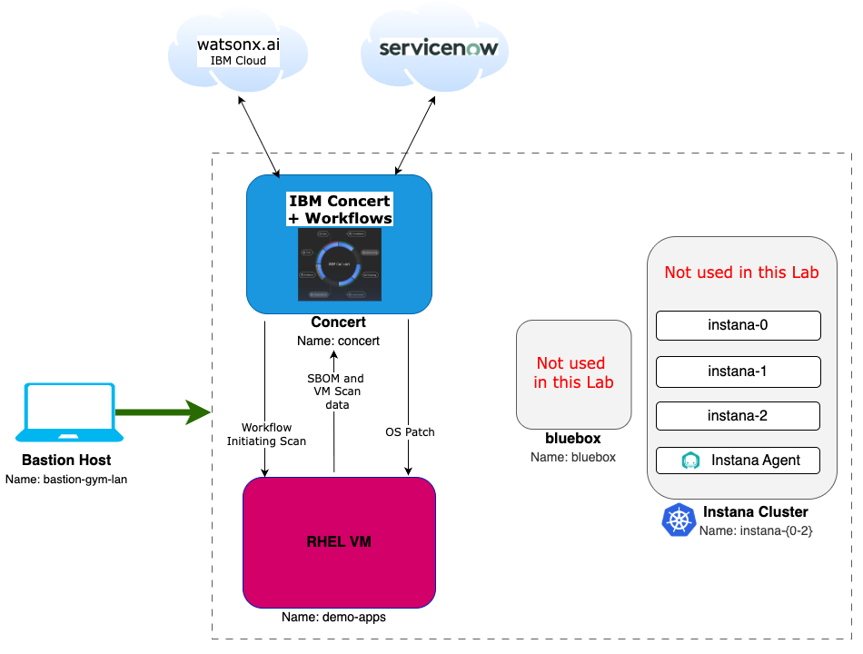
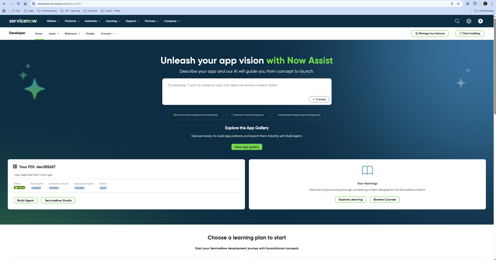
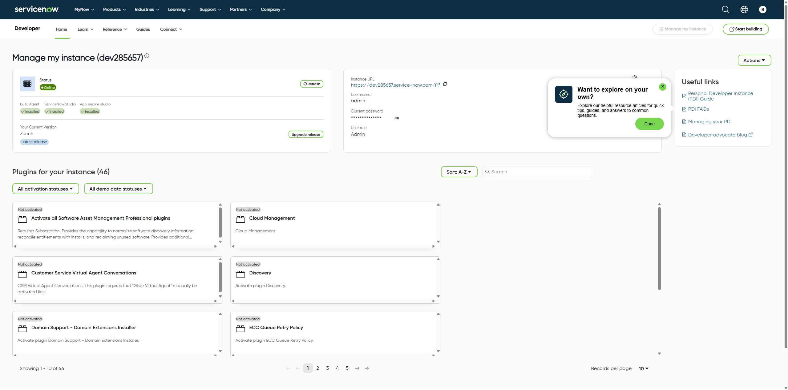

import CreateIbmId from "@site/src/components/createIbmId/CreateIbmId"
import ObtainingEntitlementKey from "@site/src/components/obtainingEntitlementKey/ObtainingEntitlementKey"
import RequestingLabEnvironment from "@site/src/components/requestingLabEnvironment/RequestingLabEnvironment"
import LicenseInfo from "@site/src/components/Instana/LicenseInfo"

# Lab Environment

In this Lab, you will have access to two RHEL virtual machines plus a bastion virtual machine 
that will let you access the overall deployment:

* Bastion Host - a RHEL VM named bastion-gym-lan that will be used as the bastion host for the lab network. This Bastion host has access to all lab VM's and will be your primary workstation for these labs.
* Concert Host - a RHEL VM that has preinstalled IBM Concert + Workflows + DataApps.
* Demo Applications Cluster - a RHEL VM which you will target for the scan and the patch.

The following software versions are used in the Lab environment:
* Concert v2.1.0
* RHEL release 9.4

The following diagram describes the infrastructure for the Lab. 

:::note
Note that the **bluebox** VM and the **Instana cluster** shown in the following deployment diagram, although part 
of the overall lab environment, they will not be used in this specific lab. Because of this, you will still need to provide
the Instana license keys to request the lab environment.
:::

## Prerequisites

<CreateIbmId />

<ObtainingEntitlementKey />

<LicenseInfo />

### ServiceNow Developer Instance

During the Lab, you will create ServiceNow Incidents using your own personal ServiceNow Developer Instance. 
You can request a free instance if you do not have one already by following the instructions below:

1. On your personal computer browser, navigate to:  
   [https://developer.servicenow.com/dev.do](https://developer.servicenow.com/dev.do)

2. Sign in or create an account. After successful login, click **Request Instance** to request a ServiceNow developer instance.

**Example**  

3. Select the **latest release** for your instance and click **Request**.

**Example**  

4. After a few minutes, your developer instance will be online. Click **Manage my instance**.

**Example**  

5. Copy the **Instance URL**, **Username**, and **Password** from your developer instance.

**Example**  

## Requesting a Lab Environment

<RequestingLabEnvironment
   environmentName="Jam-in-a-Box: Concert - Vulnerability"
   environmentUrl="https://techzone.ibm.com/my/reservations/create/6866cf81f89d5795f68e379f"
/>

