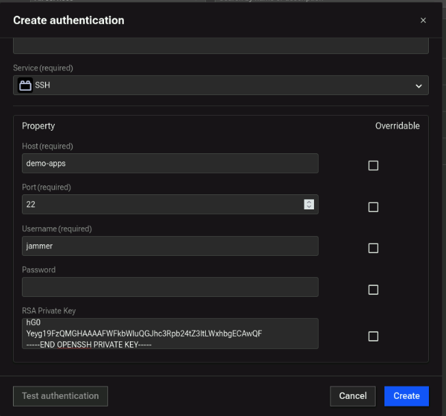
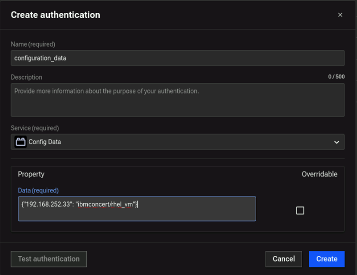
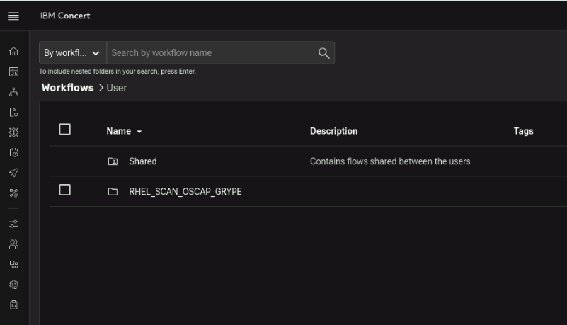
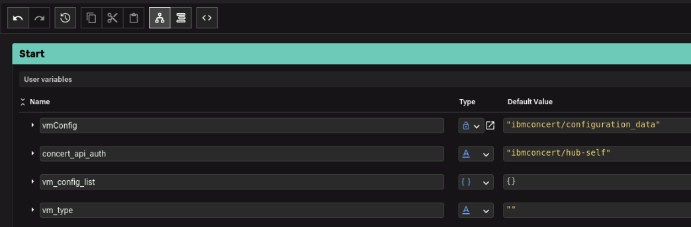

## 4.1: Overview

This lab section guides you through:

- Setting up Concert Workflows authentication to connect to the demo-apps VM
- Creating a host SBOM (Software Bill of Material) that describes a Concert environment and the VM configuration including operating system details
- Create a VM vulnerability scan 

## 4.2 Setting up Authentications for Ingestion Workflow


### 4.2.1 RHEL VM Authentication (`rhel_vm`)

This authentication allows Concert Workflows to connect to the RHEL VM via SSH to perform vulnerability scans and gather system information.

1. From **Concert Workflows** → **Authentications** tab, click **Create authentication**.  
2. On the **Create Authentication** screen:
   - **Name**: `rhel_vm`
   - **Service**: Search for **SSH**
   - **Host**: (demo-apps-ip from credentials file)
   - **Port**: `22`
   - **Username**: `jammer`
   - **Password**: Leave blank
   - **Private Key**: Copy full private key from `rhel_vm_private_key` in credentials file

3. Click **Create**.

Example of RHEL VM Authentication:




### 4.2.2 VM Configuration Data (`configuration_data`)

This authentication is used to provide Concert Workflows with necessary configuration data about the VM(s) to be scanned, such as IP address and authentication reference.

1. From **Authentications** tab, click **Create Authentication**.  
2. On the **Create Authentication** screen:
   - **Name**: `configuration_data`
   - **Service**: **Config Data**
   - **Data**: JSON construct that includes the IP address of the demo-apps VM and a fully qualified reference to the `rhel_vm` 
   authentication created in the previous step, as shown below:
   
     ```json
     {"192.168.252.33": "ibmconcert/rhel_vm"}
     ```

:::note
For multiple servers, add additional VMs in JSON array format.
:::

Configuration Data example:

  

3. Finally, click **Create**.

---

### 4.2.3 Concert API Key (`hub-self`)

:::note
Note that in future versions of the Lab, this authentication will not be required.  Use the name `hub-self` for authentication.
:::

1. From the **Authentications** tab, click **Create Authentication**.  
2. Configure the following fields:
   - **Name**: `hub-self`
   - **Service**: **IBM Concert API Key**
   - **Protocol**: `https://`
   - **Host**: `concert.ibmdte.local:12443`
   - **API Key**: Concert API Key from credentials file
   - **API Key Type**: `C_API_Key`
   - **Instance ID**: `0000-0000-0000-0000`
3. **Test** the authentication
4. Click **Create**.

Concert API Key example:


---

## 4.3 Import, Configure and Run Workflow

### 4.3.1 Import Workflow

1. From **credentials.txt**, open the link for **Concert Workflows** link in new browser tab on your VM.
2. Download the `.zip` file to the VM called **vulnerability_scan.zip**
3. In **Concert Workflows** → **Workflows**, click **Import** → select `vulnerability_scan.zip`.
4. Verify workflow appears in **Workflows** list as `RHEL_SCAN_OSCAP_GRYPE`.

It should look like this:



### 4.3.2 Configure Workflow

1. Click the RHEL_SCAN_OSCAP_GRYPE folder and click again on the workflow to open it.
2. In the **Start** block:
  - set **vmConfig** parameter to `ibmconcert/configuration_data` (as defined in section 4.2.2)
  - set **concert_api_auth** parameter to `ibmconcert/hub-self` (as defined in section 4.2.3)
  - set **cve_limit** parameter to `20`. This is done to limit the time it takes to patch a VM within the context of the lab.

  The configured parameters should look like this:



3. Click **Save**.


### 4.3.3 Run Workflow

1. Click **Run** to execute the workflow (it takes a few minutes).
2. After completion, verify results in **Concert** → **Administration** → **Event Log**.
3. You should see Application SBOMs and VM scan results uploaded to IBM Concert.


:::tip Success Indicators
- Application SBOMs visible
- VM scan results in Event Log
- No authentication errors
:::


## 4.4 Review Scan Findings in Concert

From the Concert UI, navigate to **Inventory → Environment Inventory** (click on the **Refresh** icon) and note that there is a new environment called **staging**. 
Click on the **Runtimes** tab (click on the **Refresh** icon) and note that there is a new runtime called **demo-apps** with an 
IP 192.168.252.33. Click on **demo-apps** to view the vulnerabilities found by the workflow you just ran.

Navigate to **Inventory → Application Inventory** (click on the **Refresh** icon) and note that there is a new application called **demo-apps**.

Navigate to **Dimensions → Vulnerability** and note that there are vulnerabilities discovered from the scan.

Concert provides a unified dashboard where you can monitor vulnerabilities, review remediation actions, and track progress across different environments.

The last tab highlights **auto-remediation** options. Concert’s auto-remediation feature automatically detects and fixes security vulnerabilities
 across operating systems, web servers, and container images. It identifies applicable fixes, creates remediation actions, and triggers patching
  workflows after receiving the required approvals.

By leveraging auto-remediation, you can proactively manage vulnerabilities, reduce the risk of security breaches, and strengthen your overall
 security posture. Concert displays newly discovered vulnerabilities from loaded scan files along with their associated impacts.

Concert also supports mitigation planning for new vulnerabilities using generative AI powered by **watsonx.ai**, helping you design data-driven remediation strategies.

After you upload a scan report (for example, from a Red Hat Enterprise Linux (RHEL) virtual machine), Concert 
analyzes the scan results and generates recommended remediation actions—such as installing specific OS patches. 
These actions are automatically submitted for approval through a GitHub pull request or a ServiceNow incident, depending on the action type.

Once approved, Concert triggers the corresponding workflows to apply patches and updates the action status in the UI.

---
