## 4.1: Overview

In this section, we will import a Concert Workflow, create workflow authentications, configure the workflow with the authentications created and 
finally run the workflow. This workflow will do the following:

- It will run the the open-source vulnerability scanner OpenSCAP on the demo-apps host and create a CVE vulnerability scan file.
- It will create a host **deploy** SBOM (Software Bill of Material) that contains application and demo-apps host information.
- It wil load the **deploy** SBOM and the vulnerability scan (in this order) into Concert.

### Concert Workflows Menu Navigation

You can access the Concert Workflows features by selecting the **Workflows** menu on the top. From here you will be using  
the **Workflows tile** to create new Workflows and the **Authentications tile** to create new Authentications. 

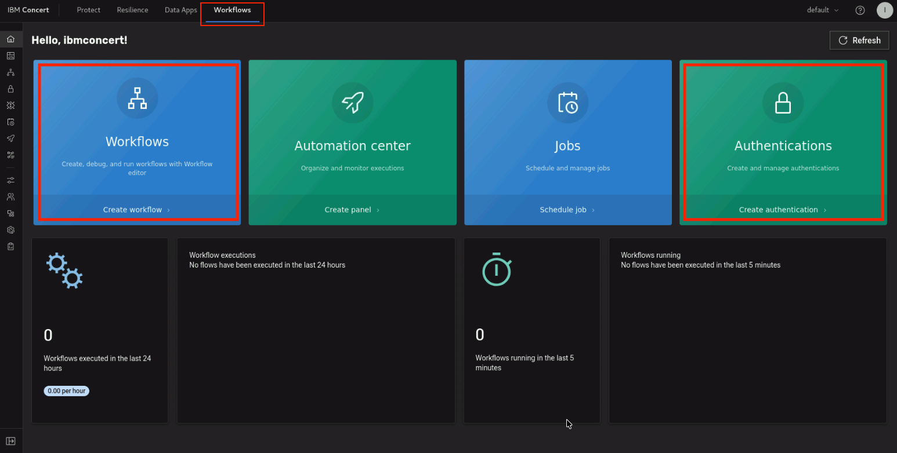


## 4.2 Setting up Authentications for Scan Workflow

### 4.2.1 RHEL VM Authentication (`rhel_vm`)

This authentication allows Concert Workflows to connect to the RHEL demo-apps VM via SSH to perform vulnerability scans and gather system information.

1. From the **Concert Workflows** page, select the **Authentications tile**.
2. Click **Create authentication**.  
3. On the **Create Authentication** window:
   - **Name**: `rhel_vm`
   - **Service**: Search for **SSH**
   - **Host**: (copy/paste the demo-apps-ip from credentials file)
   - **Port**: `22`
   - **Username**: `jammer`
   - **Password**: Leave blank
   - **Private Key**: Copy full private key from `rhel_vm_private_key` in credentials file. 
      - DO NOT copy any extra spaces at the beginning or end.
      - DO NOT add a new line after -----END OPENSSH PRIVATE KEY-----

4. Click **Create**.

Example of RHEL VM Authentication:

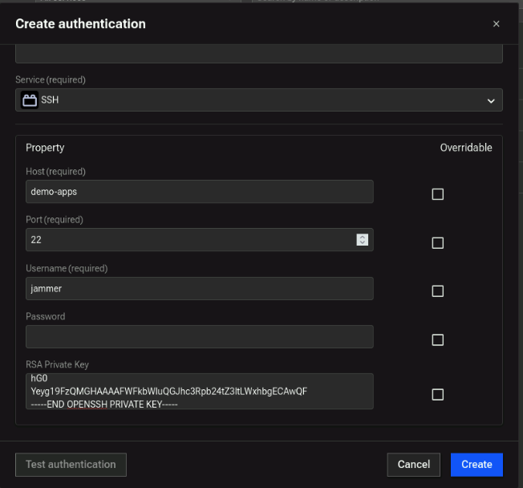


### 4.2.2 VM Configuration Data (`configuration_data`)

This authentication is used to provide Concert Workflows with necessary configuration data about the VM(s) to be scanned, such as IP address and authentication reference.

1. From the same **Authentications** page, click **Create authentication** again.
2. On the **Create Authentication** screen:
   - **Name**: `configuration_data`
   - **Service**: **Config Data**
   - **Data**: copy this JSON construct that includes the IP address of the demo-apps VM and a fully qualified reference to the `rhel_vm` 
   authentication created in the previous step, as shown below:
   
     ```json
     {"192.168.252.33": "ibmconcert/rhel_vm"}
     ```

:::note
For multiple servers, add additional VMs in JSON array format.
:::

Configuration Data example:

  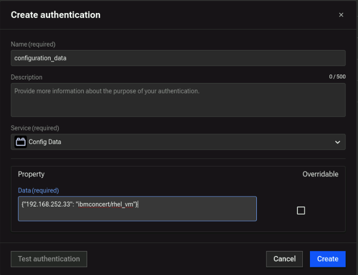

3. Finally, click **Create**.

---

### 4.2.3 Platform API Authentication (`hub_self`)

:::note
**IBM Hub - Self** is a special type of authentication that allows connection between Concert Workflows (executions) 
and other capabilities on the platform. At this point of time, it can be used to authenticate with Concert APIs and 
Concert Workflows APIs as it integrates with itself.
:::

1. From the same **Authentications** page, click **Create authentication** again.
2. Configure the following fields:
   - **Name**: `hub_self`
   - **Service**: search for **IBM Hub - Self**. Make sure to select the Hub Self that has the IBM icon, as shown below:

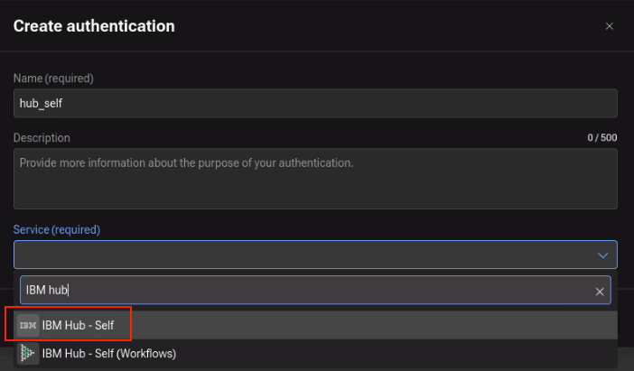


4. Click **Create**.


---

## 4.3 Import, Configure and Run Workflow

Now that you have the necessary workflows authentications set up, you can import the vulnerability scan workflow, 
configure it to use the authentications you created, and run it to perform a vulnerability scan on the demo-apps RHEL VM.

### 4.3.1 Import Workflow

1. From **credentials.txt**, open the link for **Concert Workflows** URL in a new browser tab.
2. Download the `.zip` file to the VM called **Vulnerability_Scan.zip**.
3. Select the top **Workflows** tab and select the **Workflows tile**.
4. From the top-right corner, click on the 3-dot icon and select 
**Create folder**. Name the folder `SCAN_WORKFLOWS` and click **Create**.
5. Click on the newly created SCAN_WORKFLOWS folder to open it and click **Import** → select `Vulnerability_Scan.zip`.
6. Verify the new workflow appears as `RHEL_SCAN_OSCAP_GRYPE`.

It should look like this:

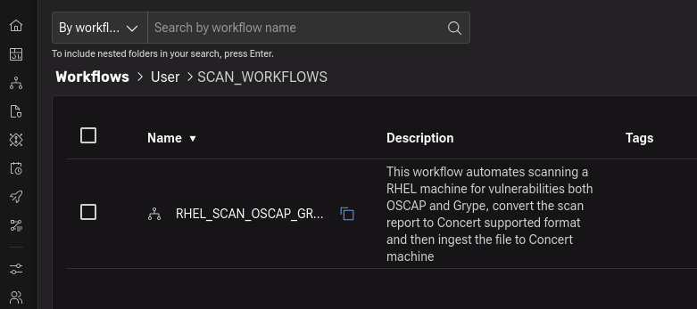

### 4.3.2 Configure Workflow

1. Click on the `RHEL_SCAN_OSCAP_GRYPE` workflow to open it.
2. In the **Start** block we will add the authentications defined previously as input parameters:
  - set **vmConfig** parameter to `ibmconcert/configuration_data` (as defined in section 4.2.2)
  - set **concert_api_auth** parameter to `ibmconcert/hub_self` (as defined in section 4.2.3)

  The configured parameters should look like this:

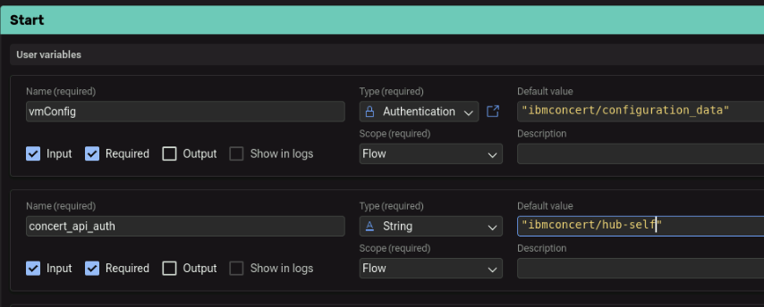

3. Click **Save**.


### 4.3.3 Run Workflow

1. Click **Run** to execute the workflow (it should take about two minutes).

:::tip Successful Run Indicators
- No authentication errors in the Logs.
- VM scan results in the Log with CVEs discovered from the scan
- Deploy and Application SBOMs visible in the log (you need to expand the log details to see these)
:::


## 4.4 Review Vulnerability Scan Findings in Concert

From the Concert UI, click on the top **Resilience** tab.
From the left menu, navigate to **Inventory → Environment inventory** as shown below

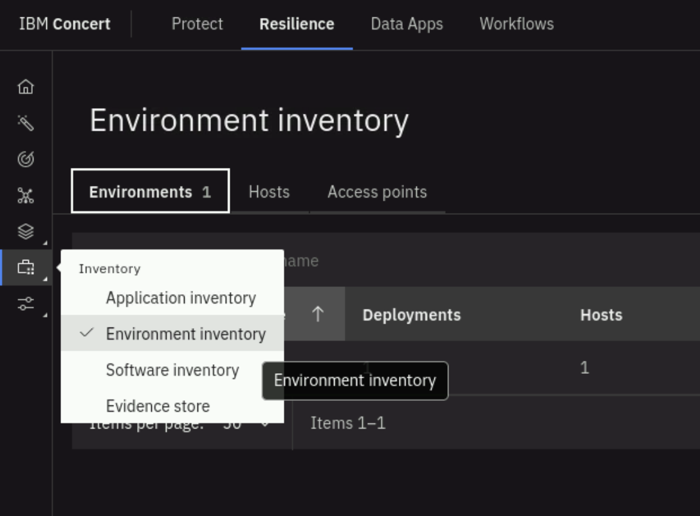


Note that there is a new environment called **staging** (click the refresh icon if necessary)

Click on the **Hosts** tab (click on the **Refresh** icon) and note that there is a new host called **demo-apps.ibmdte.local** of Type **host**. 
Click on **demo-apps.ibmdte.local** host and note the IPv4 address 192.168.252.33. Click on the **CVE findings** tab and scroll down to 
view the vulnerabilities found by the workflow you just ran.

On the left side menu, navigate to **Inventory → Application Inventory** (click on the **Refresh** icon) and note that there is a new application called **demobank**.
We will define the criticality settings for this application. This is context information That Concert 
 * Click on the **demobank** application, and on the Versions tab, select the **1.0.0** version.

 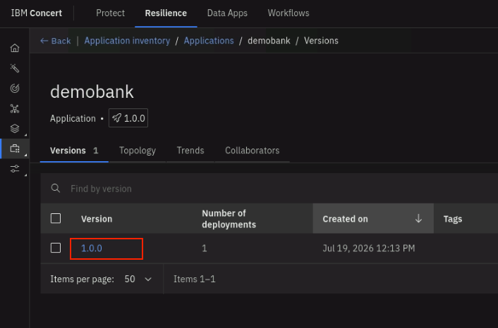

 * On the **demobank 1.0.0** page, select the Overview tab and click on the Edit pencil icon.

  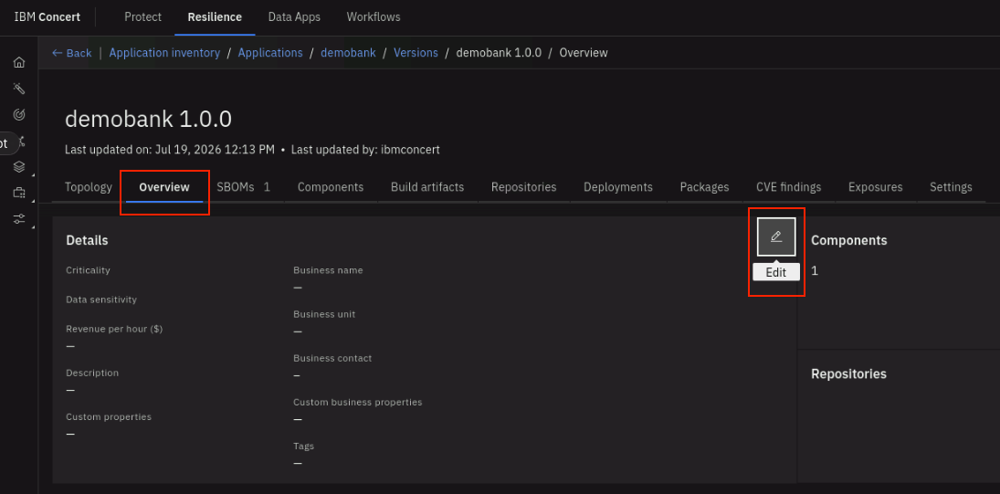

 * On the **Edit details** window, set both **Criticality** and **Data sensitivity** to **Very high** and click on **Save**.

  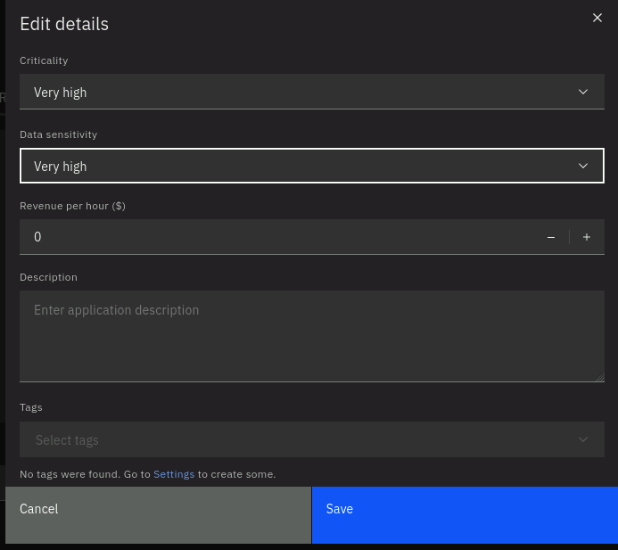

Now that we have changed the criticality of the application, we will ask Concert to recompute the Risk score based on this new information.

 * On the left side menu, select Administration -> Settings.
 * On the **Settings** page, change the Priority 1 (red) slider from 7.5 to 7. This change will enable the **Recompute priorities** button. 
 Click on the **Recompute priorities** button and on the pop-up window confirm the action by clicking on **Recompute and save**.

  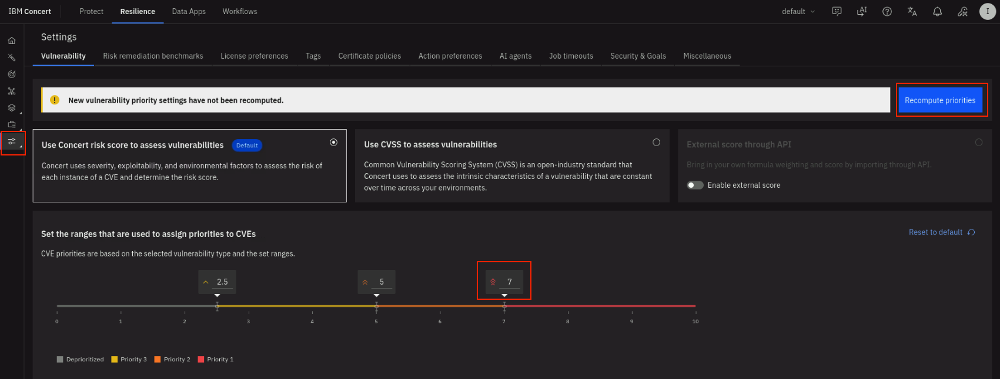


Lets review the list of vulnerabilities. On the left side menu, navigate to **Dimensions → Vulnerability** (click on the **Refresh** icon) and note that there 
are Host CVEs vulnerabilities discovered from the scan. Concert provides a unified dashboard where you can monitor vulnerabilities, 
review remediation actions, and track progress across different environments.

On the left side menu, select the **Action center** tab and click on the **Refresh** icon. Note that there is a new remediation action with Action type **OS** 
with **Location** as the **demo-apps.ibmdte.local** host. 
Concert’s auto-remediation feature automatically detects and fixes security vulnerabilities
 across operating systems, web servers, and container images. It identifies applicable fixes, creates remediation actions, and triggers patching
  workflows after receiving the required approvals.

By leveraging auto-remediation, you can proactively manage vulnerabilities, reduce the risk of security breaches, and strengthen your overall
 security posture. Concert displays newly discovered vulnerabilities from loaded scan files along with their associated impacts.

Concert also supports mitigation planning for new vulnerabilities using generative AI powered by **watsonx.ai**, helping you design data-driven remediation strategies.

After you upload a scan report (for example, from a Red Hat Enterprise Linux (RHEL) virtual machine), Concert 
analyzes the scan results and generates recommended remediation actions—such as installing specific OS patches. 

These actions follow the approval flow shown below:

Approval pending -> Approved -> Scheduled -> In Progress -> Success/Failure


