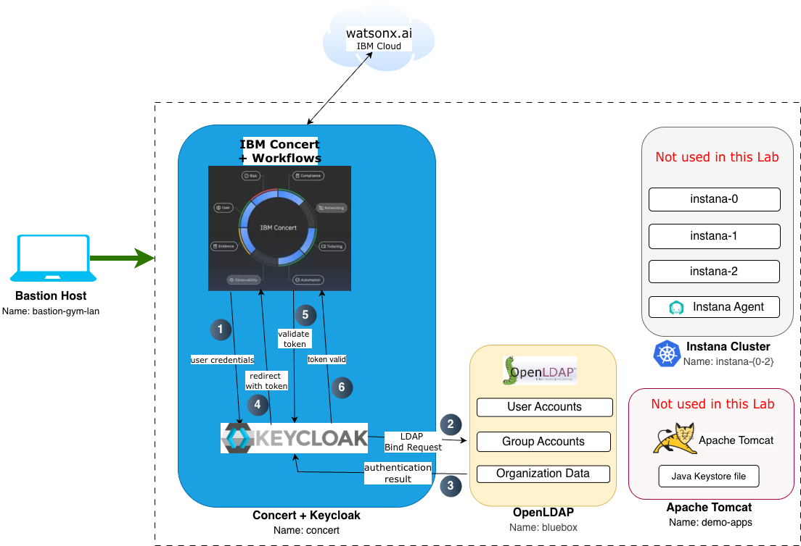
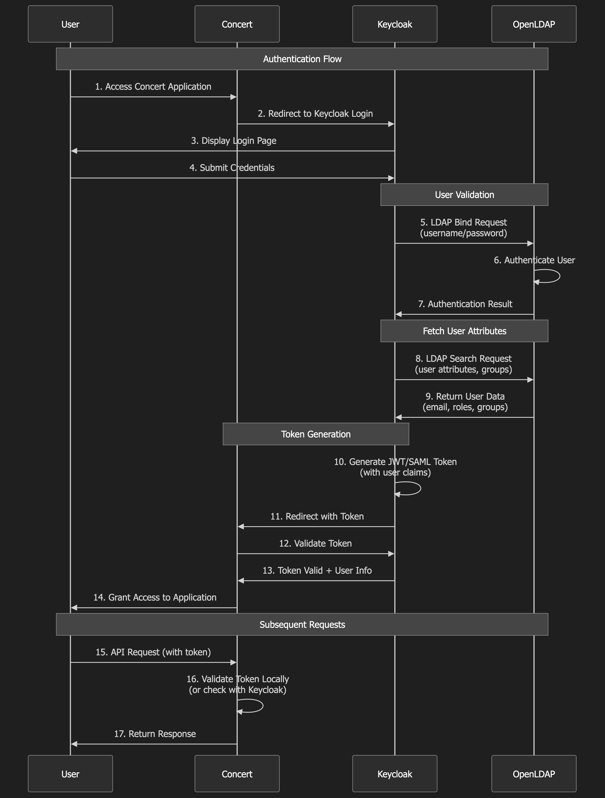

import CreateIbmId from "@site/src/components/createIbmId/CreateIbmId"
import ObtainingEntitlementKey from "@site/src/components/obtainingEntitlementKey/ObtainingEntitlementKey"
import RequestingLabEnvironment from "@site/src/components/requestingLabEnvironment/RequestingLabEnvironment"
import LicenseInfo from "@site/src/components/Instana/LicenseInfo"

# Lab Environment

In this lab, you will have access to three RHEL virtual machines plus a bastion virtual machine that will let you access the overall deployment:

* **Bastion Host** - a RHEL VM named `bastion-gym-lan` that will be used as the bastion host for the lab network. This Bastion host has access to all lab VMs and will be your primary workstation for these labs.
* **Concert Host** - a RHEL VM named `concert` that has pre-installed IBM Concert v2.2.0 with embedded Keycloak identity provider.
* **OpenLDAP Host** - a RHEL VM named `bluebox` that has pre-installed OpenLDAP server configured as a user directory.

## Software Versions

The following software versions are used in the Lab environment:

* **IBM Concert**: v2.2.0
* **Keycloak**: v26.4.5 embedded with Concert
* **OpenLDAP**: v2.6.8 
* **RHEL**: 9.4

## Lab Architecture

The following diagram describes the infrastructure for the Lab:

### Architecture Components

#### 1. Bastion Host
- **Purpose**: Entry point and workstation for lab activities
- **Access**: Remote desktop via TechZone
- **Tools**: Firefox browser, Terminal, Text Editor
- **Connectivity**: SSH access to all lab VMs

#### 2. Concert Host
- **Purpose**: IBM Concert platform with embedded Keycloak
- **Services**:
  - Concert UI: `https://concert.ibmdte.local:12443/concert/`
  - Keycloak Admin Console: `https://concert.ibmdte.local:13443/sys/internal/kc/`
  - Concert API: `https://concert.ibmdte.local:12443`
- **Pre-configured**: Concert installation complete, Keycloak embedded and running

#### 3. OpenLDAP Host
- **Purpose**: Centralized user directory
- **Service**: OpenLDAP server on port 389
- **Base DN**: `dc=example,dc=com`
- **Pre-configured**: OpenLDAP installed via Ansible automation
- **Access**: LDAP protocol from Keycloak and command-line tools

### Authentication Flow

The diagram below illustrates the SSO authentication flow in this lab environment:

**Flow Steps**:
1. User accesses Concert UI from Bastion Host
2. Concert redirects to Keycloak for authentication
3. Keycloak queries OpenLDAP to validate user credentials
4. OpenLDAP returns user information and group memberships
5. Keycloak generates OIDC token with user roles
6. User is redirected back to Concert with authentication token
7. Concert validates token and grants access based on roles

### Network Configuration

All VMs are on the same internal network (`ibmdte.local` domain):

| Hostname | IP Address | Services | Ports |
|----------|-----------|----------|-------|
| bastion-gym-lan | 192.168.252.99 | SSH, Remote Desktop | 22, 3389 |
| concert | 192.168.252.35 | Concert UI, Keycloak, API | 443, 8443, 12443 |
| bluebox | 192.168.252.34 | LDAP, LDAPS | 389, 636 |

:::note
The exact IP addresses will be assigned by TechZone when you reserve the environment. You can retrieve them using the `getent hosts <hostname>` command from the Bastion Host.
:::

## Prerequisites

### IBM ID

<CreateIbmId />

### Entitlement Key

<ObtainingEntitlementKey />

<LicenseInfo />

:::info
While this lab uses pre-installed software, the entitlement key may be required for TechZone environment provisioning.
:::

### Browser Requirements

This lab requires a modern web browser with JavaScript enabled. **Firefox** is pre-installed on the Bastion Host and is the recommended browser for this lab.

**Browser Configuration**:
- Accept self-signed certificates (lab uses internal certificates)
- Enable cookies for session management
- Allow pop-ups from Concert and Keycloak domains

### Knowledge Prerequisites

Before starting this lab, you should be familiar with:
- Basic Linux command-line operations (SSH, file editing)
- Web browser navigation
- Basic understanding of authentication concepts
- Familiarity with IBM Concert (helpful but not required)

## Lab Environment Access

### Requesting a Lab Environment

<RequestingLabEnvironment
   environmentName="Jam-in-a-Box: Concert"
   environmentUrl="https://techzone.ibm.com/my/reservations/create/6866cf81f89d5795f68e379f"
/>

## Next Steps

Now that you understand the lab environment and have verified access to all components, proceed to the **Lab Preparation** section where you will:
- Gather all necessary credentials
- Create a credentials file for easy reference
- Verify OpenLDAP installation
- Access Keycloak Admin Console
- Prepare your environment for the configuration exercises

---

:::tip
Keep this architecture diagram handy as a reference throughout the lab. Understanding the component relationships will help you troubleshoot issues and understand the authentication flow.
:::