# 3. Lab Preparation

## 3.1: Overview

Before proceeding with the main lab activities, ensure that you have completed **all Lab Preparation steps** in this section. These steps will help you gather necessary credentials, verify system access, and prepare your environment for the SSO configuration exercises.

:::warning
You may receive prompts for software updates during the lab.  
Please **ignore these prompts** and **do not install any updates** to avoid disrupting the lab environment.
::: 

If you encounter a security warning such as **"Warning: Potential Security Risk Ahead"** when using the browser, please disregard it. Select **Advanced** → **Accept the Risk and Continue**.

---

## 3.2: Using the Bastion Host

This section provides background information about the Bastion environment. You will execute actual commands in later sections.

### 3.2.1: Accessing the UIs

From the **Bastion Host Terminal**, click on **Activities** and open **Firefox**.

The following bookmarks are pre-configured in Firefox:
- **Concert UI**: `https://concert.ibmdte.local:12443/concert/`
- **Keycloak Admin Console**: `https://concert.ibmdte.local:13443/sys/internal/kc/`

### 3.2.2: Using SSH from the Bastion Host

You can connect from the Bastion host to other lab VMs using SSH commands as shown below:

```bash title="Host: bastion-gym-lan"
# Access the Concert VM
ssh jammer@concert

# Access the OpenLDAP VM
ssh jammer@bluebox
```

:::tip
All SSH connections use key-based authentication. No password is required when connecting from the Bastion Host to lab VMs.
:::

---

## 3.3: Creating the Credentials File

In this section, you will collect all necessary credentials and configuration details required to complete the lab exercises. All credentials will be consolidated into a single text file, which simplifies the steps later in the lab.

### 3.3.1: Prepare the Credentials File

1. From the **Bastion Remote Desktop**, on the left panel click **Show Applications** → **Text Editor**.
2. Create a new file named `credentials.txt`.
3. Paste the following template into the file and **save** it.
4. Keep this window open for easy access during the lab.

```yaml
# Concert SSO Lab Credentials
# ===========================

Bookmarks:
  Lab guide:  https://ibm.github.io/waiops-tech-jam/labs/concert/sso/1-introduction/
  Concert:    https://concert.ibmdte.local:12443/concert/
  Keycloak:   https://concert.ibmdte.local:13443/sys/internal/kc/

# Concert Configuration
Concert URL: https://concert.ibmdte.local:12443/concert/
Concert Port: 12443
concert_username: 
concert_password: 

# Keycloak Configuration
Keycloak Admin Console: https://concert.ibmdte.local:13443/sys/internal/kc/
Keycloak Realm: concert-realm
keycloak_admin_username: admin
keycloak_admin_password: 
keycloak_bootstrap_admin_username: 
keycloak_bootstrap_admin_password: 

# OpenLDAP Configuration
OpenLDAP Host: bluebox.ibmdte.local
OpenLDAP Port: 389
OpenLDAP Base DN: dc=example,dc=com
OpenLDAP Admin DN: cn=admin,dc=example,dc=com
openldap_admin_password: secret

# Test Users (to be created in OpenLDAP-configuration section)
alice_username: alice
alice_password: Alice@123
alice_role: Admin
alice_group: corporate_it_staff

bob_username: bob
bob_password: Bob@123
bob_role: User
bob_group: hr_staff

charlie_username: charlie
charlie_password: Charlie@123
charlie_role: User
charlie_group: sales_staff

# OIDC Client Configuration (to be created in Keycloak)
oidc_client_id: concert-client
oidc_client_secret: 

# Host IP Addresses
concert_ip: 
openldap_ip: 
```

From the Bastion SSH, run the command below:

```sh title="Host: bastion-gym-lan"
cat demo-details.yml | grep -E 'concert'
``` 

Just to have the users and passwords handy together, copy these values below to the credentials file:
* concert_username: 
* concert_password:

:::important
Keep this credentials file open throughout the lab. You will update it with retrieved passwords and configuration values as you progress through the exercises.
:::

---

## 3.4: Retrieve Host IP Addresses


Run the following commands from the **Bastion SSH terminal** to capture the IP addresses of the lab hosts:

```bash title="Host: bastion-gym-lan"
# Get Concert host IP address
getent hosts concert | awk '{print $1}'

# Get OpenLDAP host IP address
getent hosts bluebox | awk '{print $1}'
```

At the bottom of your `credentials.txt` file, you will see `concert_ip` and `openldap_ip` fields. <br/>
Copy the IP addresses displayed and update the corresponding sections in your `credentials.txt` file:

```text
concert_ip:  <IP Address>
openldap_ip: <IP Address>
```

---

## 3.5: Retrieve Keycloak Admin Password

Keycloak is embedded within the Concert installation and runs as a container. The admin password is stored in an environment variable under **ibm-solis-embedded-keycloak** container.

### 3.5.1: Steps to Retrieve Keycloak Admin Password

1. Connect to the Concert host via SSH:

```bash title="Host: bastion-gym-lan"
ssh jammer@concert
```

2. List all pods under the Concert host to verify that the **ibm-solis-embedded-keycloak** container is running:

```bash title="Host: concert"
kubectl get pods -n platform-hub
```
You should see output similar to the one below:

```bash title="Example output"
[jammer@concert ~]$ kubectl get pods -n platform-hub | grep ibm-solis-embedded-keycloak
NAME                                          READY   STATUS    RESTARTS   AGE
ibm-solis-embedded-keycloak-cb4df6d87-slskv   1/1     Running   0          80m
```

3. Retrieve the Keycloak admin password from the **ibm-solis-embedded-keycloak** pod environment variables:

```bash title="Host: concert"
# Get the default Keycloak admin username
kubectl exec -it ibm-solis-embedded-keycloak-cb4df6d87-slskv -n platform-hub -- env | grep KC_BOOTSTRAP_ADMIN_USERNAME
```

```bash title="Host: concert"
# Get the default Keycloak admin password
kubectl exec -it ibm-solis-embedded-keycloak-cb4df6d87-slskv -n platform-hub -- env | grep KC_BOOTSTRAP_ADMIN_PASSWORD
```

You should see output similar to the one below:

```bash title="Example output"
# Get the KC_BOOTSTRAP_ADMIN_USERNAME and KC_BOOTSTRAP_ADMIN_PASSWORD
[jammer@concert ~]$ kubectl exec -it ibm-solis-embedded-keycloak-cb4df6d87-slskv -n platform-hub -- env | grep KC_BOOTSTRAP_ADMIN_USERNAME
KC_BOOTSTRAP_ADMIN_USERNAME=70ef10c2c12c17b74301624d

[jammer@concert ~]$ kubectl exec -it ibm-solis-embedded-keycloak-cb4df6d87-slskv -n platform-hub -- env | grep KC_BOOTSTRAP_ADMIN_PASSWORD
KC_BOOTSTRAP_ADMIN_PASSWORD=<your-secure-password>
```

:::note
The ibm-solis-embedded-keycloak pod name contains installation-specific hash suffixes (for example, ibm-solis-embedded-keycloak-cb4df6d87-slskv) 
that are generated dynamically during Concert installation. Since the pod name varies across environments, retrieve it using 
"kubectl get pods -n platform-hub | grep ibm-solis-embedded-keycloak" 
:::

:::note
The Keycloak bootstrap admin username and password are randomly generated during Concert installation. You must retrieve them from the **ibm-solis-embedded-keycloak container** environment variables as shown above.
:::

3. Copy the admin username and admin password displayed and update your `credentials.txt` file:

```text
keycloak_bootstrap_admin_username: 70ef10c2c12c17b74301624d
keycloak_bootstrap_admin_password: <your-secure-password>
```

These 2 values will be used in **Section 3.6** to log in to the Keycloak Admin Console for the first time.

4. Exit the SSH session:

```bash title="Host: concert"
exit
```

---

## 3.6: Login to Keycloak for the first time

From the Bastion Host, open Firefox.

1. Click on the Keycloak bookmark to open the Keycloak UI. Or navigate to: `https://concert.ibmdte.local:13443/sys/internal/kc/`
2. Accept the certificate warning if prompted
3. Enter `keycloak_bootstrap_admin_username` and `keycloak_bootstrap_admin_password` at the login page

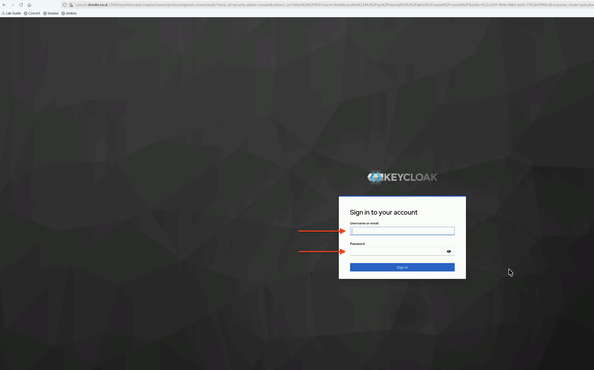

This is the initial login to Keycloak Admin Console using the bootstrap admin credentials retrieved in **Section 3.5**.
Accept the browser pop-up prompt to save the username and password for future use. 

4. After login, you will get a message highlighted in yellow that says "You are logged in as a temporary admin user. To harden security, create a permanent admin account and delete the temporary one".

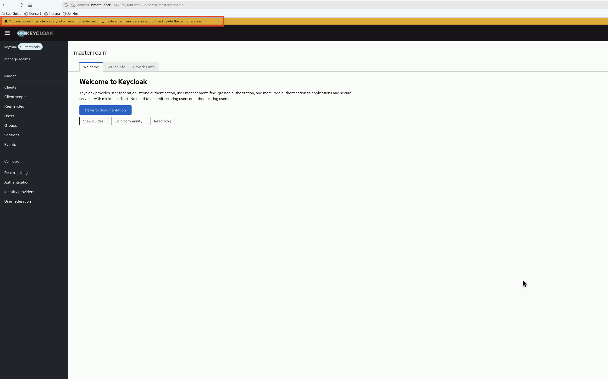

5. Let's create an admin user and password. From the Keycloak UI, select `Users` in the left side navigation. Then, select `Add user`.

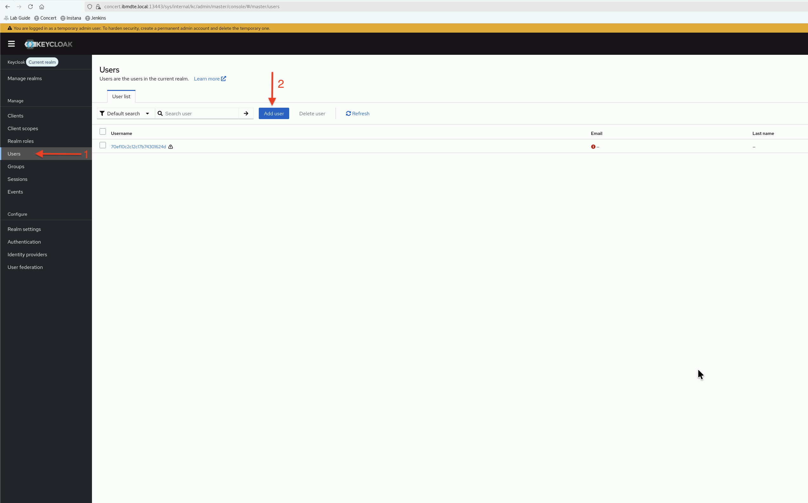

6. Create an Admin user using below values and finally, click the `Create` button.
   - **Username**: `admin`
   - **Email**: `admin@example.com`
   - **First name**: `john`
   - **Last name**: `doe`

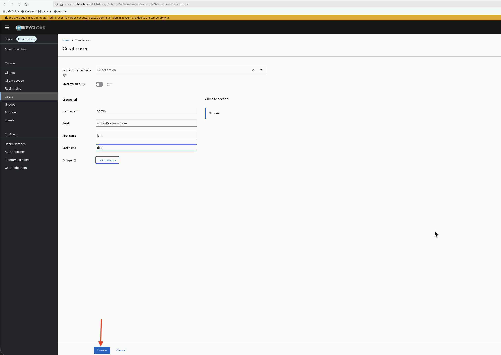

7. Next, set password for the Admin user. Still, under `Users` in the left side navigation, on `Admin` page, select `Credentials` tab and click `Set password` button.

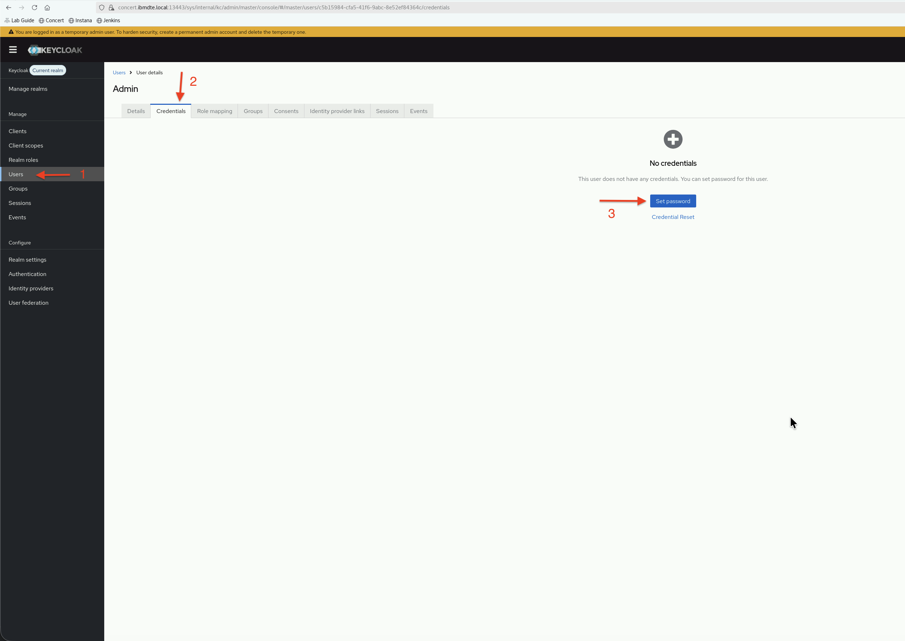

8. Delete the temporary auto created password for the user.

9. Enter the following details:
   - **Password**: `secret`
   - **Password confirmation**: `secret`
   - **Temporary**: Toggle to **OFF** 

This is the permanent password for the Admin user. Click `Save` button to save.
And finally, click `Save password` button when `Set password?` dialog box appears to save the password.

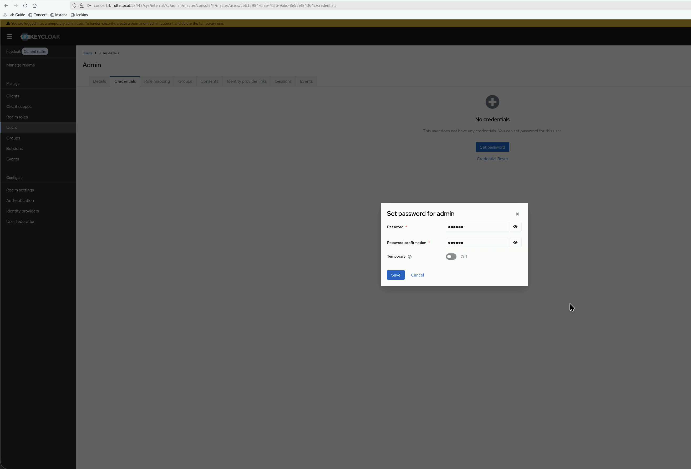

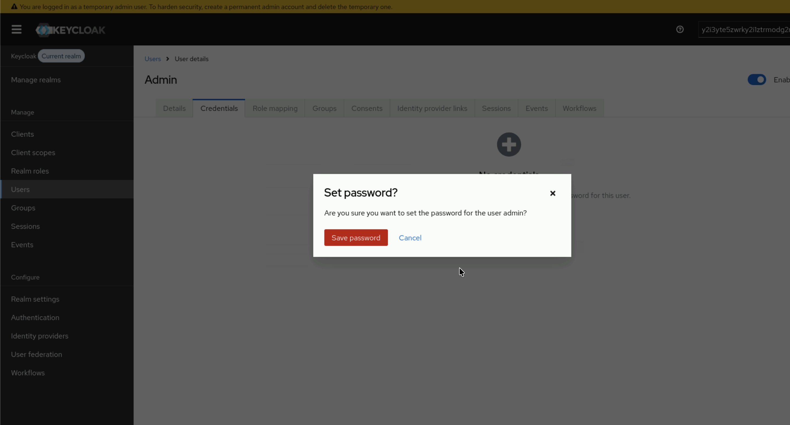

10. Copy the new **admin username** and **admin password** displayed and update your `credentials.txt` file:

```text
keycloak_admin_username: admin
keycloak_admin_password: secret
```

Now, you have successfully created the admin user and password. Keep the admin user and password.

10. Assign a role to the admin user. Under `Users` in the left side navigation, select `Role mapping` tab. Click `Assign role` drop down list and pick `Realm role`. Assign `admin` role to the admin user. 

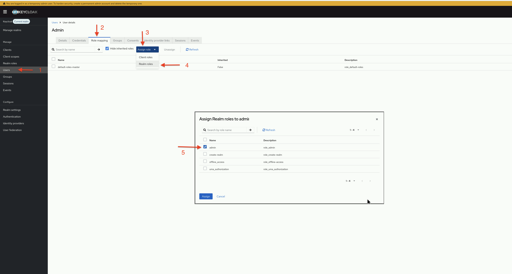

11. Sign out from Keycloak UI. 

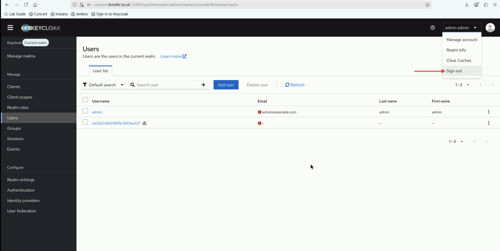

12. Re-login to Keycloak UI using the new admin username and password. Accept the browser pop-up prompt to save the username and password for future use.
You should now be logged in as the new admin user.

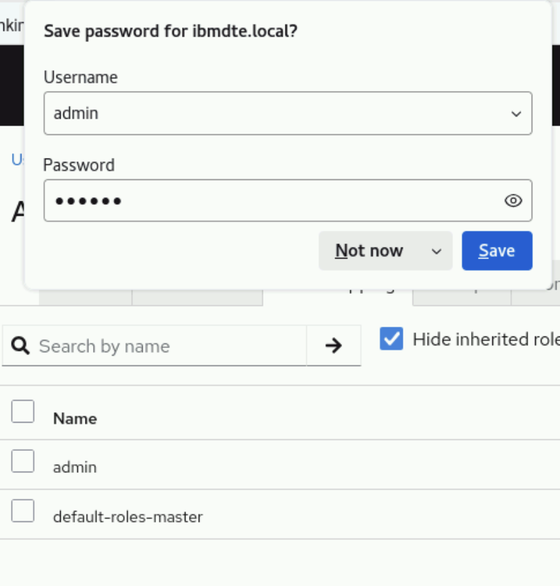

We will use the new admin username and password from this point onward.

---

## 3.7: Verify OpenLDAP Installation

Before proceeding with user configuration, verify that OpenLDAP is installed on `bluebox.ibmdte.local` virtual machine. By default, the OpenLDAP service is stopped. 
Let's bring up OpenLDAP service for this lab activity and check its connection from `bastion-gym-lan.ibmdte.local`.

:::info
By default, OpenLDAP slapd service is stopped to minimize compute resources on `bluebox.ibmdte.local` virtual machine. 
:::

### 3.7.1: Check OpenLDAP Service Status and Test LDAP Connectivity

1. Connect to the bluebox via SSH:

```bash title="Host: bastion-gym-lan"
# Connect to OpenLDAP host
ssh jammer@bluebox
```

2. Check slapd service and bring it up for next lab:

```bash title="Host: bluebox"
# Check if slapd service is running
sudo systemctl status slapd

# Bring up OpenLDAP service
sudo systemctl start slapd

# Verify LDAP is listening on port 389
sudo netstat -tlnp | grep 389
```

Expected output:
- Service status should show **active (running)**
- Port 389 should be in **LISTEN** state

3. Do LDAP search to verify connectivity and authentication:

```bash title="Host: bluebox"
# Test LDAP search from bluebox
ldapsearch -x -H ldap://bluebox.ibmdte.local:389 -b "dc=example,dc=com" \
              -D "cn=admin,dc=example,dc=com" -w secret

# Exit back to Bastion
exit
```

Expected output:
- Should return the base DN entry
- No errors about connection refused or authentication failure

```bash title="Example output"
# extended LDIF
#
# LDAPv3
# base <dc=example,dc=com> with scope subtree
# filter: (objectclass=*)
# requesting: ALL
#

# example.com
dn: dc=example,dc=com
objectClass: top
objectClass: dcObject
objectClass: organization
o: Example Organization
dc: example

# admin, example.com
dn: cn=admin,dc=example,dc=com
objectClass: organizationalRole
cn: admin
description: LDAP Administrator

# users, example.com
dn: ou=users,dc=example,dc=com
objectClass: organizationalUnit
ou: users

# groups, example.com
dn: ou=groups,dc=example,dc=com
objectClass: organizationalUnit
ou: groups

# search result
search: 2
result: 0 Success

# numResponses: 5
# numEntries: 4
```

:::warning
If you encounter connection errors, verify:
- OpenLDAP service is running on the openldap host
- You're using the correct admin password
:::

---

## 3.8: Access Concert UI

Verify that you can access the Concert user interface.

### 3.8.1: Steps to Access Concert

1. From the **Bastion Remote Desktop**, open **Firefox** browser.
2. Click on the Concert bookmark to open the Concert UI. Or navigate to: `https://concert.ibmdte.local:12443/concert/`
3. Accept the certificate warning if prompted.
4. Login to the Concert UI with the credentials recorded in the credentials file (concert_username: and concert_password:).

- **concert_username**
- **concert_password**


On the Concert welcome page, select the **Resilience** option on the right and select **Skip** in the next page:


:::danger
If prompted with the **Welcome to IBM Concert!** dialog, choose **Skip** to bypass the setup wizard.

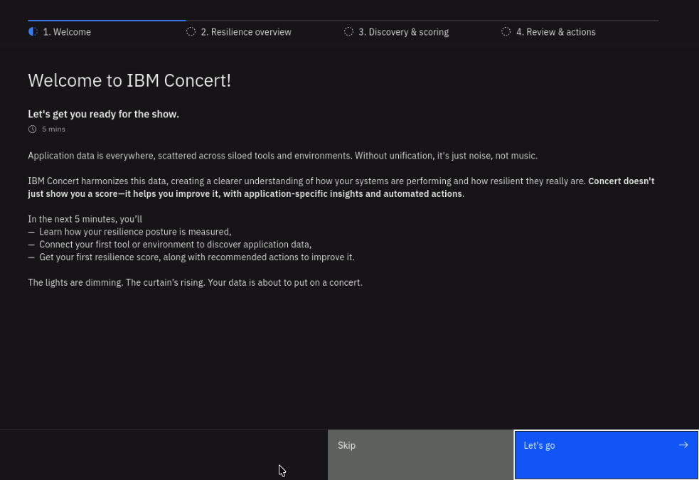
:::

### 3.8.2: Verify Concert Access

After logging in, you should see:
- Concert dashboard with navigation menu
- No error messages
- Ability to navigate to different sections

:::note
At this stage, SSO is not yet configured. You're logging in with the default **concert_username** and **concert_password**. After completing the lab, you'll be able to log in via SSO with LDAP users.
:::

---

## 3.9: Access Keycloak Admin Console

Verify that you can access the Keycloak Admin Console.

### 3.9.1: Steps to Access Keycloak

1. From the **Bastion Remote Desktop**, open **Firefox** browser. 
2. Click on the Keycloak bookmark to open the Keycloak UI. Or navigate to: `https://concert.ibmdte.local:13443/sys/internal/kc/`
3. Accept the certificate warning if prompted.
4. Log in with the Keycloak admin credentials from your credentials file:
   - **Username**: `admin`
   - **Password**: `secret`

### 3.9.2: Verify Keycloak Access

After logging in, you should see:
- Keycloak Admin Console interface
- **Master realm** selected by default
- Left navigation menu with options like Users, Groups, Clients, etc.

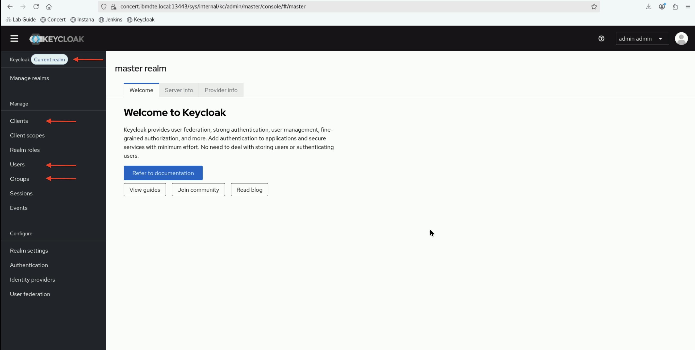

:::tip
Keep both Concert and Keycloak tabs open in Firefox. You'll switch between them frequently during the lab exercises.
:::

---

## 3.10: Preparation Checklist

Before proceeding to the next section, verify that you have completed all preparation steps:

- [ ] Created and saved `credentials.txt` file
- [ ] Retrieved and recorded Concert host IP address
- [ ] Retrieved and recorded OpenLDAP host IP address
- [ ] Retrieved and recorded Keycloak admin password
- [ ] Retrieved and recorded OpenLDAP admin password
- [ ] Verified OpenLDAP service is running
- [ ] Successfully tested LDAP connectivity
- [ ] Successfully logged into Concert UI
- [ ] Successfully logged into Keycloak Admin Console
- [ ] Verified LDAP client tools are installed

:::success
If you've completed all items in the checklist, you're ready to proceed to the next section where you'll configure OpenLDAP with Concert users and groups.
:::

---

## Troubleshooting

:::info
This section provides basic troubleshooting steps in case you encounter any issues while performing the steps above.
These steps are optional and only need to be followed if you run into problems.
:::

### Cannot Retrieve Temporary Keycloak Admin Password

**Problem**: The `podman exec -it ibm-solis-embedded-keycloak env | grep KC_BOOTSTRAP_ADMIN_PASSWORD` command fails or returns an error.

**Solutions**:
- Verify you're on the Concert host: `hostname` should return `concert`
- Check if you have proper permissions as jammer user: `whoami`
- Verify that KC_BOOTSTRAP_ADMIN_USERNAME and KC_BOOTSTRAP_ADMIN_PASSWORD exist from : `podman exec -it ibm-solis-embedded-keycloak env | grep KC_BOOTSTRAP_ADMIN_PASSWORD` command output, refer to **Section 3.5**

### Cannot Connect to OpenLDAP

**Problem**: `ldapsearch` command fails with "Can't contact LDAP server"

**Solutions**:
- Verify OpenLDAP service is running: `ssh jammer@bluebox 'sudo systemctl status slapd'`
- Check network connectivity: `ping bluebox.ibmdte.local`
- Verify firewall rules allow LDAP traffic
- Try using IP address instead of hostname

### Cannot Access Concert or Keycloak UI

**Problem**: Browser shows connection error or timeout

**Solutions**:
- Verify you're using Firefox on the Bastion Host (not your local browser)
- Check the URL is correct (https://)
- Accept certificate warnings
- Verify services are running on Concert host
- Try clearing browser cache and cookies
- Restart Firefox

### Credentials File Lost

**Problem**: Accidentally closed the credentials file

**Solutions**:
- Open Text Editor again
- Navigate to the file location (usually in home directory)
- If file is lost, recreate it using the template in section 3.3
- Re-retrieve passwords following sections 3.5 and 3.6

---

:::tip
Keep your `credentials.txt` file open and updated throughout the lab. It will be your primary reference for all configuration values.
:::