# 5. Keycloak LDAP Integration

In this section, you will configure Keycloak to federate users from the OpenLDAP directory you created in the previous section. This integration allows Keycloak to authenticate users against LDAP while managing sessions and tokens centrally.

## 5.1: Understanding User Federation

User Federation in Keycloak allows you to connect to external user directories (like LDAP or Active Directory) without importing users into Keycloak's database. Instead, Keycloak queries the external directory in real-time for authentication and user information.

### 5.1.1: Benefits of User Federation

- **Single Source of Truth**: User data remains in LDAP
- **Real-time Synchronization**: Changes in LDAP are immediately reflected
- **Reduced Maintenance**: No need to duplicate user management
- **Scalability**: Supports large user directories efficiently

---

## 5.2: Setup Keycloak using setup-keycloak script

1. Connect to the Keycloak host via SSH :

```bash title="Host: bastion-gym-lan"
ssh jammer@concert
```

2. On the Concert host, perform the following steps:

```bash title="Host: concert"
cd /opt/ibm/concert/ibm-concert/concert-hub/bin
```

3. Prepare the following command before running it on the Concert host. Open a text editor window and paste the following:

```bash title="Host: concert"
./setup-keycloak.sh \
--kc-url=https://concert.ibmdte.local:13443/sys/internal/kc \
--namespace=platform-hub \
--product-url=https://concert.ibmdte.local:12443 \
--username=<concert_username> \
--password=<concert_password> \
--kc-admin-username=<keycloak_admin_username> \
--kc-admin-password=<keycloak_admin_password>
```

4. Next, replace these 4 parameters present in above command with actual credentials present in `credentials.txt` file.
   - `concert_username`,
   - `concert_password`,
   - `keycloak_admin_username`,
   - `keycloak_admin_password`

5. Finally, run the prepared setup-keycloak.sh command on the Concert host using the credentials you entered in the previous step.

```bash title="Host: concert"
./setup-keycloak.sh \
--kc-url=https://concert.ibmdte.local:13443/sys/internal/kc \
--namespace=platform-hub \
--product-url=https://concert.ibmdte.local:12443 \
--username=ibmadmin \
--password=<concert_password> \
--kc-admin-username=admin \
--kc-admin-password=<keycloak_admin_password>
```

```bash title="Actual output of the command"
[2026-07-29 11:51:36 UTC] [INFO] Validate arguments and initialize vars...
[2026-07-29 11:51:36 UTC] [INFO] Keycloak Setup:
[2026-07-29 11:51:36 UTC] [INFO]   Keycloak Server URL: https://concert.ibmdte.local:13443/sys/internal/kc
[2026-07-29 11:51:36 UTC] [INFO]   Hub Namespace: platform-hub
[2026-07-29 11:51:36 UTC] [INFO]   Product URL (Root URL): https://concert.ibmdte.local:12443
[2026-07-29 11:51:36 UTC] [INFO]   Admin username: ibmconcert
[2026-07-29 11:51:36 UTC] [INFO]   Keycloak Admin username: admin
[2026-07-29 11:51:36 UTC] [INFO] Keycloak setup initiated
[2026-07-29 11:51:36 UTC] [INFO] Getting token...
[2026-07-29 11:51:36 UTC] [INFO] Creating realm...
[2026-07-29 11:51:38 UTC] [INFO] Creating client...
[2026-07-29 11:51:39 UTC] [INFO] Fetching internal IDs...
[2026-07-29 11:51:39 UTC] [INFO] Assigning realm-management roles to service account...
[2026-07-29 11:51:39 UTC] [INFO] Creating client roles...
[2026-07-29 11:51:39 UTC] [INFO] Creating groups client scope...
[2026-07-29 11:51:40 UTC] [INFO] Creating Admin users and Assigning roles...
[2026-07-29 11:51:40 UTC] Init keycloak auth... 
[2026-07-29 11:51:40 UTC] [INFO] Initializing Keycloak authentication for namespace: platform-hub
[2026-07-29 11:51:40 UTC] [INFO] Keycloak URL: https://concert.ibmdte.local:13443/sys/internal/kc
[2026-07-29 11:51:40 UTC] [INFO] Realm: concert-realm
[2026-07-29 11:51:40 UTC] [INFO] Client ID: concert-client
[2026-07-29 11:51:40 UTC] [INFO] Patching app-cfg-cm with Keycloak configuration...
configmap/app-cfg-cm patched
[2026-07-29 11:51:40 UTC] [INFO] Restarting deployments to apply new configuration...
[2026-07-29 11:51:40 UTC] [INFO] Restarting ibm-solis-core...
deployment.apps/ibm-solis-core restarted
[2026-07-29 11:51:40 UTC] [INFO] Restarting ibm-solis-ui...
deployment.apps/ibm-solis-ui restarted
[2026-07-29 11:51:41 UTC] [INFO] Restarting ibm-solis-hub-gw...
deployment.apps/ibm-solis-hub-gw restarted
[2026-07-29 11:51:41 UTC] [INFO] Waiting for deployments to be ready...
[2026-07-29 11:51:41 UTC] [INFO] Waiting for ibm-solis-core...
Waiting for deployment "ibm-solis-core" rollout to finish: 1 old replicas are pending termination...
Waiting for deployment "ibm-solis-core" rollout to finish: 1 old replicas are pending termination...
deployment "ibm-solis-core" successfully rolled out
[2026-07-29 11:52:43 UTC] [INFO] Waiting for ibm-solis-ui...
deployment "ibm-solis-ui" successfully rolled out
[2026-07-29 11:52:43 UTC] [INFO] Waiting for ibm-solis-hub-gw...
deployment "ibm-solis-hub-gw" successfully rolled out
[2026-07-29 11:52:43 UTC] [SUCCESS] Keycloak authentication initialized successfully

Keycloak Setup Completed Successfully!
--------------------------------------------------------

Root URL      : https://concert.ibmdte.local:12443

---- Admin Credentials ----

Username      : ibmconcert
Password      : XXXXXXXX

=========================================================

=========================================================
```

The `setup-keycloak.sh` script performs the following actions:
- Creates a new realm in Keycloak for Concert SSO
- Creates a new OIDC client for Concert SSO
- Configures the client with the necessary redirect URIs and capabilities
- Creates roles, service account roles and permissions to the client<br/>

Let's verify that the new Keycloak realm and client were created successfully in the following section.

---

## 5.3: Access Keycloak Admin Console

From the Bastion Host, open Firefox.

1. Click on the Keycloak bookmark to open the Keycloak UI. Or navigate to: `https://concert.ibmdte.local:13443/sys/internal/kc/`
2. Accept the certificate warning if prompted
3. Accept the browser pop-up prompt to save the username and password for future use.
4. Log in with Keycloak admin credentials from your credentials file:
   - **Username**: `admin`
   - **Password**: (created in **Section 3.6**)

:::tip
If you're already logged into Keycloak from the Lab Preparation section, you can continue using that session.
:::

---

## 5.4: Verify the Creation of the new Realm for Concert SSO

Keycloak uses realms to isolate different sets of users, applications, and configurations. We'll verify the new Concert SSO realm created by the `setup-keycloak.sh` script.

### 5.4.1: Why a New Realm is required?

- **Isolation**: Separates Concert SSO from other applications
- **Clean Configuration**: Starts with a fresh configuration
- **Best Practice**: Production deployments typically use dedicated realms

### 5.4.2: Steps to Verify the new Realm

1. In the Keycloak Admin Console, click **Manage realms** in the left navigation menu.
2. On Manage realms page, you will see a list of existing realms.
3. Verify that the new realm created by the `setup-keycloak.sh` script is listed as `concert-realm`.
4. Click **concert-realm** to enter the realm.

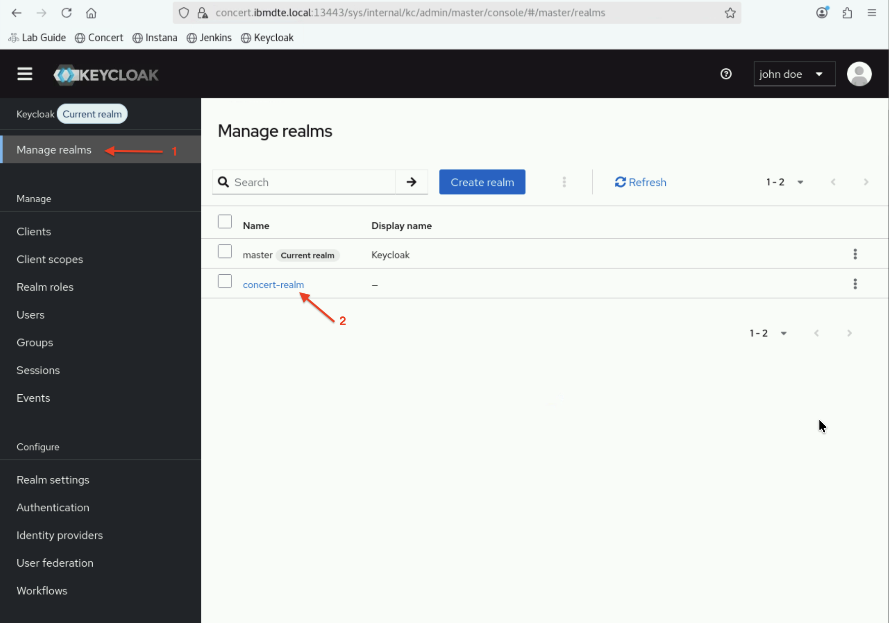

Please leave the Keycloak session on the Firefox browser open for the next steps.

:::note
After clicking the `concert-realm`, Keycloak automatically switches to the new realm.
:::

---

## 5.4: Verify the creation of new OIDC Client for Concert SSO

Now that the `concert-realm` is active, let's verify the creation of new OIDC client that Concert will use to authenticate users via Keycloak. <br/>
The new Client for Concert SSO is a Keycloak OIDC client registration — it is the identity record that represents IBM Concert <br/>
as an application within Keycloak and allows it to request authentication and receive tokens.

### 5.4.1: Why a new OIDC Client is required?

- **OIDC integration**: Enables Concert to use Keycloak for authentication
- **Client identity**: Provides the client ID that Concert will reference
- **Token exchange**: Allows secure issuance of ID and access tokens

### 5.4.2: Steps to Verify the new Concert OIDC Client

1. In the Keycloak Admin Console, ensure you're in the **concert-realm** realm
2. In the left navigation menu, click **Clients** in the main navigation.
3. The new client created by `setup-keycloak.sh` script should be listed as `concert-client`.

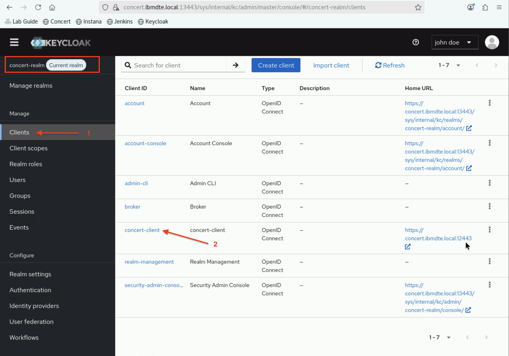

4. Click on `concert-client` to view its configuration.

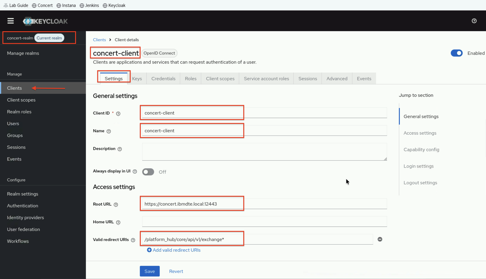

5. Above page shows `General settings` and first part of `Access settings` for `concert-client`.

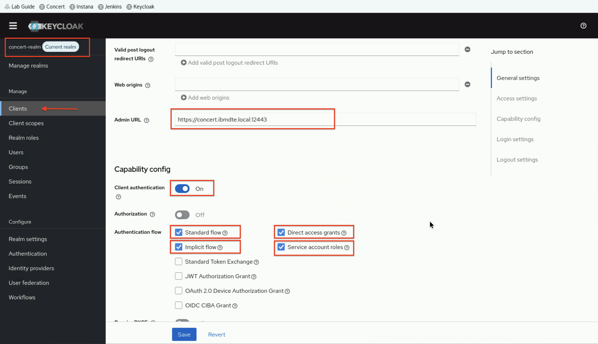

6. Above page shows second part of `Access settings` and `Capability config` for `concert-client`.

7. On the concert-client page, click on **Roles** tab to view the roles assigned to the client. You should see `Admin` and `User` roles on this page.

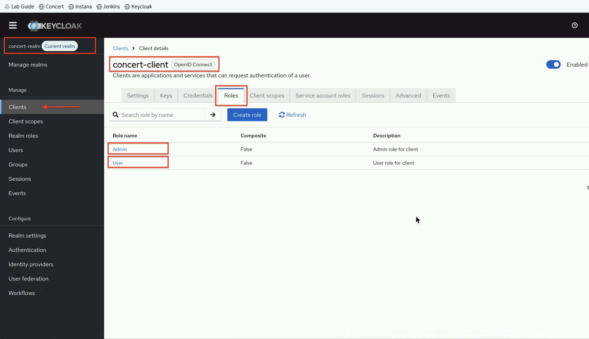

8. Still on the concert-client page, click on **Service account roles** tab to view the service account roles assigned to the client. You should see `manage users`, `realm-admin` and `default-roles-concert-realm` roles on this page.

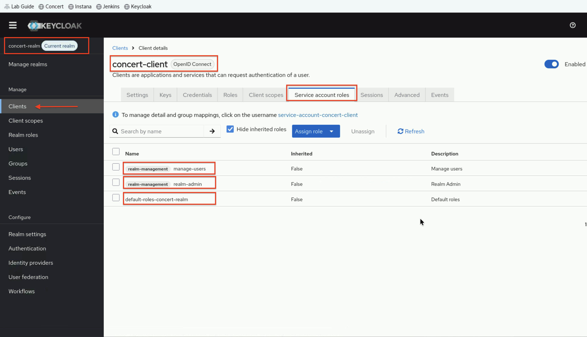

All these configurations under `concert-client` are created by the `setup-keycloak.sh` script.<br/>
Please leave the Keycloak session on the Firefox browser open for the next steps.

### 5.4.3: What the concert-client Does

- The client is registered as an OIDC client in the `concert-realm`.
- `concert-client` becomes the identifier used by Concert for authentication requests.
- The Root URL and redirect URI ensure the client can complete the OIDC login flow.

---

## 5.5: Configure LDAP User Federation

Now, we will add OpenLDAP as a user federation provider in the `concert-realm` realm. <br/>
User Federation in Keycloak is a configuration that connects Keycloak to an external 
user directory (such as LDAP or Active Directory), allowing Keycloak to delegate user 
authentication and profile lookups to that external source rather than managing users 
in its own internal database — so organisations can keep their existing user directory 
as the single source of truth while still using Keycloak as the identity provider for 
all their applications. <br/>
For this lab, it connects to the **OpenLDAP** server on **bluebox.ibmdte.local**.

### 5.5.1: Navigate to User Federation

1. In the left navigation menu, click **User Federation**
2. Click **Add Ldap providers** tile

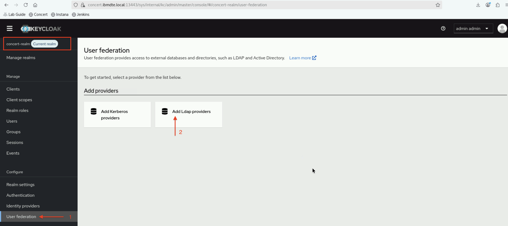

### 5.5.2: Configure LDAP Connection Settings

On the LDAP configuration page, enter the following settings:

#### 5.5.2.1: General Settings

1. Enter the following values:
   - **UI Display Name**: `openldap`
   - **Vendor**: `Other`

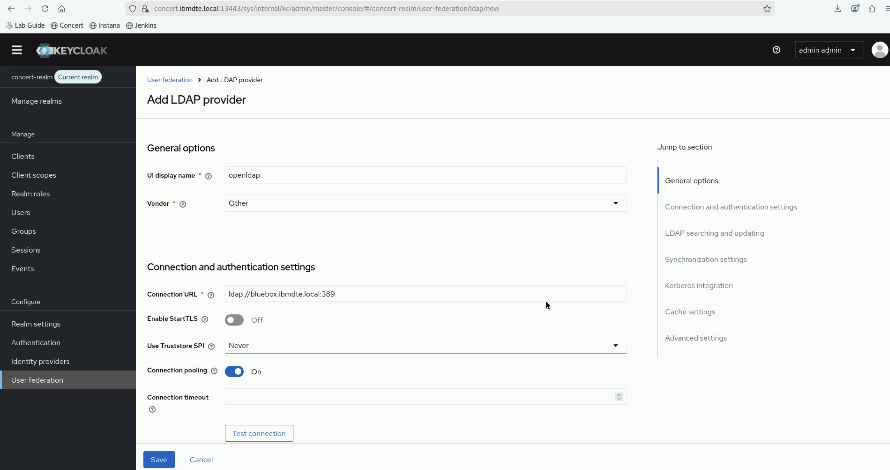

#### 5.5.2.2: Connection and Authentication Settings

1. Enter the following values:
   - **Connection URL**: `ldap://bluebox.ibmdte.local:389`
   - **Enable StartTLS**: `OFF`
   - **Use Truststore SPI**: `Never`
   - **Connection Pooling**: `ON`
   - **Connection Timeout**: `**Leave empty**`

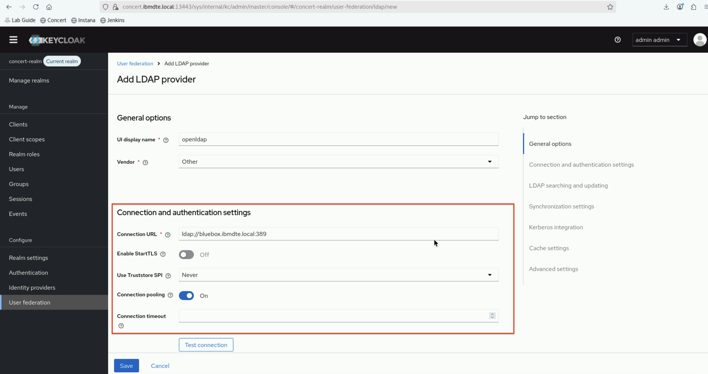

:::important
In real-life production system, Secure LDAP (LDAPS) is the recommended approach to secure the communication channel between Keycloak and OpenLDAP.
:::

#### 5.5.2.3: Test LDAP Connection

After adding the LDAP connection and authentication settings, let's test the connection to ensure Keycloak can communicate with OpenLDAP.

1. You will see the **Test connection** button under **Connection Timeout**
2. Click **Test connection**
3. You should see a success message: "Successfully connected to LDAP"

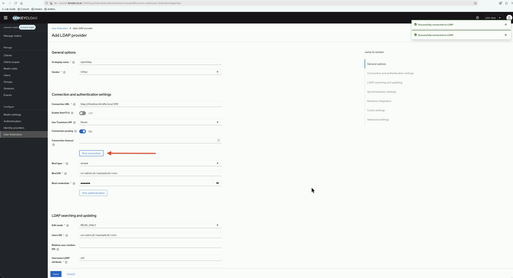

:::warning
If the connection test fails:
- Verify OpenLDAP service is running on the openldap host
- Check the Connection URL is correct
- Verify the Bind DN and Bind Credential are correct
:::

#### 5.5.2.4: LDAP Bind Settings

Let's configure the LDAP bind settings.
1. Enter the following values:
   - **Bind Type**: `simple`
   - **Bind DN**: `cn=admin,dc=example,dc=com`
   - **Bind Credential**: `openldap_admin_password` (refer to **openldap_admin_password** in `credentials.txt` file)

:::important
Use the OpenLDAP admin password present in the `credentials.txt` file.
:::

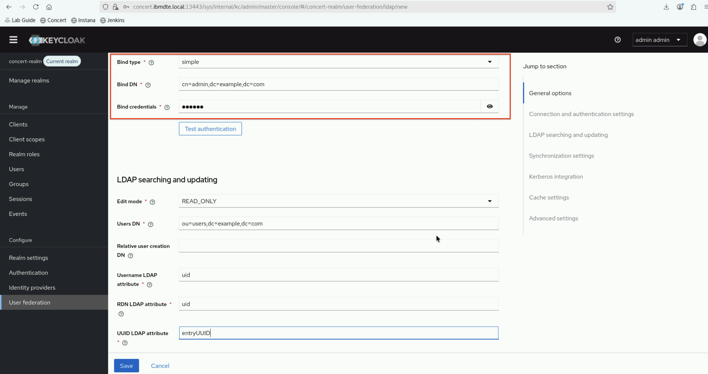

#### 5.5.2.5: Test LDAP Authentication

After adding the LDAP bind settings, let's test the authentication:

1. You will see the **Test authentication** button under **Bind Credentials**
2. Click **Test authentication**
3. You should see a success message: "Successfully connected to LDAP"

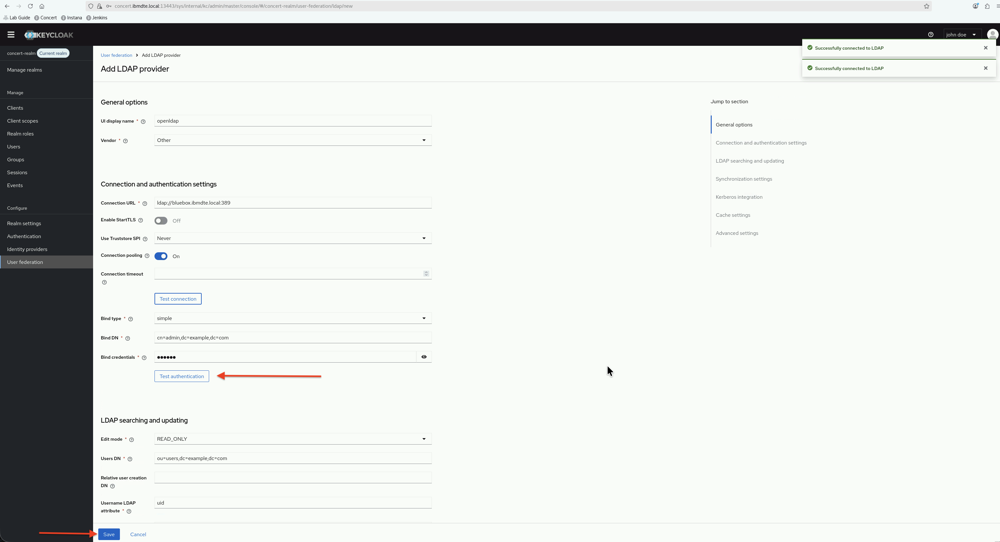

#### 5.5.2.6: LDAP Searching and Updating

1. Enter the following values:
   - **Edit Mode**: `READ_ONLY`
   - **Users DN**: `ou=users,dc=example,dc=com`
   - **Relative user creation DN**: `**Leave empty**`
   - **Username LDAP attribute**: `uid`
   - **RDN LDAP attribute**: `uid`
   - **UUID LDAP attribute**: `entryUUID`

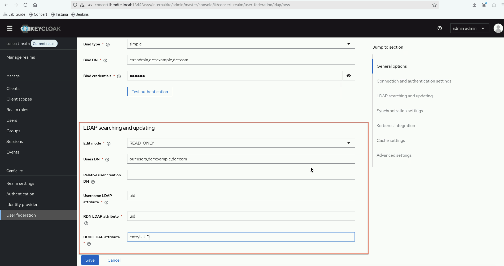

   - **User Object Classes**: `inetOrgPerson, organizationalPerson`
   - **User LDAP filter**: `**Leave empty**`
   - **Search scope**: `One Level`
   - **Read timeout**: `**Leave undefined**`
   - **Pagination**: `ON`
   - **Referral**: `**Leave empty**`

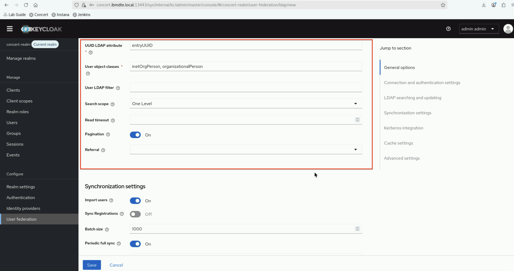

#### 5.5.2.7: Synchronization settings

1. Enter the following values:
   - **Import Users**: `ON`
   - **Sync Registrations**: `OFF`
   - **Batch size**: `1000`
   - **Periodic full sync**: `ON`
   - **Full sync period**: `604800`
   - **Periodic changed users sync**: `ON`
   - **Changed users sync period**: `86400`
   - **Remove invalid users during searches**: `ON`
   
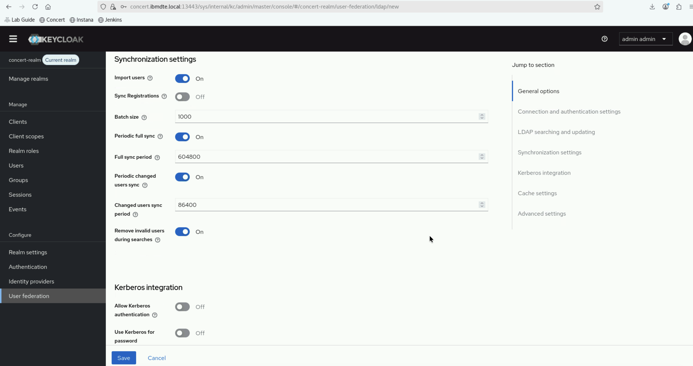

#### 5.5.2.8: Kerberos integration

1. Enter the following values:
   - **Allow Kerberos authentication**: `OFF`
   - **Use Kerberos for password authentication**: `OFF`

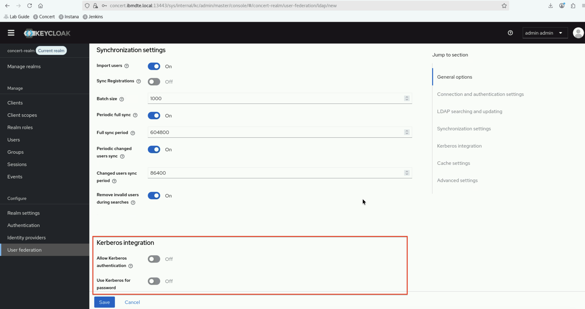

#### 5.5.2.9: Cache settings

1. Enter the following values:
   - **Cache policy**: `DEFAULT`

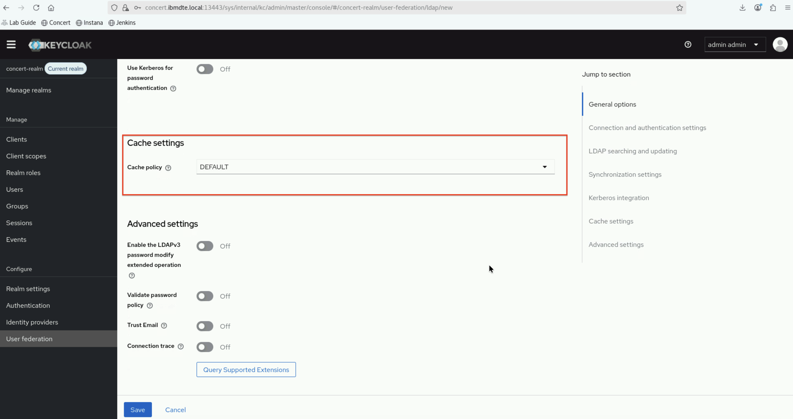

#### 5.5.2.10: Advanced settings

1. Enter the following values:
   - **Enable the LDAPv3 password modify extended operation**: `OFF`
   - **Validate password policy**: `OFF`
   - **Trust Email**: `OFF`
   - **Connection trace**: `OFF`

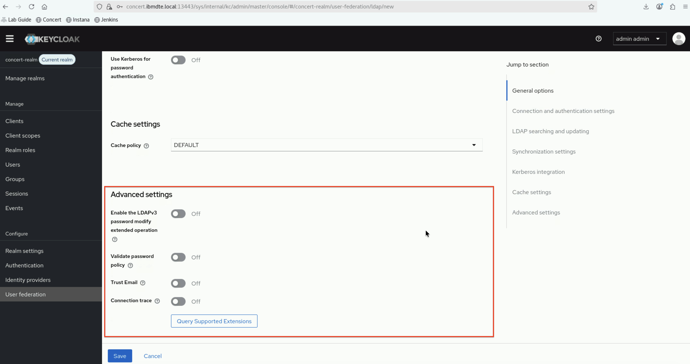

### 5.5.5: Save Configuration

1. At the bottom of the page, you will find **Save** to save the LDAP provider configuration.
2. Click **Save**

You should see a success message indicating the LDAP provider was created.

Finally, after saving the configuration, you will be able to see `openldap` in a tile under User federation page.
Please leave the Keycloak's `User Federation` page open on the Firefox browser for the next steps.

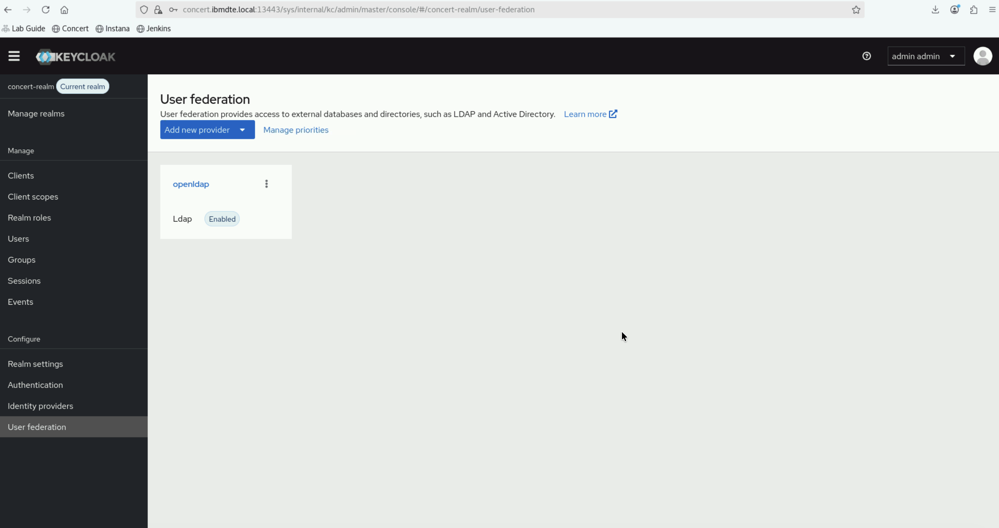

---

## 5.6: Synchronize Users from LDAP

Now that **openldap** User Federation has been configured, synchronize users from OpenLDAP to Keycloak.

### 5.6.1: Perform Initial Sync

1. On the **User federation** page, click **openldap** tile
2. On **openldap** settings, click **Action** drop down
3. Click **Sync all users**

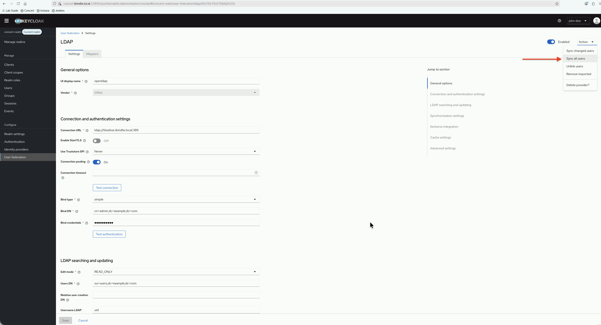

4. Wait for the synchronization to complete

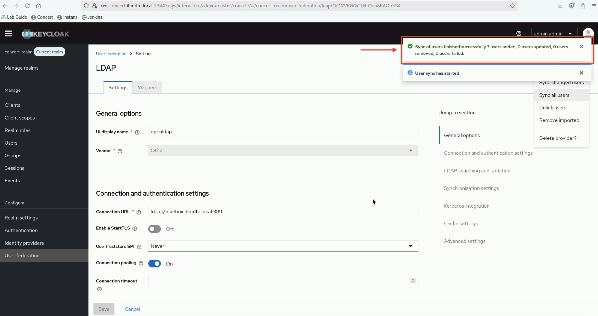

5. You should see a message indicating how many users were synchronized (should be 3: alice, bob, charlie)


### 5.6.2: Verify Users in Keycloak

1. In the left navigation menu, click **Users**
2. Enter `*` in the search box, next to magnifying glass, and click `Return` key 
3. You should see three users: `alice`, `bob`, and `charlie` were created from User Federation with OpenLDAP

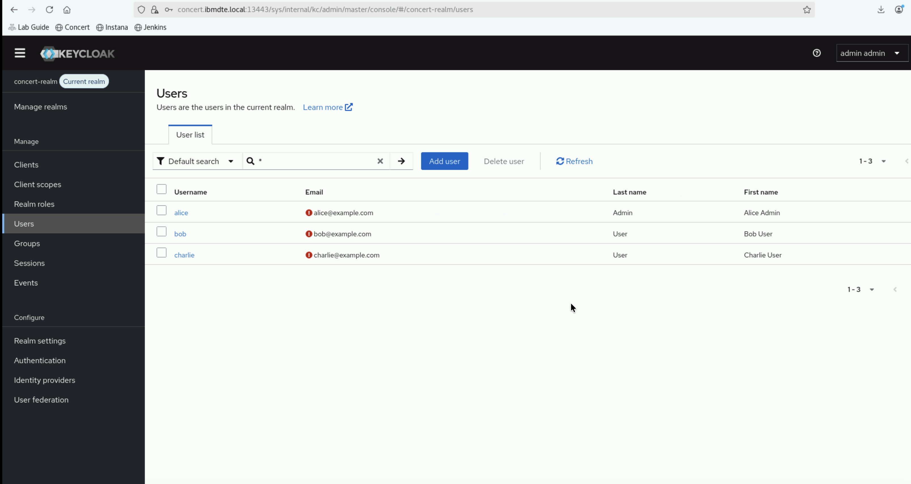

4. The user: `ibmconcert` was created from `setup-keycloak.sh` script and is not part of the LDAP federation

### 5.6.3: Inspect User Details

Click on one of the users (e.g., alice) to view details:

1. **Details** tab shows:
   - Federation Link: openldap
   - Username: alice
   - Email: alice@example.com
   - First name: Alice Admin
   - Last name: Admin<br/>

   Under `User metadata` section, the `LDAP_ENTRY_DN` attribute value indicates the user was imported from OpenLDAP

2. **Credentials** tab shows:
   - Password is managed by LDAP (cannot be changed in Keycloak)

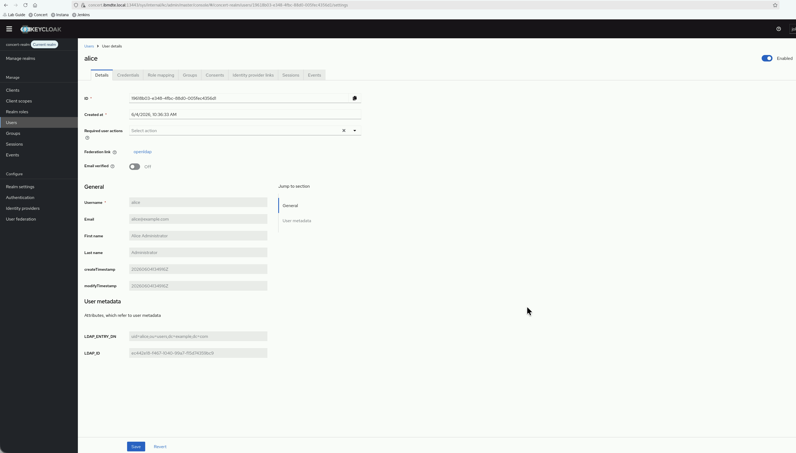

---

## 5.7: Configure LDAP Mappers

Mappers define how LDAP attributes are mapped to Keycloak user attributes. We will configure mappers for user attributes and group membership.

### 5.7.1: Navigate to Mappers

1. Go back to **User Federation** → **openldap** 

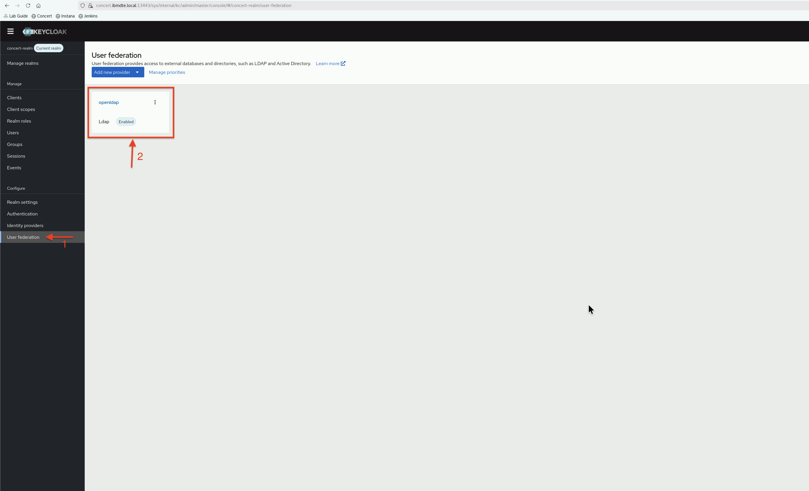

2. Click the **Mappers** tab
3. You'll see several default mappers already created

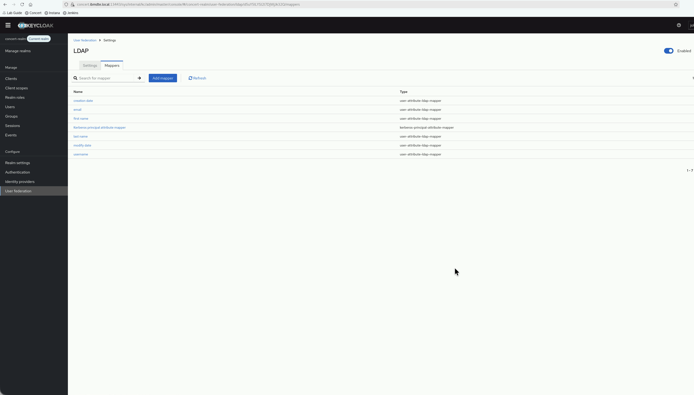

### 5.7.2: Review Default Mappers

Keycloak creates several default mappers automatically such as:

| Mapper Name | Type | Description |
|-------------|------|-------------|
| **username** | user-attribute-ldap-mapper | Maps uid to username |
| **email** | user-attribute-ldap-mapper | Maps mail to email |
| **first name** | user-attribute-ldap-mapper | Maps cn to first name |
| **last name** | user-attribute-ldap-mapper | Maps sn to last name |
| **creation date** | user-attribute-ldap-mapper | Maps createTimestamp |
| **modify date** | user-attribute-ldap-mapper | Maps modifyTimestamp |
| **Kerberos principal attribute mapper** | kerberos-principal-attribute-mapper | Maps Kerberos user attribute |

These default mappers are sufficient for basic user attributes.

### 5.7.3: Create Group Mapper

Now, we will create a mapper to import LDAP groups as Keycloak groups:

1. Click **Add mapper**

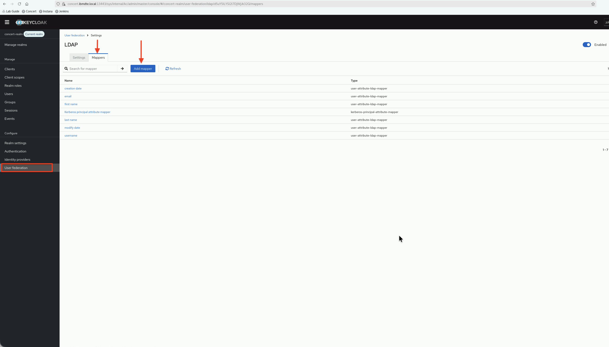

2. Select **group-ldap-mapper** from the mapper type dropdown

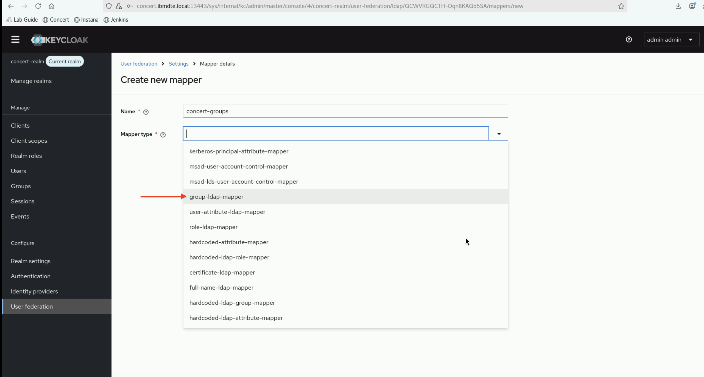

3. Enter the following values for the new mapper:
   - **Name**: `concert-groups`
   - **Mapper type**: `group-ldap-mapper`
   - **LDAP Groups DN**: `ou=groups,dc=example,dc=com`
   - **Relative creation DN**: `**Leave empty**`
   - **Group Name LDAP Attribute**: `cn`
   - **Group Object Classes**: `groupOfNames`
   - **Preserve Group Inheritance**: `ON`
   - **Ignoring Missing Groups**: `OFF`
   - **Membership LDAP Attribute**: `member`
   - **Membership Attribute Type**: `DN`

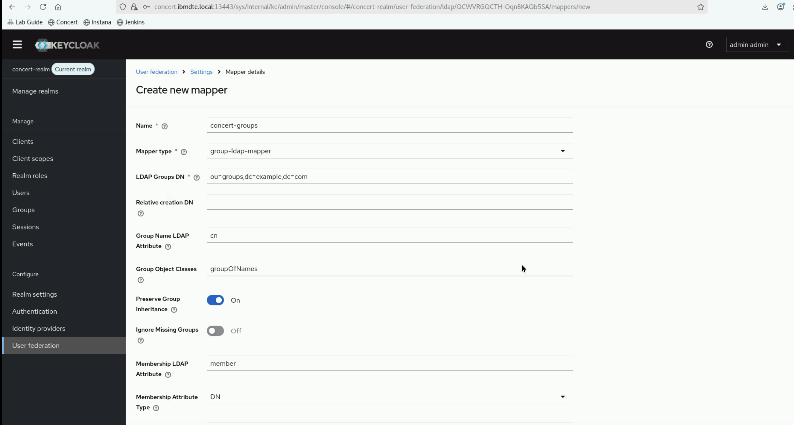

   - **Membership User LDAP Attribute**: `uid`
   - **LDAP Filter**: `**Leave empty**`
   - **Mode**: `READ_ONLY`
   - **User Groups Retrieve Strategy**: `LOAD_GROUPS_BY_MEMBER_ATTRIBUTE`
   - **Member-Of LDAP Attribute**: `memberOf`
   - **Mapped Group Attributes**: `**Leave empty**`
   - **Drop non-existing groups during sync**: `OFF`
   - **Groups Path**: `/`

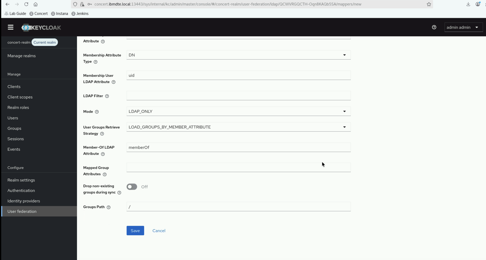

4. Click **Save** to save the new group mapper.


### 5.7.4: Synchronize Groups

After creating the group mapper:

1. Find the **concert-groups** mapper in the list
2. Click on it to open the configuration
3. Scroll down and click **Sync LDAP Groups To Keycloak**

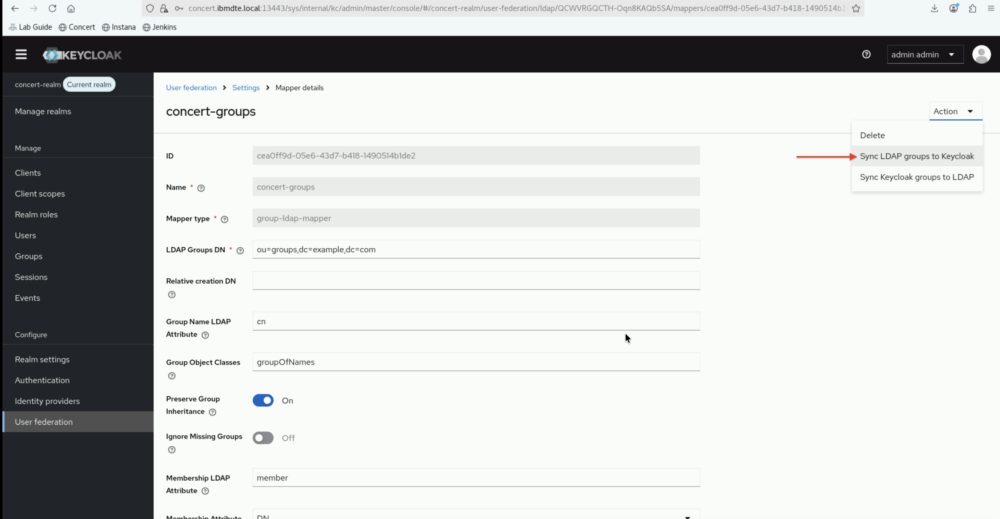

4. You should see a message, `Data successfully synced ...`  on top right corner indicating groups were synchronized
 

 
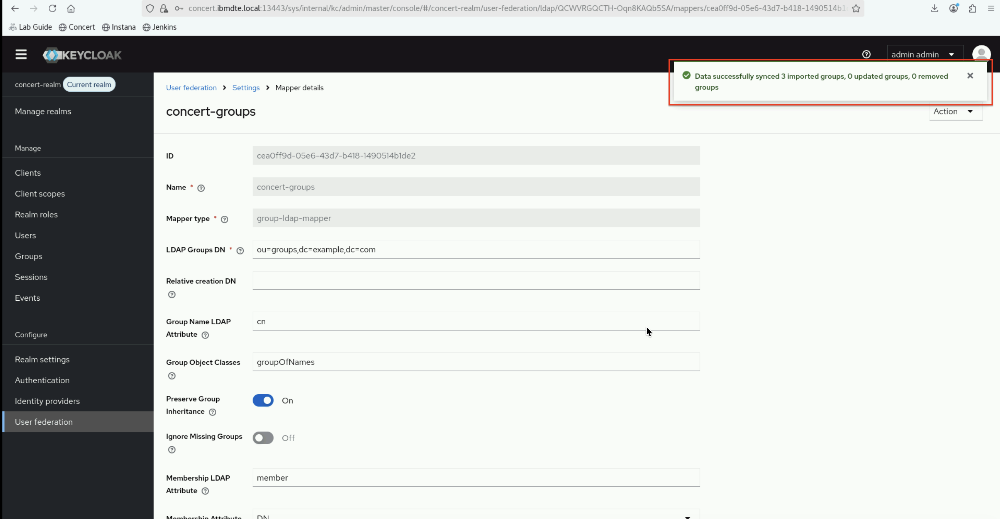

---

## 5.8: Verify Group Synchronization

Let's verify that groups and group memberships were synchronized correctly.

### 5.8.1: View Groups in Keycloak

1. In the left navigation menu, click **Groups**
2. You should see three groups:
   - corporate_it_staff
   - hr_staff
   - sales_staff

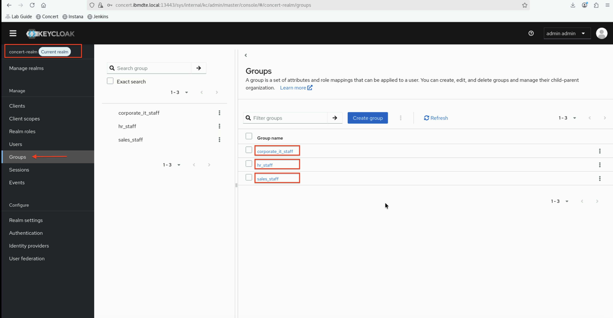

### 5.8.2: Verify Group Membership

1. Click on **corporate_it_staff** group
2. Click the **Members** tab
3. You should see **alice** as a member

Repeat for other groups:
- **hr_staff** should have **bob** as a member
- **sales_staff** should have **charlie** as a member

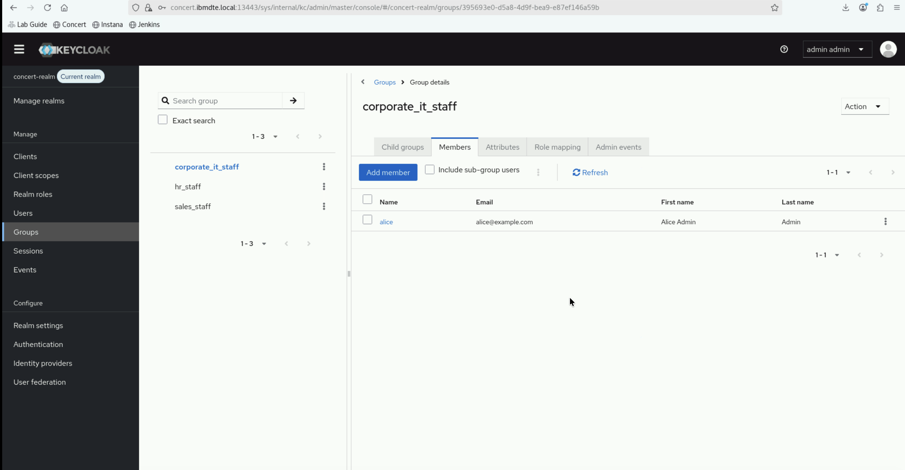

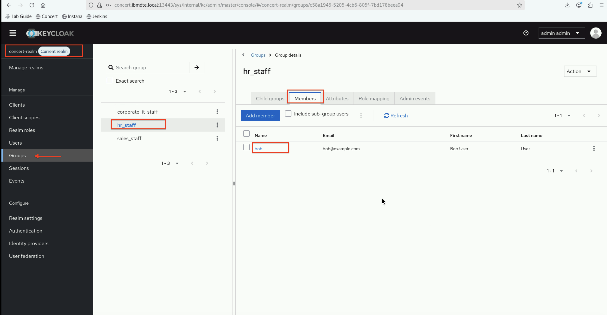

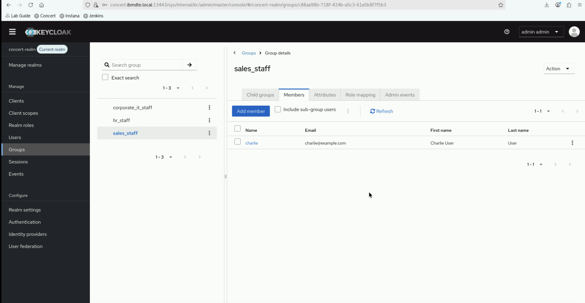

---

## 5.9: Configuration Summary

You have successfully configured Keycloak LDAP integration with:

### LDAP User Federation
- ✅ Connected Keycloak to OpenLDAP server
- ✅ Configured LDAP connection and bind settings
- ✅ Tested LDAP connection and authentication
- ✅ Synchronized 3 users from LDAP to Keycloak

### User Attribute Mappers
- ✅ Username mapper (uid → username)
- ✅ Email mapper (mail → email)
- ✅ First name mapper (cn → firstName)
- ✅ Last name mapper (sn → lastName)

### Group Mapper
- ✅ Created group mapper for LDAP groups
- ✅ Synchronized 3 groups from LDAP to Keycloak
- ✅ Verified group memberships

### Verification
- ✅ Users visible in Keycloak Users list
- ✅ Groups visible in Keycloak Groups list
- ✅ Group memberships correctly mapped
- ✅ LDAP authentication working via Keycloak

---

## Troubleshooting

:::info
This section provides basic troubleshooting steps in case you encounter any issues while performing the steps above.
These steps are optional and only need to be followed if you run into problems.
:::

### Test LDAP Authentication

**Problem**: LDAP authentication fails when testing with Keycloak

This is a troubleshooting section to verify that users can authenticate via Keycloak using their LDAP credentials.
To achieve that, let's create a **temporary test client**.

:::info 
Why Create a Test Client? <br/>
Before integrating Keycloak with Concert, we need to verify that the LDAP integration is working correctly. A test client allows us to:
- Confirm users can authenticate through Keycloak
- Verify LDAP user data is being retrieved properly
- Test that group mappings are working
- Ensure token claims are configured correctly

This test client can be deleted after verification, and the actual `concert-client` which you have configured in Section 5.4 will be used for all subsequent steps.
:::

#### Create a Test Client

To test authentication, we will create a **temporary test client**:

1. In the **Keycloak** left navigation menu, click **Clients**
2. Click **Create client**
3. Enter the following:
   - **Client type**: `OpenID Connect`
   - **Client ID**: `test-client`
   - **Name**: `test-client`
   - **Description**: `test-client`
4. Click **Next**

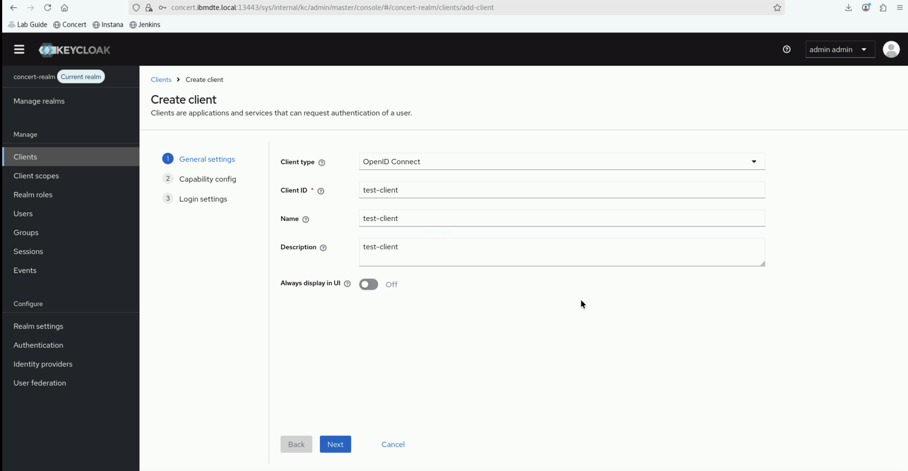

5. Under **Configure capability**, configure the following:
   - **Client authentication**: `OFF` (public client)
   - **Authorization**: `OFF`
   - **Standard flow**: `ON`
   - **Direct access grants**: `ON`
6. Click **Next**


7. Under **login settings**, configure the following:
   - **Valid redirect URIs**: `*`
   - **Web origins**: `*`
8. Click **Save**

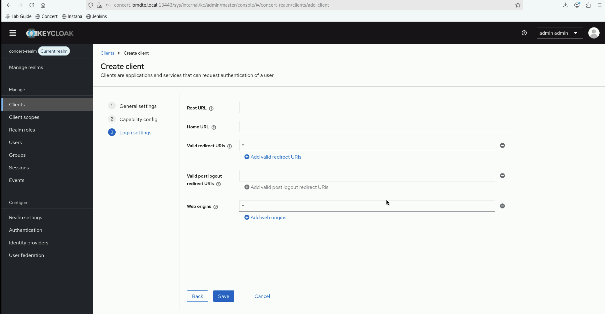

#### Test Authentication with Direct Access Grant

From the Bastion Host terminal, test authentication using curl commands below:

```bash title="Host: bastion-gym-lan"
# Test Keycloak endpoint for OIDC configuration
curl -k https://concert.ibmdte.local:13443/sys/internal/kc/realms/concert-realm/.well-known/openid-configuration

# Test Alice's authentication
curl -X POST "https://concert.ibmdte.local:13443/sys/internal/kc/realms/concert-realm/protocol/openid-connect/token" \
  -H "Content-Type: application/x-www-form-urlencoded" \
  -d "client_id=test-client" \
  -d "username=alice" \
  -d "password=Alice@123" \
  -d "grant_type=password" \
  --insecure | jq .

# Test Bob's authentication
curl -X POST "https://concert.ibmdte.local:13443/sys/internal/kc/realms/concert-realm/protocol/openid-connect/token" \
  -H "Content-Type: application/x-www-form-urlencoded" \
  -d "client_id=test-client" \
  -d "username=bob" \
  -d "password=Bob@123" \
  -d "grant_type=password" \
  --insecure | jq .

# Test Charlie's authentication
curl -X POST "https://concert.ibmdte.local:13443/sys/internal/kc/realms/concert-realm/protocol/openid-connect/token" \
  -H "Content-Type: application/x-www-form-urlencoded" \
  -d "client_id=test-client" \
  -d "username=charlie" \
  -d "password=Charlie@123" \
  -d "grant_type=password" \
  --insecure | jq .
```

:::note
If `jq` is not installed, you can omit `| jq .` to see the raw JSON response.
:::

:::info
Endpoint `https://concert.ibmdte.local:13443/sys/internal/kc/realms/<realm-name>` <br/>
is specific to this embedded Keycloak instance. <br/> For standard Keycloak deployments, 
the endpoint would be <br/> `https://<keycloak-host>:<port>/auth/realms/<realm-name>`
:::

Expected output should include:
- `access_token`: JWT token for the authenticated user
- `refresh_token`: Token for refreshing the access token
- `token_type`: "Bearer"
- `expires_in`: Token expiration time

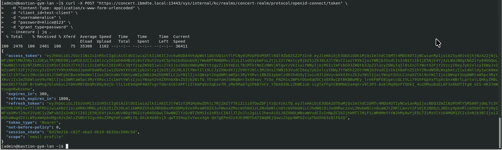

If authentication fails, you'll see an error message like:
```json
{
  "error": "invalid_grant",
  "error_description": "Invalid user credentials"
}
```

#### Delete Test Client

After testing, delete the test client:

1. In the **Keycloak** left navigation menu, click **Clients**
2. Find **test-client**
3. Click on it
4. Click **Delete** (in the Action dropdown or at the bottom)
5. Confirm deletion

### Users Not Appearing After Sync

**Problem**: Synchronize all users completes but no users appear

**Solutions**:
- Verify Users DN is correct: `ou=users,dc=example,dc=com`
- Check User Object Classes match LDAP: `inetOrgPerson, organizationalPerson`
- Verify users exist in LDAP: `ldapsearch -x -b "ou=users,dc=example,dc=com" "(uid=*)"`

### Groups Not Synchronizing

**Problem**: Group sync completes but no groups appear

**Solutions**:
- Verify LDAP Groups DN is correct: `ou=groups,dc=example,dc=com`
- Check Group Object Classes: `groupOfNames`
- Verify groups exist in LDAP: `ldapsearch -x -b "ou=groups,dc=example,dc=com" "(cn=*)"`
- Ensure Membership LDAP Attribute is `member`
- Check that group members use full DN format

### Group Membership Not Showing

**Problem**: Groups exist but members are not associated

**Solutions**:
- Verify member attribute in LDAP contains full user DN
- Check Membership Attribute Type is set to `DN`
- Re-sync groups: Click **Sync LDAP Groups To Keycloak**
- Verify in LDAP: `ldapsearch -x -b "ou=groups,dc=example,dc=com" "(cn=concert-admins)" member`

### Authentication Test Fails

**Problem**: Test authentication button shows failure

**Solutions**:
- Verify Bind DN and Bind Credential are correct
- Test LDAP bind manually: `ldapwhoami -x -D "cn=admin,dc=example,dc=com" -w secret`
- Check OpenLDAP service is running
- Verify network connectivity to OpenLDAP host

### Cannot Connect to LDAP

**Problem**: Test connection fails

**Solutions**:
- Verify Connection URL format: `ldap://bluebox.ibmdte.local:389`
- Check OpenLDAP service: `ssh jammer@bluebox 'sudo systemctl status slapd'`
- Test network connectivity: `ping bluebox.ibmdte.local`
- Verify firewall allows port 389
- Try using IP address instead of hostname

### Users Can't Authenticate

**Problem**: Direct access grant test fails with invalid credentials

**Solutions**:
- Verify user password in LDAP: `ldapwhoami -x -D "uid=alice,ou=users,dc=example,dc=com" -w secret`
- Check user exists in Keycloak: Go to Users → View all users
- Verify user is enabled in Keycloak
- Check Edit Mode is set to READ_ONLY (not UNSYNCED)
- Re-sync users from LDAP

---

## Next Steps

Now that Keycloak is successfully integrated with OpenLDAP and can authenticate users, you're ready to proceed to the next section where you'll configure Concert to use Keycloak as its OIDC identity provider. This will enable SSO login for Concert using the LDAP users you've configured.

:::success
Keycloak LDAP integration is complete! Users from OpenLDAP can now authenticate via Keycloak with proper group memberships.
:::