# 6. Concert OIDC Setup

In this section, you will configure Concert to use Keycloak as its OpenID Connect (OIDC) identity provider. This enables Single Sign-On for Concert, allowing users to authenticate with their LDAP credentials through Keycloak.

## 6.1: Understanding OIDC Integration

OpenID Connect (OIDC) is an authentication protocol built on top of OAuth 2.0. It allows applications like Concert to delegate authentication to an identity provider like Keycloak.

### 6.1.1: OIDC Authentication Flow

1. **User Access**: User navigates to Concert and clicks "Login with SSO"
2. **Authorization Request**: Concert redirects user to Keycloak with an authorization request
3. **User Authentication**: User authenticates with Keycloak (which validates against LDAP)
4. **Authorization Grant**: Keycloak redirects back to Concert with an authorization code
5. **Token Exchange**: Concert exchanges the code for an ID token and access token
6. **User Info**: Concert validates the token and retrieves user information
7. **Session Creation**: Concert creates a session and grants access

---

## 6.2: Retrieve Client Secret

After creating the **concert-client** in **Section 5.4**, you need to retrieve the client secret for Concert configuration.

### 6.2.1: Get Client Secret

1. In the Keycloak Admin Console, ensure you're in the **concert-realm** realm (check the realm dropdown)
2. In the left navigation menu, click **Clients** in the main navigation.
3. Click **concert-client** from **Clients list**
4. Click the **Credentials** tab
5. You'll see the **Client Secret** field
6. Click the **Copy to clipboard** icon next to the secret
7. Paste the secret into your `credentials.txt` file under `oidc_client_secret:`

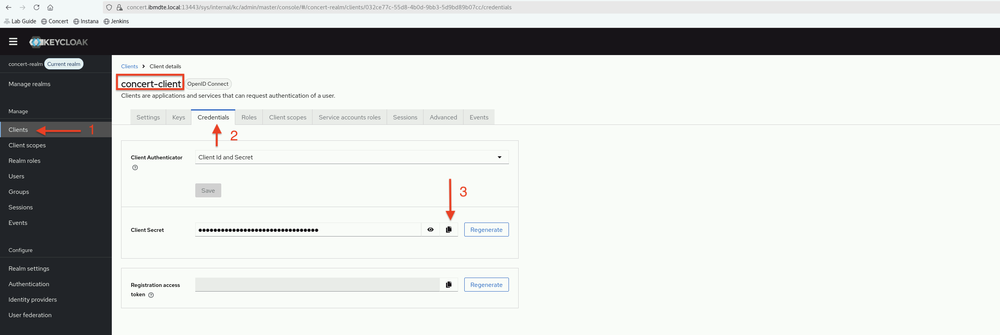

:::important
Keep this client secret secure. It will be used by Concert to authenticate with Keycloak.
:::

---

## 6.3: Assign Service Accounts Roles to a Client

Now, we will assign Service Accounts Roles to **concert-client**.

### 6.3.1: Assign Service Accounts Roles

1. After retrieving the client secret, you should be on the client details page for **concert-client**
2. Click the **Service accounts roles** tab
3. Click **Assign role** dropdown list and select **Client Roles**

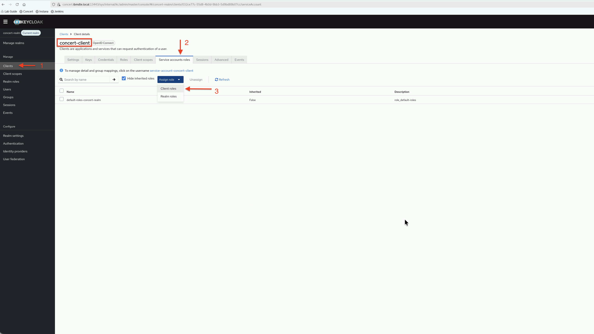

4. Search for `realm-admin` and `manage-users` roles
5. Assign `realm-admin` and `manage-users` roles to it


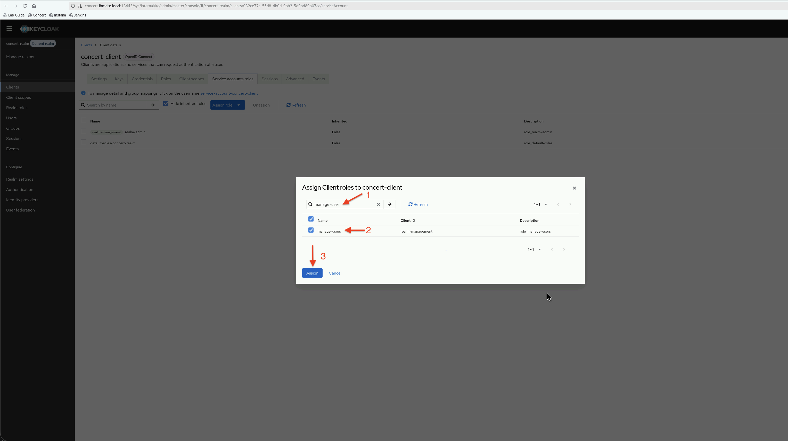

6. Click **Assign**

7. Now, you should be able to see 2 new roles added to the list for **concert-client**

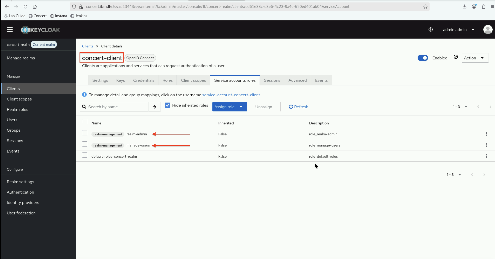

---

## 6.4: Create client roles

Now, we will create 2 new Roles for **concert-client**.

### 6.4.1: Create Client Roles

1. After assigning service account roles, you should be on the client details page for **concert-client**
2. Click the **Roles** tab
3. Click **Create role**

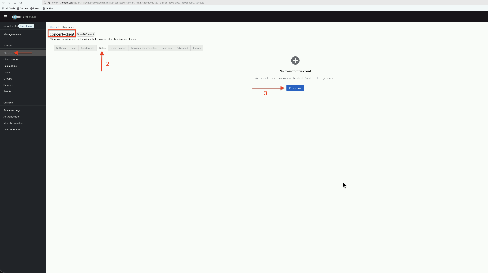

4. Add a custom specific Role name for `Admin`. 
   On the **Create Role** page, enter the following values:
   - **Role Name**: `Admin`
   - **Description**: `Admin`

5. Click **Save**

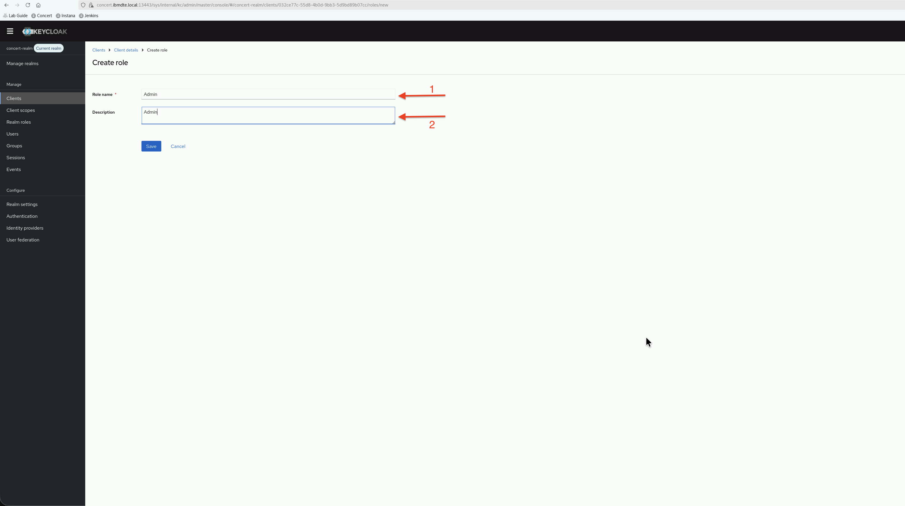

6. Add a custom specific Role name for `User`. 
   On the **Create Role** page, enter the following values:
   - **Role Name**: `User`
   - **Description**: `User`

7. Click **Save**


8. Finally, you should see 2 new client roles in the list

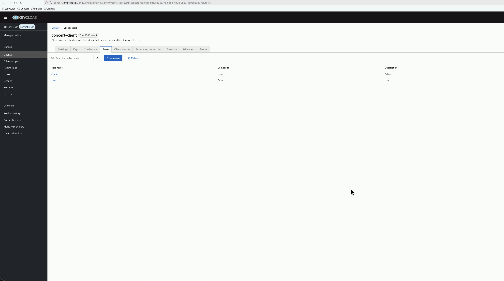

---

## 6.5: Setup the default role for all imported users

Now, we will setup the default role for all OpenLDAP imported users.

### 6.5.1: Navigate to Clients

1. In the Keycloak Admin Console, ensure you're in the **concert-realm** realm (check the realm dropdown)
2. Click **Realm Roles** from the left navigation menu.
3. Check if the role **default-roles-concert-realm** already exists for your Realm.
4. Click on **default-roles-concert-realm** to list all the roles for user realm.

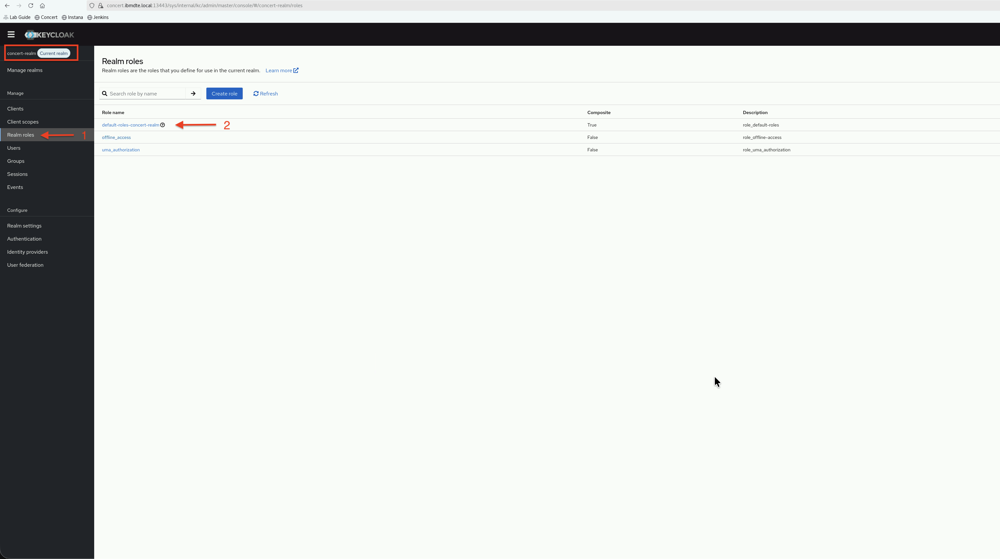

5. Click **Assign role** dropdown list and select **Client Roles**

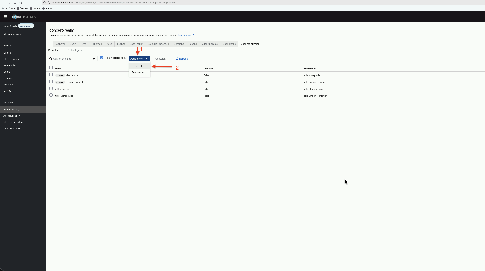

6. Search for `User` 
7. Select **User** role and click **Assign**.

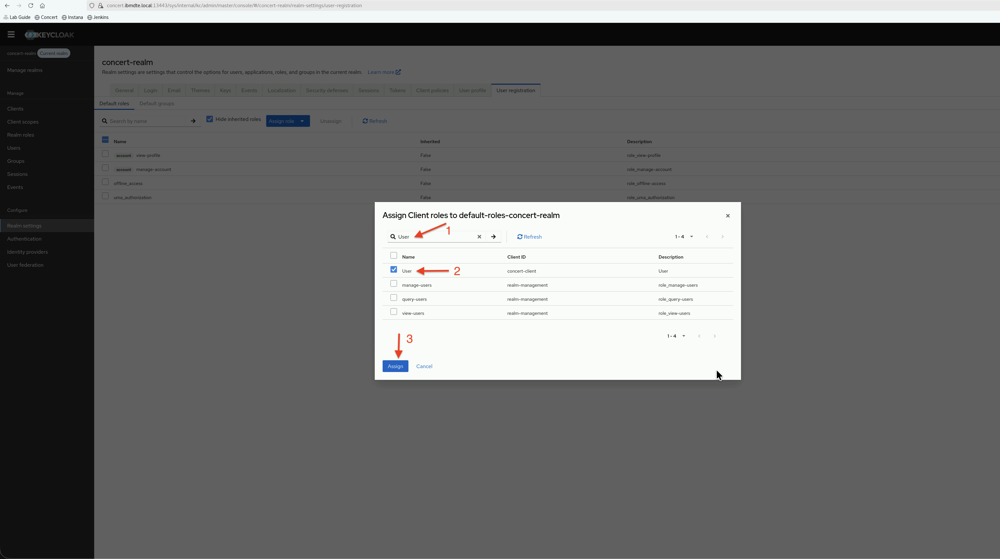

8. Finally, you should see **User** role is added in the list.

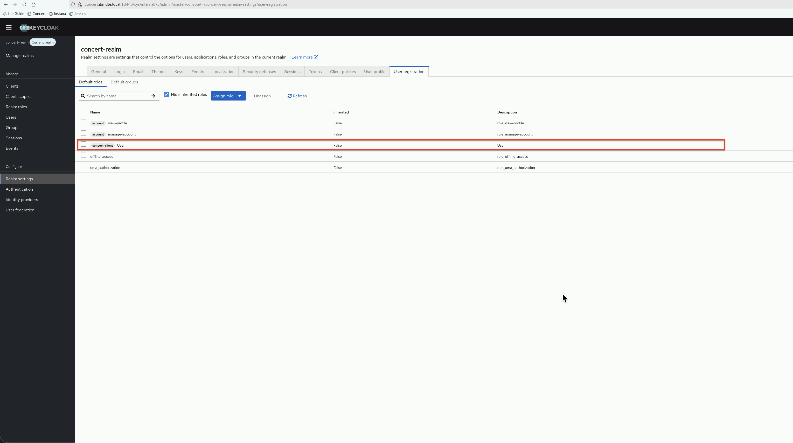

---

## 6.6: Configure Client Scopes

Client scopes define what information is included in the tokens issued by Keycloak. We'll configure scopes to include user roles and group memberships.

### 6.6.1: Add a new Client Scope

1. In the Keycloak Admin Console, ensure you're in the **concert-realm** realm, go to **Clients** → **concert-client**
2. On the **concert-client** details page, click **Client scopes** from the left navigation menu.
3. Click **Create client scope** button

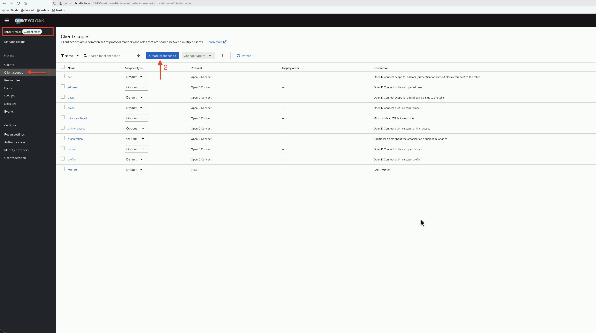

4. Configure the **new Client Scope** using the following values:
   - **Name**: `groups`
   - **Description**: `Include user groups in the token`
   - **Type**: `Default`
   - **Protocol**: `OpenID Connect`
   - **Display on consent screen**: `ON`
   - **Consent screen text**: `**Leave empty**`
   - **Include in token scope**: `OFF`
   - **Include in OpenID Provider Metadata**: `ON`
   - **Display Order**: `**Leave empty**`

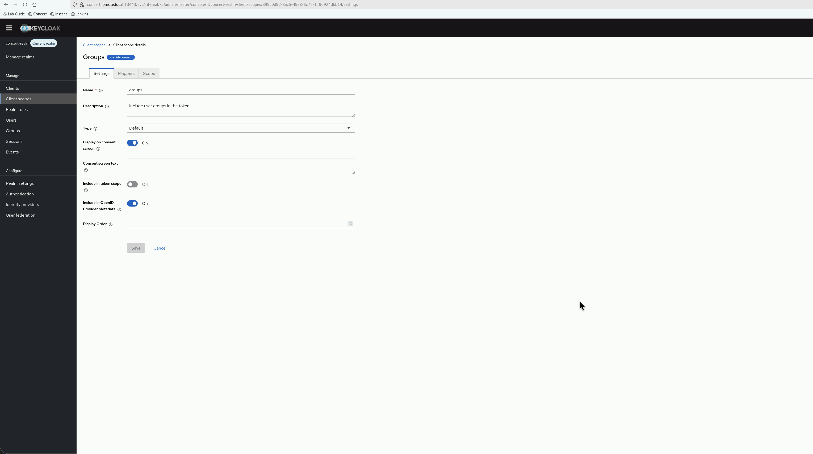

5. Click **Save**.
6. You should see the newly created client scope in the list of **client scopes**.

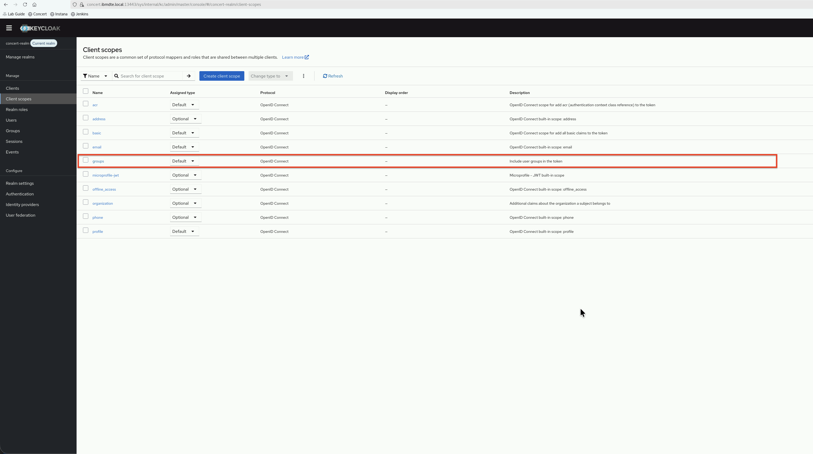

---

## 6.7: Configure Group Membership Mapper for Client Scope

Now, we will setup **concert-client** with Group Membership Mapper for Client Scope.

### 6.7.1: Add Groups to Token

1. In the Keycloak Admin Console, ensure you're in the **concert-realm** realm, go to **Clients** → **concert-client**
2. On the **concert-client** details page, click the **Client scopes** tab
3. You'll see **Assigned client scopes** column name

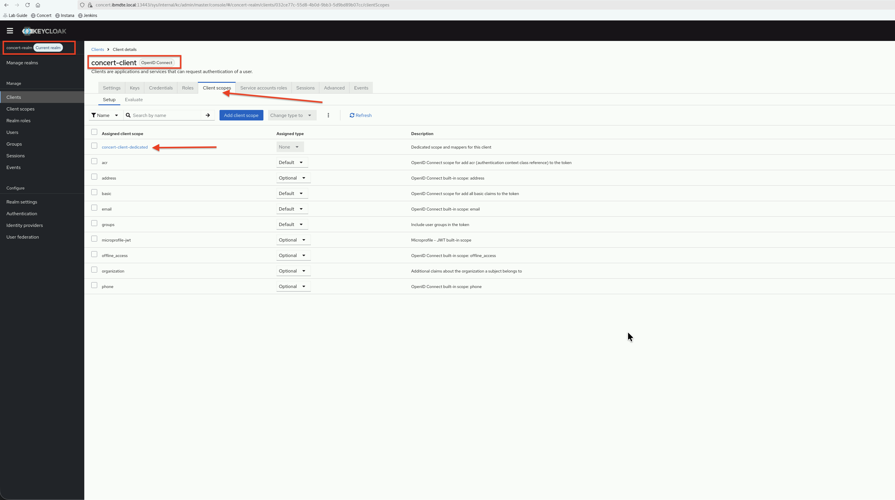

4. In the **Assigned client scope** column, find and click on **concert-client-dedicated**
5. Click the **Mappers** tab
6. Click **Configure a new mapper**

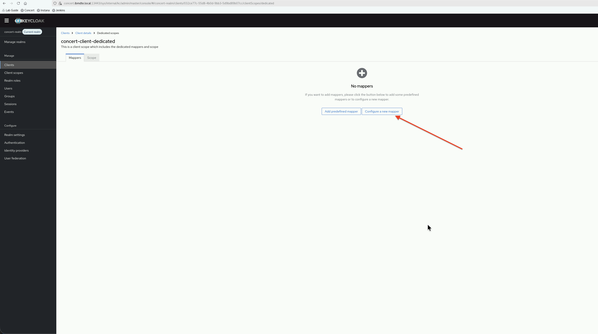

7. Select **Group Membership** from the list of built-in mapper types

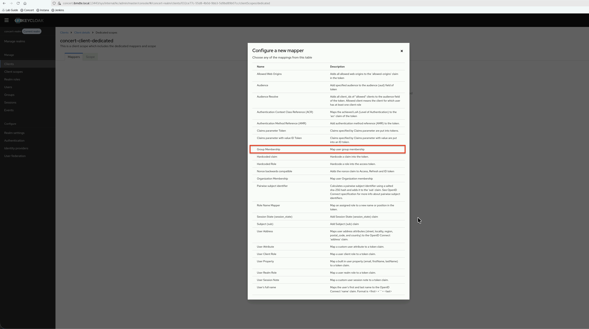

8. Configure the Group Membership mapper using the following values:
   - **Name**: `groups`
   - **Token Claim Name**: `groups`
   - **Full group path**: `OFF`
   - **Add to ID token**: `ON`
   - **Add to access token**: `ON`
   - **Add to lightweight access token**: `OFF`
   - **Add to userinfo**: `ON`
   - **Add to token introspection**: `ON`

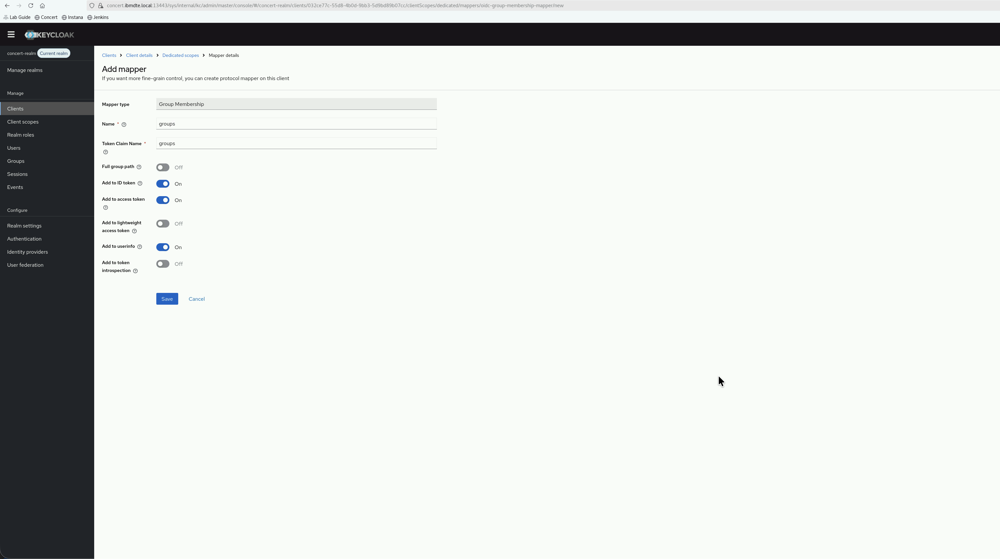

9. Click **Save**
10. You will see the newly created Group Membership mapper in the list of mappers for the `concert-client-dedicated` client scope.

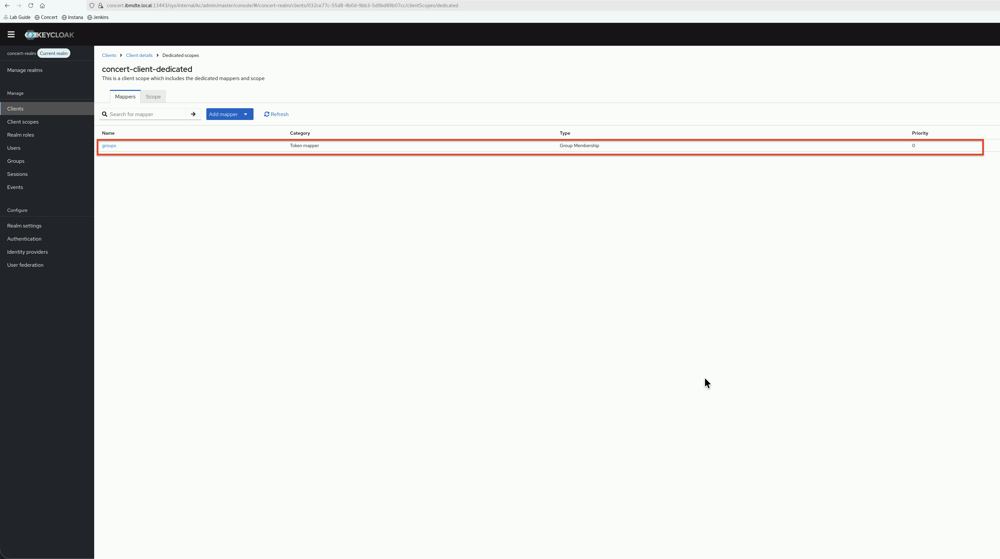

---

## 6.8: Assign groups to concert-client

Now, we will assign **groups** which we created in Section 6.6 to **concert-client**.

### 6.8.1: Assign groups to client

1. In the Keycloak Admin Console, ensure you're in the **concert-realm** realm, go to **Clients** → **concert-client**
2. On the **concert-client** details page, click **Client scopes**.
3. Click **Add Client Scope**.

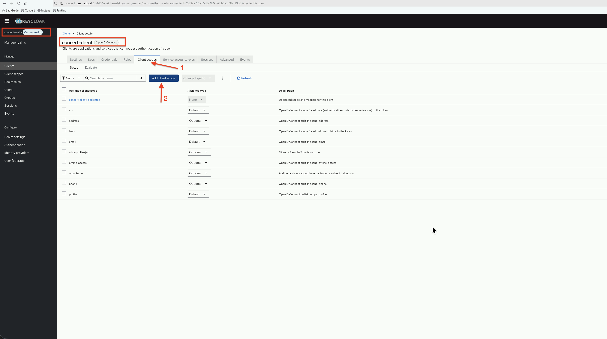

4. Select **groups**.
5. Select the **Default** option to assign the groups.

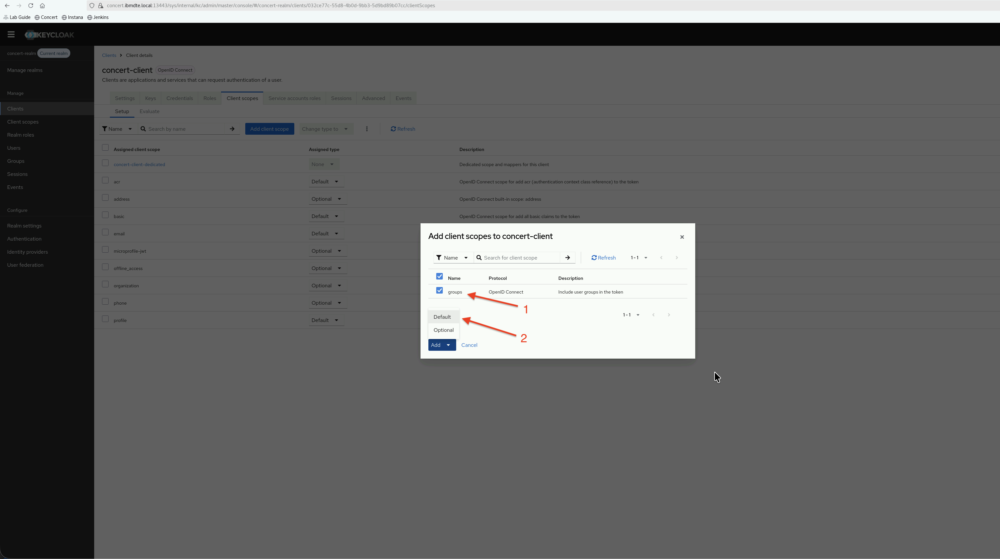

6. You should see the **groups** in the list of assigned client scopes for **concert-client**.

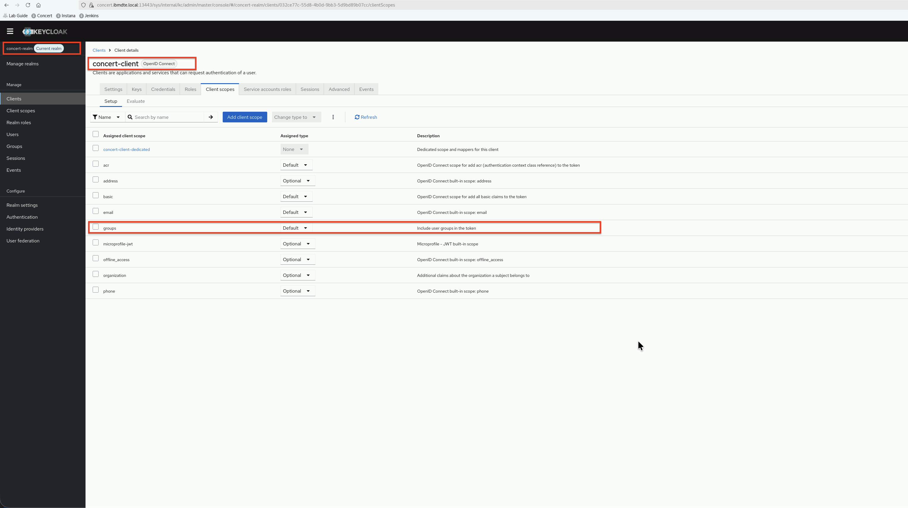

---

## 6.9 : Verify Token Claims

Before testing the actual login, let's verify that Keycloak will include the correct user information in the authentication tokens.

1. Go back to **Clients** → **concert-client**
2. Click the **Client scopes** tab
3. Click **Evaluate**
4. In the **User** field, type `alice` and select the user
5. Click **Generated access token** tab
6. You should see the token payload including:
   - `preferred_username`: alice
   - `email`: alice@example.com
   - `groups`: ["corporate_it_staff"]

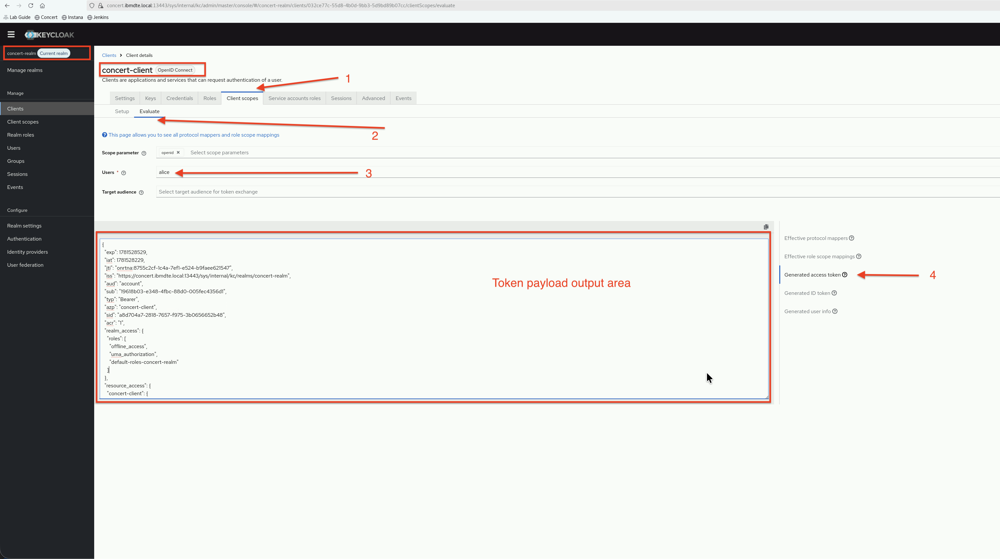

```bash title="Actual output in payload section"
{
  "exp": 1782133013,
  "iat": 1782132713,
  "jti": "onrtna:4b1020a6-6975-02a4-d141-36d9a136ab55",
  "iss": "https://concert.ibmdte.local:13443/sys/internal/kc/realms/concert-realm",
  "aud": "account",
  "sub": "d5659585-1fc3-4fa5-afea-c36125755275",
  "typ": "Bearer",
  "azp": "concert-client",
  "sid": "99c2b194-1c3f-a182-c086-d377a834631f",
  "acr": "1",
  "realm_access": {
    "roles": [
      "offline_access",
      "uma_authorization",
      "default-roles-concert-realm"
    ]
  },
  "resource_access": {
    "concert-client": {
      "roles": [
        "User"
      ]
    },
    "account": {
      "roles": [
        "manage-account",
        "manage-account-links",
        "view-profile"
      ]
    }
  },
  "scope": "openid email profile",
  "email_verified": false,
  "name": "Alice Admin Admin",
  "groups": [
    "corporate_it_staff"
  ],
  "preferred_username": "alice",
  "given_name": "Alice Admin",
  "family_name": "Admin",
  "email": "alice@example.com"
}
```

---

## 6.10: Configure Admin Role for Concert Instance level

Concert has 2 levels of role-based access: **Instance level** access and **Object level** access.

With **Instance level** access, user with **Admin** role can perform the following actions:

| Role | Details | 
|---------|-------|
| **Admin** | Grant or revoke access to other users or user groups (except for the Owner role) |
| | Create, edit, delete, and run ingestion jobs |
| | View, use, create, update, and delete shared third-party credentials (connections) |
| | Define applications and environments | 

Whereas user with **User** role can perform the following actions:
| Role | Details | 
|---------|-------|
| **User** | View ingestion jobs |
| |View and use shared third-party credentials (connections) |
| | Define applications and environments |

:::info

This section only applies to Concert v2.2.0. Steps for this section are not required for Concert v2.3.0 or later.

:::

In this section, we will assign `Admin` role to `alice` user for Concert instance level access. Other users will have `User` role for instance level access.
We will explore object level access and role assignment in section 7.

1. In the Keycloak Admin Console, ensure you're in the **concert-realm** realm (check the realm dropdown)
2. Click **Users** from the left navigation menu.
3. Enter `alice` in the search box, next to magnifying glass, and click `Return` key 

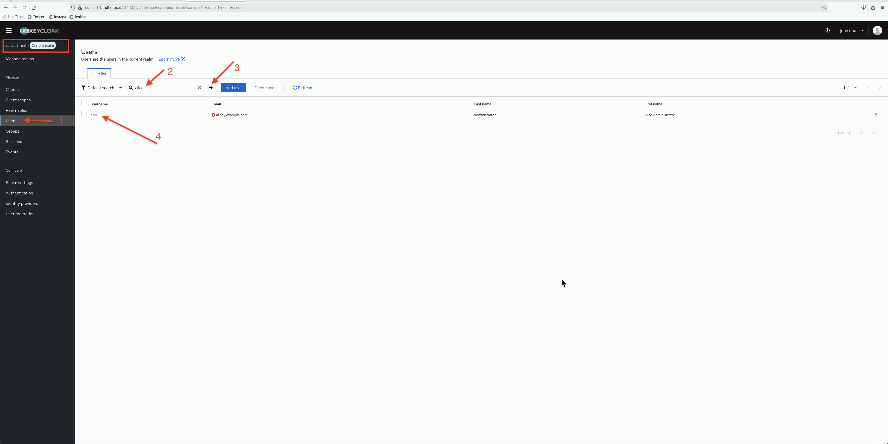

4. You should see one user: `alice`
5. Click on `alice` to open user details page
6. Click on the **Role Mappings** tab

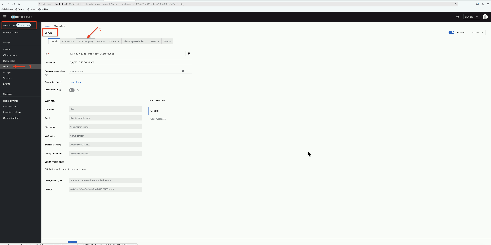

7. For `Assign role` dropdown, select **Client Roles** and then select `Admin` under Name column and `concert-client` under Client ID column

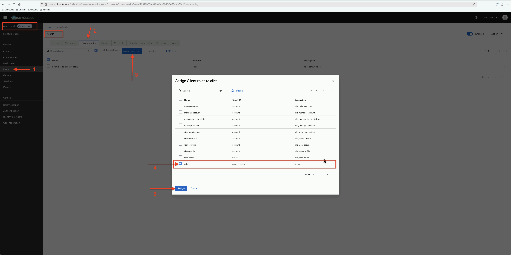

8. Now, you should see `Admin` role is added in the list of assigned roles for `alice` user.
9. Next, remove `default-roles-concert-realm` role from `alice` user by selecting `default-roles-concert-realm` role in the list of assigned roles.
10. Click the **⋮** (three vertical dots) far right on same row as `default-roles-concert-realm` role to make `Unassign` visible.
11. Click `Unassign` to unassign the role from `alice` user.
This step is required because the default role assigned to all users is set to `User` and it will override the client role assignment. 
Unassign the default role will allow the `Admin` role to take effect.

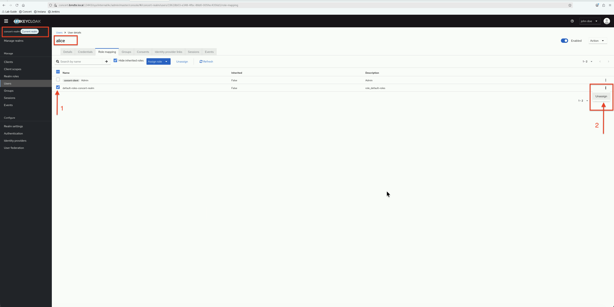

12. Leave the other users `bob` and `charlie` with the `default-roles-concert-realm` role for Concert instance level access.

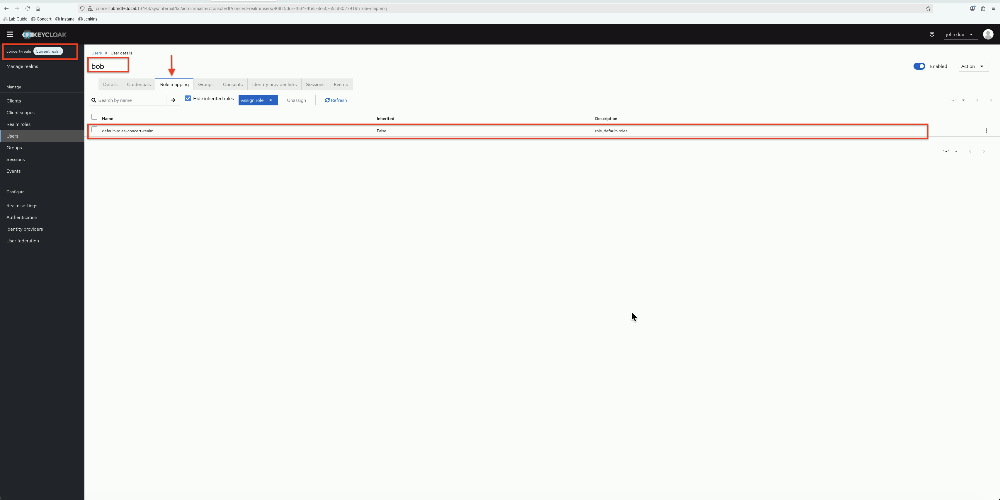

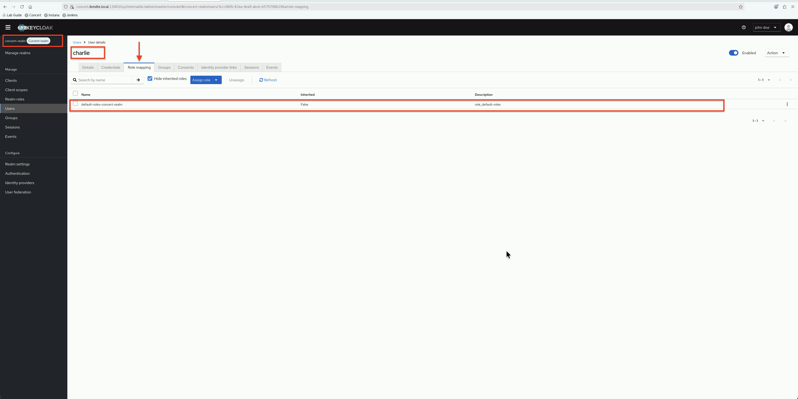

We will validate this role assignment for Concert Instance level in **Section 7** when we test the SSO login to Concert UI with `alice` user.

---

## 6.11: Configure Concert OIDC Integration

Now, we will configure Concert to use Keycloak as its OIDC identity provider. This configuration is done via Concert's configuration files on the Concert host.

### 6.11.1: Connect to Concert Host

1. Connect to **concert** host using SSH from the **bastion-gym-lan**. 
The Concert host is where the Concert application is running and where we'll apply the OIDC configuration.

```bash title="Host: bastion-gym-lan"
ssh jammer@concert
```

### 6.11.2: Locate Concert Configuration

2. For Concert VM installation, its OIDC configuration is kept in a file called `local_config.env` located in `/opt/ibm/concert/ibm-concert/concert-hub/etc/` directory.

```bash title="Host: concert"
ls /opt/ibm/concert/ibm-concert/concert-hub/etc/local_config.env
```

### 6.11.3: Backup current configuration file before making changes

3. For safety, create a backup of the current `local_config.env` file before making any changes. This allows you to restore the original configuration if needed.

```bash title="Host: concert"
cp /opt/ibm/concert/ibm-concert/concert-hub/etc/local_config.env \ 
   /opt/ibm/concert/ibm-concert/concert-hub/etc/local_config.env.no-oidc
```

### 6.11.4: Create OIDC Configuration Secret

4. Now you have a backup of the original configuration file named `local_config.env.no-oidc` in the same directory. 
You can proceed with the OIDC configuration knowing that you can revert back to the original settings if necessary.
Edit `local_config.env` located in `/opt/ibm/concert/ibm-concert/concert-hub/etc/` directory. 
Include the following OIDC configuration parameters at the end of the file:

```bash title="Host: concert"
vi /opt/ibm/concert/ibm-concert/concert-hub/etc/local_config.env
```

```bash title="Host: concert"
# OIDC Configuration
SOLIS_AUTH=OIDC
KEYCLOAK_URL=https://concert.ibmdte.local:13443/sys/internal/kc
REALM_NAME=concert-realm
CLIENT_ID=concert-client
CLIENT_SECRET=<your-client-secret-from-credentials-file>
```

Replace `<your-client-secret-from-credentials-file>` with the actual client secret you copied earlier in **Section 6.2.1**.

5. Save the file and exit the editor.
6. Your saved file should now contain the OIDC configuration parameters needed for Concert to integrate with Keycloak like below:

```bash title="Example OIDC Configuration in local_config.env"
HUB_REGISTRY=cp.icr.io/cp/solis-hub
HUB_IMAGE_TAG=v2.2.0-273-20251215.165711-v2.2.0.x
DOCKER_EXE=podman
HUB_HTTPS_PORT=13443
HUB_CLIENT_LANG=en_US.UTF-8
HUB_BUILD_SUFFIX=-v2.2.0-273-20251215.165711-v2.2.0.x
SYSTEMD_ENABLE=y
SOLIS_DEPLOYMENT=sw-ent
SOLIS_HUB_INTERNAL_SECRET=197ed1a07f4dd3637927cf31
KC_BOOTSTRAP_ADMIN_USERNAME=70ef10c2c12c17b74301624d
KC_BOOTSTRAP_ADMIN_PASSWORD=<kc-admin-password>
OOB_POSTGRES_USER=1961420ace5043233a6f75b5
OOB_POSTGRES_PASSWORD=<oob-postgres-password>
SOLIS_AUTH_USERNAME=ibmconcert
SOLIS_AUTH=OIDC
KEYCLOAK_URL=https://concert.ibmdte.local:13443/sys/internal/kc
REALM_NAME=concert-realm
CLIENT_ID=concert-client
CLIENT_SECRET=Dqmj9eMW2qYyp8IW5MrjSTQrSe61wOsn
```

7. Restart the Concert instance with OIDC.
First, stop the Concert service to apply the new configuration.

```bash title="Host: concert"
bash /opt/ibm/concert/ibm-concert/concert-hub/systemd/stop_service
```

Finally, start the Concert service to apply the new configuration.
```bash title="Host: concert"
bash /opt/ibm/concert/ibm-concert/concert-hub/systemd/start_service
```

### 6.11.5: Verify Configuration

Check that the Concert containers affected by the `stop_service` and `start_service` commands have restarted and are healthy:

```bash title="Host: concert"
podman ps -f name=ibm-solis-core -f name=ibm-solis-embedded-db \
          -f name=ibm-solis-embedded-keycloak -f name=ibm-solis-hub-gw
```

You should be able to see similar results as shown below:

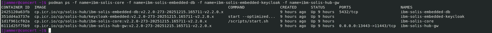

### 6.11.6: Exit Concert Host

```bash title="Host: concert"
exit
```

---

## 6.12: Enable SSO Login Button

After configuring OIDC, Concert should display an SSO login option on the login page.

### 6.12.1: Verify SSO Login Option

1. From the Bastion Host, open Firefox
2. Navigate to Concert UI: `https://concert.ibmdte.local:12443/concert/`
3. You should now see **Login with SSO** (new OIDC login button)


:::note
If you don't see the SSO login button:
- Verify OIDC configuration was applied correctly
- Check Concert containers have restarted
- Clear browser cache and reload the page
:::

---

## 6.13: Configuration Summary

You have successfully configured Concert OIDC integration with:

### Keycloak Client Configuration
- ✅ Created `concert-client` in Keycloak
- ✅ Configured as confidential client with authorization code flow
- ✅ Set valid redirect URIs for Concert
- ✅ Retrieved and secured client secret

### Client Scopes and Mappers
- ✅ Configured group membership mapper
- ✅ Enabled groups claim in tokens
- ✅ Verified token claims include user groups

### Concert OIDC Configuration
- ✅ Created OIDC configuration secret
- ✅ Created OIDC configuration ConfigMap
- ✅ Updated Concert deployment with OIDC settings
- ✅ Configured role mappings for Concert personas

### Verification
- ✅ Concert containers restarted with new configuration
- ✅ SSO login button visible on Concert login page
- ✅ OIDC provider initialized successfully

---

## Troubleshooting

:::info
This section provides basic troubleshooting steps in case you encounter any issues while performing the steps above.
These steps are optional and only need to be followed if you run into problems.
:::

### SSO Login Button Not Appearing

**Problem**: Concert login page doesn't show SSO option

**Solutions**:
- Verify OIDC configuration was applied in local_config.env file
- Check Concert containers state whether healthy or not
- Clear browser cache and reload page
- Verify OIDC enabled flag is set in local_config.env file

### Concert Containers Not Restarting

**Problem**: Containers don't restart after configuration change

**Solutions**:
- Check for concert-hub service status : `bash /opt/ibm/concert/ibm-concert/concert-hub/systemd/status_service`
- Verify client secret exists in local_config.env file : <br/> 
         `grep CLIENT_SECRET /opt/ibm/concert/ibm-concert/concert-hub/etc/local_config.env`

### Invalid Client Error

**Problem**: Login fails with "Invalid client" error

**Solutions**:
- Verify client ID matches in both Keycloak and Concert configuration
- Check client is enabled in Keycloak
- Verify redirect URIs are correctly configured in Keycloak client
- Ensure Concert URL matches the configured redirect URI

### Client Secret Mismatch

**Problem**: Authentication fails with "Invalid client credentials"

**Solutions**:
- Verify client secret in Concert configuration matches Keycloak
- Regenerate client secret in Keycloak if needed
- Update Concert secret with new client secret
- Restart Concert containers after updating secret

### Groups Not in Token

**Problem**: Users authenticate but don't get correct roles

**Solutions**:
- Verify group membership mapper is configured in Keycloak
- Check mapper is added to the correct client scope
- Evaluate token in Keycloak to verify groups claim is present
- Ensure users are members of LDAP groups
- Re-sync LDAP groups in Keycloak

### Role Mapping Not Working

**Problem**: Users authenticate but have wrong permissions in Concert

**Solutions**:
- Verify role mapping configuration in Concert OIDC config
- Check group names match exactly (case-sensitive)
- Ensure Concert role names are correct (Admin, User)
- Review Concert logs for role assignment messages
- Test with different users to isolate the issue

### Redirect Loop

**Problem**: Login redirects back and forth between Concert and Keycloak

**Solutions**:
- Verify redirect URIs are correctly configured
- Check for trailing slashes in URLs (should be consistent)
- Clear browser cookies and cache
- Verify Concert callback endpoint is accessible
- Check for proxy or load balancer configuration issues

---

## Next Steps

Now that Concert is configured to use Keycloak for OIDC authentication, you're ready to test the complete SSO flow. In the next section, you'll:
- Test SSO login with different user personas
- Verify role-based access control
- Validate the complete authentication chain from Concert → Keycloak → OpenLDAP
- Troubleshoot any authentication issues

:::success
Concert OIDC setup is complete! Concert is now ready to authenticate users via Keycloak SSO.
:::