# 7. Testing Authentication

In this section, you will test the complete Concert SSO authentication flow with different user personas. 
You'll verify that users can log in via SSO, receive the correct roles based on their LDAP group membership, and have appropriate access to Concert features.

## 7.1: Two levels of role-based access in Concert 

Let's recap, Concert has 2 levels of role-based access: 

1. **Instance level** access

With **Instance level Role** access, user with **Admin** or **User** role can perform the following actions:

| Instance level Role | Details | 
|---------|-------|
| **Admin** | Grant or revoke access to other users or user groups (except for the Owner role) |
| | Create, edit, delete, and run ingestion jobs |
| | View, use, create, update, and delete shared third-party credentials (connections) |
| | Define applications and environments | 
| **User** | View ingestion jobs |
| |View and use shared third-party credentials (connections) |
| | Define applications and environments |

2. **Object level** access

| Object level Role | Access to applications or environments | Access to automation rules | Access to managing other users or user groups |
|---------|-------|-------|-------|
| **Admin** | View, edit, and delete an application or environment | View, create, edit, or delete an automation rule for applications/environments to which you have access | Grant or revoke access to other users |
| **Editor** | View and update an application or environment | View, create, edit, or delete an automation rule for applications/environments to which you have access | No access |
| **Viewer** | View an application or environment | View an automation rule | No access |

Also, in **Section 4**, we have created 3 users and 3 groups in OpenLDAP as follow:
```
dc=example,dc=com (Base DN)
├── ou=users (Organizational Unit for users)
│   ├── uid=alice 
│   ├── uid=bob 
│   └── uid=charlie 
└── ou=groups (Organizational Unit for groups)
    ├── cn=corporate_it_staff 
    ├── cn=hr_staff 
    └── cn=sales_staff 
```
For the above LDAP structure, let's imagine that: <br/>
• **Alice** belongs to Corporate **IT** organization. <br/>
  She gets Admin role and everybody else assigns her as Editor for Concert objects such as applications and environments. <br/>
• **Bob** is a techie user in **HR** organization. <br/>
  He only supports HR applications. He will create a sample HR application and make Alice as an Editor and Charlie as a Viewer. <br/>
• **Charlie** is a techie user in **Sales** organization. <br/>
  He only supports Sales applications. He will get Viewer role to the sample HR application. <br/>

In this section, we will test :
1. **Instance level** access for Alice, Bob and Charlie,
2. **Object level** access for Alice, Bob and Charlie.


## 7.1: Understanding the Complete Authentication Flow

Before testing, let's review the complete authentication chain:

```
User → Concert UI → Keycloak → OpenLDAP
                ↓
            ID Token
                ↓
         Concert Session
                ↓
         Role Assignment
                ↓
         Access Granted
```

**Flow Steps**:
1. User clicks "Log in with SSO" in Concert
2. Concert redirects to Keycloak authorization endpoint
3. Keycloak presents login page
4. User enters LDAP credentials (username/password)
5. Keycloak validates credentials against OpenLDAP
6. OpenLDAP confirms authentication and returns user info
7. Keycloak generates ID token with user claims (including groups)
8. Keycloak redirects back to Concert with authorization code
9. Concert exchanges code for tokens
10. Concert validates token and extracts user information
11. Concert maps groups to roles (concert-admins → Administrator)
12. Concert creates session and grants access

---

## 7.2: Test instance level access for Alice

In this section, you will test **instance-level** access for **Alice**, who is assigned the Admin role at the instance level.
You will log in to Concert SSO as `Alice`.

### 7.2.1: Concert SSO Login as Alice

From the Bastion Remote Desktop, open the Firefox browser and click on the Concert bookmark.

1. On the Concert login page, click **Log in with SSO**

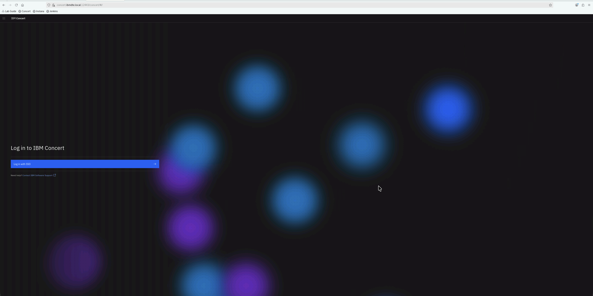

2. You should be redirected to the Keycloak login page
3. Enter Alice's credentials:
   - **Username**: `alice`
   - **Password**: `Alice@123`
4. Click **Sign In**

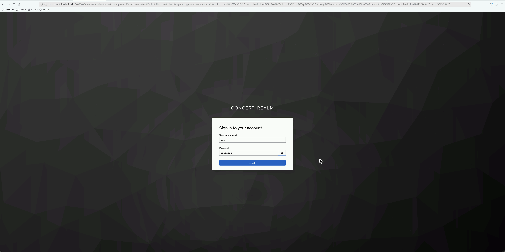

### 7.2.2: Verify Successful Login

After successful authentication:
- You should be redirected back to Concert. On the Concert welcome page, select the **Resilience** option on the right:

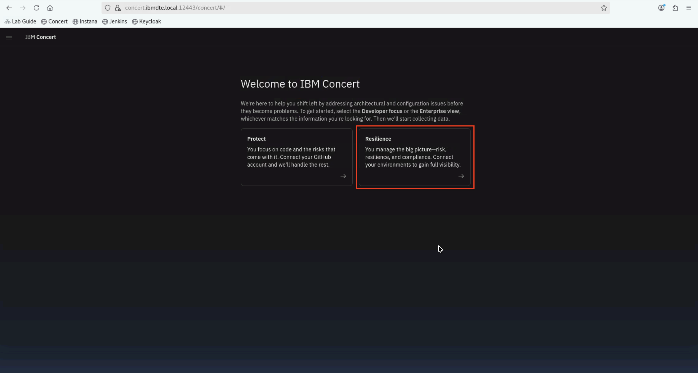

- Click **Skip**

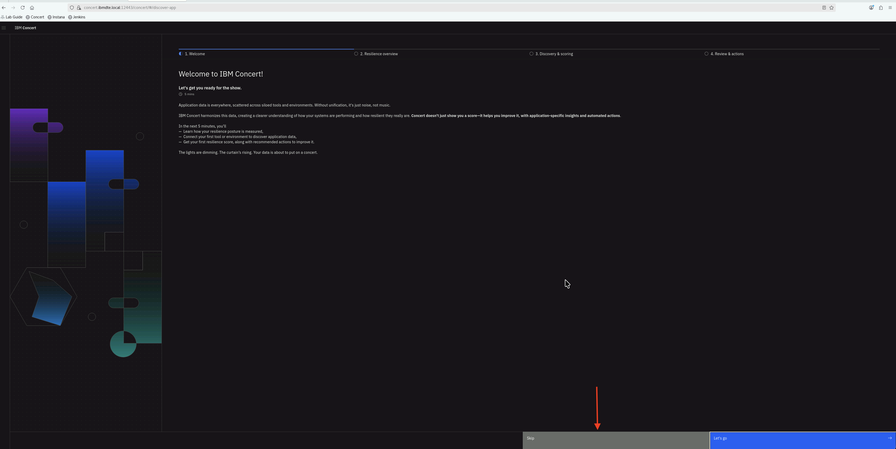

- Concert dashboard should load
- You should see Alice's name in the top-right corner

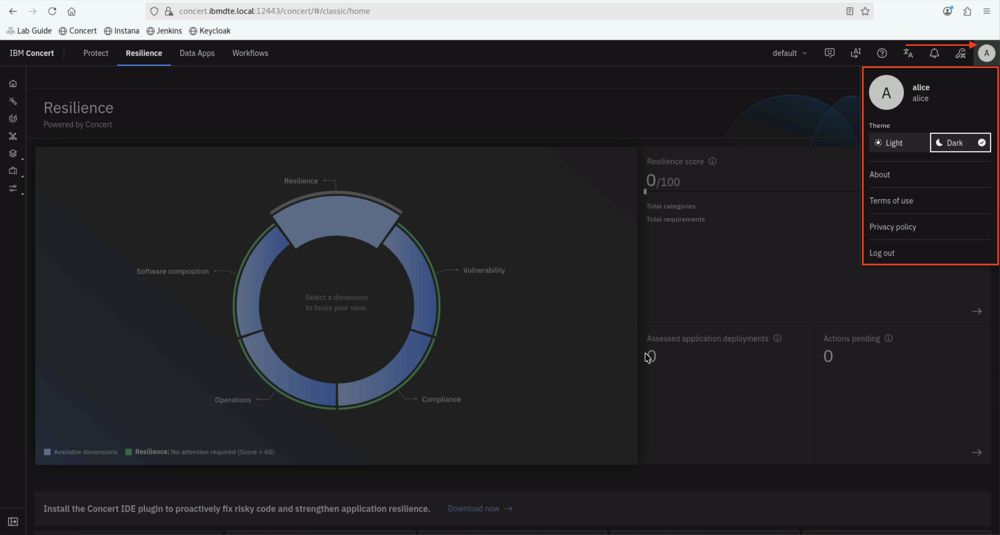

### 7.2.3: Verify Instance level Admin Role

With **Admin** role, Alice should have full access to all Concert features.

1. **Check Navigation Menu** on left panel : Click the `Administration` icon at the bottom
2. Under **Settings**:
   - You should be able to access all admin sections:
     - Vulnerability
     - Risk remediation benchmarks
     - License preferences
     - Tags
     - Certificate policies
     - Action preferences
     - AI agents
     - Job timeouts
     - Security & Goals
     - Miscellaneous

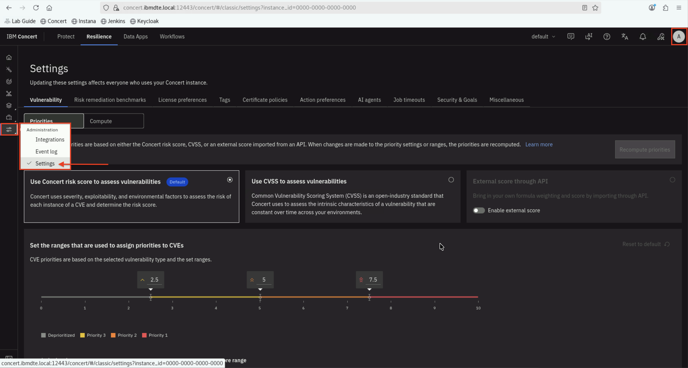

:::info
For instance level access with User role, the user will see message below when trying to access Settings page: <br/>
`**Read-only** Contact your instance administrator to get access to edit these settings.` <br/>
We will see this in action when we test Bob's and Charlie's login as Instance level User role.
:::

### 7.2.4: Concert logout as Alice
1. Logout from Alice's session

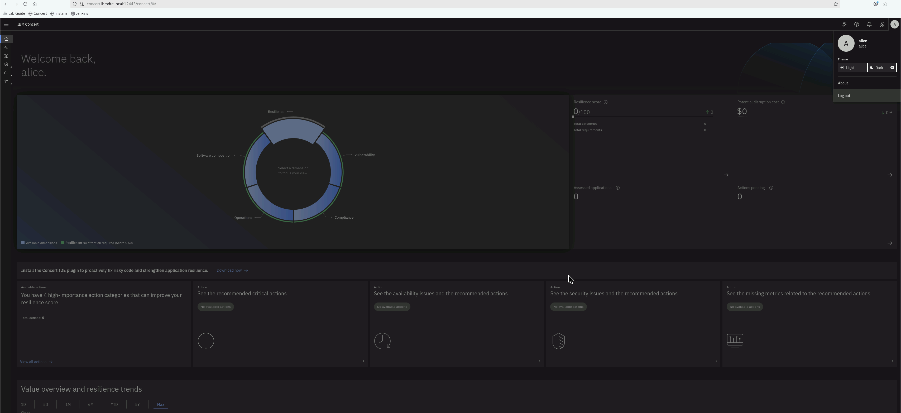

### 7.2.5: Keycloak signout Alice session

:::info
Why do I need to sign out? <br/>
In a typical workplace, each person uses their own computer, so signing out of Keycloak isn't usually necessary. 
If you don't sign out, the browser will remember the previous user's session, preventing you from properly testing the next user's login.
:::

From the Bastion Remote Desktop, open the Firefox browser and click on the Keycloak bookmark.
1. Accept the certificate warning if prompted
2. Log in with Keycloak admin credentials from your credentials file:
   - **Username**: `admin`
   - **Password**: (created in **Section 3.6**)
3. In the Keycloak Admin Console, ensure you're in the **concert-realm** realm (check the realm dropdown)
4. In the left navigation menu, click **Sessions**
5. Click **Sign out**

Alice's session is signed out from Keycloak and now, we can use other user account to login to Concert SSO. 
Otherwise, Concert SSO uses Alice to login automatically without prompting username and password.

:::info
In a real-life production environment, you typically don't need to sign out of Keycloak because each user works on <br/>
their own computer. For this lab, you must perform Keycloak sign out between users to avoid confusion and ensure proper testing.
:::

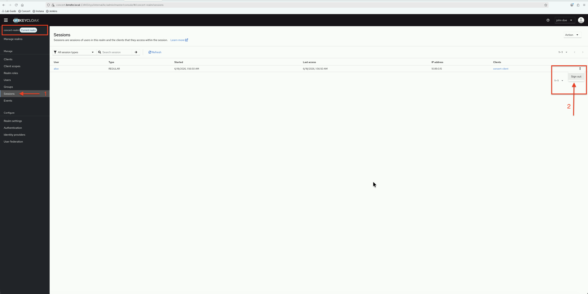

:::success
✅ Alice successfully logged in via SSO with Admin role and full access to Concert features.
:::

---

## 7.3: Test instance level access for Bob 

In this section, you will test **instance-level** access for **Bob**, who is assigned the User role at the instance level.
You will log in to Concert SSO as `Bob`.

### 7.3.1: Concert SSO Login as Bob

From the Bastion Remote Desktop, open the Firefox browser and click on the Concert bookmark.
1. On the Concert login page, click **Log in with SSO**


2. Enter Bob's credentials:
   - **Username**: `bob`
   - **Password**: `Bob@123`
3. Click **Sign In**

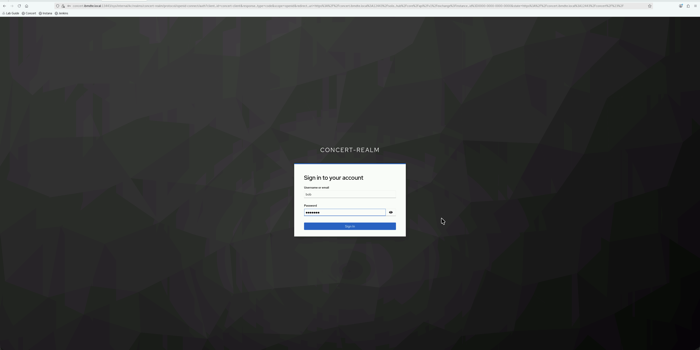

### 7.3.2: Verify Successful Login

After successful authentication:
- You should be redirected back to Concert. On the Concert welcome page, select the **Resilience** option on the right:


- Click **Skip**


- Concert dashboard should load
- You should see Bob's name in the top-right corner

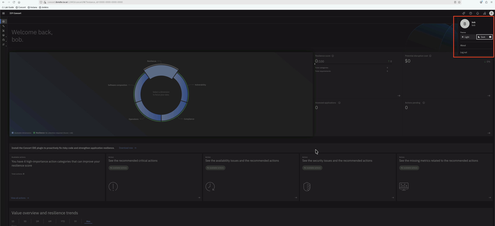

### 7.3.3: Verify Instance level User Role

With **User** role, Bob should have partial access to all Concert features:

1. **Check Navigation Menu** on left panel : Click the `Administration` icon at the bottom
2. Under **Settings**:
   - You have **Read-only** access to all sections:
     - Vulnerability
     - Risk remediation benchmarks
     - License preferences
     - Tags
     - Certificate policies
     - Action preferences
     - AI agents
     - Job timeouts
     - Security & Goals
     - Miscellaneous

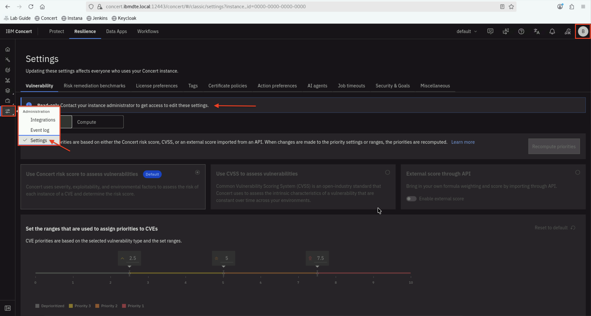

:::info
For instance level access with User role, the user will see message below when trying to access Settings page: <br/>
`**Read-only** Contact your instance administrator to get access to edit these settings.` <br/>
:::

### 7.3.4: Concert logout as Bob
1. Logout from Bob's session

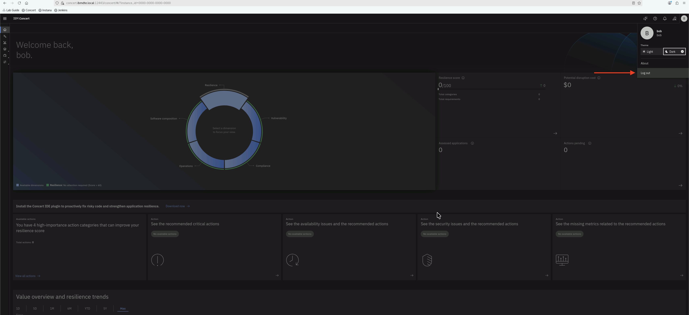

### 7.3.5: Keycloak signout Bob session

From the Bastion Remote Desktop, open the Firefox browser and click on the Keycloak bookmark.
1. Accept the certificate warning if prompted
2. Log in with Keycloak admin credentials from your credentials file:
   - **Username**: `admin`
   - **Password**: (created in **Section 3.6**)
3. In the Keycloak Admin Console, ensure you're in the **concert-realm** realm (check the realm dropdown)
4. In the left navigation menu, click **Sessions**
5. Click **Sign out**

Bob's session is signed out from Keycloak and now, we can use other user account to login to Concert SSO. 
Otherwise, Concert SSO uses Bob to login automatically without prompting username and password.

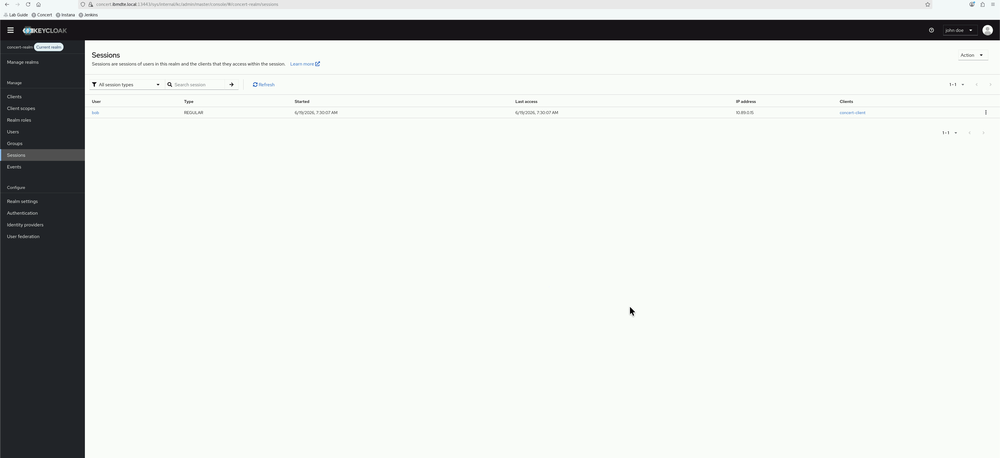

:::success
✅ Bob successfully logged in via SSO with **instance-level** User role and appropriate access restrictions.
:::

---

## 7.4: Test instance level access for Charlie

In this section, you will test **instance-level** access for **Charlie**, who is assigned the User role at the instance level.
You will log in to Concert SSO as `Charlie`.

### 7.4.1: Concert SSO Login as Charlie

From the Bastion Remote Desktop, open the Firefox browser and click on the Concert bookmark.
1. On the Concert login page, click **Log in with SSO**


2. You should be redirected to the Keycloak login page
3. Enter Charlie's credentials:
   - **Username**: `charlie`
   - **Password**: `Charlie@123`
4. Click **Sign In**

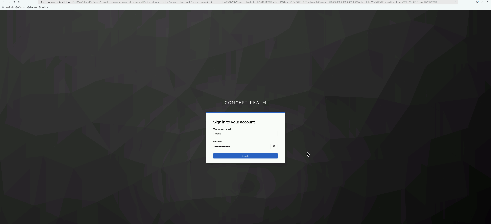

### 7.4.2: Verify Successful Login

After successful authentication:
- You should be redirected back to Concert. On the Concert welcome page, select the **Resilience** option on the right:


- Click **Skip**


- Concert dashboard should load
- You should see Charlie's name in the top-right corner

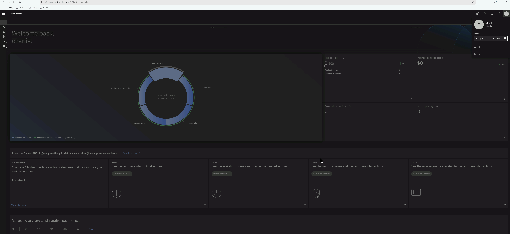

### 7.4.3: Verify Instance level User Role

With **User** role, Charlie should have partial access to all Concert features:

1. **Check Navigation Menu** on left panel : Click the `Administration` icon at the bottom
2. Under **Settings**:
   - You have **Read-only** access to all sections:
     - Vulnerability priorities
     - License preferences
     - Tags
     - Miscellaneous
     - Certificate policies
     - IBM Power preferences
     - AI agents

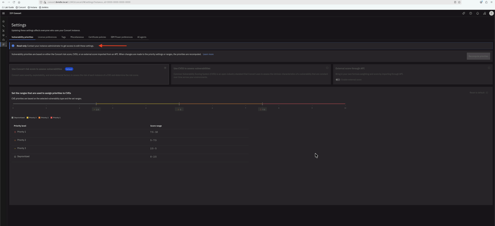

:::info
For instance level access with User role, the user will see message below when trying to access Settings page: <br/>
`**Read-only** Contact your instance administrator to get access to edit these settings.` <br/>
:::

### 7.4.4: Concert logout as Charlie
1. Logout from Charlie's session

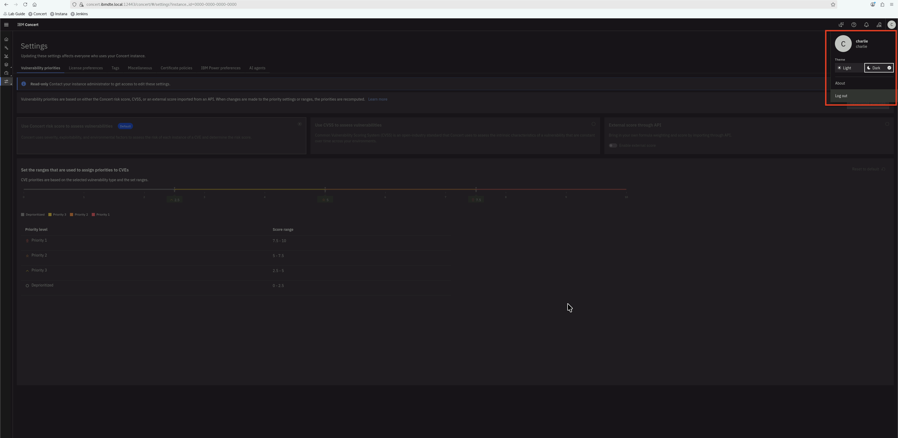

### 7.4.5: Keycloak signout Charlie session

From the Bastion Remote Desktop, open the Firefox browser and click on the Keycloak bookmark.
1. Accept the certificate warning if prompted
2. Log in with Keycloak admin credentials from your credentials file:
   - **Username**: `admin`
   - **Password**: (created in **Section 3.6**)
3. In the Keycloak Admin Console, ensure you're in the **concert-realm** realm (check the realm dropdown)
4. In the left navigation menu, click **Sessions**
5. Click **Sign out**

Charlie's session is signed out from Keycloak and now, we can use other user account to login to Concert SSO. 
Otherwise, Concert SSO uses Charlie to login automatically without prompting username and password.


:::success
✅ Charlie successfully logged in via SSO with **instance-level** User role and read-only access.
:::

---

## 7.5: Create an Application in Concert as Bob and grant role

Next, you will login to Concert as Bob, create an Application and grant role to Alice and Charlie.

### 7.5.1: Concert SSO Login as Bob

From the Bastion Remote Desktop, open the Firefox browser and click on the Concert bookmark.
1. On the Concert login page, click **Log in with SSO**


2. Enter Bob's credentials:
   - **Username**: `bob`
   - **Password**: `Bob@123`
3. Click **Sign In**


### 7.5.2: Verify Successful Login

After successful authentication:
- Concert dashboard should load
- You should see Bob's name in the top-right corner


### 7.5.3: Create an Application in Concert

Let's create an Application in Concert as `Bob`.

1. Click **Inventory** on left panel and click **Application inventory**.

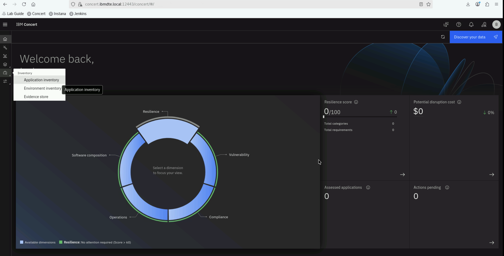

2. On **Application inventory** page, click **Define application** dropdown and select **From components**.

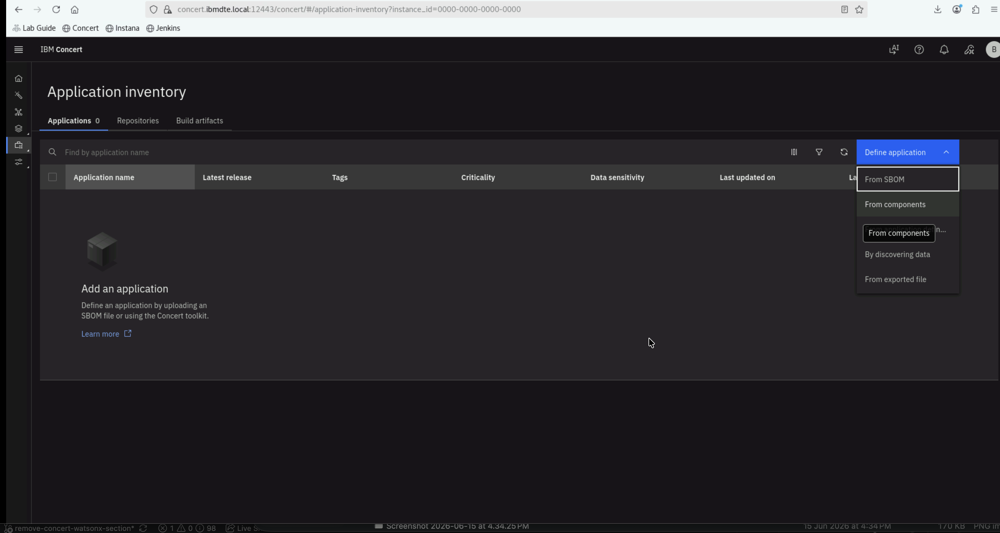

3. On **Define an application** page, under **Details** section, enter the following values:
   - **Name**: `HR-application`
   - **Description (optional)**: `HR application`
   - **Version**: `3.0.0`
   - **Criticality (optional)**: `Very low`
   - **Data sensitivity (optional)**: `Very low`
   - **Revenue per hour in $ (optional)**: `0`
   - **Tags (optional)**: `**Leave empty**`
   - **Add business details**: `NO`
   - **Custom properties** section: `**Leave undefined**`

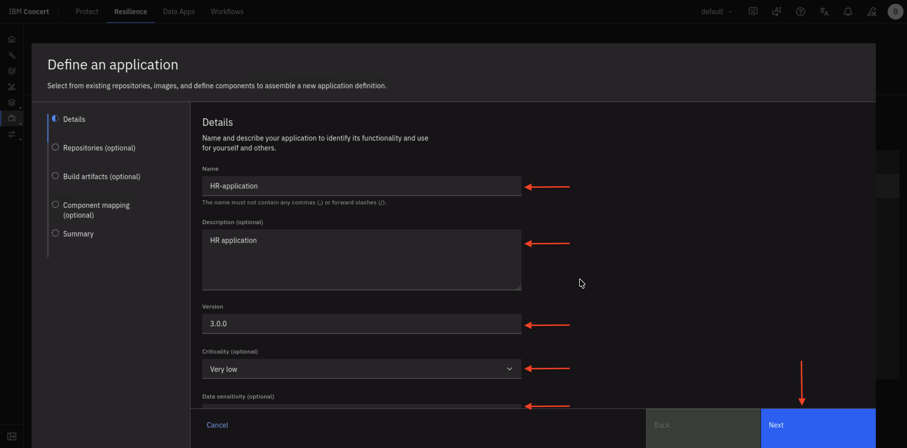

4. On the **Repositories (optional)** section, select **Select from inventory list** radio button.

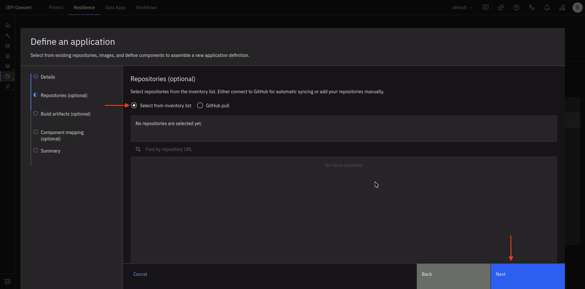

5. On the **Build artifacts (optional)** section, select **Select from inventory list** radio button.

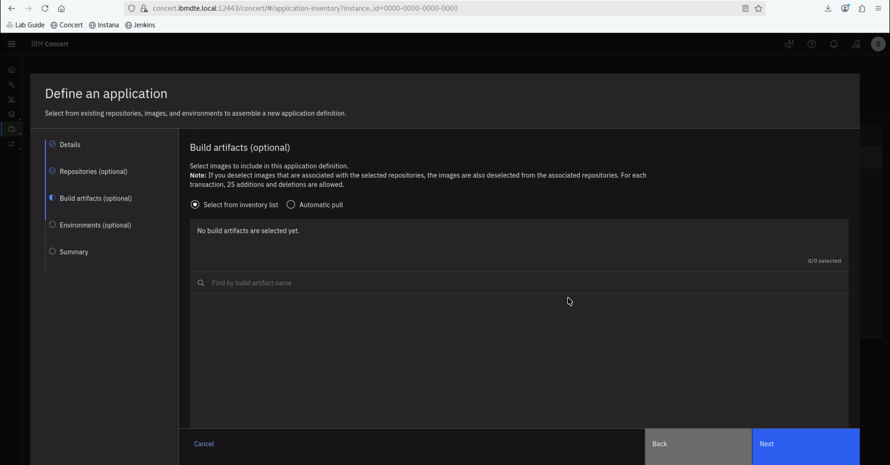

6. On the **Component mapping (optional)** section, leave as is.

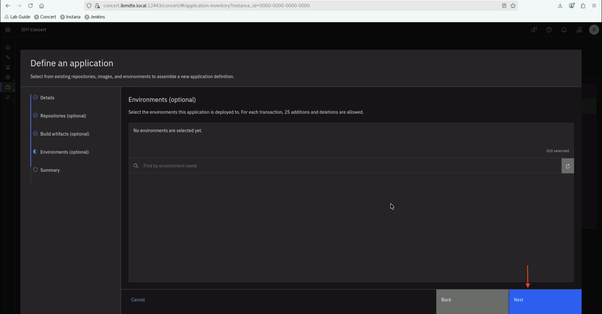

7. On the **Summary** section, click **Create** button.

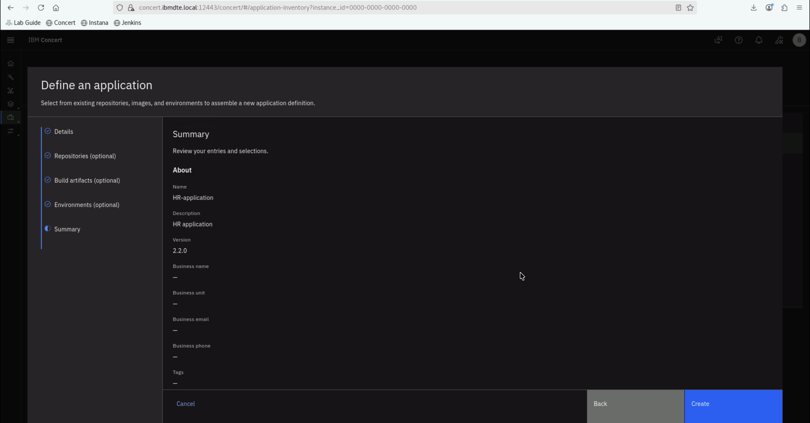

8. The newly created application called **HR-application** is now listed in Application Inventory page.


9. Click the `⋮` (three vertical dots) menu icon on same row to perform **Manage collaborators** action.

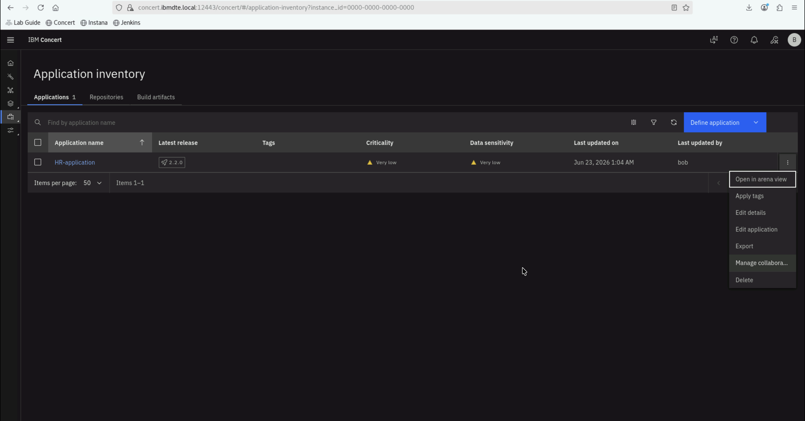

10. You will make **Alice** as an **Editor** and **Charlie** as a **Viewer** for **HR-application**. 
11. Click **Grant access** button.

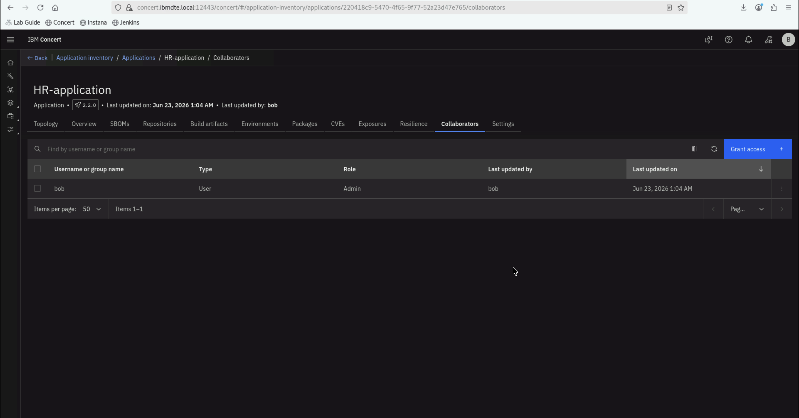

12. On **Grant access to HR-application** page, do the following:
   - select **alice** by ticking the checkbox 
   - select **Editor** from the drop down list
   - click **Grant** button

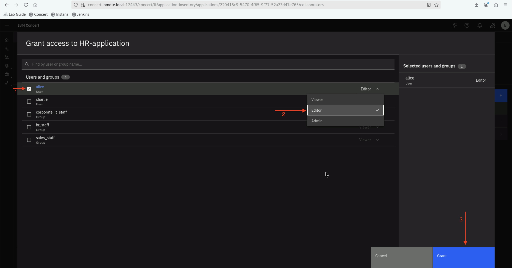

13. Click **Grant access** button.

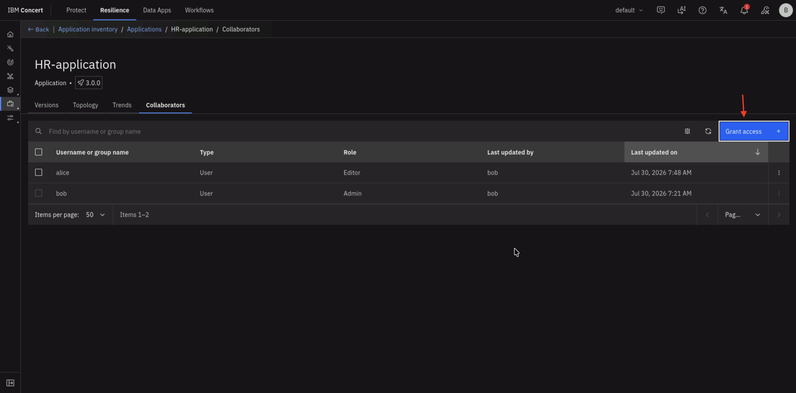

14. On **Grant access to HR-application** page, do the following:
   - select **charlie** by ticking the checkbox
   - assign **Viewer** from the drop down list
   - click **Grant** button

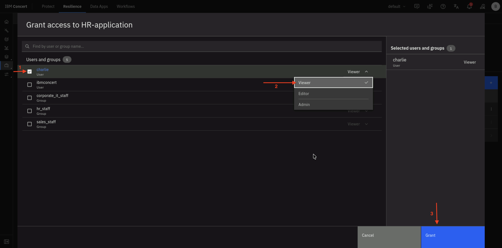

15. Finally, as Bob, you have granted **HR-application** to Alice as an Editor and Charlie as a Viewer. 

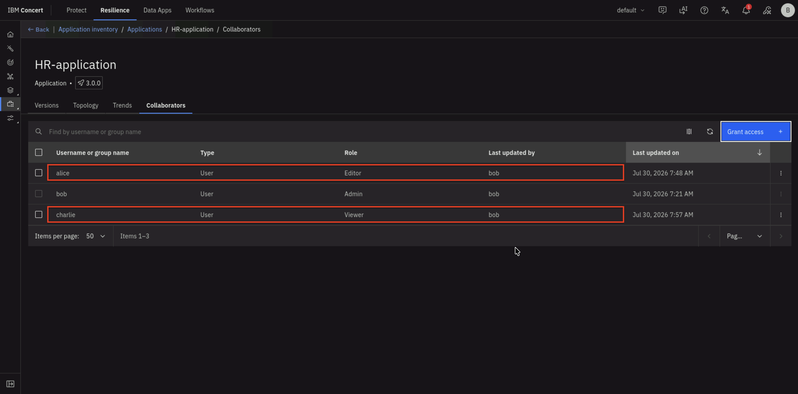

16. Log out from Concert as Bob.

---

## 7.6: Object level access testing

Next, you will perform **object level** access testing as Alice, Bob and Charlie.

### 7.6.1: Validate object level access as Alice

For a quick recap, Alice belongs to Corporate IT organization. She gets Admin role and everybody else assigns her as **Editor** for Concert objects such as applications and environments including **HR-application**.

First, let's sign out Concert session under **concert-realm** from Keycloak to avoid any SSO issues. <br/>
From the Bastion Remote Desktop, open the Firefox browser and click on the Keycloak bookmark.
1. Accept the certificate warning if prompted
2. Log in with Keycloak admin credentials from your credentials file:
   - **Username**: `admin`
   - **Password**: (created in **Section 3.6**)
3. In the Keycloak Admin Console, ensure you're in the **concert-realm** realm (check the realm dropdown)
4. In the left navigation menu, click **Sessions**
5. Click **Sign out**

Next, let's sign in to Concert as Alice to validate her object level access. <br/>
From the Bastion Remote Desktop, open the Firefox browser and click on the Concert bookmark.
1. Log in to Concert as Alice.
On the Concert login page, click **Log in with SSO**.

2. Enter Alice's credentials:
   - **Username**: `alice`
   - **Password**: `Alice@123`
3. Click **Sign In**.

4. Click **Inventory** on left panel, select **Application Inventory**

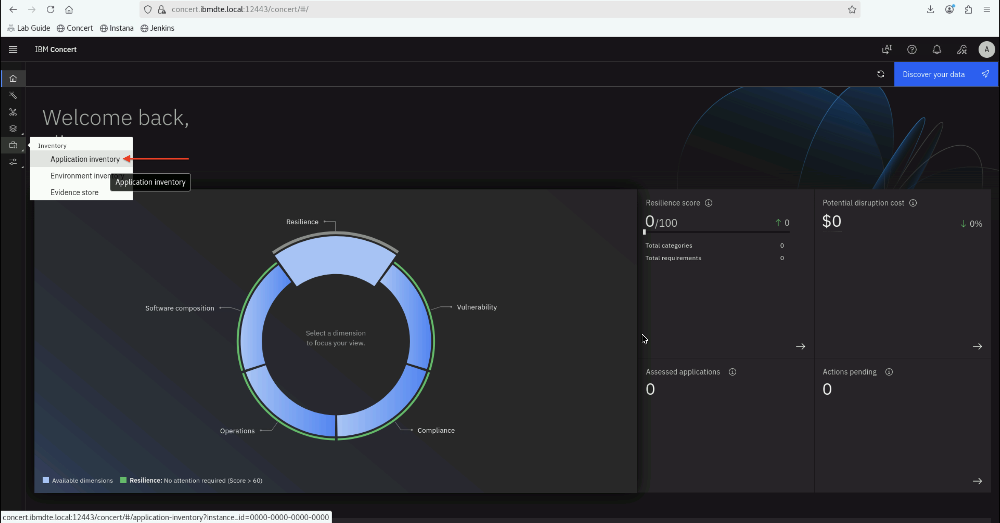

5. Alice will be able to view all applications, such as **HR-application**, that have been granted to her.<br/>
Click **HR-application**.

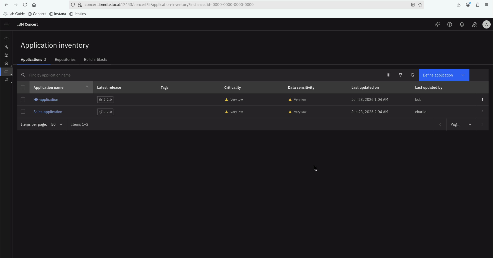

6. You will see **3.0.0** as the version.<br/>Click the **⋮** (three vertical dots) menu icon on same row.<br/>
Alice with **Editor** role, has the permission to perform the following actions :
   - **Use this version...**
   - **Apply tags**
   - **Edit details**
   - **Delete**

7. Click **Edit details** for **HR-application**, you will be able to make changes to the application attributes.

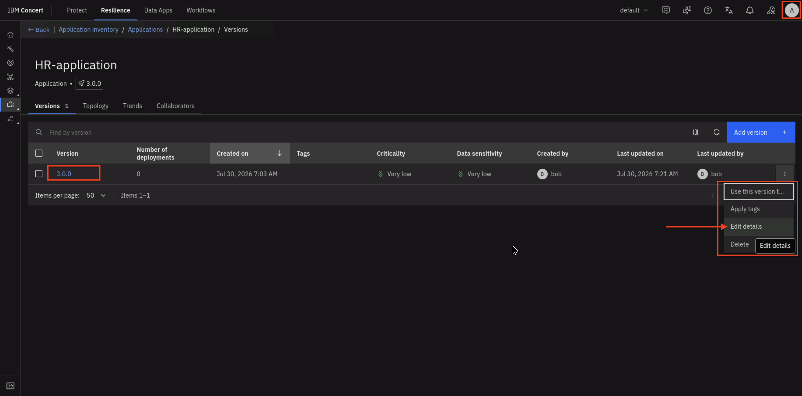

8. On **Edit details**, make the following change:
   - **Revenue per hour ($)**: `1000`

9. Click **Save**.

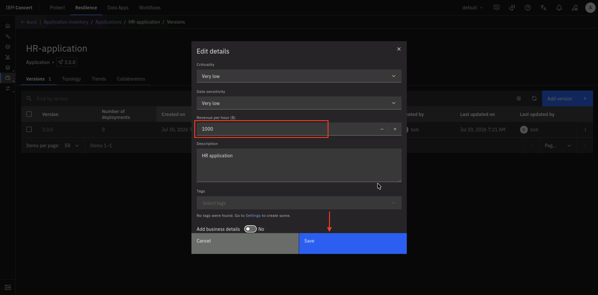

10. Logout Concert as Alice.

### 7.6.2: Validate object level access as Charlie

For a quick recap, Charlie is a techie user in Sales organization.
He has **Viewer** role for **HR-application**.

First, let's sign out Concert session under **concert-realm** from Keycloak to avoid any SSO issues. <br/>
From the Bastion Remote Desktop, open the Firefox browser and click on the Keycloak bookmark.
1. Accept the certificate warning if prompted
2. Log in with Keycloak admin credentials from your credentials file:
   - **Username**: `admin`
   - **Password**: (created in **Section 3.6**)
3. In the Keycloak Admin Console, ensure you're in the **concert-realm** realm (check the realm dropdown)
4. In the left navigation menu, click **Sessions**
5. Click **Sign out**

Next, let's sign in to Concert as Charlie to validate his object level access. <br/>
From the Bastion Remote Desktop, open the Firefox browser and click on the Concert bookmark.
1. Log in to Concert as Charlie.
On the Concert login page, click **Log in with SSO**.

2. Enter Charlie's credentials:
   - **Username**: `charlie`
   - **Password**: `Charlie@123`
3. Click **Sign In**

4. Click **Inventory** on left panel, select **Application Inventory**


5. Charlie will be able to view all applications, such as **HR-application**, which have been granted to him.<br/>
Click **HR-application**.


6.  You will see **3.0.0** as the version.<br/>Click the **⋮** (three vertical dots) menu icon on same row.<br/>
Charlie with **Viewer** role for the **HR-application** does not have permission to perform any action.

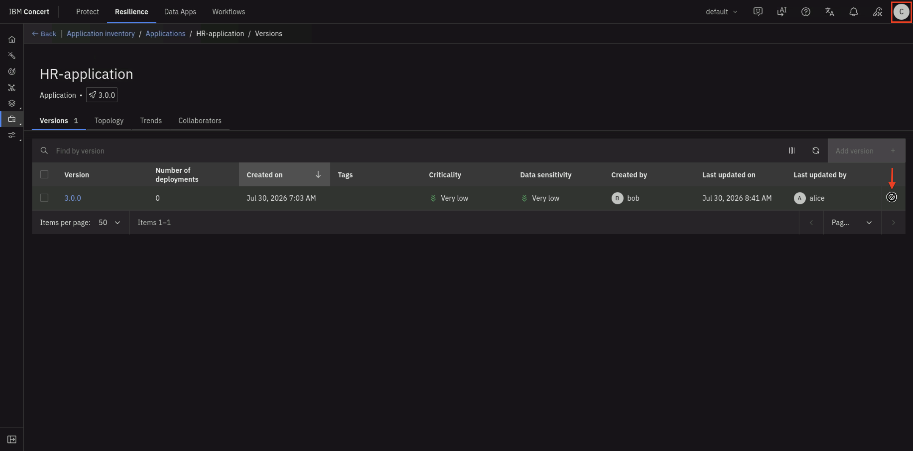

7. Logout Concert as Charlie.

### 7.6.3: Validate object level access as Bob

For a quick recap, Bob is a techie user in HR organization.
He only supports HR applications within the company.<br/> 
He has **Admin** role for **HR-application**.

First, let's sign out Concert session under **concert-realm** from Keycloak to avoid any SSO issues. <br/>
From the Bastion Remote Desktop, open the Firefox browser and click on the Keycloak bookmark.
1. Accept the certificate warning if prompted
2. Log in with Keycloak admin credentials from your credentials file:
   - **Username**: `admin`
   - **Password**: (created in **Section 3.6**)
3. In the Keycloak Admin Console, ensure you're in the **concert-realm** realm (check the realm dropdown)
4. In the left navigation menu, click **Sessions**
5. Click **Sign out**

Next, let's sign in to Concert as Bob to validate his object level access. <br/>
From the Bastion Remote Desktop, open the Firefox browser and click on the Concert bookmark.
1. Log in to Concert as Bob.
On the Concert login page, click **Log in with SSO**.

2. Enter Bob's credentials:
   - **Username**: `bob`
   - **Password**: `Bob@123`
3. Click **Sign In**

4. Click **Inventory** on left panel, select **Application Inventory**


5. Bob will be able to view all applications, such as **HR-application**.<br/>
Click **HR-application**.

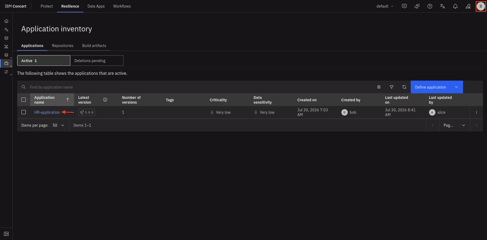

6. You will see **3.0.0** as the version. Click the **⋮** (three vertical dots) menu icon on same row.<br/>
Bob has the permission to perform all actions because Bob is the Admin for **HR-application**.

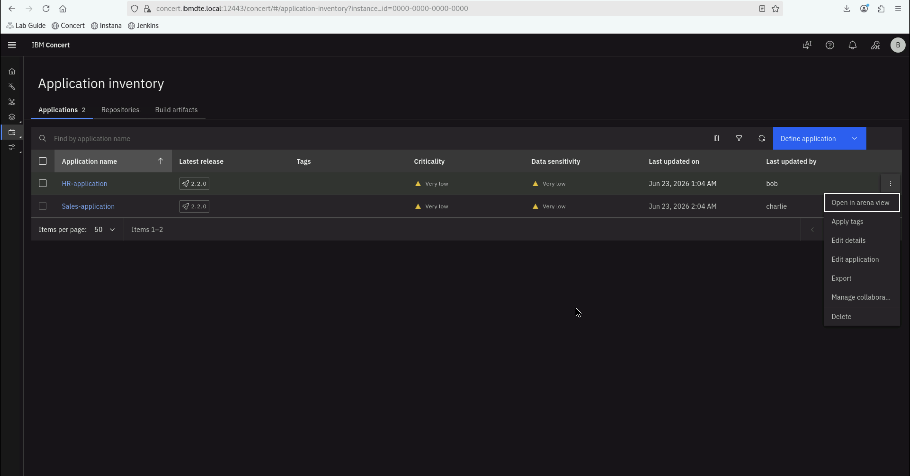

7. Logout Concert as Bob.

---

## Troubleshooting

:::info
This section provides basic troubleshooting steps in case you encounter any issues while performing the steps above.
These steps are optional and only need to be followed if you run into problems.
:::

### Verification Checklist

Use this checklist to verify all SSO functionality:

#### Authentication Tests
- [ ] Alice can login via SSO
- [ ] Bob can login via SSO
- [ ] Charlie can login via SSO
- [ ] Invalid credentials are rejected
- [ ] Non-existent users cannot login

#### Role-Based Access Control
- [ ] Alice has Admin role at Instance level
- [ ] Bob has User role at Instance level
- [ ] Charlie has User role at Instance level
- [ ] Admin role has permission to all actions for Concert objects
- [ ] Editor role has permission to 4 actions for Concert objects
- [ ] Viewer role cannot modify any data

#### Session Management
- [ ] Users can logout successfully
- [ ] Sessions expire after timeout period
- [ ] Expired sessions require re-authentication

#### Group Synchronization
- [ ] LDAP group changes sync to Keycloak
- [ ] Group membership changes affect Concert roles
- [ ] Role changes take effect after re-login

#### User Experience
- [ ] SSO login button is visible and functional
- [ ] Redirect to Keycloak works smoothly
- [ ] Return to Concert after authentication works
- [ ] User information displays correctly
- [ ] No error messages during normal flow

### Login Redirects to Keycloak but Fails

**Problem**: User is redirected to Keycloak but authentication fails

**Solutions**:
- Verify user exists in LDAP: `ldapsearch -x -b "ou=users,dc=example,dc=com" "(uid=alice)"`
- Check user password is correct: `ldapwhoami -x -D "uid=alice,ou=users,dc=example,dc=com" -W`
- Verify LDAP connection in Keycloak: Test connection and authentication

### SSO Login Button Missing

**Problem**: Concert login page doesn't show SSO option

**Solutions**:
- Verify OIDC configuration is applied in Concert
- Clear browser cache and reload page

---

## Testing Summary

Congratulations! You have successfully tested the complete SSO authentication flow:

### What You Tested
- ✅ SSO login with three different user personas
- ✅ Role-based access control for each persona
- ✅ Invalid credential rejection
- ✅ Session management and logout
- ✅ Group membership synchronization
- ✅ Complete authentication chain: Concert → Keycloak → OpenLDAP

### What You Verified
- ✅ Users authenticate against LDAP via Keycloak
- ✅ Group memberships are correctly mapped to Concert roles
- ✅ Role-based permissions are enforced in Concert
- ✅ Security controls prevent unauthorized access
- ✅ Session management works as expected

### Key Takeaways
1. **SSO Simplifies Access**: Users login once with LDAP credentials
2. **Centralized Management**: User and group management in LDAP
3. **Role-Based Security**: Automatic role assignment based on groups
4. **Seamless Integration**: Concert, Keycloak, and OpenLDAP work together
5. **Enterprise Ready**: Production-grade authentication and authorization

---

## Next Steps

You've completed the hands-on testing of Concert SSO! Proceed to the final section for a summary of what you've learned, best practices for production deployments, and additional resources.

:::success
🎉 SSO testing complete! All authentication flows are working correctly with proper role-based access control.
:::
