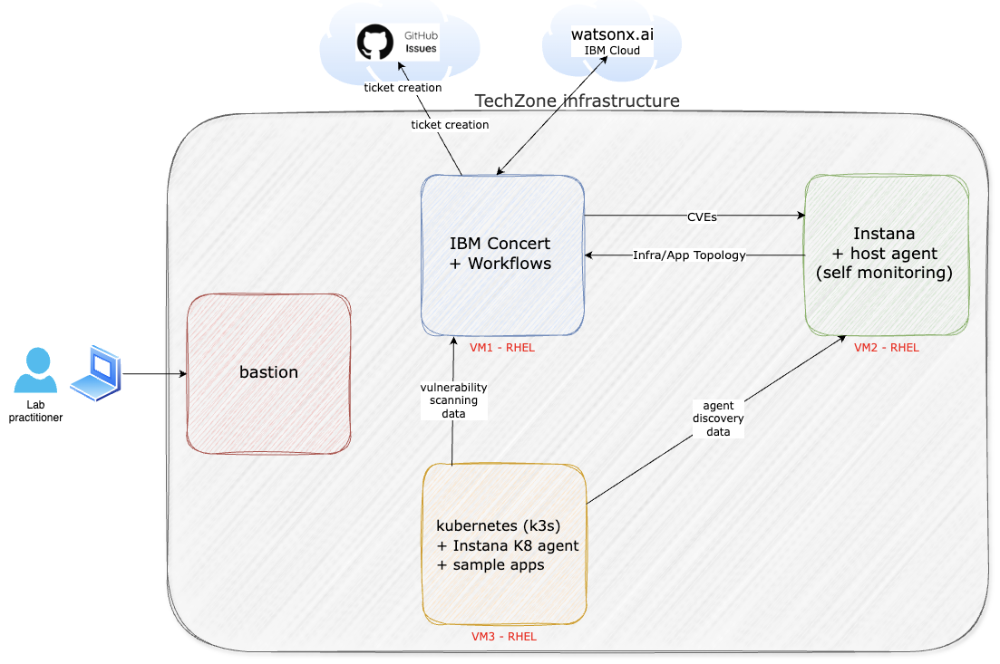
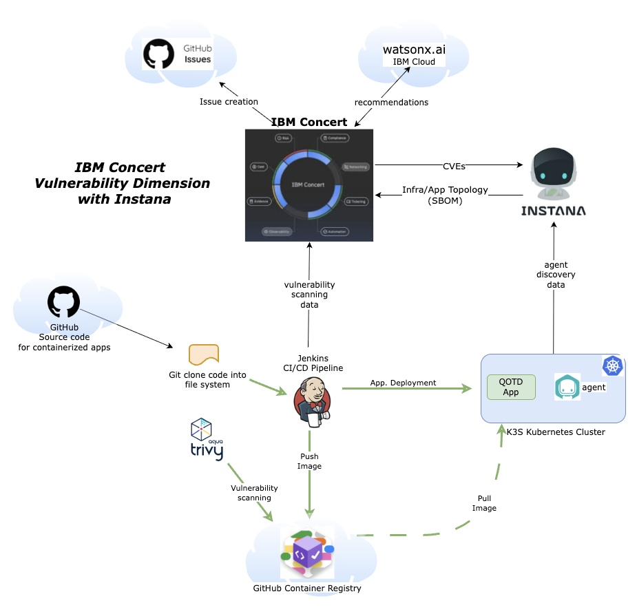

import CreateIbmId from "@site/src/components/createIbmId/CreateIbmId"
import ObtainingEntitlementKey from "@site/src/components/obtainingEntitlementKey/ObtainingEntitlementKey"
import RequestingLabEnvironment from "@site/src/components/requestingLabEnvironment/RequestingLabEnvironment"
import LicenseInfo from "@site/src/components/Instana/LicenseInfo"

# Lab Environment

In this Lab, you will have access to three RHEL (Red Hat Enterprise Linux) virtual machines plus a bastion virtual machine 
that will let you access the overall deployment:

* Bastion Host - a RHEL VM named bastion-gym-lan that will be used as the bastion host for the lab network. This Bastion host has access to all lab VM's and will be your primary workstation for these labs.
* Concert Host - a RHEL VM that has preinstalled IBM Concert + Workflows.
* Instana Cluster - 3 RHEL VMs that are running a multi-node self-hosted Instana server on a [K3S](https://k3s.io/) kubernetes cluster.
* Bluebox - a RHEL VM that contains an Instana Agent pre-installed. 
* Demo Applications Cluster - a RHEL VM with the CI/CD tool Jenkins and the open-source vulnerability scanner [Trivy](https://github.com/aquasecurity/trivy) preinstalled. In addition, it has a (single node) [K3S](https://k3s.io/) kubernetes cluster. 
This kubernetes cluster has an Instana agent preinstalled and the demo application Quote of the Day (qotd) that *will be* installed by the Jenkins pipeline during the Lab.  

The following software versions are used in the Lab environment:
* Concert v2.1.0
* Instana tag 3.297.463-0
* Jenkins v2.528.2
* Trivy v0.67.2
* RHEL release 9.4

The following diagram describes the infrastructure for the Lab:

## Functional View
The following diagram describes the Lab functional view. It shows the different components and how they interact with each other: 

## Prerequisites

<CreateIbmId />

<ObtainingEntitlementKey />

<LicenseInfo />

### A public GitHub account

During the Lab, you will need to fork a GitHub repository using your own personal public GitHub account. You can create a free account 
if you do not have one already from [GitHub](https://github.com).

## Requesting a Lab Environment

<RequestingLabEnvironment
   environmentName="Jam-in-a-Box: Concert - Vulnerability"
   environmentUrl="https://techzone.ibm.com/my/reservations/create/6866cf81f89d5795f68e379f"
/>

