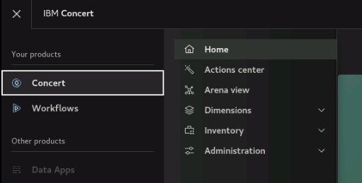
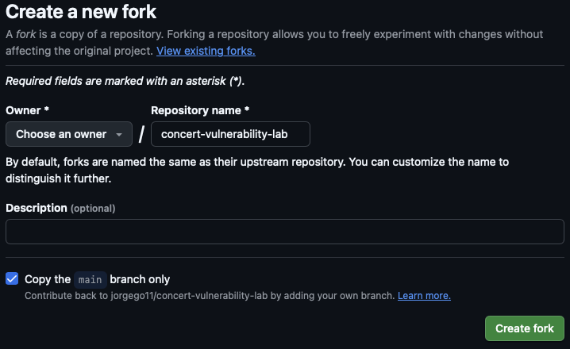
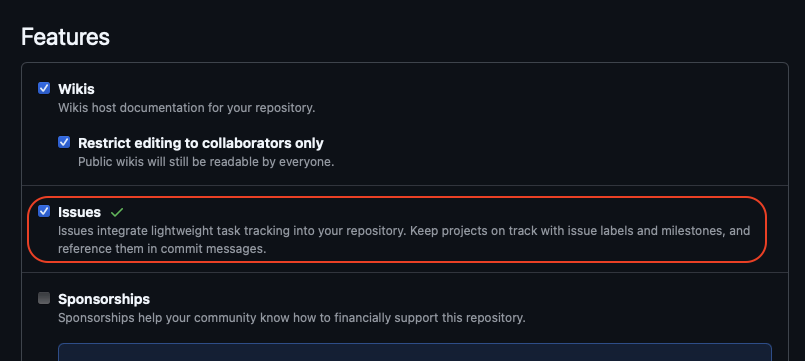

## 3.1: Overview

Make sure to complete the Lab preparation steps from this section before proceeding with the Lab.


:::warning
You may get prompted for software updates during the lab. Please ignore these prompts and 
do NOT install any updates to avoid disrupting the lab environment.
::: 


If you get a security warning (**Warning: Potential Security Risk Ahead**) when accessing the Concert, Instana or Jenkins UIs, please 
ignore it and proceed to the UI (click on **Advanced** and then **Accept the Risk and Continue**). 

## 3.1.1: Using the Bastion Host Terminal and UI 

This is for information only. Later in this page you will be instructed to run the actual commands. This Lab has both Concert and Workflows installed:
* To access the Concert UI, click on the burger menu on the top left corner and select **Concert -> Home**. 
* To access the Workflows UI, click on the burger menu on the top left corner and select **Workflows -> Home**.



Note that from the Bastion SSH, you can ssh into each other VM with the commands below: 

```bash
# Access the Concert VM
ssh jammer@concert
# Access the Instana VM
ssh jammer@instana-{0-2}
# Access the Demo Apps VM
ssh jammer@demo-apps
# Access the Bluebox VM
ssh jammer@bluebox
``` 


## 3.1.2: Capturing the Lab Credentials

You will need to capture multiple pieces of information from the Concert and Instana UIs to complete the lab.
To facilitate this process, we will capture this information into a single text file. From the Bastion Remote Desktop, 
on the left panel click on **Show Applications**, select **Text Editor**, paste the content below into a new 
file named `credentials.txt` and **save** it. Keep this window open for easy access later.

```
Bookmarks:
  Lab guide:  https://ibm.github.io/waiops-tech-jam/labs/concert/introduction/
  Concert:    https://concert.ibmdte.local/
  Instana:    https://unit0-ibm.instana-0.ibmdte.local/
  Jenkins:    http://demo-apps.ibmdte.local:8080/

Concert URL:      https://concert.ibmdte.local
Concert API Key:  
concert_username: 
concert_password: 

Instana URL:             https://unit0-ibm.instana-0.ibmdte.local
Instana API Token:       
instana_server_username: 
instana_server_password: 

jenkins_user:      admin
jenkins_password:  

GIT_URL - GitHub Repository URL: 
GitHub Container Registry URL:   https://ghcr.io/<github-username>/ 
GHCR_USER - GitHub Username:     
GHCR_PAT - GitHub Personal Access Token:

---------------------------------------

``` 

From the Bastion SSH, run the command below:

```bash
cat demo-details.yml | grep -E 'concert|instana|jenkins'
``` 

Just to have the users and passwords handy together, copy these values below to the credentials file:
* concert_username: 
* concert_password:
* instana_server_username:
* instana_server_password:
* jenkins_password:


## 3.2: Obtaining the IBM Concert API Key

From the Bastion Remote Desktop, open the Firefox browser and click on the Concert bookmark to open the Concert UI.
* To access the Concert UI, click on the burger menu on the top left corner and select Concert -> Home.

Login to the Concert UI with the credentials recorded in the credentials file (**concert_username:** and **concert_password:**).

:::danger
If prompted, make sure to select **Skip** in the **Welcome to IBM Concert** dialog.
:::


* In the Concert UI, on the top right corner, click on the API Key icon.
* Click **Generate API key**.
* After the API key is generated, save the value under **API key** into the credentials file. You will need it when you configure the CVE sensor in Instana.
* Click on the **X** to close the window.


## 3.3: Obtaining the Instana API token

* From the Bastion Remote Desktop, on the Firefox browser, **open a new Tab** and click on the Instana bookmark to open the Instana UI.
* Login to the Instana UI with the credentials recorded in the credentials file (**instana_server_username:** and **instana_server_password:**).
* From the Instana navigation menu on the left, click **Settings > Security & access > API tokens**.
* Click **New API token**.
* Enter a unique name for your API token, such as **concert-token**. For the Instana-Concert integration, Concert uses read-only APIs 
and the default API token permissions are sufficient.
* Click on **Save** at the bottom.
* After the API token is generated, save it into the credentials file after **Instana API Token:**. You will need this token when 
creating the Instana connection in Concert.


## 3.4: Establishing a connection between Concert and watsonx.ai


Concert leverages the capabilities of watsonx.ai to provide advanced AI features. To enable this integration, 
you need to configure the connection between Concert and an existing instance of watsonx.ai that is used to support Concert Labs.

:::warning
DO NOT use these watsonx.ai credentials for any other purpose outside this lab. 
:::

From the Bastion SSH, run the following command to login to the Concert host with the user 'jammer'. If this is your first time connecting, 
you may need to accept the host key fingerprint.

```bash
ssh jammer@concert
```
Once logged in, run the following command:

```bash
export INSTALL_DIR=/opt/ibm/concert/ibm-concert
```

Obtain the required credentials for connecting to watsonx.ai. Open [**this Box Note**](https://ibm.box.com/v/concert-vuln-lab), 
copy the three lines and run them in the Concert host Terminal to set the environment variables. 

```bash
# use the exports from the Box Note, they should look similar to this:
export WATSONX_API_KEY=... 
export WATSONX_API_PROJECT_ID=...
export WATSONX_API_URL=...
```

Just to confirm the four env. variables are set, run this command and make sure each line shows a value:

```bash
echo "INSTALL_DIR=$INSTALL_DIR"
echo "WATSONX_API_KEY=$WATSONX_API_KEY"
echo "WATSONX_API_PROJECT_ID=$WATSONX_API_PROJECT_ID"
echo "WATSONX_API_URL=$WATSONX_API_URL"
``` 

Run the commands below to apply the watsonx.ai configuration into the file **local_config.env**:

```bash
echo "WATSONX_API_KEY=$WATSONX_API_KEY" >> $INSTALL_DIR/ibm-concert-std/etc/local_config.env
echo "WATSONX_API_PROJECT_ID=$WATSONX_API_PROJECT_ID" >> $INSTALL_DIR/ibm-concert-std/etc/local_config.env
echo "WATSONX_API_URL=$WATSONX_API_URL" >> $INSTALL_DIR/ibm-concert-std/etc/local_config.env
```

Finally, run the two commands below **one by one** to restart the py-utils service to apply the changes:

:::note
In the last **start_service** command, you can ignore one or more warnings **WARN[0000] Failed to mount subscriptions ...**
:::

```bash
$INSTALL_DIR/ibm-concert-std/bin/stop_service ibm-roja-py-utils
$INSTALL_DIR/ibm-concert-std/bin/start_service ibm-roja-py-utils
```

## 3.5: Configuring GitHub

You will need a GitHub account to complete the lab. If you do not have one, please create one at [GitHub](https://github.com/).

### 3.5.1: Forking the qotd application repository

You will fork the qotd application repository into your GitHub account. We will use this repository to demonstrate the vulnerability 
scanning capabilities of Concert.

* Login to your GitHub account and open the following repository URL on the browser

https://github.com/jorgego11/concert-vulnerability-lab

* On the top right corner of the page, click on the **Fork** button to create a copy of the repository in your GitHub account.
* In the **Create a new fork** page, keep the default settings and click **Create fork** as shown below (your GitHub username will be shown under **Owner**).:



* Copy the URL of your forked repository and save it into the credentials file after **GitHub Repository URL**. You will need it later to configure Jenkins.
The URL should look similar to:
```
https://github.com/<github-username>/concert-vulnerability-lab
```

* Update the **GitHub Container Registry URL** in the credentials file by replacing `<github-username>` with your actual GitHub username.

* Update **GitHub Username** in the credentials file with your actual GitHub username.


### 3.5.2: Enabling GitHub issues

You will enable GitHub issues in your forked repository to allow Concert to create issues for the detected vulnerabilities.

* In your forked repository, click on the **Settings** tab.
* Under the **General** section, scroll down to the **Features** section and select the checkbox for **Issues**
as shown below:




### 3.5.3: Creating a Personal Access Token (PAT)

You will create a Personal Access Token (PAT) in GitHub to allow the Jenkins CI/CD pipeline to access your forked repository.

* In your GitHub account, click on your profile picture on the top right corner of the page and select **Settings**.
* In the left navigation menu, scroll all way down and click **Developer settings**.
* In the left navigation menu, click **Personal access tokens** > **Tokens (classic)**.
* Click **Generate new token** > **Generate new token (classic)**.
* Under **Note**, enter a name for your token, such as **concert-lab**.
* Under **Expiration**, select **90 days**.
* Select the following scopes:
  * **repo** (Full control of private repositories)
  * **write:packages** (to push/pull images)
  * **delete:packages** (to delete images)
  * **user** (Update ALL user data)  
* Click **Generate token** on the bottom.
* Copy the generated token into the credentials file after **GHCR_PAT**. You will need it later to configure Jenkins.

:::warning
Make sure to **save** the credentials file!. Keep the window open for easy access during the Lab.
::: 


