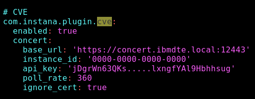

## 3.1: Overview


The Concert and Instana bidirectional integration simplifies the management of application vulnerabilities. 
When you integrate, ​Concert​​​ automatically pulls in your ​Instana​​​​ application components, Kubernetes 
clusters, namespaces, container image names, and their relationships. You can bypass the manual process 
of generating and uploading Concert-defined (ConcertDef) SBOM files​​​​, which can be time-consuming and error prone.

Concert uses these configurations to assess CVEs within the context of your application and 
environment topology and assigns scores based on their potential impact on your application 
delivery lifecycle. For example, a CVE in a testing tool in your test environment receives a 
lower risk score than a CVE that affects multiple application images in your production environment.

To set up the integration, you will create a connection and an ingestion job for Instana from the Concert UI. 
Then, you will configure the CVE sensor in Instana to view Concert CVE assessment data in the Instana UI.


## 3.2: Establishing a connection from Concert to Instana

Note that SBOM files are not required in this scenario as Concert can pull the application and environment data directly from Instana.

### 3.2.1: Creating an Instana connection in Concert

In the Concert UI, establish a connection with Instana by completing the following steps:

*  In the Concert UI, click **Administration > Integrations**.
*  Click the **Connections** tab.
*  Click **Create connection**.
*  Use the search bar or scroll to find and click **IBM Instana Observability**.
*  On the **Create IBM Instana Observability connection** screen, enter a **Name** for the connection.
*  Under **Endpoint**, enter the Instana URL you obtained in the **Lab Preparation** chapter.
*  Enter a the **Instana API token** you obtained in the **Lab Preparation** chapter.
*  Click **Validate connection**.
*  After the connection validates **Successful**, click **Create**.

### 3.2.2: Creating a target environment in Concert

An environment in Concert groups related applications and inventory data.
We will define a new environment to capture the application and environment data coming from Instana.

* In the Concert UI, select **Inventory > Environment inventory**.
* Click **Define environment > From resources**.
* Enter ***staging*** as the **Name** for the environment.
* From the **Type** drop down menu, select **Kubernetes (generic)**.
* Select the **Purpose** of this environment as **Staging**.
* Click **Next**.
* As there are no **Build Artifacts** to include in your environment definition, we will skip this step.
* Click **Next**.
* Review the summary of your entries, then click **Create**.

### 3.2.3: Creating a data ingestion job in Concert

To create an ingestion job to pull application and environment data from Instana to Concert, complete the following steps:

* In the Concert UI, click **Administration > Integrations**.
* Under the **Ingestion jobs** tab, click **Create ingestion job**.
* Enter ***instana-ingestion*** as the **Name** for the ingestion job.
* Under **Connection type**, select Instana.
* Under **Connection**, select the name of the connection established previously.
* Select the **Target environment** defined previously.
* Click **Create**. The new ingestion job appears in the list.
* Click the overflow menu next to the ingestion job you just created and select **Run now** to initial data ingestion from Instana.

:::note
Currently, the Instana data ingestion job only collects data from applications that are running on a Kubernetes cluster.
:::

## 3.3: Establishing a connection from Instana to Concert

Instana can be configured to pull vulnerability data from Concert using the CVE sensor.


### 3.3.1: Configuring the CVE Sensor in Instana

:::warning
In order to minimize Lab infrastructure resources, we are enabling the CVE sensor on the existing Instana monitoring 
agent, that is, the agent that monitors Instana itself. Note that this IS NOT a recommended practice for a production environment. In production environments, 
the CVE Sensor should be enabled on a different Instana agent running on separate infrastructure, 
for example, a different Linux VM.
::: 


The Instana CVE sensor collects vulnerability data from Concert so you can view it in the Instana Vulnerabilities tab.

From the Bastion SSH, connect to the Instana host:

```bash
ssh jammer@instana
``` 
Installing Helm, will allow us to update the agent configuration. Run these commands below **one by one**:

```bash
curl -fsSL -o get_helm.sh https://raw.githubusercontent.com/helm/helm/main/scripts/get-helm-3
chmod 700 get_helm.sh
./get_helm.sh
helm version
```

We will enable the CVE sensor by updating the agent configuration file.
First, we will retrieve the current configuration and save it to a file named `current-values.yaml`:

```bash
sudo /usr/local/bin/helm get values instana-agent -n instana-agent -o yaml --kubeconfig '/etc/rancher/k3s/k3s.yaml' > current-values.yaml
```

Next, we will edit the `current-values.yaml` file to include the Concert CVE sensor configuration. 
Add the lines below after the   `configuration_yaml: |` line as shown below. 
Make sure to assign api_key with the Concert API key you generated in the **Lab Preparation** chapter between single quotes.
Also, use the right indentation as shown in the picture below (2 spaces).


```yaml
    com.instana.plugin.cve:
      enabled: true
      concert:
        base_url: 'https://concert.ibmdte.local:12443'
        instance_id: '0000-0000-0000-0000'
        api_key: '<Concert API key that you generated in the **Lab Preparation** chapter>'  
        poll_rate: 10 
        ignore_cert: true
```

Your updated configuration should look similar to the following example:




Finally, apply the updated configuration to the Instana agent by running the following command:

```bash
sudo /usr/local/bin/helm upgrade instana-agent instana/instana-agent \
  --namespace instana-agent \
  --kubeconfig '/etc/rancher/k3s/k3s.yaml' \
  -f current-values.yaml
```