## 5.1: Overview

In this section, we will build and deploy a sample application using a simple Jenkins CI/CD pipeline.
The application is called Quote of the Day (QOTD) and its a microservices-based application that consists of several services: 
* qotd-web: the web front-end service
* qotd-quote: the quote service that provides quotes
* qotd-ratings: the ratings service that provides ratings for quotes
* qotd-pdf: the PDF service that generates PDF documents with quotes
* qotd-engraving: the engraving service that generates engraving text for quotes
* qotd-author: the author service that provides information about authors of quotes

The application code is hosted in a GitHub repository. The container images are built using [Buildah](https://buildah.io) and pushed to the GitHub Container Registry (GHCR).
The application is deployed in a K3S cluster running on the demo-apps VM.    
The application will be monitored by Instana, which will provide the SBOM information to Concert for vulnerability scanning.


:::note
[Buildah](https://buildah.io) is an open-source, daemonless tool for building and managing OCI/Docker container images with fine-grained control over the build process.
From a high-level perspective, Buildah is similar to Docker or Podman, but it does not require a daemon to run and can be easily used in rootless mode.    
:::


## 5.2: Verifying that the Application is not Deployed

We will verify now that the application is not deployed yet in the cluster by running the following commands.
From the Bastion SSH, run the following commands **one by one** to login to the demo-apps VM host with the user 'jammer'.

```bash
ssh jammer@demo-apps
kubectl get pods -n qotd
exit
```
You should see an error message stating that no resources were found in **qotd** namespace.


## 5.3: Initializing Jenkins

Follow these steps to initialize Jenkins and install the required plugins.
From the Bastion Remote Desktop, open the Firefox browser and click on the Jenkins bookmark. On the 
*Unlock Jenkins* window, enter the Jenkins Administrator password found in the credentials file under 
*jenkins_password* and click **Continue**.

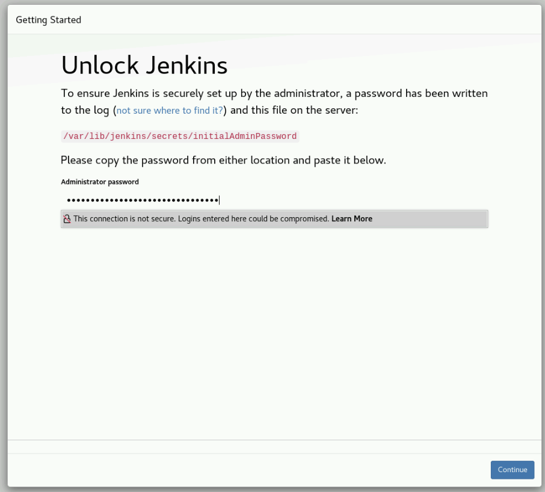 

On the *Customize Jenkins* window, select **Install suggested plugins**.

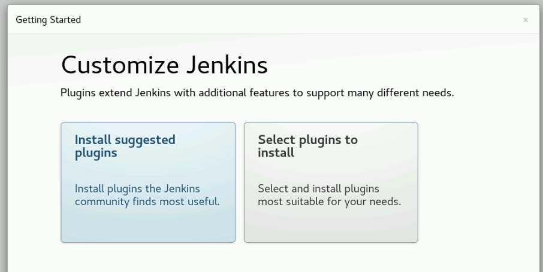

After the plugins are installed, skip the *Create First Admin User* window by clicking **Skip and continue as admin**.

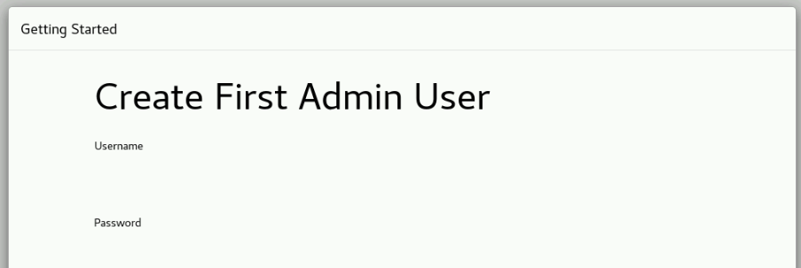

On the *Instance Configuration* window, don't change the default URL and just click **Save and Finish**.

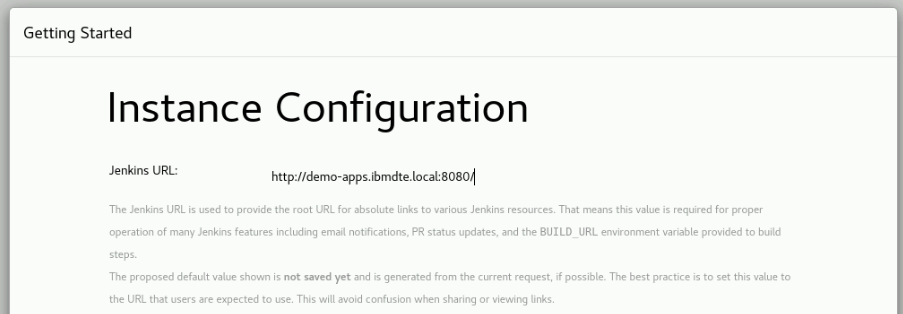

On the *Jenkins is ready* window, click **Start using Jenkins**.

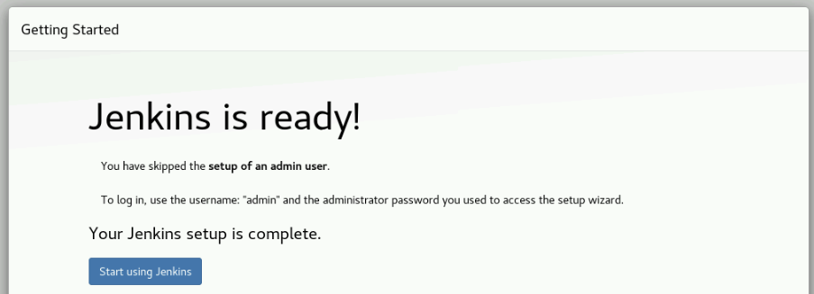


## 5.4: Configuring the Jenkins Pipeline for Application Build and Deploy

:::note
In this Lab, we will use the basic capabilities of Jenkins to create two simple CI/CD pipelines.
Advanced Jenkins configuration and security hardening is out of the scope of this Lab.
:::


We will create a Jenkins pipeline to build and deploy the sample application.

On the *Welcome to Jenkins!* window, click on **Create a job**.

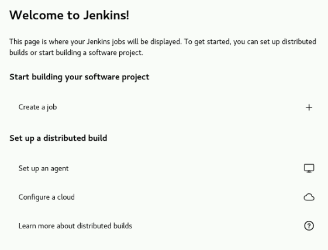

In the **New Item** page under **Enter an item name** field, type **Build and Deploy**. Select **Pipeline** and click **OK**.

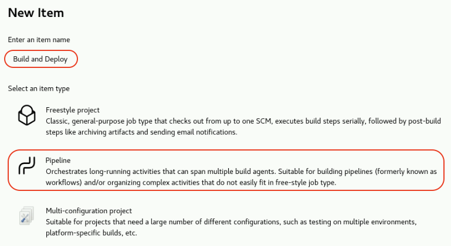


In the **Configure** page, select **Pipeline** on the left menu. Under the **Pipeline** section, leave **Pipeline script** in the **Definition** field
and copy the following code (hover on the code and use the top-right *Copy* button to avoid missing code). Paste the code into the **Script** field. 
Click on **Save** to save the pipeline.


```python
pipeline {
    agent any
    
    environment {
        KUBECONFIG = '/home/jenkins/.kube/config'
        
        // Update the environment variables below
        GIT_URL = 'UPDATE'
        GHCR_USER = 'UPDATE'
        GHCR_PAT = 'UPDATE'
    }
    
    stages {
        stage('Checkout Code') {
            steps {
                git url: "${GIT_URL}", branch: 'main'
            }
        }

        stage('Create namespace and pull secret for GitHub Container Registry') {
            steps {
                sh '''
                    # Create namespace if it does not exist
                    kubectl create namespace qotd --dry-run=client --save-config -o yaml | kubectl apply -f -
                
                    # Create docker-registry secret for qotd
                    kubectl delete secret ghcr-secret --namespace=qotd --ignore-not-found
                    kubectl create secret docker-registry ghcr-secret \
                        --docker-server=ghcr.io \
                        --docker-username=$GHCR_USER \
                        --docker-password=$GHCR_PAT \
                        --namespace=qotd
            
                '''
            }
        }
        
        stage('Build, Tag and Push the images to the local Registry') {
            steps {
                sh '''
                    
                    export REGISTRIES_CONFIG_PATH=/etc/containers/registries.conf
                    

                    # Buildah is an open-source, daemonless tool for building and managing OCI/Docker container images
                    # Authenticate to GitHub Container Registry (rootless)
                    buildah login -u $GHCR_USER -p $GHCR_PAT ghcr.io
                

                    # Build the image (rootless automatically uses ~/.local/share/containers/storage)
                    buildah bud --storage-driver=vfs -t ghcr.io/$GHCR_USER/qotd-web:latest ./qotd/qotd-web
                    buildah bud --storage-driver=vfs -t ghcr.io/$GHCR_USER/qotd-ratings-service:latest ./qotd/qotd-ratings-service
                    buildah bud --storage-driver=vfs -t ghcr.io/$GHCR_USER/qotd-quote-service:latest ./qotd/qotd-quote-service
                    buildah bud --storage-driver=vfs -t ghcr.io/$GHCR_USER/qotd-pdf-service:latest ./qotd/qotd-pdf-service
                    buildah bud --storage-driver=vfs -t ghcr.io/$GHCR_USER/qotd-engraving-service:latest ./qotd/qotd-engraving-service
                    buildah bud --storage-driver=vfs -t ghcr.io/$GHCR_USER/qotd-author-service:latest ./qotd/qotd-author-service                    

                    # Push the image to the local registry using HTTP
                    buildah push --storage-driver=vfs --tls-verify=true ghcr.io/$GHCR_USER/qotd-web:latest
                    buildah push --storage-driver=vfs --tls-verify=true ghcr.io/$GHCR_USER/qotd-ratings-service:latest
                    buildah push --storage-driver=vfs --tls-verify=true ghcr.io/$GHCR_USER/qotd-quote-service:latest
                    buildah push --storage-driver=vfs --tls-verify=true ghcr.io/$GHCR_USER/qotd-pdf-service:latest
                    buildah push --storage-driver=vfs --tls-verify=true ghcr.io/$GHCR_USER/qotd-engraving-service:latest
                    buildah push --storage-driver=vfs --tls-verify=true ghcr.io/$GHCR_USER/qotd-author-service:latest
                    
                    # List images in the local registry
                    echo "List images in the local registry from   https://github.com/users/$GHCR_USER/packages"
                    
                '''
            }
        }
        
        stage('Deploy applications into the K8 cluster') {
            steps {
                sh '''
                    # Deploy applications
                    envsubst < ./qotd/qotd-web/deployment/qotd_web.yaml | kubectl apply -f -
                    envsubst < ./qotd/qotd-ratings-service/deployment/qotd_rating.yaml | kubectl apply -f -  
                    envsubst < ./qotd/qotd-quote-service/deployment/qotd_quote.yaml | kubectl apply -f -                    
                    envsubst < ./qotd/qotd-pdf-service/deployment/qotd_pdf.yaml | kubectl apply -f -    
                    envsubst < ./qotd/qotd-engraving-service/deployment/qotd_engraving.yaml | kubectl apply -f -  
                    envsubst < ./qotd/qotd-author-service/deployment/qotd_author.yaml | kubectl apply -f -  
                '''
            }
        }

    }
}
```

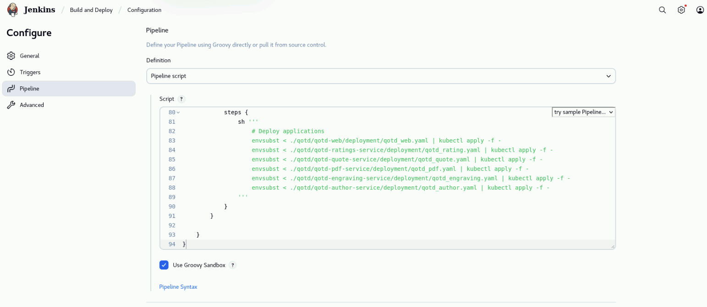

:::note
Take a minute to review the pipeline code. Note that first, environment variables are defined for the GitHub repository URL, 
GitHub Container Registry (GHCR) *user* and *Personal Access Token* (PAT). 
Then, the pipeline has four stages: 
1. Checkout Code: this stage clones the GitHub repository that contains the code for the sample application.
2. Create namespace and pull secret for GitHub Container Registry: this stage creates the `qotd` 
namespace and a pull secret to access the GHCR.
3. Build, Tag and Push the images to the local Registry: this stage builds the container images using Buildah,
tags them and pushes them to the GHCR.
4. Deploy applications into the K8 cluster: this stage deploys the application into the K3S cluster 
using `kubectl` and the deployment YAML files.
:::


After saving the pipeline, click on **Configure** on the left menu. On the **Configure** page, click on **Pipeline** 
on the left menu. Under the **Pipeline** section, in the **Script** field, update the environment variables
GIT_URL, GHCR_USER, GHCR_PAT with the values that you captured in the `credentials.txt` file during the lab preparation.
Click on **Save** to save the changes.


Finally, click on **Build Now** on the left menu to run the pipeline. Note that the first build will take longer (about 3-5 minutes)
After the build is finish, you should see a green check next to the build number indicating that the build was successful.

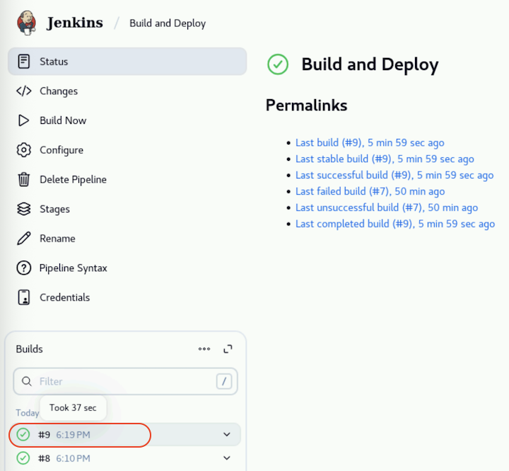


## 5.5: Verifying that the Application has been Deployed


We will verify now that the application has been deployed in the cluster by running the following commands.
From the Bastion SSH, run the following commands **one by one**  to login to the demo-apps VM host with the user 'jammer'.

```bash
ssh jammer@demo-apps
kubectl get pods -n qotd
exit
```
You should see the following output will all pods with running status:

```bash
[jammer@demo-apps ~]$ kubectl get pods -n qotd
NAME                             READY   STATUS    RESTARTS   AGE
qotd-author-696bcdb947-mvb2d     1/1     Running   0          76m
qotd-engraving-fb54bc78d-klb7t   1/1     Running   0          76m
qotd-pdf-5b447c68b4-9tgls        1/1     Running   0          76m
qotd-pdf-5b447c68b4-gw4x6        1/1     Running   0          76m
qotd-quote-5fd5556546-jgrkm      1/1     Running   0          76m
qotd-quote-5fd5556546-mrgw6      1/1     Running   0          76m
qotd-rating-5b6b5bd444-75gpg     1/1     Running   0          76m
qotd-rating-5b6b5bd444-b778g     1/1     Running   0          76m
qotd-web-7cb646f6f6-b9nk6        1/1     Running   0          76m
qotd-web-7cb646f6f6-nd8t8        1/1     Running   0          76m
```


## 5.6: Defining the Application in Instana

We will define the application in Instana to enable monitoring and vulnerability scanning.
From the Bastion Remote Desktop, open the Firefox browser and click on the Instana bookmark. On the Instana login page, 
enter the username and password found in the credentials file
under *instana_server_username* and *instana_server_password* and click **Sign In**.

We will now look at the information that Instana agent has already collected from the demo-apps K3S cluster.
On the Instana left menu, click on **Platforms > Kubernetes**. On the **Kubernetes** page, click on the **Clusters** tab and 
note that the K3S cluster **demo-app**s is listed, as shown below.

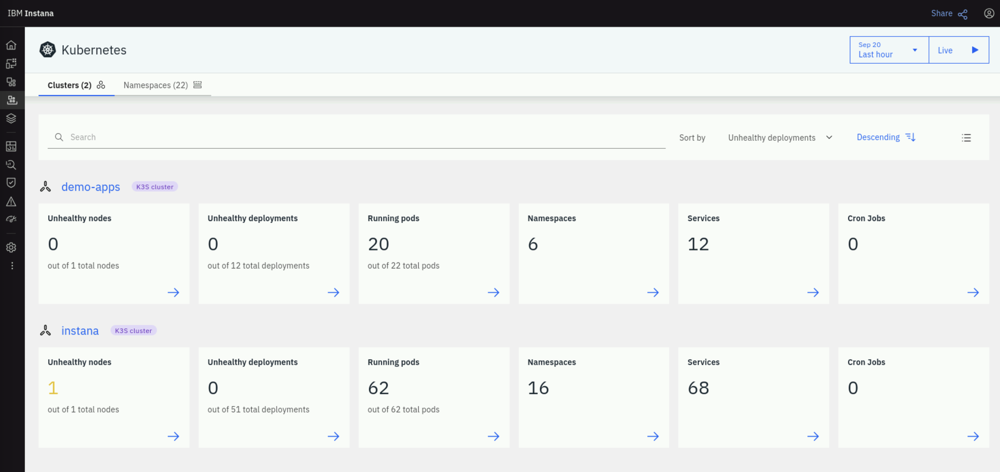

Note that Instana has already discovered the nodes, services, namespaces and pods running in the cluster.

We will now define the **qotd** application in Instana. On the left menu, click on **Applications**. 
On the *Applications* page,on the bottom-right click on **+ ADD** and select *New application perspective*.

On the New Application Perspective* window, on *Step 1: Select model* select **Kubernetes or containers** and click **Next**.
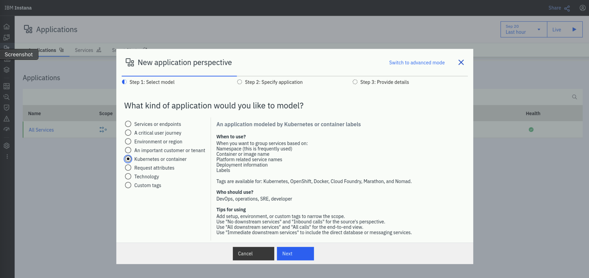

On *Step 2: Specify application*, click on the **Add Filter** button. In the *Add Filter* window, type *namespace* in the search field,
and select **Kubernetes > Namespace > Name**. In the listed name options, select **qotd**.
Under *Which downstream services would you like to include?*, select **All downstream services** and click **Next**.

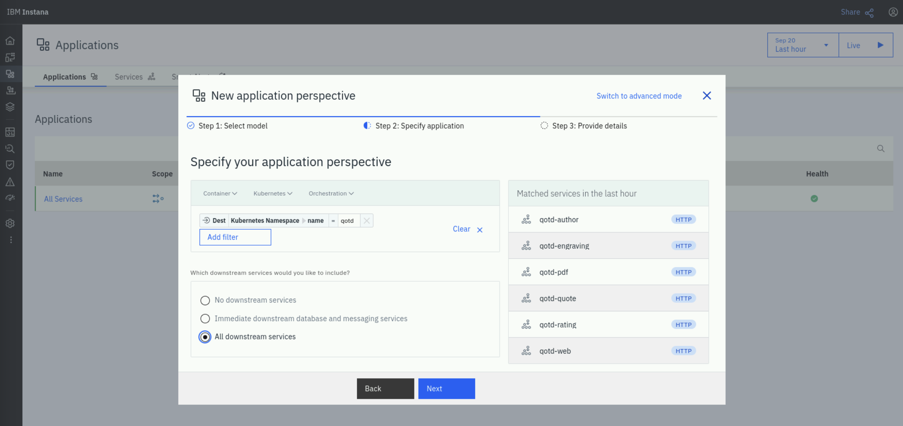

On *Step 3: Provide details*, under Application perspective name, type **qotd**. Under *Are you interested just in the calls 
to this application, or also the internal calls?* select **All calls**. Click **Create** to create the application perspective.

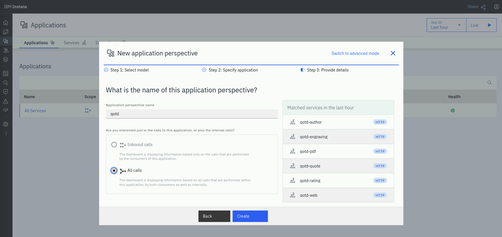


All right! The application perspective has been created. On the top-right, click on the **Live** button to enable live data feeds. After a few seconds, 
you should see the Summary page get populated with data. 

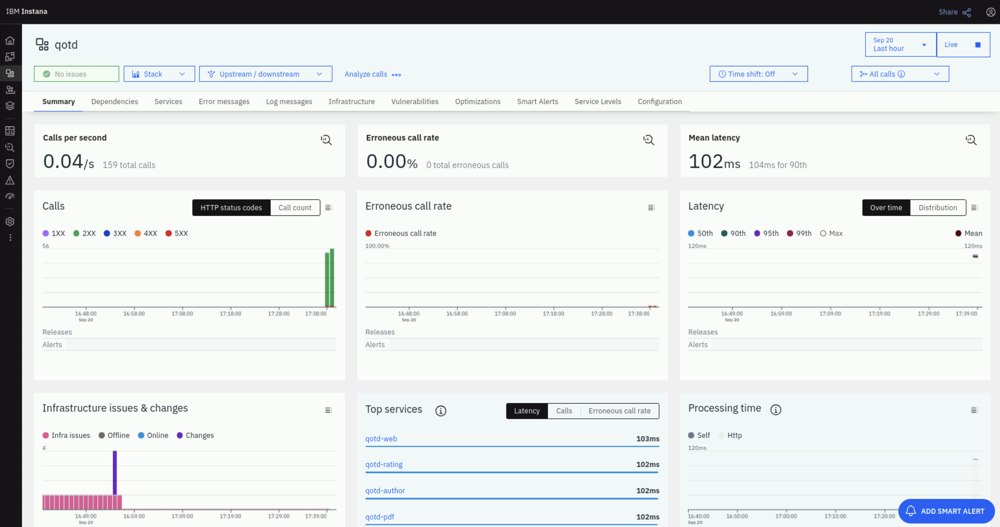


Click on the **Vulnerabilities** tab. Note that there are no vulnerabilities shown yet because Concert has not reported vulnerabilities.

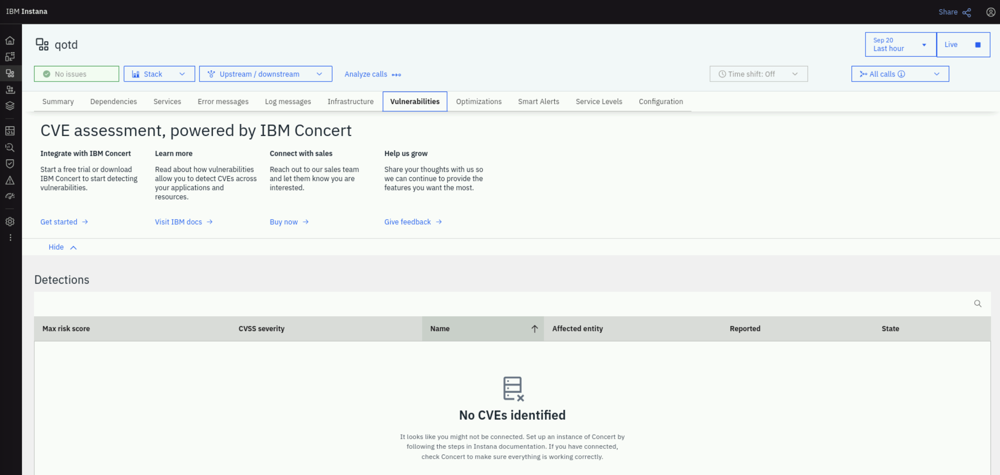


## 5.7: Prompting Concert to get Application Information from Instana


:::warning
Wait at least one (1) hour after defining the application in Instana before proceeding to this section.
This is required to allow the Instana agent to collect enough application information (SBOM) and make it available for Concert ingestion.
We are looking into reducing this waiting time in future releases of the lab.
::: 


Concert will consume the application information (SBOM) from Instana.
From the Bastion Remote Desktop, open the Firefox browser and click on the Concert bookmark to open the Concert UI. 
Log in with the username and password found in the credentials file under *concert_username* and *concert_password* and click **Log In**.

From the left menu, click on **Administration > Integrations**. Under the **Ingestion jobs** tab, locate the **instana-ingestion** job you 
created in the previous section. Click the 3-dots menu on the right and select **Run now** to get Concert pull application configuration from Instana.

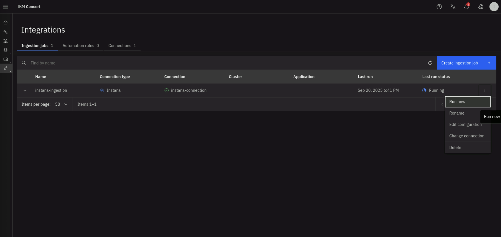

Wait 1-2 minutes for the ingestion job to complete. You can refresh the page to see the status of the job. 
When the job is completed, you should see a **Success** status.


Lets inspect the Application SBOMs that Concert has ingested from Instana. From the left menu, click on **Inventory > Evidence Store**. 
On the *Evidence Store* page, click on the **Added on** column to sort the items by descending time (downward-pointing arrow).
Note that Concert has ingested the application SBOM for the **qotd** and **All Services** applications, as shown below.


::::note
The **All Services** application in Instana is an auto-defined application that is present by default when Instana is first deployed
 in an environment. It acts as a catch-all group containing every service that Instana has automatically discovered in your monitored environment.
::::


Lets inspect the Application definitions that Concert now has. From the left menu, click on **Inventory > Application inventory**.

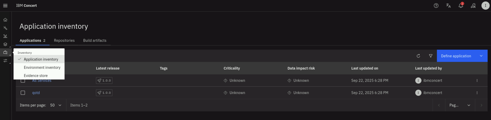

 From the *Application inventory* page, click on the **qotd** application. On the Topology tab, note that Concert has discovered the 
 application components and their relationships.

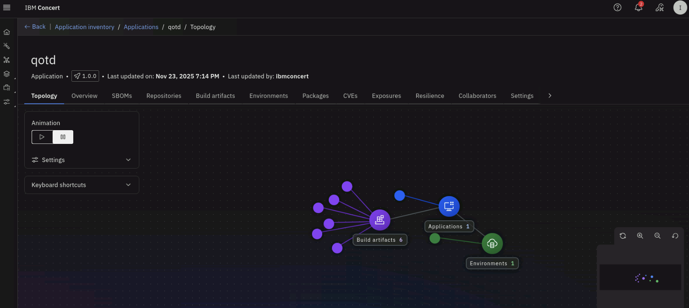

Click on the **Overview** tab. Note that empty application details are shown. Click on the pencil (**Edit**) icon to edit the application details.

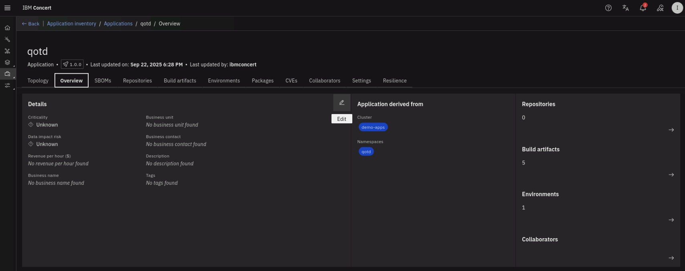

On the *Edit details* window, under **Criticality**, select **High**. Under **Impact Risk**, select **High**. under **Revenue per hour ($)**, type **500**.
Under **Description**, type **Quote of the day application**. On **Add business details**, select **Yes**.


Under **Business Owner**, type **ACME**. Under **Business Unit**, type **Sales**. Under **Business email**, type **acme@email.com**.
Under **Business phone**, type **919-555-5555**.  

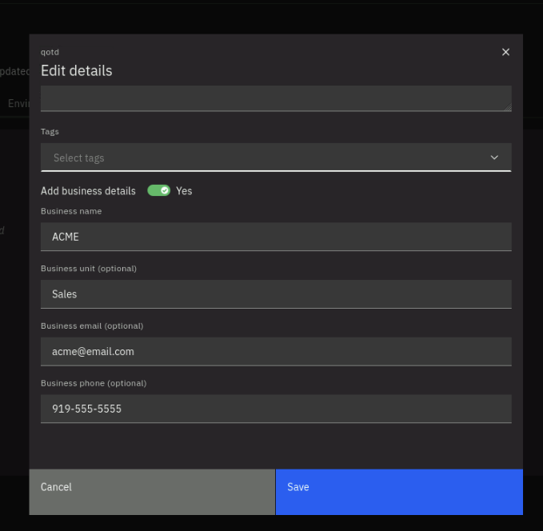

Click **Save** to save the changes.

On the *SBOMs* tab, note that the SBOM file is listed again.

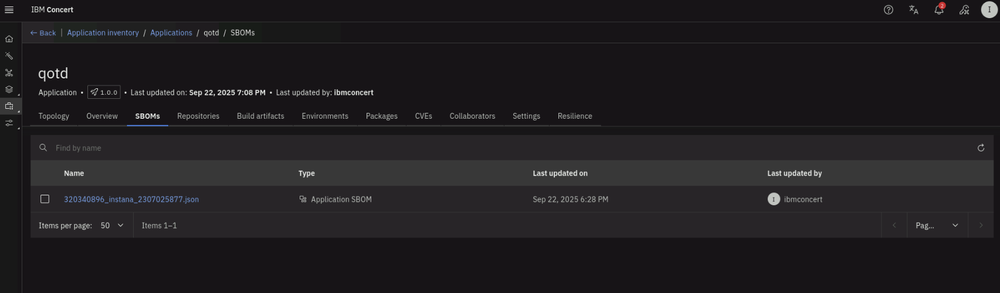

Click on the SBOM file name to see the details of the SBOM again (click on **Show more** on the right to expand the File view).
Explore the SBOM details that was provided by Instana.

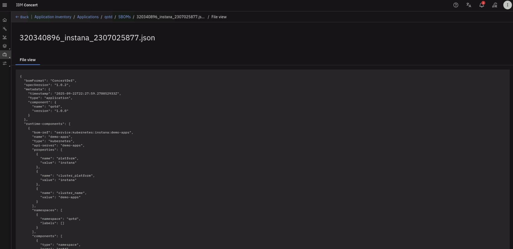

Click on **Back** on the top-left. 

Click on the **Build artifacts** tab. Note that the application build artifacts are listed, based on the SBOM information provided by Instana.

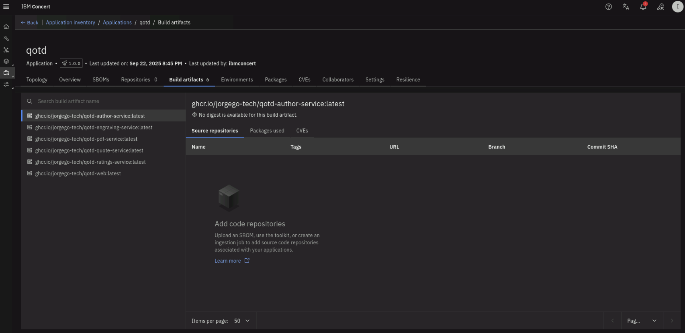

Click on the **Environments** tab. Note that under **Runtimes**, both the demo-apps K3S cluster and the Instana K3S cluster are listed as runtime environments.

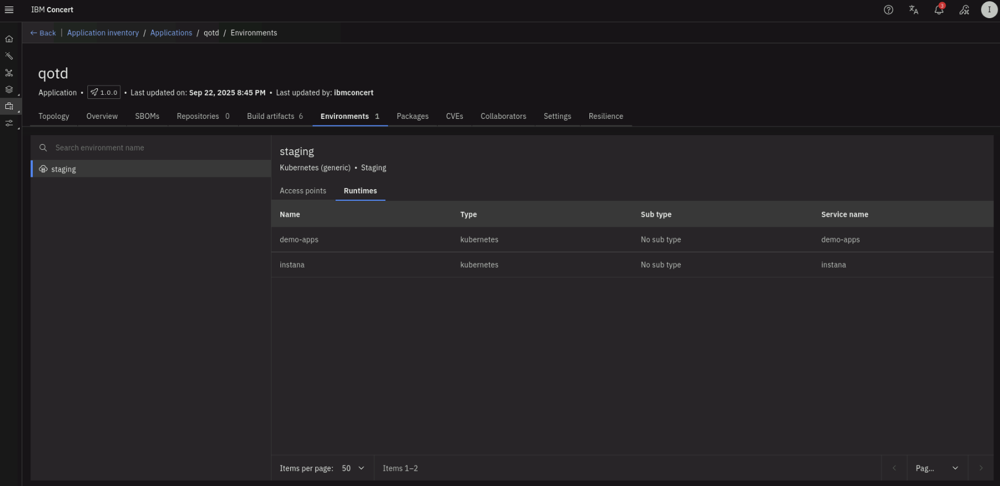

Finally, click on the **CVEs** tab. Note that there are no vulnerabilities because Concert has not received any 
vulnerability scanning information yet.

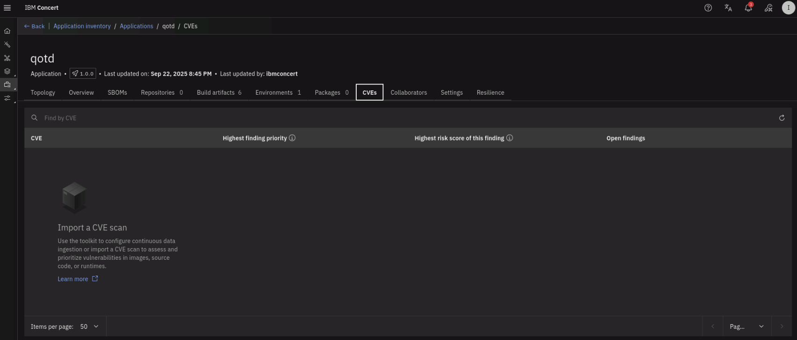

Congratulations! You have successfully built and deployed the sample application using Jenkins, defined the application in Instana,
and allowed Concert to ingest the application information from Instana. In the next section, we will perform the vulnerability scanning of the application. 