## 6.1: Overview

In this section, we will configure automation rules to allow Concert to create issues/tickets automatically, then 
 we will perform the vulnerability scanning of the sample application container images using Trivy,
and integrate it into the Jenkins CI/CD pipeline. We will also verify that the vulnerability information is
ingested into Concert and is visible in the Concert dashboard. At the same time, Instana will pull the vulnerability 
information from Concert. 

:::note
Trivy is a comprehensive, open-source vulnerability scanner developed by Aqua Security that detects 
security issues in applications, infrastructure, and code artifacts. It is especially popular for scanning 
container images. For more information, visit the [Trivy GitHub repository](https://github.com/aquasecurity/trivy).
:::


## 6.2: Creating a GitHub Integration from Concert

You will use the personal access token that you created previously to configure a GitHub Connection. 
Concert will leverage this connection to create GitHub issues for the detected vulnerabilities in the sample application.

From the Bastion Remote Desktop, open the Firefox browser and click on the Concert bookmark to open the Concert UI.
Login to the Concert UI with the credentials recorded in the credentials file (**concert_username** and **concert_password**).


* Go to **Administration** > **Integrations**.
* Select the **Connections** tab.
* Click on **Create connection**.
* Search for **GitHub** and click on the GitHub tile.
* Enter a unique **Name** for the connection such as **github-connection**.
* Skip the description field.
* Under **Parameters**, provide the following details:
  * **Host**: https://api.github.com/
  * **Personal Access Token**: the PAT you created in the previous step.
* Click on **Validate connection** to verify the connection is successful.
* Click **Create**.


## 6.3: Creating Automation Rules in Concert

Concert calculates a risk score and assigns a priority to all detected CVEs impacting the applications
 based on the ingested CVE vulnerability scans. Using automation rules, we will automate the issue/ticket creation 
 in GitHub to quickly address high priority CVEs impacting the application.
 Note that Concert can also integrate with other ticketing systems such as Jira, Salesforce, ServiceNow, etc.

:::note
In addition to automation rules, Concert can leverage ingestion jobs to pull data from external issue tracking systems
in order to automatically update ticket status. This configuration is out of scope for this lab.
:::

From the Bastion Remote Desktop, open the Firefox browser and click on the Concert bookmark to open the Concert UI.
Login to the Concert UI with the credentials recorded in the credentials file (**concert_username** and **concert_password**).

* Click **Administration** > **Integrations**.
* Select the **Automation rules** tab.
* Click the **Create automation rule** button on the right.


* Enter a name for the automation rule such as *issue-creation*.
* Enter a description for the automation rule (optional).
* Under **Take this action**:
    * select **Open a GitHub issue**
    * In **Enter target organization** type your GitHub username.
    * In **Enter target repository** type *concert-vulnerability-lab*.
* Under **With GitHub labels**, 
    * Click on the refresh icon.
    * Check the **bug** label from the list.
* Under **Using this connection**:
    * Select the GitHub connection created during the lab preparation.
    * For **assign to**, type your GitHub username.
* Under **When this condition occurs**:
    * Select **A CVE is detected**.
    * For **affecting**, select **Application** and then select **qotd** from the list of applications.
* Under **With the following threshold values**:
    * For **Risk Score >=**, type 4. This is the only condition that will trigger the issue creation.
    * Leave the other fields blank.
* For **Create tickets only for CVEs with fix available**, keep **No** as selection.

Your configuration should look similar to the screenshot below. Your github name will be different:

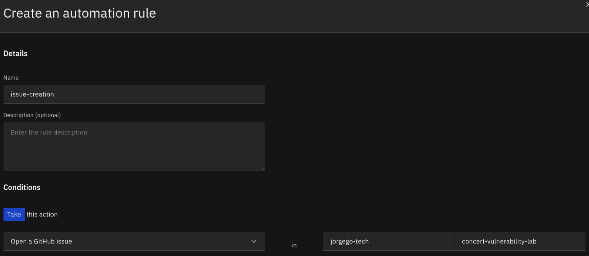
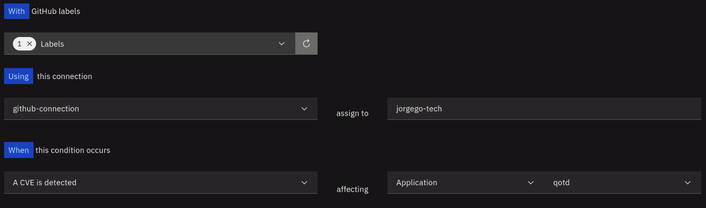
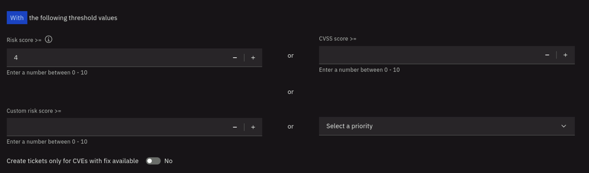

* Click **Create** to create the automation rule.

After the rule is created, it will appear in the list of automation rules. Click on the twistie before the rule name to 
expand the section and see more details. Review the conditions that will trigger the issue creation.

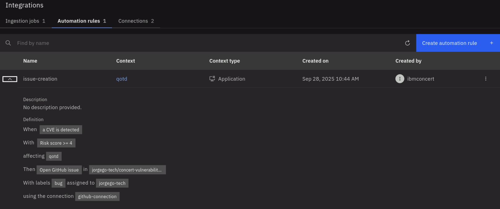


## 6.4: Configuring the Jenkins Pipeline for Application Vulnerability Scanning

We will now create a new Jenkins pipeline that includes a vulnerability scanning stage using Trivy.

From the Bastion Remote Desktop, open the Firefox browser and click on the Jenkins bookmark. On the 
*Sign in to Jenkins* page, enter **admin** as Username and the password found in the credentials file under 
**jenkins_password** and click **Sign in**.

On the Jenkins dashboard, click on **New Item** on the left menu. 
On the **New Item** page, on the *Enter an item name* field, enter **Vulnerability Scan**. Select **Pipeline** and click **OK**.

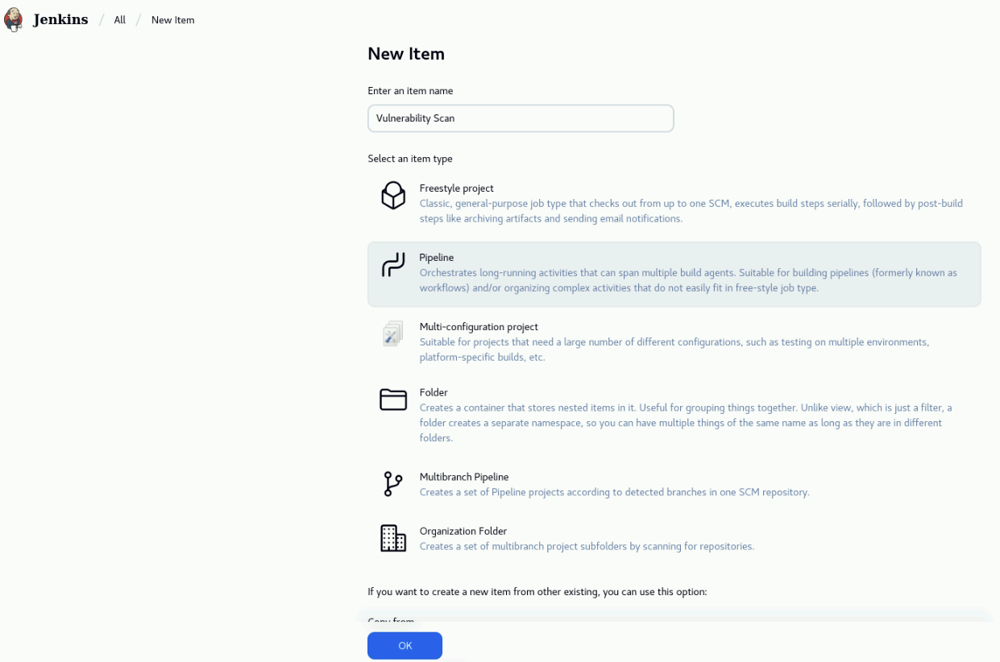

In the **Configure** page, select **Pipeline** on the left menu. Under the **Pipeline** section, leave **Pipeline script** in the **Definition** field
and copy the following code (hover on the code and use the top-right *Copy* button to avoid missing code). Paste the code into the **Script** field. 
Click on **Save** to save the pipeline.

```python
pipeline {
    agent any
    environment {
        CONCERT_HOST = 'https://concert.ibmdte.local'
        CONCERT_PORT = '12443'
        CONCERT_INSTANCE_ID = '0000-0000-0000-0000'

        // Update the environment variables below
        CONCERT_API_KEY = 'UPDATE'
        GHCR_USER = 'UPDATE'
        GHCR_PAT = 'UPDATE'
    }
    
    stages {

        stage('Vulnerability Scan') {
            steps {
                sh '''
                    export TRIVY_USERNAME=$GHCR_USER
                    export TRIVY_PASSWORD=$GHCR_PAT
                    trivy image --skip-version-check --image-src remote ghcr.io/$GHCR_USER/qotd-web:latest --format cyclonedx --scanners vuln -o cve-scan-qotd-web.json
                    trivy image --skip-version-check --image-src remote ghcr.io/$GHCR_USER/qotd-ratings-service:latest --format cyclonedx --scanners vuln -o cve-scan-qotd-ratings-service.json
                    trivy image --skip-version-check --image-src remote ghcr.io/$GHCR_USER/qotd-quote-service:latest --format cyclonedx --scanners vuln -o cve-scan-qotd-quote-service.json
                    trivy image --skip-version-check --image-src remote ghcr.io/$GHCR_USER/qotd-pdf-service:latest --format cyclonedx --scanners vuln -o cve-scan-qotd-pdf-service.json
                    trivy image --skip-version-check --image-src remote ghcr.io/$GHCR_USER/qotd-engraving-service:latest --format cyclonedx --scanners vuln -o cve-scan-qotd-engraving-service.json
                    trivy image --skip-version-check --image-src remote ghcr.io/$GHCR_USER/qotd-author-service:latest --format cyclonedx --scanners vuln -o cve-scan-qotd-author-service.json
                '''
            }
        }
        
        stage('Upload to Concert') {
            steps {
                sh '''
                    # sleep needed to avoid Concert v2.0.0.2 choke error 
                    curl --insecure -X 'POST' "${CONCERT_HOST}:${CONCERT_PORT}/ingestion/api/v1/upload_files" -H 'accept: application/json' -H "InstanceID: ${CONCERT_INSTANCE_ID}" -H "Authorization: C_API_KEY ${CONCERT_API_KEY}" -H 'Content-Type: multipart/form-data' -F "data_type=image_scan" -F "filename=@cve-scan-qotd-web.json" -F 'metadata={"scanner_name": "trivy"}'
                    sleep 20s
                    curl --insecure -X 'POST' "${CONCERT_HOST}:${CONCERT_PORT}/ingestion/api/v1/upload_files" -H 'accept: application/json' -H "InstanceID: ${CONCERT_INSTANCE_ID}" -H "Authorization: C_API_KEY ${CONCERT_API_KEY}" -H 'Content-Type: multipart/form-data' -F "data_type=image_scan" -F "filename=@cve-scan-qotd-ratings-service.json" -F 'metadata={"scanner_name": "trivy"}'
                    sleep 20s
                    curl --insecure -X 'POST' "${CONCERT_HOST}:${CONCERT_PORT}/ingestion/api/v1/upload_files" -H 'accept: application/json' -H "InstanceID: ${CONCERT_INSTANCE_ID}" -H "Authorization: C_API_KEY ${CONCERT_API_KEY}" -H 'Content-Type: multipart/form-data' -F "data_type=image_scan" -F "filename=@cve-scan-qotd-quote-service.json" -F 'metadata={"scanner_name": "trivy"}'
                    sleep 20s
                    curl --insecure -X 'POST' "${CONCERT_HOST}:${CONCERT_PORT}/ingestion/api/v1/upload_files" -H 'accept: application/json' -H "InstanceID: ${CONCERT_INSTANCE_ID}" -H "Authorization: C_API_KEY ${CONCERT_API_KEY}" -H 'Content-Type: multipart/form-data' -F "data_type=image_scan" -F "filename=@cve-scan-qotd-pdf-service.json" -F 'metadata={"scanner_name": "trivy"}'
                    sleep 20s
                    curl --insecure -X 'POST' "${CONCERT_HOST}:${CONCERT_PORT}/ingestion/api/v1/upload_files" -H 'accept: application/json' -H "InstanceID: ${CONCERT_INSTANCE_ID}" -H "Authorization: C_API_KEY ${CONCERT_API_KEY}" -H 'Content-Type: multipart/form-data' -F "data_type=image_scan" -F "filename=@cve-scan-qotd-engraving-service.json" -F 'metadata={"scanner_name": "trivy"}'
                    sleep 20s
                    curl --insecure -X 'POST' "${CONCERT_HOST}:${CONCERT_PORT}/ingestion/api/v1/upload_files" -H 'accept: application/json' -H "InstanceID: ${CONCERT_INSTANCE_ID}" -H "Authorization: C_API_KEY ${CONCERT_API_KEY}" -H 'Content-Type: multipart/form-data' -F "data_type=image_scan" -F "filename=@cve-scan-qotd-author-service.json" -F 'metadata={"scanner_name": "trivy"}'
                '''
            }
            
        }
    }               
}
```

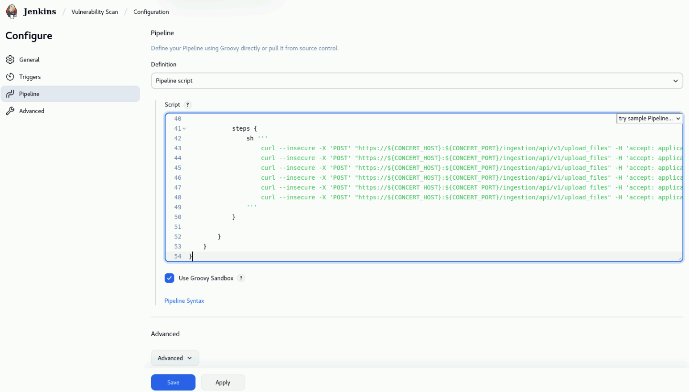

:::note
Take a minute to review the pipeline code. Note that first, environment variables are defined for Concert host, port, API key, 
GitHub Container Registry (GHCR) username and PAT. Note that Trivy has been pre installed in the demo-apps VM.
The pipeline has three stages: 

1. In the *Vulnerability Scan* stage, Trivy will remotely scan each container image stored in GitHub Container Registry. The scan results are saved in 
the CycloneDX format. 
2. In the *Upload to Concert* stage, the scan results are uploaded to Concert using the Concert file ingestion API.
::: 

After saving the pipeline, click on **Configure** on the left menu. On the **Configure** page, click on **Pipeline** 
on the left menu. Under the **Pipeline** section, in the **Script** field, update the environment variables
CONCERT_API_KEY, GHCR_USER and GHCR_PAT with the values that you captured in the `credentials.txt` file during the lab preparation.
Click on **Save** to save the changes.


Finally, click on **Build Now** on the left menu to run the pipeline.


## 6.5: Verifying Vulnerability Information in Concert

Once the **Vulnerability Scan** pipeline completes successfully, we will verify that the vulnerability information has been ingested into Concert
and is visible in the Concert Vulnerability dashboard.

From the Bastion Remote Desktop, open the Firefox browser and click on the Concert bookmark to open the Concert UI.
Login to the Concert UI with the credentials recorded in the credentials file (**concert_username** and **concert_password**).

On the Concert dashboard, click on **Dimensions -> Vulnerabilities** on the left menu as shown below.

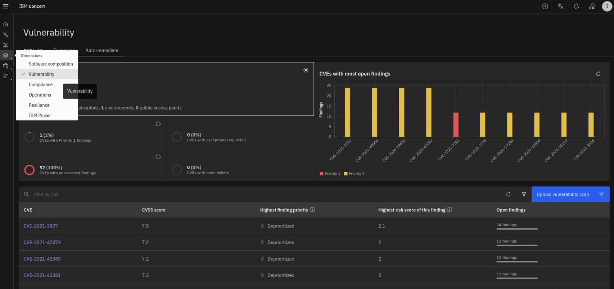

Note the total number of unique CVEs found across all images and the number of findings.
Click on the **Highest finding priority** to sort downward to see the highest priority vulnerabilities first. 
Select a CVE with Priority 1 or 2 and click on it to see more details.

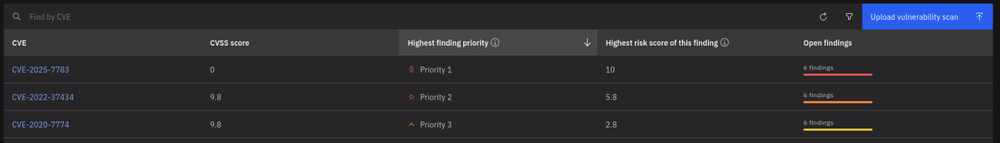

The CVE **Details** section shows the description of the vulnerability, the **Detailed attack vector explanation** and the **Active exploit and remediation**
are populated by watsonx. On the top right, using the **Ask watsonx** button, you can ask questions about the vulnerability and get answers powered by watsonx.

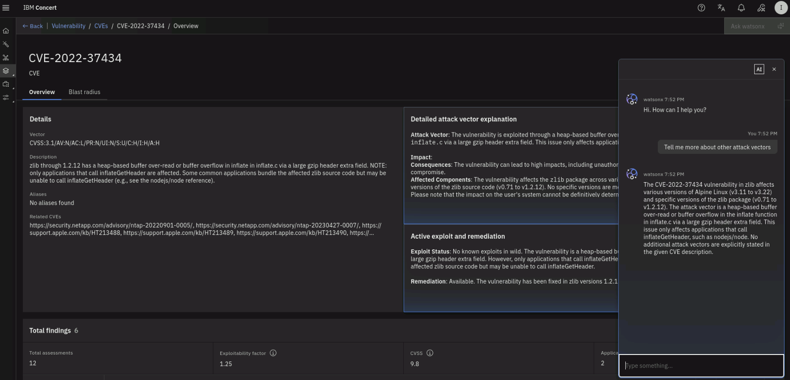

The second half of the page (the **Total findings** section) shows the list of images affected by this vulnerability. 
Click on the twistie icon on the left to see the **Recommended mitigation strategy** proposed by watsonx.

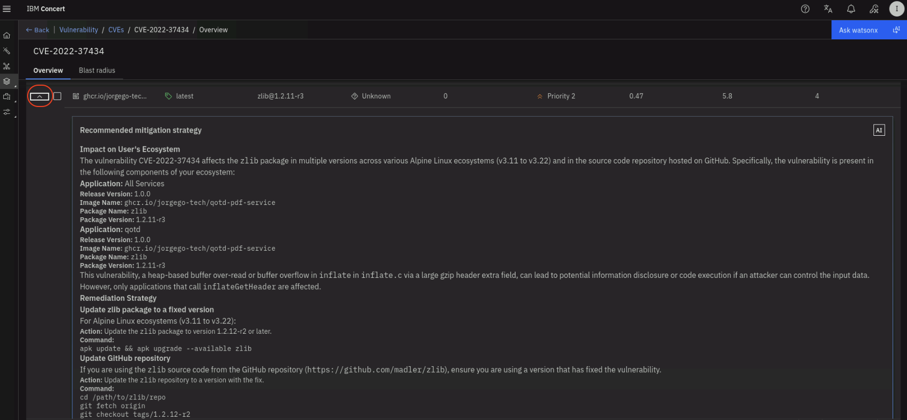

Finally click on the **Blast radius** tab on the top left to see how this vulnerability can impact Packages, Build artifacts, Applications and Environments.

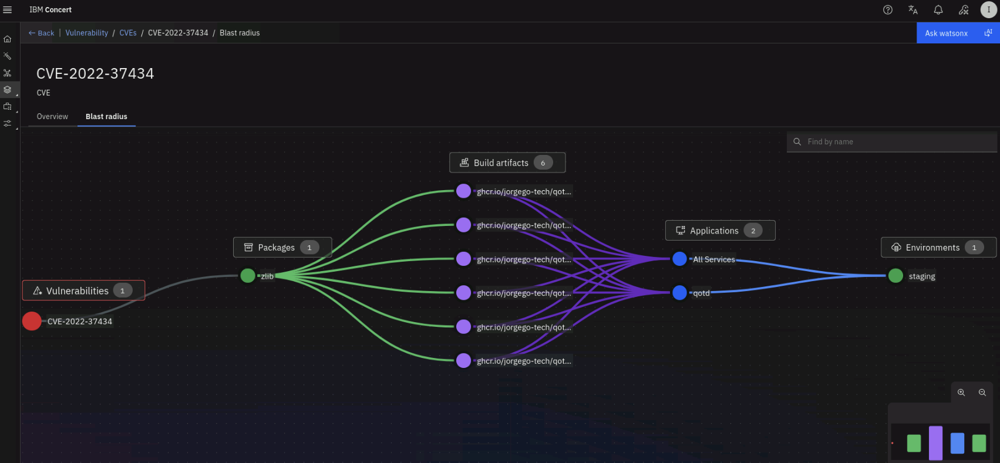


## 6.6: Verifying Issue Creation in GitHub

We will now verify that issues have been created in GitHub for the CVEs found during the scan that have a risk score >= 4.

On the Vulnerability dashboard in Concert, click on the filter icon on the right and select the **qotd** application as shown below:

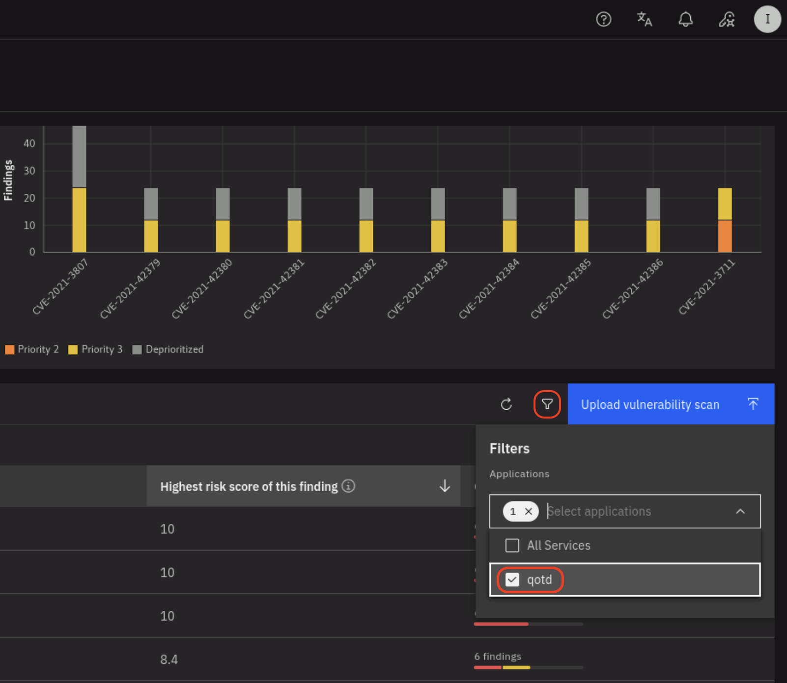


Click on the **Highest risk score of this finding ** to sort downward (downward arrow) and see the highest risk score vulnerabilities first.
Note that there are various CVEs with risk score >=4 as shown below:

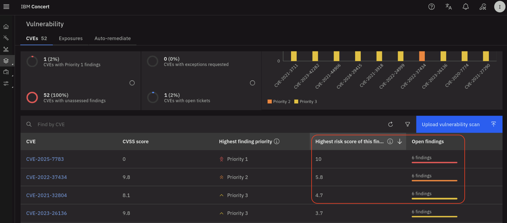


Now, on a new browser tab, login into your GitHub account and open the *concert-vulnerability-lab* repository. Select the **Issues** tab.
Note that there are various issues created by Concert, one for each CVE finding.

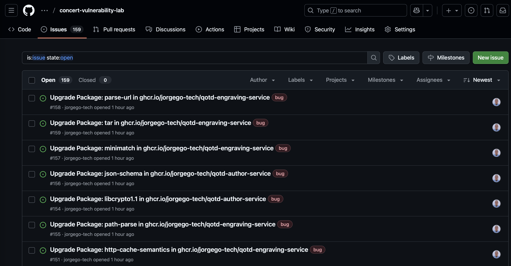


## 6.7: Verifying Vulnerability Information in Instana

We will now verify that the vulnerability information is also visible in Instana.
From the Bastion Remote Desktop, open the Firefox browser and click on the Instana bookmark. On the Instana login page, 
enter the username and password found in the credentials file
under *instana_server_username* and *instana_server_password* and click **Sign In**.

On the Instana dashboard, click on **Applications** on the left menu. On the **Applications** page, click on the **qotd** application.
On the **qotd** application page, click on the **Vulnerabilities** tab. Note that the vulnerabilities found by the Trivy scanner are listed here as well
because the Instana CVE Sensor pulls the vulnerability information from Concert.

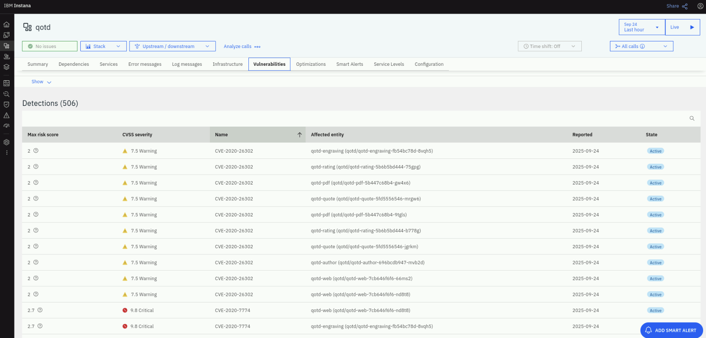    

Click on a CVE to see more details about the vulnerability.

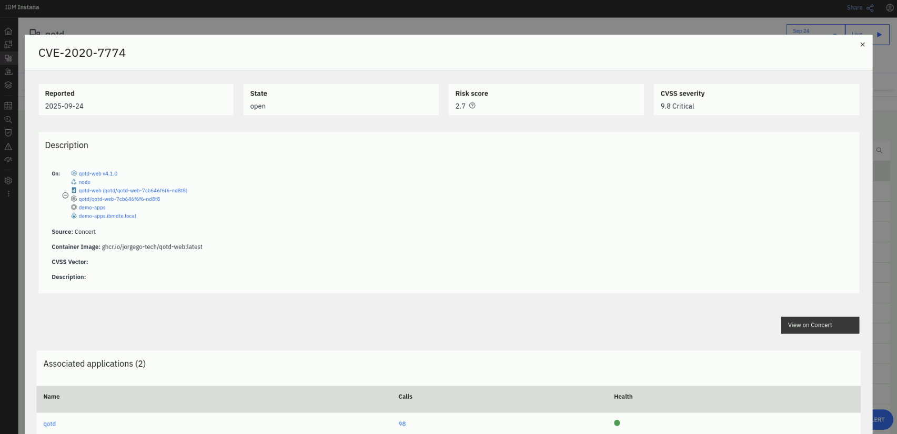

Note that you can see additional information about the vulnerability back in Concert using the **View in Concert** button on the right. Try it out!

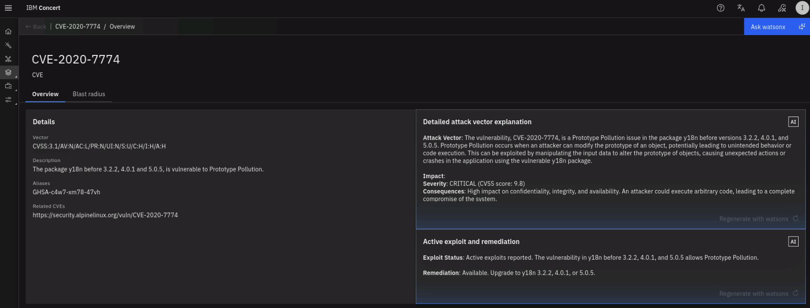


