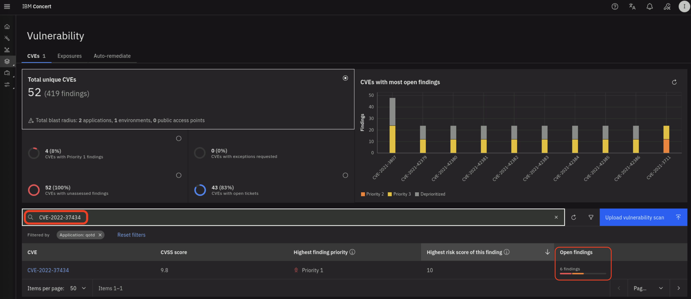
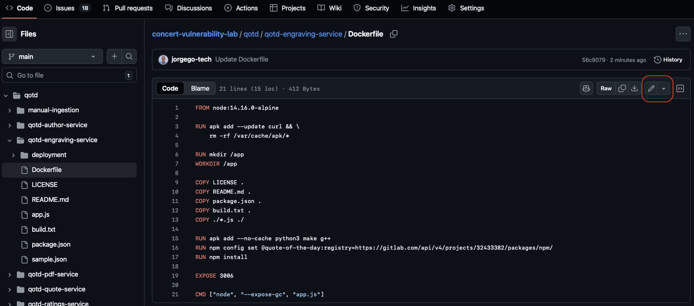
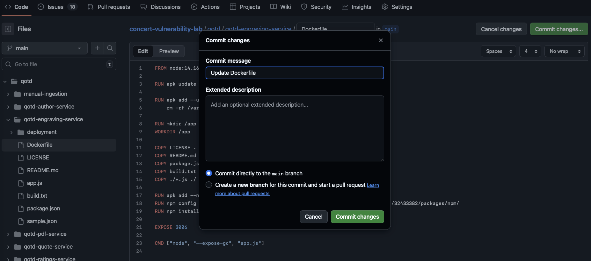
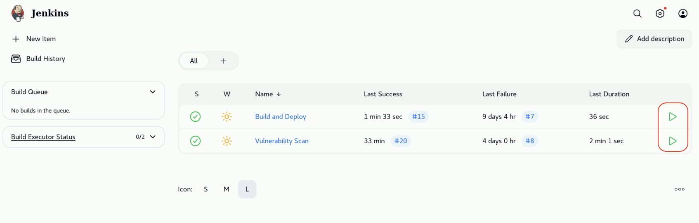
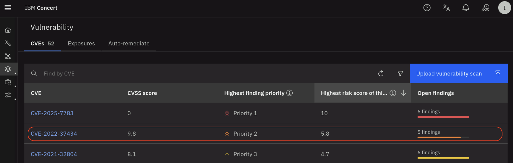
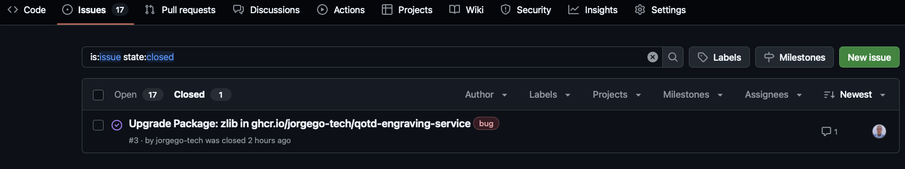
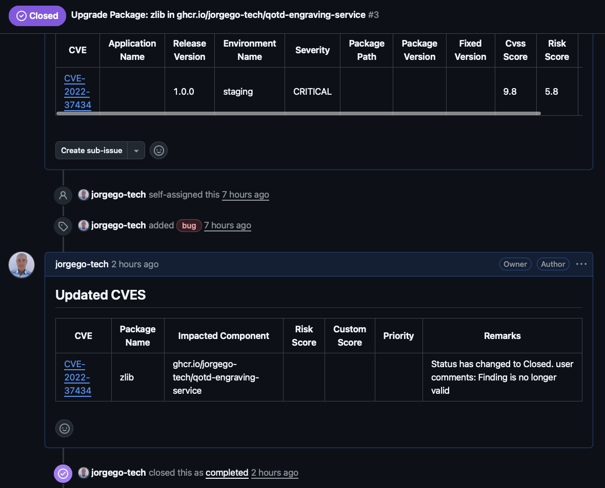
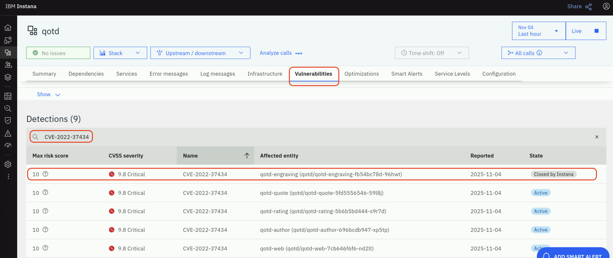

## 7.1: Overview

In this final chapter, we will demonstrate how to patch vulnerabilities in the **qotd** application deployed in the previous section.
We will focus on addressing the `zlib` package vulnerability (CVE-2022-37434) in the finding related to the
qotd-engraving-service container image. 
After patching the vulnerability, we will run the Jenkins pipelines to build, deploy and scan the updated container image.
Finally, we will verify that the vulnerability has been resolved in Concert and that the related issue in GitHub has been closed.

:::note
In order to simplify the lab steps, we have skipped the proper steps to remediate a GitHub issue.
In a real-world scenario, you would typically create a new branch, make the code changes, and create a **pull request** to merge the changes into the main branch.
This **pull request** would reference the open GitHub issue and include details about the code changes made to address the vulnerability.
Then, somebody else would review and **approve** the **pull request** before merging it or **reject** it if the code changes are not correct.
:::


## 7.2: Verifying the Vulnerability in Concert

We will start by verifying the vulnerability finding in Concert before patching it.
From the Bastion Remote Desktop, on the Firefox browser click on the Concert tab.

From the left navigation menu, click on **Dimension -> Vulnerability**. Search for `CVE-2022-37434` in 
the search box and click on the filter icon on the right and select the **qotd** application.


Note that the number of finding for **CVE-2022-37434** is six.




## 7.3: Patching Vulnerabilities

In this section, we will provide an example on how to patch vulnerabilities in the **qotd** application.
We will focus on addressing the `zlib` package vulnerability (CVE-2022-37434) in the
qotd-engraving-service container image.

Login to your GitHub account and open the following repository path:

````
concert-vulnerability-lab/qotd/qotd-engraving-service/
````

Open the `Dockerfile` in the `qotd-engraving-service` directory and click on the edit icon (pencil icon) to edit the file as shown below:



Add the line below after the first line in the Dockerfile to update the Alpine packages to the latest version.

````
RUN apk update && apk upgrade --available
````
Your **Dockerfile** code should look like below. The only change is adding the line after the **From node:...** line in the **Dockerfile**.

```Dockerfile
FROM node:14.16.0-alpine

RUN apk update && apk upgrade --available

RUN apk add --update curl && \
    rm -rf /var/cache/apk/*

RUN mkdir /app
WORKDIR /app

COPY LICENSE .
COPY README.md .
COPY package.json .
COPY build.txt .
COPY ./*.js ./

RUN apk add --no-cache python3 make g++
RUN npm config set @quote-of-the-day:registry=https://gitlab.com/api/v4/projects/32433382/packages/npm/
RUN npm install

EXPOSE 3006

CMD ["node", "--expose-gc", "app.js"]
```


Click on the **Commit changes...** button on the top-right to commit the changes to the repository.
On the **Commit changes** dialog, select the **Commit directly to the main branch** option and click on the **Commit changes** button.




## 7.4: Running the Pipelines after Patching

Now that we have patched the vulnerability in the Dockerfile, we will run the pipelines to build, deploy and scan the updated container image.

From the Bastion Remote Desktop, on the Firefox browser click on the Jenkins tab.

On the Jenkins dashboard, click on the play button on the right corresponding to the **Build and Deploy** pipeline and follow the execution progress 
(remember that this pipeline takes about 10 minutes to complete). 

After the first pipeline completes successfully, click on the play button on the 
right corresponding to the **Vulnerability Scan** pipeline and follow the execution progress (remember that this pipeline takes about 3 minutes to complete).




## 7.5: Verifying the Vulnerability Resolution in Concert

After both pipelines completed successfully, Concert received the updated vulnerability scan results and 
automatically updated the finding related to the qotd-engraving-service container image.

From the Bastion Remote Desktop, on the Firefox browser click on the Concert tab.

From the left navigation menu, click on **Dimension -> Vulnerability**. From the left navigation menu, 
click on **Dimension -> Vulnerability**. Search for `CVE-2022-37434` in the search box as shown below. 
Note that the number of finding for **CVE-2022-37434** changed from **six** to **five** as shown below:




## 7.6: Verifying Issue Resolution in GitHub

Now go back to the GitHub repository page where you edited the Dockerfile. Click on the **Issues** tab.
Click on the **Closed** lower tab to view the closed issues related to **CVE-2022-37434** in qotd-engraving-service.
Note that in addition to the issue related to **zlib**, other issues are also fixed and closed due to the fact 
that we updated all the packages in the Dockerfile.  



Open the closed issue to view the details. You can see that the issue was automatically closed by Concert due to the fact that 
the vulnerability **CVE-2022-37434** does not affect the finding on qotd-engraving-service anymore.




## 7.7: Verifying the Vulnerability Resolution in Instana

Finally, we can also verify that the vulnerability has been resolved in Instana.
From the Bastion Remote Desktop, on the Firefox browser click on the Instana tab.

From the left navigation menu, click on **Applications** and then click on the **qotd**.
From the **qotd** application page, click on the **Vulnerabilities** tab. 
Click on the search icon on the right side of the search box and search for `CVE-2022-37434` as shown below.

Note that the State of the **CVE-2022-37434** for the **Affected entity** `qotd-engraving` is **Closed by Instana**.




================================
===================================

# Congratulations! You have completed the Lab

================================
===================================

