## 11.1: Overview

IBM Runbook Automation can automate procedures that can help IT staff solve
everyday operational problems and do not require human interaction, thereby
increasing the efficiency of IT operational processes.

Runbooks start as documented procedures on a piece of paper that can become
fully automated procedures.

This module focuses on the creation of a simple Semi-automated runbook.

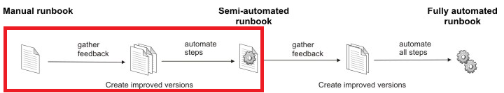

**Scenario:** There is a apache2 server running on HOST . The apache2 process is
monitored and configured to generate an alert when the apache2 API service goes
UP/DOWN.

**Objective:** Create a runbook to restart apache2 API service and associate it
with “apache2 API Service Down” alert.

By the end of this module, you will have a fully functional semi-automated
runbook ready in the Watson AIOPs Event Manager environment.

---

## 11.2: Configure Integration with other systems

:::caution Important

Before starting this tutorial, Please enable Impact Service as follows:

**Automation -> Netcool Impact (login as icpadmin user) -> Click on Services ->
Start service RBA_EventReader**

:::

For executing runbooks, users need to choose the type of automation provider
from Ansible Tower, SCRIPT or BigFix. A connection must be set up to connect to
your target endpoints.

The SCRIPT automation provider allows to execute scripts (bash, ksh, perl ) on a
target system. In this example, we will use the SCRIPT automation provider to
establish an ssh session to target the endpoint. To allow RBA to log in without
needing to specify a password, we need to copy RBA's public key into the user’s
SSH authorized_keys of the target host. We can get the RBA public key by
accessing the Watson AIOps — Event Manager User Interface as follows:

Navigate to: **Administration → Integration with other systems > automation
type > script > configure**

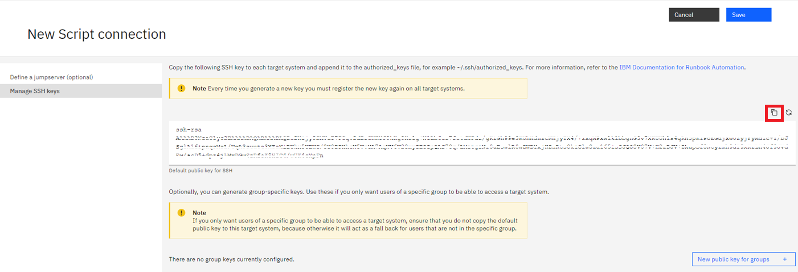

Copy the public key to `~/.ssh/authorized_keys` for the jammer user on the
remote host (control node) where we want to execute the command.

Click on "Save", go back to "Automation type", the "Script" status should be
"Connected".

:::warning

When you add the generated public key to your control node, be very careful not
to edit the configured public key or you will lock yourself out of your control
node.

:::

---

## 11.3: Create Automation

Automation is a unit of programmatic instructions in RBA. Automation can be a
script that is run through an SSH session on a remote system, an HTTP(s) API
call, a BigFix call, or an Ansible tower Job or Job Workflow call. A Runbook is
formed by combining one or more automation. You can create new automation using
Watson AIOps — Event Manager UI as follows:

Navigate to: ** Automations → Runbooks → Automations → Create Automation **

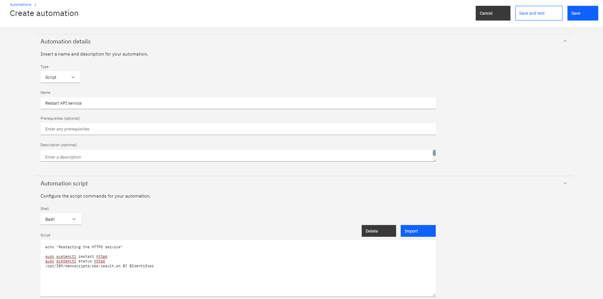

Script :

```sh
echo "Restarting the apache2 service"
sudo systemctl restart apache2
sudo systemctl status apache2
```

---

Automation Parameters:

**target** and **user** are default parameters are required to execute
automation on the remote system. Add another parameter **Identifier** of String
type that we can use later for updating alarm based on runbook results.

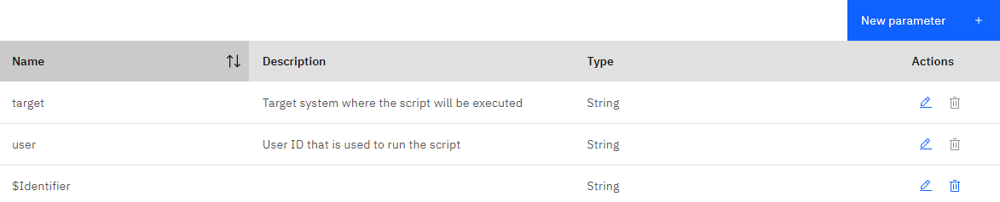

Save the automation.

## 11.4: Create Runbook

Navigate to: ** Automations → Runbooks → Library → Create Runbook **

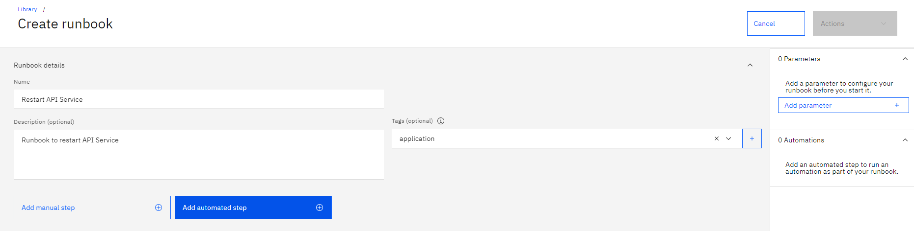

Add automated Step > Select "Restart API Service" Automation

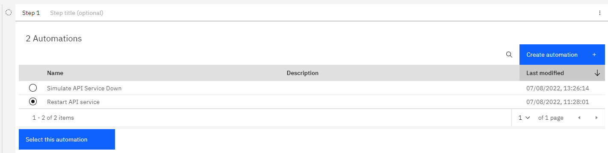

Map Automation parameters as follows:

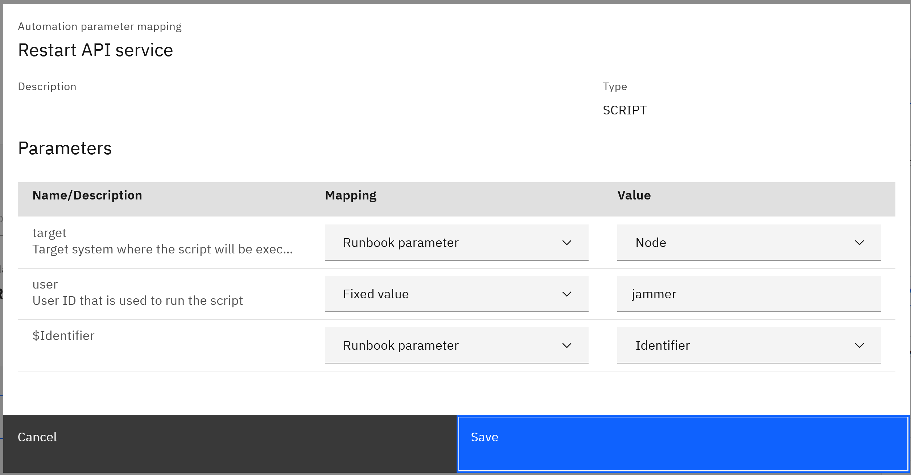

Publish runbook by clicking ** Actions > Publish **

---

## 11.5: Create Trigger

Triggers are used to associate runbook to the alerts. It looks for events in
which their Summary fields match the string pattern. For more information on
triggers : https://www.ibm.com/docs/en/noi/1.6.5?topic=triggers-create-trigger

Connect to Control node.

Install & start apache2 service on control node.

```sh
sudo apt install net-tools -y
sudo apt install apache2 -y
sudo systemctl start apache2
sudo systemctl status apache2
```

Login to OCP cluster

Now stop apache2 Service and insert some test alert for apache2 Service. (In
live monitoring this alert is automatically generated when Service goes down)

```sh
sudo systemctl stop apache2
sudo systemctl status apache2
```

Run "ifconfig" to capture eth0 IP address.

```sh
ifconfig
```

```sh
oc exec -it evtmanager-ncoprimary-0 -- /bin/bash -c '/opt/IBM/tivoli/netcool/omnibus/bin/nco_sql -server AGG_P -user root -pass $OMNIBUS_ROOT_PWD'
```

Replace the '\<HOSTNAME\>' with the Control Node eth0 IP address from previous command in below command.

```sh
insert into alerts.status (Identifier,Severity,Type,AlertGroup,Node,FirstOccurrence,LastOccurrence,Manager,Class,Summary) values('Demo API Server <HOSTNAME> 1',5,1,'Demo','<HOSTNAME>',getdate,getdate,'Tivoli EIF Probe',6601,'API Server on <HOSTNAME>:80 is DOWN');
go
```

Navigate to: ** Automations → Runbooks → Triggers → Create Trigger **

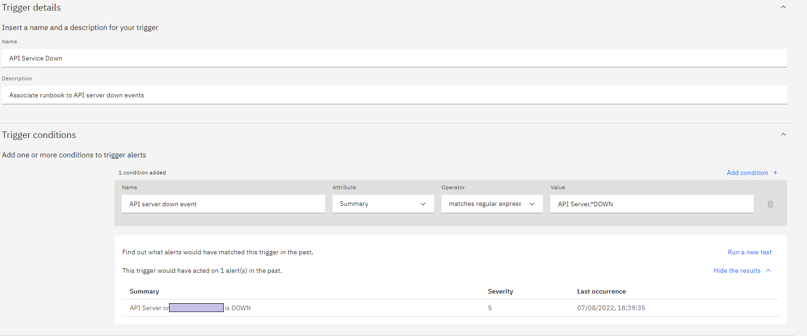

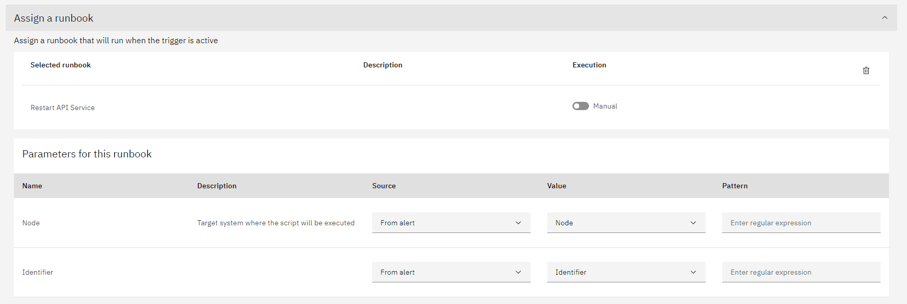

Click on "Save".

---

## 11.6: Test runbook

Launch Alert Viewer and check alert with Summary = "API Server on HOST is DOWN".
There should be a runbook associated with this alert automatically.

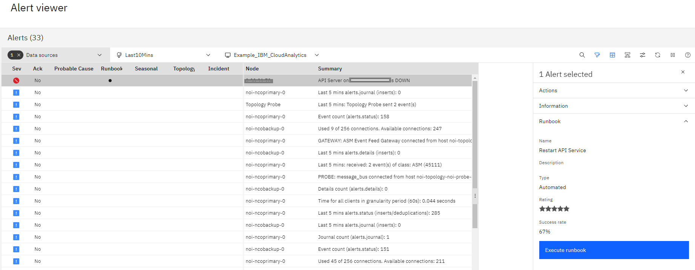

** Execute runbook > Start Runbook **

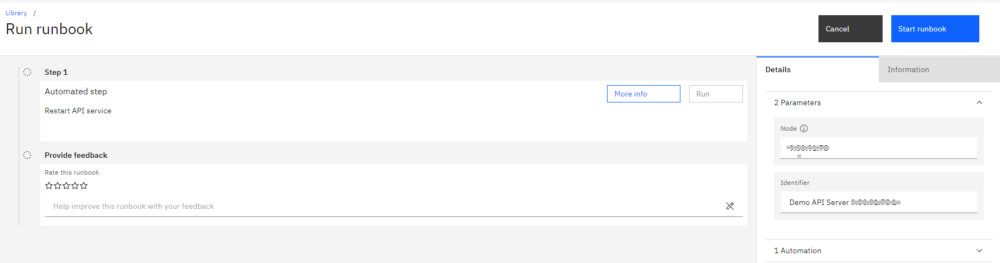

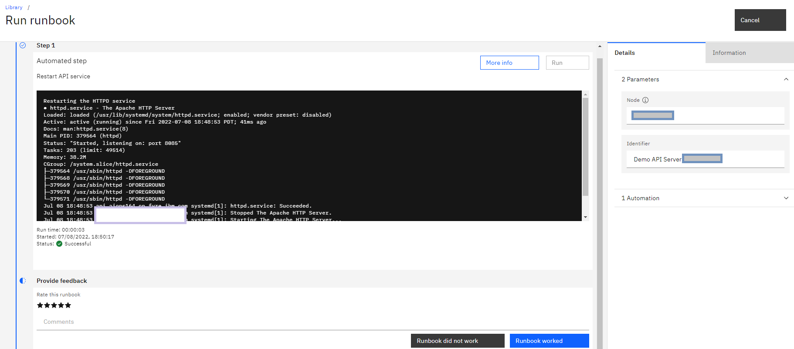

Connect to control node.

Check Status of apache2 service on control node.

```sh
sudo systemctl status apache2
```

It should return running status , as runbook automatically started this service

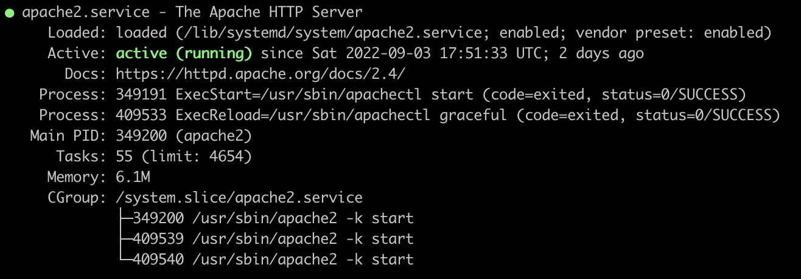

---

:::note

For more details on Runbooks, see the documentation link:
https://www.ibm.com/docs/en/noi/1.6.5?topic=systems-managing-runbooks-automations

:::

You have now completed this module and learned how Semi automated runbooks work
in Event Manager. In next module we will cover fully automated runbook with
event journal update.

Proceed to the next section.
