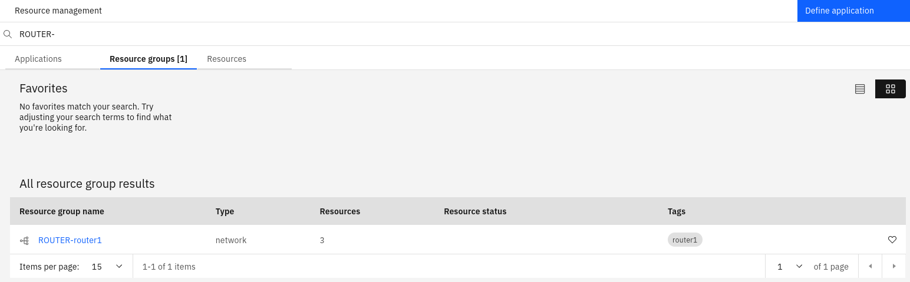
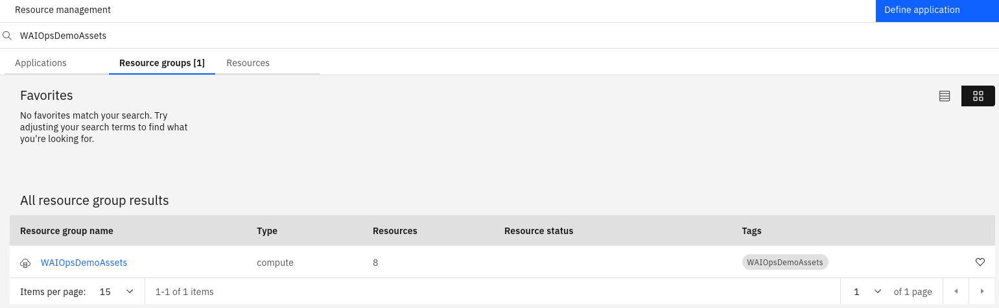
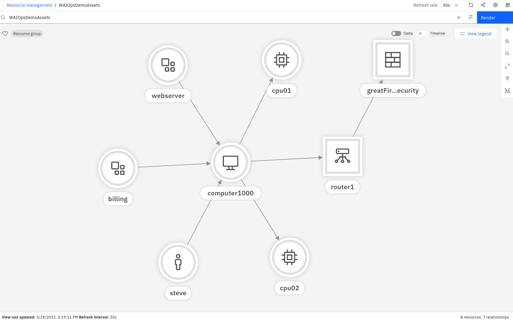
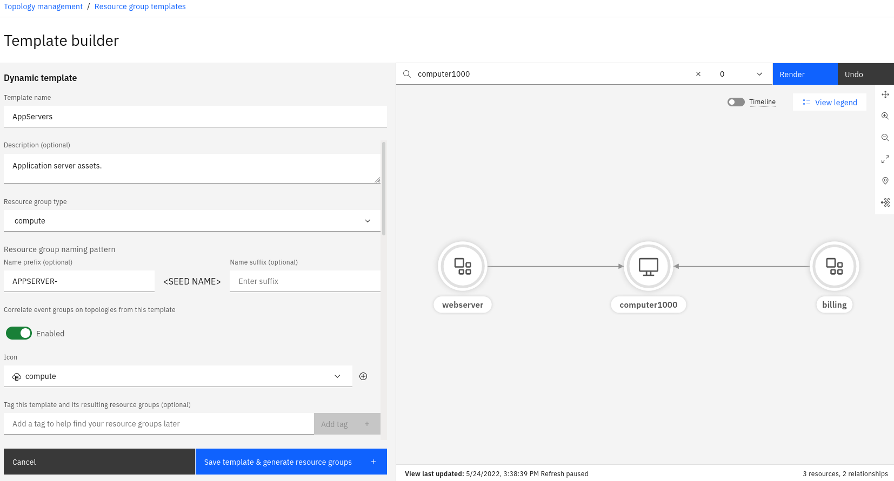
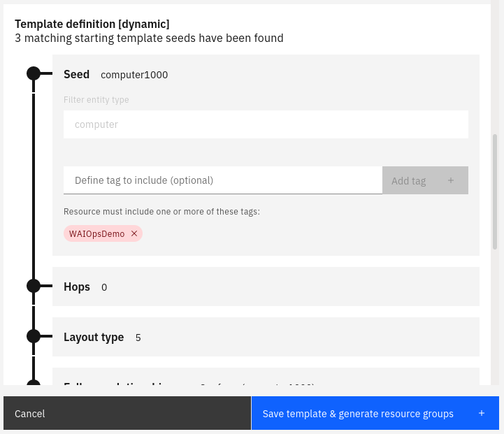
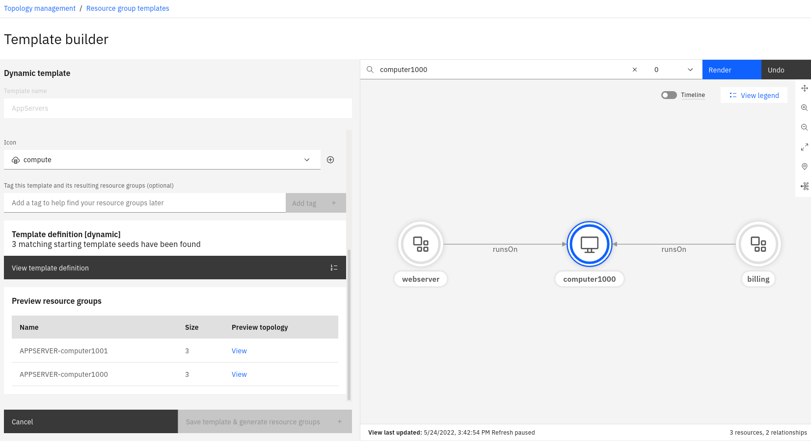
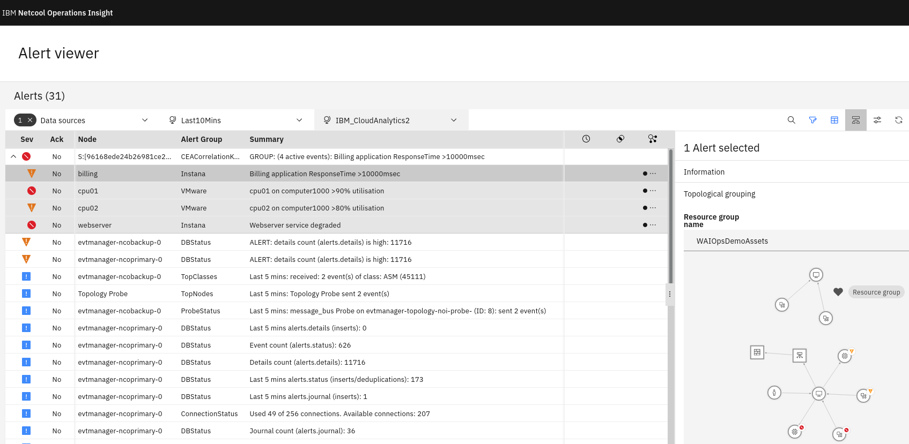
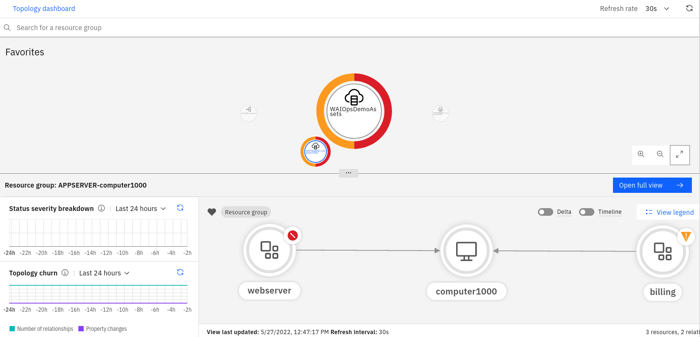

## 6.1: Overview

This module focuses on topology group templates, the different types, and what
each is used for, including for topology-based event correlation. This module
will use on the topology we created in the previous module.

By the end of this module, you will understand the three types of topology
template, and have created an example of each type. You will also understand
what a "favourite" is and will have added some items to your topology dashboard.
Finally, you will have injected some sample events, and will observe them being
grouped by the topology-based event grouping function.

Topology group templates are used to create groups of resources. Resource groups
make it easier to find and visualise collections of related resources, as well
as do event correlation over resources in a group. There are three main types of
topology group template:

- Exact: defines a single group of specific resources
- Tag-based: defines a single group of resources that share a common tag or tags
- Dynamic: defines one or more groups that match a prescribed specification

The exact topology group template is useful for when you have a specific
collection of resources that are unique in your environment that may be of
particular importance. Perhaps you want to be able to find this group of
resources quickly and easily, or visualise them on a wall screen.

The tag-based topology allows you to define a group of resources based on a
common tag. These resources don't have to be connected; they simply need to have
the common tag in order to be included. Tags can be added to resources via
topology Rules set up in the GUI, or via the tags parameter if creating topology
via the File or REST Observers.

The Dynamic template is probably the most versatile of the three topology group
templates. Using an example of a set of resources you want to group, the dynamic
topology group template will automatically find other groups of resources that
follow the same "recipe" as the example you give. As you expose the resources
and relationships in the view, the template builder records the steps, and then
uses this recipe to find other similar groups of resources.

## 6.2: Create an exact topology group template

In this exercise, we will create a template for a specific group of resources
for our router (router1) and its connected resources.

Navigate to: **Administration > Topology configuration > Group templates**

Click on **Create a new template** and then select **Exact template**.

You will be presented with a **Template builder** window. From here, use the
following steps to configure an exact template sample:

- Give the template a name and provide a brief description
- Choose the **Resource group type: network**
- Add a **Resource group naming pattern prefix** for the resulting group's name:
  **ROUTER-**
- Enable **Correlate event groups on topologies from this template** if you want
  to correlate events across these resources
- Type **router1** in the search box: **Search for a resource to get started**
  and hit Enter
- Choose **router1** from the list of resources
- Change the view to 1 hop and click **Render**
- Click **Save template & generate resource group**

You should have something like the following:


After returning to the **Resource group templates** screen, you will see your
saved template:


:::note

An exact topology group template will only ever have 1 resource group.

:::

If you navigate to Resource management and search for **ROUTER-** , you will see
the following under the **Resource groups** tab:



If you click on the name **ROUTER-router1**, you will be able to view the
topology group, which consists of 3 resources:


:::note

if you have enabled event correlation across this group of resources and receive
events from these resources, the events will be correlated automatically.

:::

## 6.3: Create a tag based topology template

In this exercise, we will create a template for group of resources based on
their common tag.

Navigate to: **Administration > Topology configuration > Group templates**

Click on **Create a new template** and select **Tag based template**.

You will be presented with a **Template builder** window. From here, use the
following steps to configure an tag based template sample:

- Give the template a name and provide a brief description
- Choose the **Resource group type: compute**
- Add a **Resource group name** for the name of the group of resources:
  **WAIOpsDemoAssets**
- Enable **Correlate event groups on topologies from this template** if you want
  to correlate events across these resources
- Type **WAIOpsDemo** in the search box: **Search for a tag to get started** and
  hit Enter
- Check **WAIOpsDemo** from the list of available tags and then click the
  **Resources** tab to see the list of matching resources
- Click **Save template & generate resource group**

You should have something like the following:


After returning to the **Resource group templates** screen, you will see your
saved template:



If you navigate to Resource management and search for **WAIOpsDemoAssets** , you
will see the following under the **Resource groups** tab:


If you click on the name **WAIOpsDemoAssets** , you will be able to view the
topology group, which consists of 8 resources:



## 6.4: Create a dynamic template

In this exercise, we will create a dynamic template to create groups of servers
that host our applications. We will create a second server **computer1001** that
hosts the **notification** and **email** applications for the purposes of this
exercise.

Create a new file called application2.txt with the following contents:

```sh title="application2.txt"
V:{"_operation":"InsertReplace","uniqueId":"111-379177a8-0a6a-4068-817c-d6d6e870437e-app2","matchTokens":["111-379177a8-0a6a-4068-817c-d6d6e870437e-app2","notifications"],"tags":["WAIOpsDemo"],"name":"notifications","entityTypes":["application"]}
V:{"_operation":"InsertReplace","uniqueId":"111-9c1f90e0-7dc4-40d8-8721-40ea2f3af453-app2","matchTokens":["111-9c1f90e0-7dc4-40d8-8721-40ea2f3af453-app2","email"],"tags":["WAIOpsDemo"],"name":"email","entityTypes":["application"]}
V:{"_operation":"InsertReplace","uniqueId":"111-974d1788-1312-4151-8a62-73fa1854e807-app2","matchTokens":["111-974d1788-1312-4151-8a62-73fa1854e807-app2","computer1001"],"tags":["WAIOpsDemo"],"name":"computer1001","entityTypes":["computer"]}
E:{"_toUniqueId":"111-974d1788-1312-4151-8a62-73fa1854e807-app2","_edgeType":"runsOn","_fromUniqueId":"111-379177a8-0a6a-4068-817c-d6d6e870437e-app2"}
E:{"_toUniqueId":"111-974d1788-1312-4151-8a62-73fa1854e807-app2","_edgeType":"runsOn","_fromUniqueId":"111-9c1f90e0-7dc4-40d8-8721-40ea2f3af453-app2"}
```

Use the steps included in the previous module to import this file into the Event
Manager system and create a new File Observer job to ingest the topology data.

Navigate to: **Administration > Topology configuration > Group templates**

Click on **Create a new template** and select **Dynamic template**.

You will be presented with a **Template builder** window. From here, use the
following steps to configure an tag based template sample:

- Give the template a name and provide a brief description
- Choose the **Resource group type: compute**
- Add a **Resource group naming pattern** prefix for the resulting group's name:
  **APPSERVER-**
- Enable **Correlate event groups on topologies from this template** if you want
  to correlate events across these resources
- Type **computer1000** in the search box: **Search for a resource to get
  started** and hit Enter
- Choose **computer1000** from the list of available resources
- Right-click on computer1000 and select **Follow Relationship → runsOn** which
  will expose the applications **webserver** and **billing**

You should have something like the following:



Continue with the following steps:

- Scroll down on the left side and note that the template has been recording
  your actions to build a "recipe" for the template
- Add a tag to the list of starting seeds if you want to restrict the items
  matched by this template to just those tagged with specific tags
- Continue to scroll down and click **Save template & generate resource group**



You should see that the dynamic template builder has found two groups of
resources that match the specification:



## 6.5: Inject test events and observe event grouping

SQL can be injected into the ObjectServer to generate test events that will
match the topology groups created in previous steps.

Create a local file called `sample_events.sh` on the machine you are running
your terminal session from and paste in the following contents:

```sh title="sample_events.sh"
#!/bin/bash
/opt/IBM/tivoli/netcool/omnibus/bin/nco_sql -server AGG_P -user root -passwd $OMNIBUS_ROOT_PWD << EOF

insert into alerts.status (Identifier, Node, Summary, Severity, Type, AlertGroup) values ('cpu01', 'cpu01', 'cpu01 on computer1000 >90% utilisation', 5, 1, 'VMware');
insert into alerts.status (Identifier, Node, Summary, Severity, Type, AlertGroup) values ('cpu02', 'cpu02', 'cpu02 on computer1000 >80% utilisation', 4, 1, 'VMware');
insert into alerts.status (Identifier, Node, Summary, Severity, Type, AlertGroup) values ('billing', 'billing', 'Billing application ResponseTime >10000msec', 4, 1, 'Instana');
insert into alerts.status (Identifier, Node, Summary, Severity, Type, AlertGroup) values ('webserver', 'webserver', 'Webserver service degraded', 5, 1, 'Instana');
go
exit

EOF

```

Use the following command to copy your new script to the ObjectServer pod in
your OpenShift cluster:

```sh
cat sample_events.sh | oc exec -i evtmanager-ncoprimary-0 -- sh -c "cat > /tmp/sample_events.sh"
```

```sh
oc exec -it evtmanager-ncoprimary-0 bash -- sh -c "chmod +x /tmp/sample_events.sh"
```

Finally, use the following command to execute the script, to inject synthetic
events into the system:

```sh
oc exec -it evtmanager-ncoprimary-0 bash -- /tmp/sample_events.sh
```

:::info

You can ignore the message:
`Warning: Failed to find tar in the following directories : /bin /usr/bin`

:::

After completing these steps, waiting a few moments and refresh your Event
Viewer. You should see a group containing the events generated by your script.
If you click on the **Correlation Information** button, and then one of the
buttons in the topology-based correlation column, you'll see a preview of the
topology based group that has caused the correlation of these events:



## 6.6: View results in Topology Dashboard

Navigate to: **Resource management > Resource groups**. Browse your defined
groups and click on the small heart icon to the right of each on a selection of
the groups. Favourite some groups that have some associated underlying events.
You'll notice that your favourite groups of resources automatically appear at
the top of the screen.

Navigate to: **Dashboards > Topology dashboard**. This will open the topology
dashboard with any groups of resources you have made a favourite.



Note how two of the groupings have a red and orange halo of colour around them.
This is because of the underlying events we created in the previous step, that
have now been associated with some of the underlying resources. If you click on
one of the groupings, it will show you a preview of the topology group, and a
summary of **Status severity breakdown**, as well as **Topology churn**.
Clicking on **Open full view** will take you into the full topology view for the
selected topology group, where you can then get a fuller view of the affected
topology resources.

You have now completed this module and are ready for module "Configure
scope-based grouping".

[Reference Blog](https://community.ibm.com/community/user/aiops/blogs/zane-bray1/2022/04/26/getting-started-with-watson-aiops-event-manager-57)
