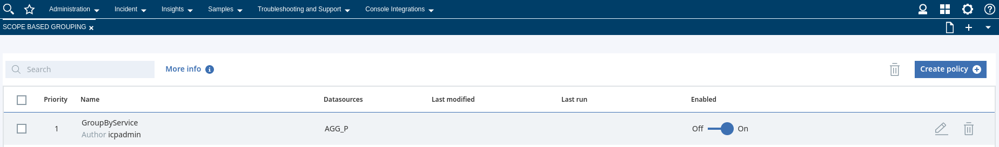
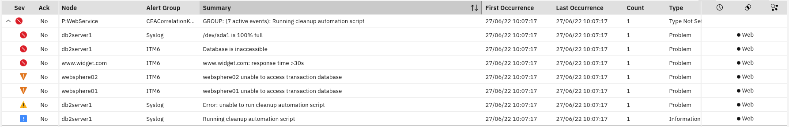
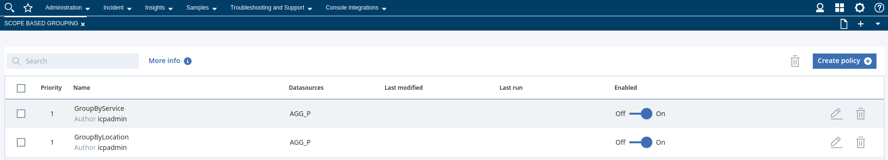
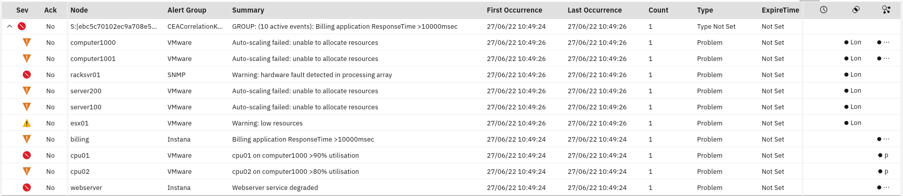

## 7.1: Overview

This module considers a second method of doing event correlation: scope-based
event grouping. Scope-based event grouping is based on a basic premise that
events occurring at the "same place", and at the "same time" are likely related.

For example, if a remote cell site has a power failure, there will likely be
alarms generated from equipment there, along with building management alarms,
and so on, in a relatively short space of time. In this case, the scope might be
the remote location, and the time window might be, say, a 10 minute window.
Another example is where there is a hardware failure in one of the servers that
contribute to the provision of a service, such as an application or website.
This failure may result in alarms being generated from the dependent parts. In
this case, the scope might be the common application or service name, and the
scope might be, say, a 5 minute window.

Scope-based grouping is provided by Watson for AIOps Event Manager so that
operations teams can input local knowledge on how events should be grouped. A UI
is provided so that scope-based event **grouping policies** can be created and
maintained.

In practice, scope-based event grouping is very powerful and yields tremendous
event reduction by virtue of grouping events, thereby effectively reducing the
number of rows presented to operators. The level of reduction achieved varies
depending on the data sets, but it is typically **upwards of 60%**. A major
north-American financial institution reported that scope-based event grouping
helped them to reduce the number of tickets they open by around 70%, by opening
tickets based on groups of events rather than individual events.

By the end of this module, you will have created two scope-based event grouping
policies, injected some test events and observed the grouping. The second
example will include overlap with a topology-based event correlation scenario in
the previous module to demonstrate so-called "super grouping".

## 7.2: Create a scope-based event grouping policy to group by Service

Log in to Watson for AIOps Event Manager and navigate to: **Netcool WebGUI**.

Navigate to: **Insights > Scope Based Grouping**

Complete the following steps to create a policy based on common application
name:

- Click on: **Create policy**
- Give the policy a name - eg: **GroupByService**
- Complete the Description field with something appropriate - eg: "Policy to
  group events by common service name"
- Leave the **Priority** field set to 1
- The default **Datasource** should already be checked
- From the **Events** section, select: **Specify conditions**
- Set **Condition 1** to: **Service** field **Is not empty**
- Set the **Action** parameter to define the scope: set it to **Service**
- Set the **Time Window** to 300 seconds (5 minutes)
- Set the **Enabled** toggle switch to **On** and **Save**.

You should end up with something like the following:



## 7.3: Inject some sample Service events

Create a new local file and call it `scope_events.sh` and paste the following
content into it:

```sh title="scope_events.sh"
#!/bin/bash

/opt/IBM/tivoli/netcool/omnibus/bin/nco_sql -server AGG_P -user root -passwd $OMNIBUS_ROOT_PWD << EOF

delete from alerts.status;
go

insert into alerts.status (Identifier, Node, Summary, Severity, Type, AlertGroup, Service) values ('db2server1clean1', 'db2server1', 'Running cleanup automation script', 2, 13, 'Syslog', 'WebService');
insert into alerts.status (Identifier, Node, Summary, Severity, Type, AlertGroup, Service) values ('db2server1clean2', 'db2server1', 'Error: unable to run cleanup automation script', 3, 1, 'Syslog', 'WebService');
insert into alerts.status (Identifier, Node, Summary, Severity, Type, AlertGroup, Service) values ('db2server1syslog', 'db2server1', '/dev/sda1 is 100% full', 5, 1, 'Syslog', 'WebService');
insert into alerts.status (Identifier, Node, Summary, Severity, Type, AlertGroup, Service) values ('db2server1db', 'db2server1', 'Database is inaccessible', 5, 1, 'ITM6', 'WebService');
insert into alerts.status (Identifier, Node, Summary, Severity, Type, AlertGroup, Service) values ('websphere01', 'websphere01', 'websphere01 unable to access transaction database', 4, 1, 'ITM6', 'WebService');
insert into alerts.status (Identifier, Node, Summary, Severity, Type, AlertGroup, Service) values ('websphere02', 'websphere02', 'websphere02 unable to access transaction database', 4, 1, 'ITM6', 'WebService');
insert into alerts.status (Identifier, Node, Summary, Severity, Type, AlertGroup, Service) values ('widgetcom', 'www.widget.com', 'www.widget.com: response time >30s', 5, 1, 'ITM6', 'WebService');

go
exit
EOF

```

Next, use the following command to copy your new script to the ObjectServer pod
and set its file permissions:

```sh
cat scope_events.sh | oc exec -i evtmanager-ncoprimary-0 -- sh -c "cat > /tmp/scope_events.sh"
```

```sh
oc exec -it evtmanager-ncoprimary-0 bash -- sh -c "chmod +x /tmp/scope_events.sh"
```

Finally, use the following commands to execute this script to generate the
example events:

```sh
oc exec -it evtmanager-ncoprimary-0 bash -- /tmp/scope_events.sh
```

:::caution Note

You can ignore the message:
`Warning: Failed to find tar in the following directories : /bin /usr/bin`

:::

You should end up with something like the following:



## 7.4: Create a scope-based event grouping policy to group by Location

Log in to Watson for AIOps Event Manager and navigate to: Netcool WebGUI.

Navigate to: **Insights > Scope Based Grouping**

Complete the following steps to create a policy based on common geographic
location:

- Click on: **Create policy**
- Give the policy a name - eg: **GroupByLocation**
- Complete the Description field with something appropriate - eg: Policy to
  group events by common location
- Leave the **Priority** field set to 1
- The default **Datasource** should already be checked
- From the **Events** section, select: **Specify conditions**
- Set **Condition 1** to: **Location** field **Is not empty**
- Set the **Action** parameter to define the scope: set it to **Location**
- Set the **Time Window** to 300 seconds (5 minutes)
- Set the **Enabled** toggle switch to **On** and **Save**

You should end up with something like the following: 

:::note

The Priority specifies the order in which the Policies will be tried. Once a
scope-based event grouping Policy matches and the scope is set for an event, all
subsequent Policies will be skipped. If two policies have the same Priority
value (as in this case), the execution order is indeterminate.

:::

## 7.5: Inject some sample Location events

Create a new local file and call it `super_group_events.sh` and paste the
following content into it:

```sh title="super_group_events.sh"
#!/bin/bash


/opt/IBM/tivoli/netcool/omnibus/bin/nco_sql -server AGG_P -user root -passwd $OMNIBUS_ROOT_PWD << EOF

insert into alerts.status (Identifier, Node, Summary, Severity, Type, AlertGroup, Location) values ('rackserver01', 'racksvr01', 'Warning: hardware fault detected in processing array', 5, 1, 'SNMP', 'London01');
insert into alerts.status (Identifier, Node, Summary, Severity, Type, AlertGroup, Location) values ('esx1', 'esx01', 'Warning: low resources', 3, 1, 'VMware', 'London01');
insert into alerts.status (Identifier, Node, Summary, Severity, Type, AlertGroup, Location) values ('computer1000esx', 'computer1000', 'Auto-scaling failed: unable to allocate resources', 4, 1, 'VMware', 'London01');
insert into alerts.status (Identifier, Node, Summary, Severity, Type, AlertGroup, Location) values ('computer1001esx', 'computer1001', 'Auto-scaling failed: unable to allocate resources', 4, 1, 'VMware', 'London01');
insert into alerts.status (Identifier, Node, Summary, Severity, Type, AlertGroup, Location) values ('server100esx', 'server100', 'Auto-scaling failed: unable to allocate resources', 4, 1, 'VMware', 'London01');
insert into alerts.status (Identifier, Node, Summary, Severity, Type, AlertGroup, Location) values ('server200esx', 'server200', 'Auto-scaling failed: unable to allocate resources', 4, 1, 'VMware', 'London01');
go

insert into alerts.status (Identifier, Node, Summary, Severity, Type, AlertGroup) values ('cpu01', 'cpu01', 'cpu01 on computer1000 >90% utilisation', 5, 1, 'VMware');
insert into alerts.status (Identifier, Node, Summary, Severity, Type, AlertGroup) values ('cpu02', 'cpu02', 'cpu02 on computer1000 >80% utilisation', 4, 1, 'VMware');
insert into alerts.status (Identifier, Node, Summary, Severity, Type, AlertGroup) values ('billing', 'billing', 'Billing application ResponseTime >10000msec', 4, 1, 'Instana');
insert into alerts.status (Identifier, Node, Summary, Severity, Type, AlertGroup) values ('webserver', 'webserver', 'Webserver service degraded', 5, 1, 'Instana');
go

exit

EOF
```

Next, use the following command to copy your new script to the ObjectServer pod
and set its file permissions:

```sh
cat super_group_events.sh | oc exec -i evtmanager-ncoprimary-0 -- sh -c "cat > /tmp/super_group_events.sh"
```

```sh
oc exec -it evtmanager-ncoprimary-0 bash -- sh -c "chmod +x /tmp/super_group_events.sh"
```

Finally, use the following commands to execute this script to generate the
example events:

```sh
oc exec -it evtmanager-ncoprimary-0 bash -- /tmp/super_group_events.sh
```

You will observe three groups of events merged together: two created by
topology-based event grouping, and one created by scope-based event grouping.

:::info

You may need to wait a few seconds and refresh the event view before the
grouping is visible.

:::

Select any event and run the tool from the Alert Viewer. You should end up with
something like the following:



You can click on the grouping buttons on the right to inspect the details of the
group. Topology-based grouping will show a preview of the topology that has
effected the grouping. Note how you have events grouped together by both
topology-based grouping and scope-based grouping in the "super group". The
events from computer1000 and computer1001 are found in both the topology-based
correlation template groups, as well as the scope-based event grouping policy.
Hence these events are members of two different group types, and so the two
groups are automatically merged together due to these common events.

You have now completed this module and are ready for the next module "Enable
optional grouping features".

[Reference Blog](https://community.ibm.com/community/user/aiops/blogs/zane-bray1/2022/06/27/getting-started-with-watson-aiops-event-manager-67)
