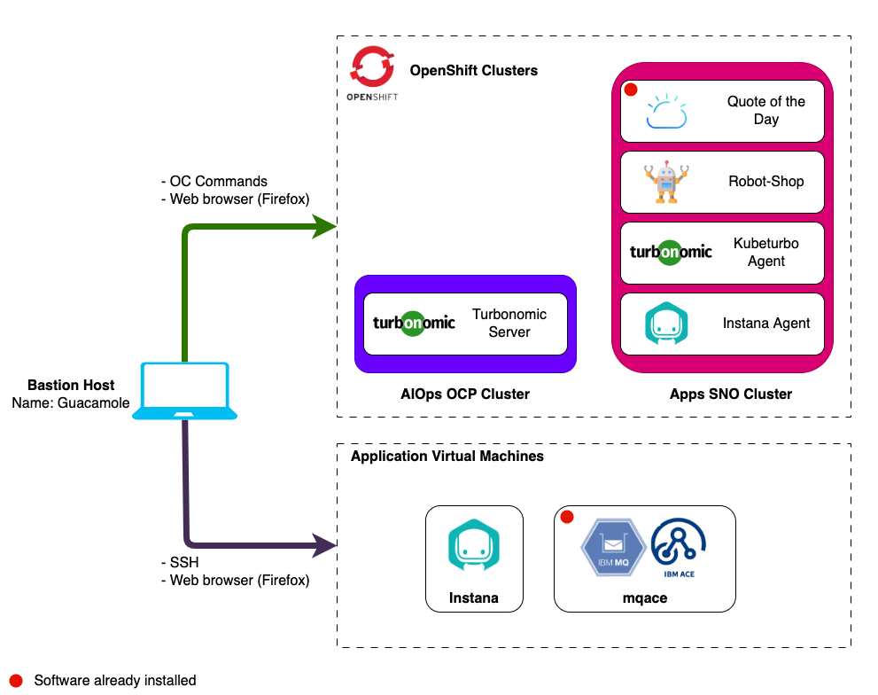
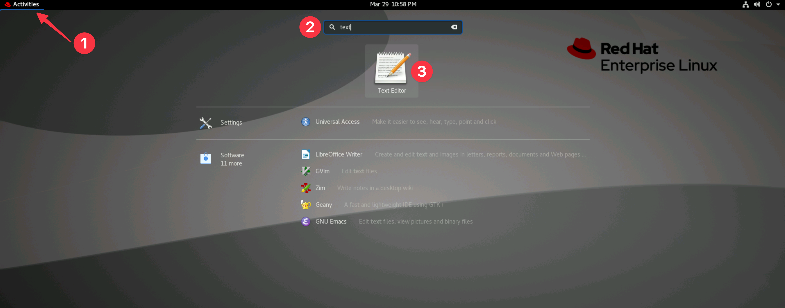
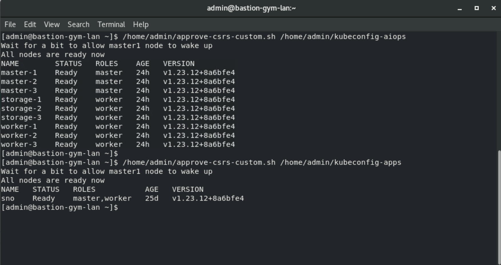
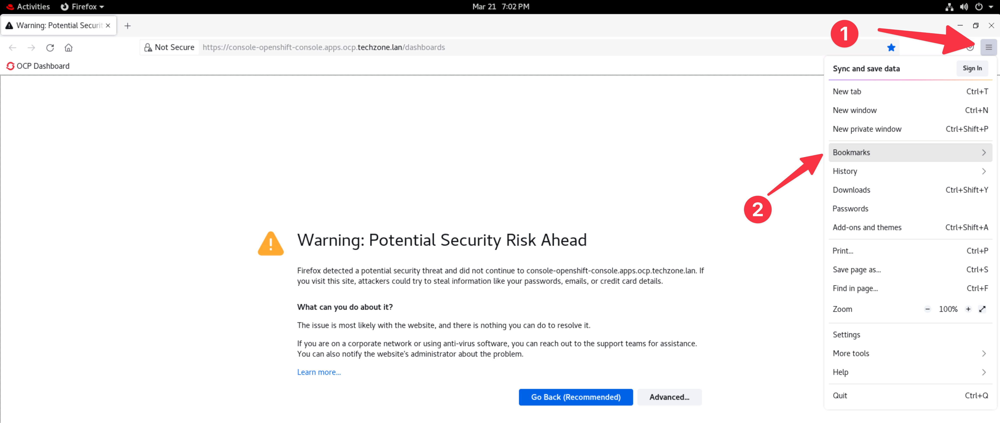
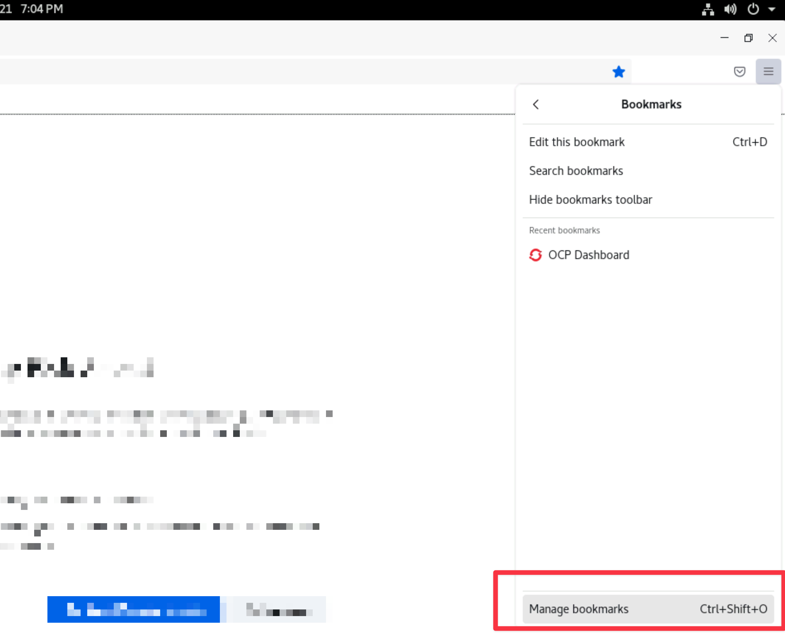
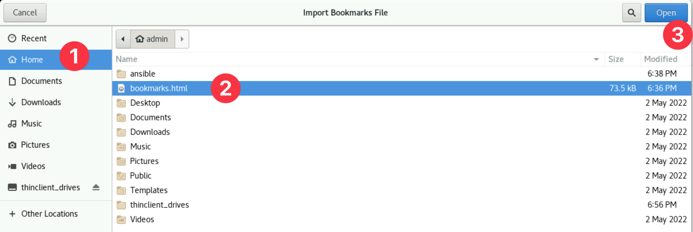
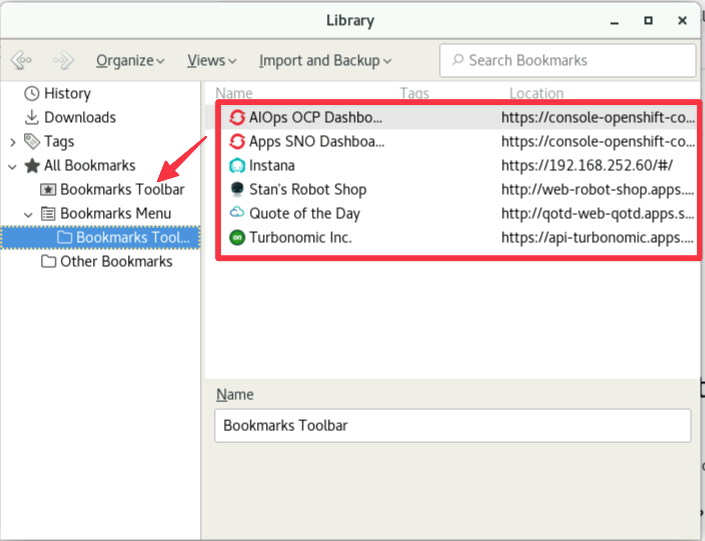
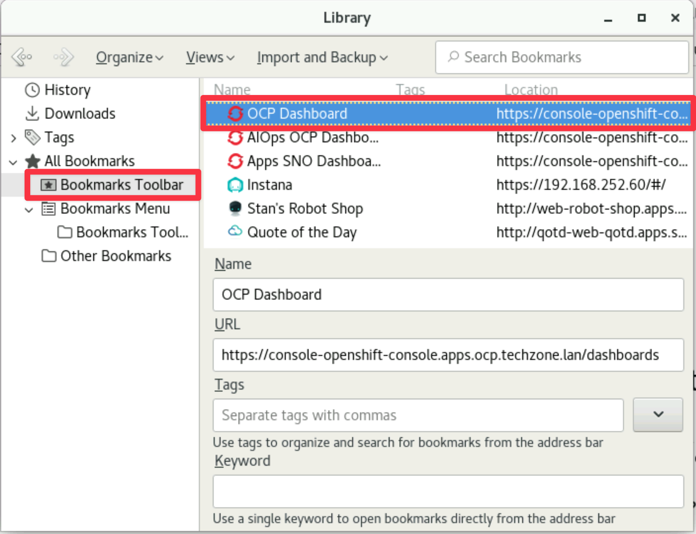
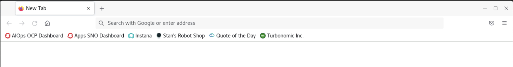

# Environmental Information

The lab environment includes 2 Openshift clusters and 3 VMs.

Openshift clusters:

1. **AIOps cluster** - A full installation of OCP that will be used to install
   Turbonomic.
2. **Apps cluster** - An instance of Single Node OpenShift that will be used to
   install the Instana and KubeTurbo agents and the sample _RobotShop_
   application. The _Quote Of The Day_ sample application has been
   pre-installed.

Virtual Machines:

1. **Guacamole VM** - A RHEL VM that will be used as the _bastion_ host into the
   lab network. Guacamole has access to all lab VM's and clusters and will be
   your primary workstation for these labs.
2. **Instana** - An Ubuntu VM that will be used to install a single node
   self-hosted Instana server.
3. **MQACE** - An Ubuntu VM that contains the pre-installed IBM ACE and MQ
   middleware.

## Lab Environment Diagram

:::note

- IBM MQ, IBM ACE and Quote of the Day have been pre-installed.
- You will install and configure all remaining components during these labs.

:::



## Important Tips

### Copy & Paste

If you are a **Windows user** be mindful that there are no new lines inserted
unintentionally when copying and pasting commands to the Terminal. If you have
this issue consider opening the lab guide within Guacamole or use the **gedit
Text Editor** to remove any extra new lines before pasting the command in the
terminal.

You can open a new **Text Editor (gedit)** document by:

1. Selecting **Activities** at the top left of the screen on the _Guacamole_
   host.
1. Entering the search term `text`
1. Selecting the **Text Editor** application



### Default Text Editor

Throughout the lab you will be required to edit kubernetes manifests. By default
you will use the **vi** editor. If you would prefer use the graphical text
editor **gedit** you can do so by:

- Setting your default kubernetes editor on the _Guacamole_ host
  (admin@bastion-gym-lan):

  ```sh
  # For the current shell
  export KUBE_EDITOR=/bin/gedit

  # More permanent change (open a new tab or window after making the change)
  echo "export KUBE_EDITOR=/bin/gedit -w" >> ~/.bashrc
  ```

## Validate cluster readiness

These lab environments are deployed on scale using automation, often just a few
hours prior to the start of a Tech Jam event.

As such, it is best to ensure that OpenShift cluster provisioning has fully
completed on your allocated lab environment:

1. On your bastion node (**Guacamole**), open a terminal session:

   

1. Paste and execute the following commands in the terminal session:

   ```sh
   /home/admin/approve-csrs-custom.sh /home/admin/kubeconfig-aiops
   /home/admin/approve-csrs-custom.sh /home/admin/kubeconfig-apps
   ```

   :::tip

   Remember to press `Enter` once the second script appears on the command line
   for it to execute as well.

   :::

   This procedure ensures your cluster nodes are ready by approving any
   outstanding certificate signing requests. Your output should be similar to:

   

## Update your clusters Global Pull Secret

Set the pull secret username and password:

:::caution

Get the `<pull-secret-user>` and `<pull-secret-pass>` from your lab proctors.

:::

```sh
export USER="<pull-secret-user>"
export PASS="<pull-secret-pass>"
```

Update the pull secret by running the following commands:

:::note

These commands use the above set variables. There is no need to edit them.

:::

```sh
oc get secret/pull-secret -n openshift-config --kubeconfig ~/kubeconfig-apps --template='{{index .data ".dockerconfigjson" | base64decode}}' > pullSecret

oc registry login --kubeconfig ~/kubeconfig-apps --registry="docker.io" --auth-basic="${USER}:${PASS}" --to=pullSecret

oc set data secret/pull-secret -n openshift-config --kubeconfig ~/kubeconfig-apps --from-file=.dockerconfigjson=pullSecret
```

## Import bookmarks on Guacamole

To make it easier to navigate to different applications a _bookmarks.html_ file
has been copied to each of the bastion hosts. Before you start the Instana lab
we recommend importing the bookmarks file by following the instruction below:

1. Open Firefox by selecting **Activites** from the top left of the _Guacamole_
   host and then selecting **Firefox** from the application menu bar.

   

1. Open the **Firefox menu** and select **Bookmarks**

   

1. Select **Manage Bookmarks** at the bottom of the menu.

   

1. Select **Import and Backup** followed by **Import Bookmarks from HTML...**

   

1. Select **Home** and open the **bookmarks.html** file.

   

1. Expand the folder **Bookmarks Menu** and drag all of the bookmarks to the
   **Bookmarks Toolbar** for easy access.

   

1. You can now select the **Bookmarks Toolbar** and delete the placeholder
   bookmark called **OCP Dashboard**.

   

1. You should now see the bookmarks available in the Firefox toolbar.

   

<!--
- [Linux and Mac Users](#linux-and-mac-users)
- [Windows Users](#windows-users)

## Linux and Mac Users

### Connect to a Server with a Private Key

1. Search for the `Terminal` app and open

2. Update your _id_rsa_ file permissions to avoid SSH permission errors

```sh
chmod 600 <path-to-key-file>/id_rsa
```

3. Access your control node using your provided SSH key:

```sh
ssh -i <path-to-your-key> <user>@<control node IP address>
```

## Windows Users

- For Windows 10 or higher, it's recommended to use
  [Windows PowerShell](#1-windows-powershell)
- For Windows users who are on lower than Windows 10, you can use
  [PuTTY](#2-putty)

### 1. Windows PowerShell

1. To open PowerShell, press `Windows+X`, and then click `Windows PowerShell`.


2. Access your control node using your provided SSH key:

```
ssh -i <path-to-your-key> <user>@<control node IP address>
```

Example:


### 2. PuTTY

Use SSH Keys with PuTTY on Windows

Requirements:

- Install PuTTY and PuTTYgen from the
  [PuTTY Download Page](https://www.chiark.greenend.org.uk/~sgtatham/putty/latest.html)
- Remote server accessible over OpenSSH

#### Use Existing Public And Private Keys

1. If you have an existing OpenSSH public and private key, copy the `id_rsa` key
   to your Windows desktop.

2. Launch `PuTTYgen` from the Windows Programs list

3. Click `Conversions` from the PuTTY Key Generator menu and select `Import key`


4. Navigate to the OpenSSH private key and click `Open`.

5. Under `Actions` -> `Save the generated key`, select `Save private key`. You
   can enter **optional** passphrase to protect the private key.


6. Save the private key to the desktop as `id_rsa.ppk`.

If the public key is already appended to the `authorized_keys` file on the
remote SSH server, then proceed to
[Connect to Server with Private Key](#connect-to-server-with-private-key).

#### Connect to Server with Private Key

1. Close the PuTTYgen tool and open `PuTTY`

2. Enter the remote server `Host Name (or IP address)` under `Session`.


3. Navigate to `Connection -> SSH -> Auth`. Click `Browse...` under
   `Authentication parameters` -> `Private key file for authentication`


4. Locate the `id_rsa.ppk` private key and click `Open`.


5. Finally, click `Open` again to log into the remote server with key pair
   authentication. -->
