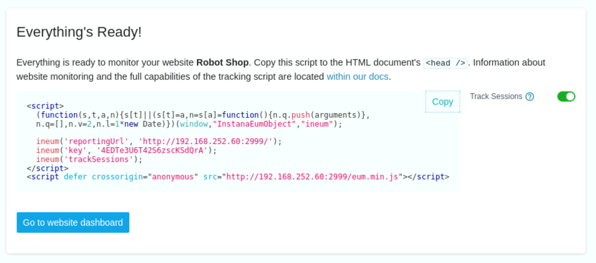
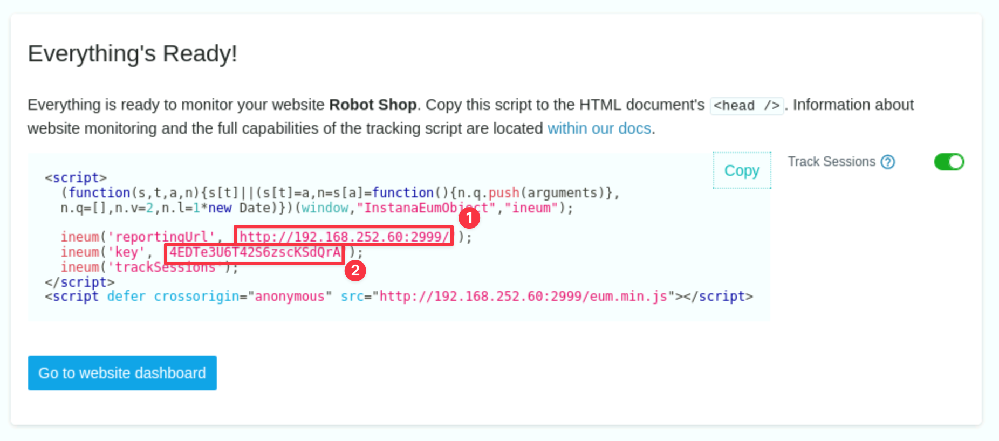

# Install the Robot Shop Application

## 3.1: Introduction

In this lab, you will learn how to install the demo application, **Robot Shop**.

Robot Shop is pre-configured with changes needed to enable Instana monitoring.
Some technologies such as java don't require any configuration, but others
require configuration changes so the application can be monitored.

During the install, you will also specify the required information that is
necessary for Instana to monitor the End User Experience (EUM) / Real User
Monitoring (RUM) data.

---

:::tip

If you are unsure how to get access to the Bastion host (Guacamole) see
[Accessing a Lab Environment](/waiops-tech-jam/labs/jam-in-a-box/#accessing-a-lab-environment)

:::

From the Bastion host open the Firefox browser and select the **Instana**
bookmark.


:::info

You can safely ignore the warning about the certificate being untrusted.


:::

When prompted, enter the username and password that you updated earlier.

- Username: **admin@instana.local**
- Password: **Passw0rd**


## 3.2: Create the Website in Instana

If you want to capture EUM/RUM data within Instana, you must first create a
website within the GUI (or via API). Open the Instana GUI within your browser.

On left side navigation, select **Websites & Mobile Apps**. You'll see a dialog
where you can enter a Website Name. Enter `Robot Shop` as the website name.
Then, click the **Add Website** button.


A dialog containing **javascript** will open. In a more typical application, you
would follow the instructions on the dialog. You copy/paste the **javascript**
into the HTML pages.



Robot Shop has already done some of the work for you by embedding this script
with variable placeholders for the unique values into the application. When you
deploy the application, you can pass parameters into the helm install to
populate the unique variables. There are two parameters within the javascript
that we will need to copy and use when we do the install. You will need the
**key** and the **reportingURL**. Either copy those parameters now or leave this
dialog open so that you can retrieve it later.



---

## 3.3: Install Robot Shop

We will install Robot Shop on the **Apps Single Node OpenShift** cluster.


The full installation instructions for **Robot Shop** can be found
[here](https://github.com/instana/robot-shop). You'll notice that there are
instructions for installing **Robot Shop** into a number of different
environments including docker, kubernetes, and OpenShift. This lab uses an
OpenShift environment, so we'll be following those steps.

We have documented the steps below, so there is no need to refer to the GitHub
instructions.

:::info Important

The following should be run from the bastion host (**admin@bastion-gym-lan**).
Check to make sure you are in the right place by running the following:

```sh
cd ~ && oc cluster-info --kubeconfig kubeconfig-apps
```

You should see the following output, specifically the url
`https:api.sno.techzone.lan:6443`. If you don't try opening a new tab or
terminal window and trying again.


::: Clone the GitHub repository by typing:

```sh
cd ~ && git clone https://github.com/instana/robot-shop.git
```

change directory into the **robot-shop/K8s** directory

```sh
cd robot-shop/K8s
```

Create an OpenShift **project (workspace)** for the **Robot Shop** application
by issuing the following command:

```sh
oc adm new-project robot-shop --kubeconfig ~/kubeconfig-apps
```

Next, setup **privileges** within the cluster for the **Robot Shop** application
by issuing the following two commands:

```sh
oc adm policy add-scc-to-user anyuid -z default -n robot-shop --kubeconfig ~/kubeconfig-apps
oc adm policy add-scc-to-user privileged -z default -n robot-shop --kubeconfig ~/kubeconfig-apps
```

Install the **Robot Shop** using Helm:

1. Set your reporting URL by making the substitution below and running the
   command.

:::info

- **<your-instana-reporting-url\>** is the _reportingURL_ you obtained in
  section 4.2. **Do not include the trailing slash ( / ) following 2999.**
  Example: `http://192.168.252.60:2999`.

:::

```sh
export REPORTING_URL="<your-instana-reporting-url>"
```

1. Set your key value by making the substitution below and running the command.

:::info

**<your-instana-key\>** is the **key** you obtained in section 4.2 from the
Instana user interface. Example: `m-IMxZYFQyW_n7Xo0VRjrw`.

:::

```sh
export EUM_KEY="<your-instana-key>"
```

1. Deploy the Robot Shop application with the following Helm command:

   ```sh
   helm install robot-shop \
   --set openshift=true \
   --set eum.key=${EUM_KEY} \
   --set eum.url=${REPORTING_URL} \
   -n robot-shop helm \
   --kubeconfig ~/kubeconfig-apps
   ```

If successful, you should see the results similar to what's shown below.


Check the status of the Robot Shop deployment by watching the pods:

:::note

Type `Ctrl-C` to exit the watch loop.

:::

```sh
oc get pods -n robot-shop -w --kubeconfig ~/kubeconfig-apps
```

If the install was successful, you'll see the following pods running.

:::info

If some of the pods (for example _ratings_ or _shipping_) show **0/1** instead
of **1/1** in the READY column or the pods aren't yet in a **Running** state you
may need to wait a little longer. It can **take as much as 15 minutes** before
all of the pods are running. If you don't want to wait, you can exit the watch
and proceed to the next steps.

:::


Finally, if you want to bring up the Robot Shop user interface, you need to
expose the service as a route. Issue the following command:

```sh
oc expose service web -n robot-shop --kubeconfig ~/kubeconfig-apps
```

The route to the application has already been saved to a bookmark called **Robot
Shop**. Alternatively you can issue the **oc get route** command to get the
route to the application

```sh
oc get route -n robot-shop --kubeconfig ~/kubeconfig-apps
```

The result should look similar to: **web-robot-shop.<cluster domain\>**


Once all pods are in a running state, open a new Firefox tab and select the
**Robot Shop** bookmark, or if pasting the route into firefox make sure you
specify http instead of https. You will see the Robot Shop application.


---

## 3.4: Setup Automated Load

Now that the application is running, you will want to generate some traffic
against the Robot-Shop application.

Issue the following command to install the load generation pod.

```sh
cat <<EOF | oc create --kubeconfig ~/kubeconfig-apps -f -
apiVersion: apps/v1
kind: Deployment
metadata:
  name: rs-website-load
  namespace: robot-shop
  labels:
    service: rs-website-load
spec:
  replicas: 1
  selector:
    matchLabels:
      service: rs-website-load
  template:
    metadata:
      labels:
        service: rs-website-load
    spec:
      containers:
      - name: rs-website-load
        env:
          - name: HOST
            value: "http://web:8080/"
        image: brightzheng100/rs-website-load:latest
EOF
```

Run the **oc get pods** command.

```sh
oc get pods -n robot-shop --kubeconfig ~/kubeconfig-apps
```

You should now see an additional pod named **rs-website-load-\*** running within
the project.

Navigate to **Websites & Mobile Apps** and select the the **Robot Shop**
application you just created. After a few minutes you should begin to see
traffic in the Robot Shop dashboard.

:::tip

You can change the filter at the top right of the page to **Live** and **Last
minute** to see the traffic in real time.

:::


<!---
The below is only required for the bundled robot-shop loadgen

Now that the application is running, you will want to generate some traffic
against the application.

Within the same directory, issue the following command to install the load
generation pod.

```sh
cd /home/admin/robot-shop/K8s
oc apply -f load-deployment.yaml -n robot-shop --kubeconfig ~/kubeconfig-apps
```

Run the **oc get pods** command. You should see an additional pod named **load**
running within the project.

```sh
oc get pods -n robot-shop --kubeconfig ~/kubeconfig-apps
```


-->

---

## 3.5: Summary

In this section, you learned how to install an application that includes
monitoring and configure it for Website EUM/RUM monitoring.

Now you can proceed to the next section of the lab where you will configure the
monitoring for IBM MQ and IBM App Connect Enterprise (ACE).

---
