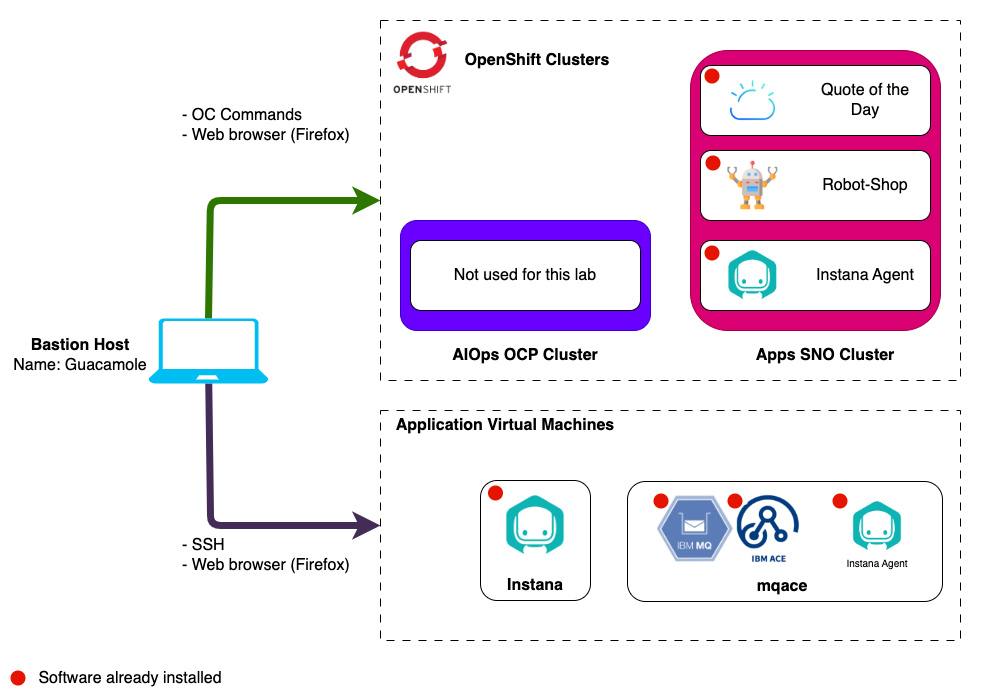

# Lab Environment

The lab environment includes 2 Openshift clusters and 3 VMs.

Openshift clusters:

1. **AIOps OCP Cluster** - Not required for this lab.
2. **Apps SNO Cluster** - An instance of Single Node OpenShift where demo
   applications (Robot Shop & Quote of the Day) have been pre-installed for you
   to begin looking at monitoring applications with Instana. Quote of the Day
   has also been integrated with IBM MQ and ACE running on the mqace VM to
   demonstrate further the Instana Servers monitoring capabilities.

Virtual Machines:

1. **Guacamole VM** - A RHEL VM that will be used as the _bastion_ host into the
   lab network. Guacamole has access to all lab VM's and clusters and will be
   your primary workstation for these labs.
2. **Instana** - An Ubuntu VM with an instance of Instana Server and Instana
   Agent running running in Docker.
3. **MQACE** - An Ubuntu VM that contains the pre-installed IBM ACE and MQ
   middleware.

## Prerequisites

To complete this lab you will need:

- Instana Agent Key - Required when requesting lab environment
- Instana Sales Key - Required when requesting lab environment

## Requesting a Lab Environment

:::info

You can follow
[these instructions](/waiops-tech-jam/labs/jam-in-a-box/#requesting-a-lab-environment)
if you need guidance on how to request a lab.

:::

For this lab we will be using the
[Jam-in-a-Box: Instana - Explore](https://techzone.ibm.com/my/reservations/create/649cd4fc83ea18001751782c)
collection.
