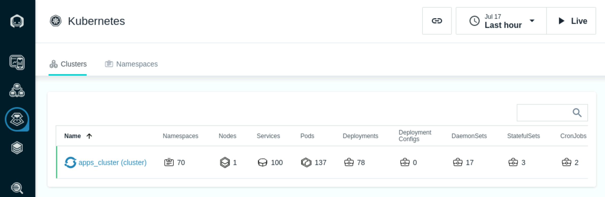

# Explore Instana

Follow this tutorial to explore some key Instana capabilities including:

- Monitoring of Kubernetes
- Monitoring of applications
- Monitoring of infrastructure

From the Bastion host open the Firefox browser and select the **Instana**
bookmark.

:::tip

If you are unsure how to get access to the Bastion host (Guacamole) see
[Accessing a Lab Environment](/waiops-tech-jam/labs/jam-in-a-box/#accessing-a-lab-environment)

:::

:::info

You can safely ignore the warning about the certificate being untrusted.

:::

When prompted, enter the username and password that you updated earlier.

- Username: **admin@instana.local**
- Password: **Passw0rd**

## 3.1: Explore Kubernetes

Open the browser tab for the Instana user interface.

On the left navigation, select **Platforms** and then **Kubernetes**

When you select **Platforms** in the classroom environment, you will only see
**kubernetes** and **Cloud Foundry**. But, there are additional **feature
flags** that can be enabled to add in other technologies like **VMware**,
**Power HMC**, and **Z HMC**. You saw the **feature flags** for those
technologies when you performed the Instana server installation.

You will see a list of Kubernetes clusters. In this environment there is only
the SNO cluster named **apps_cluster** that we installed the OCP Instana Agent
onto in an earlier lab.

Click the cluster name to open the dashboard.

You should see a screen similar to the one below where you can see overall
utilization of the Kubernetes cluster.

Select some of the other tabs to explore the Kubernetes monitoring. We recommend
you look at the **Events**, **Nodes**, and **Pods** tabs. When you select the
pods tab, you will see a list of all pods running within the cluster.

In the upper right corner of the **Pods** tab, add `qotd` into the search
widget. You'll notice that it will filter the list to the pods related to the
Quote of the Day application.

Click on one of the links on the left side and drill into the pod utilization
details.

---

## 3.2: Explore the Infrastructure View

Next, explore the Infrastructure view. To do this, click on the
**"Infrastructure"** icon on the left side.

You'll notice that there is a box surrounding the **"towers"** with the zone
names that you specified. The box is a **"zone"**. In previous labs a zone name
was specified during the install of the Instana Agent or added to the Instana
Agent configuration file. The towers contained within the zones represents the
OpenShift SNO cluster named Apps, the Instana server, and the virtual machine
running ACE and MQ.

:::note

If you cannot see 3 zones with a host in each then one of the Agents is not
connecting properly. If you see a host show up in the _'Undefined Zone'_, it
means that a zone name has not been specified in the Agent configuration.

:::

In a large environment, it can be difficult to find the server or zone that you
are looking for. Fortunately, there are a number of ways that you can search for
things within the Infrastructure view.

In the bottom right corner, click on some of the icons and explore different
ways of organizing and filtering the Infrastructure view.

Or, you can use the lucene query language in the filter/search bar at the top of
the page. Before beginning the search, flyover one of the towers and identify
the hostname of one of the servers. For example _mqace_

- Click in the filter bar and select **"Entity"**
- A list will popup. Start typing **host** and you will see the list filtered to
  "host". Once you see the single entry, select **host**.
- Once you have select "Host", another list will popup. Select **name**.
- Now, you will see **"entity.host.name:"**. After the ":", you can do a
  wildcard search. For example **"entity.host.name:\*abc\*"**. Type in a
  wildcard string that matches the beginning of the hostname you found earlier.
  In my example, I could specify **"entity.host.name:\*mqace\*"** to filter on
  the MQ/ACE server.

One you have specified the filter, you'll see that the infrastructure view is
filtered to just a single server that matches your search.

There are many other types of queries that can be executed using the
filter/search bar. For example, you can specify AND, OR, and NOT conditions. You
can find detailed information on the lucene query language in the product
documentation found here:
[lucene query language](https://www.ibm.com/docs/en/instana-observability/current?topic=instana-filtering-dynamic-focus)

Clear the filter at the top of the page by clicking on the **X**

Next, flyover the tower that represents the Instana server. This tower is taller
because there are more discovered entities running on it.

You'll notice that a number of components were automatically discovered and are
instrumented for monitoring.

Next, flyover the ACE/MQ tower.

This is the ACE and MQ server. You can see the MQ and ACE components along with
a discovered JVM, and more.

Next, click on the **"Comparison Table"** near the top of the page.

This table shows a sortable and searchable list of the Hosts that make up this
environment. You can quickly find hosts consuming high CPU, high memory, or have
poor health.

In addition, if you select where is says **"Hosts"**, there is a dropdown list
that allows you to see lists of JVMs, containers, etc.

Change from **"Hosts"** to **"Docker Containers"** in the dropdown list and
you'll see a complete list of containers and their utilization and health.

Switch back to the Map view by clicking on **"Map"** near the upper left corner.

Zoom in with the plus sign in the bottom right corner.

You'll notice that each tower is actually comprised of multiple pizza boxes.
Each one represents an **"Entity"** such as an MQ Queue Manager or an ACE
Integration Node.

Flyover the ACE/MQ server again until you see a list of all discovered Entities.
If you only see 1 entity, move your mouse to one of the corners of the tower.
Once you see all of the entities, click your mouse. You'll see a dialog open

Use the scroll bar to scroll down. You'll notice that you see each of the types
of Entities that were discovered. Expand the MQ entity type and you'll see the
Queue Manager that was discovered.

It is possible to click on either the "Open Dashboard" button or the links for
the individual entities. If you clicked, you could navigate to either the Host
operating system metrics or the specific middleware entity.

Click on the **Open Dashboard** button and we'll examine the Host Agent
dashboard.

After you click on the button you'll see a screen that looks like this:

You can see fine grained metric data for the Host operating system. Most metrics
are gathered at 1 second granularity. This can be very valuable in diagnosing
problems. To see the 1 second metric data, let's shorten the time interval on
the screen. Click on the **time range** dropdown in the upper right corner and
select **last minute**. This will filter the data to the last minute of metric
data.

Now, click the **Live** button in the upper right corner. This will show you
**Live** data as it is streaming into the Instana server in near-realtime.

After examining the data, click the **time range** dropdown and select **Last
Hour** to look at a more typical view within Instana.

Scroll down and explore the other metrics on the page.

As you scroll down the page, you'll notice a section on the left side of the
screen that contains a list of Entity types that were discovered. This is the
same list that you saw earlier on the Infrastructure view. By placing these
links in context and leveraging the relationships that are discovered by
Instana, it makes it easier to diagnose problems.

Expand the IBM MQ Queue Manager section and select the link for the
**QM1@mqace** queue manager

You will navigate to the dashboard for the MQ Queue Manager. Scroll down the
page and examine the metrics. There are many tables that contain links that
would allow you to drill into the listener, topics, queues, channels, and more.
Let's focus on the Channels. Scroll down to the table labeled **"Channels"**.

Click on the blue text on the left to drill into the Channel. Examine the
Channel metrics on the page.

Next, look at the top of the screen. You'll notice that this is a breadcrumb
that allows you to navigate back to where you were earlier in your navigation.
It is also possible to use the back button in your browser.

If time permits at the end of the lab, you can explore some of the other
elements within the MQ sensor or other middleware such as ACE.

---

## 3.3: Create an Application Perspective for Robot Shop

Before we can investigate Applications within Instana, we need to create an
**Application Perspective**. This section describes how to define the
**Application Perspective**.

**Application Perspectives** allow you to group together a number of different
services and endpoints into dashboard that shows the health and performance of a
business application. In this section, you will create and **Application
Perspective** for the **Robot Shop** application.

On the left hand navigation, select **"Applications"**. You will see a screen
open up that contains a list of all applications that are defined in the
environment. Initially, this list maybe almost empty showing just **All
Services** generic bucket.

The next thing you are going to do is define an application. You will see an
**"Add"** button in the bottom right corner.

Click the **"Add"** button

A dialog will open with two options (one if Smart Alerts feature is not enabled
yet on your server). We'll examine the "Global Smart Alerts" in the
Administrative section of this lab. For now, click on the **"New Application
Perspective"** button

**Switch to the Advanced Mode** in the upper right corner. Complete the
definition to look like below.

First, give the Application Perspective the name `Robot Shop`.

Add a filter, type in **kubernetes** and then select **namespace**. Then, click
in the **value** field. You'll notice that when you click on it, the field is
pre-populated with kubernetes namespaces that have applications being monitored.
Select the **robot-shop** namespace.

Next select **All downstream services**. This selection will allow the
application perspective to limit the scope to all transactions within the
_robot-shop_ kubernetes namespace.

Scroll down further in the dialog and select to include **All Calls**.

Finally, click the **Create** button to create the application perspective.

---

## 3.4: Create an Application Perspective for QOTD

We can now repeat a similar process to the previous section to configure an
**Application Perspective** for the **Quote of the Day** application.

On the left hand navigation, select **"Applications"**.

Click the **"Add"** button in the bottom right corner.

A dialog will open with two options (one if Smart Alerts feature is not enabled
yet on your server). We'll examine the "Global Smart Alerts" in the
Administrative section of this lab. For now, click on the **"New Application
Perspective"** button

**Swich to the Advanced Mode** in the upper right corner. Then complete the
definition to look like below.

As you add filters, you'll notice that Instana automatically populates the
fields like the service name. As you add filters, notice that you need to add a
combination of **AND** and **OR** conditions to achieve the results that you
want.

:::note

Pay close attention to the filters. The last filter is a **not equal** filter.

:::

What this Application Perspective is doing is the following:

- We are including the MQ Service by matching any service that contains the
  Queue Manager Name of QM1.
- We're including any service that includes the name of our ACE Integration
  Server named BK1.
- We're including any transactions that are in the **qotd** kubernetes
  **namespace** where the Quote of the Day application is installed. Using
  namespaces makes it very easy to build **Application Perspectives** for cloud
  native applications.
- Finally we added a filter to **filter OUT** any trace that has an endpoint
  name of **GET /health**. The **GET /health** requests are the readiness probes
  (heartbeating) that happens within kubernetes to ensure the pods are healthy.
  These transactions are not part of the application, so we want to exclude
  them.

:::note

If the lab environments are slow and the service names, kubernetes namespace,
and endpoint name may not be available yet. For example, if you start typing
kubernetes and can't find it, you can use an alternative method of defining the
application. Add a filter with Service->Name contains **qotd** as shown below

:::

You have now created an Application Perspective. In the next section, you'll
explore the application (it can take few minutes before the data for application
is populated).

---

## 3.5: Explore the Application

After creating the application, your screen should have automatically changed
context to show the Application Perspective that you just defined.

Initially, you probably won't see any metrics on the screen. In the upper right
corner, click the **"Live"** button and within a short amount of time you should
start to see metrics in the widgets.

On this page you can see the golden signals which include **transaction
volumes**, the **number of erroneous calls**, and **latency**. You'll also see
the top services that make up the application.

You'll notice a number of tabs across the top of the screen. Explore these tabs.
In particular, let's take a look at the **"Dependencies"** tab.

Click on the **Dependencies** tab.

On the dependencies tab, you'll see a full topology of the application services.
This topology is discovered automatically. You can see transactions flowing
between the different nodes in the topology. Most of these services are node.js
based cloud-native services. There should be also be a node with a name that
ends in **BK1:EG2**. BK1 is the ACE Integration Node and EG2 is the ACE
Integration Server. The QM1 node in the topology is the MQ Queue Manager named
**"QM1"**.

Fly your mouse over the **QM1** node. Flying over any node in the dependency
graph will show you a summary of the traces going through that service. You'll
see the percentage of calls that are erroneous and the latency of the calls.

Click on the **"QM1"** node. Notice that there are 3 options that would allow
you to navigate to the MQ dashboard, the transaction Flow within MQ, or analyze
the transaction calls through MQ. For now, we'll skip this navigation, but we
suggest you explore those options later.

Click on **"Upstream/Downsteam"** near the top of the page. This will allow you
to see a list of Upstream and Downstream services for the application.

Click on **"Stack"** where you can view the Application, Kubernetes, and
Infrastructure stack that makes up the application.

All of this contextual and relationship data helps you analyze and debug you
applications to get to root cause as quickly as possible. In addition, Instana's
built analytics uses this data to automatically group multiple related
**"Events"** into a single **"Incident"** for diagnosis.

Close the **Stack** dialog by either clicking on the **Stack** button or
somewhere else on the background of the Instana GUI.

:::note

There are a few other tabs on this screen that you can explore on your own.

:::

Click on the **Services tab**

You will see a list of services that make up the application.

Scroll down on the page until you see the **"qotd-engraving"** service.

Click on the **qotd-engraving** link on the left Column. The qotd-engraving
service is the service that calls and ACE flow and then puts a message on the MQ
queue. We want to explore this service in more detail.

You should see a page showing the transactional data filtered down to just the
qotd-engraving service.

Click on the **"Analyze Calls"** button to analyze the individual transactions
that are executing within the **"qotd-engraving"** service.

This will take you to a screen showing all of the different types of calls
taking place within the qotd-engraving service. At the top, there is a summary
of all calls in terms of transaction rates, return codes, erroneous calls, and
latency.

On the right side, click the arrow to expand the list of qotd-engraving **"POST
/order"** calls. Instana is capturing 100% of the transactions so that you don't
miss intermittent problems that might be occurring in the environment.

Select one of the requests

You are now looking at the tracing data for a single transaction. At the top of
the screen, you will see a summary of the latency, sub-calls and timeline. On
the right side of the screen, you'll see the details and stack trace.

Scroll down and you will see the service endpoint list

Finally, scroll to the bottom of the screen and you will see a detailed call
stack **Calls**. The call stack gives you the timing and sequence of the call
going through the application.

:::note

If errors were captured in the logs, they would be shown at the bottom of the
screen, below the call stack.

:::

If you select the text on the left or the timeline bar, the **"Details & Stack
Trace"** context to the right of the page will change.

Explore the different types of calls going through this transaction by selecting
the individual call. When you select an entry, examine the detailed information
on the right.

You should notice that different request types are color coded differently. Blue
represents the HTTP requests going through an App Server or java process. Orange
represents a database call. And green represents a messaging call (ACE and MQ).

When you select the Node.js App Server requests, you'll see the **StackTrace**
on the right hand side. Within the **StackTrace**, click one of the URLs.

When you click on the link, Instana will decompile the code and show you the
lines of code. The exact line of code that is executing will be highlighted in
yellow.

Click the **X** in the upper right corner to close the dialog.

When you select the ACE portions of the call Stack (gen.supplychain,
msgFlowTransaction, and postOrder) you will see key information including the
flow name, Integration Node, Integration Server, IP address, and more on the
right side of the screen.

When you select the MQ portion of the call stack, you'll see key information
related to the MQ environment on the right. The information includes the Queue
Manager, Queue Name, and the message ID that was posted on the queue.

Scroll down to the very bottom on the right side of the screen and you will see
a link named **"CP4I.DEMO.API.Q"**. Click on the **"CP4I.DEMO.API.Q"** link and
you will navigate to the Queue page of the MQ sensor for the CP4I.DEMO.API.Q
queue. Instana places these links in context to make it easier to diagnose
problems.

Earlier, you explored the Queue Manager and the MQ Channels. You're now looking
at the queue that is being used by this application. You'll notice key
information like the oldest message on the queue, queue depth, input/output
rates, and more.

---

## 3.6: Websites and Mobile App Monitoring

:::note

When you installed Robot Shop you also installed a load generator. The load
generator is a bot accessing the Robot Shop web application and mimics real
users so that you can see metrics collected by Instana.

:::

Next, let's take a look at **Website** and **Mobile Application** Monitoring. In
this environment, Instana does not include any native mobile applications,
however you should know that Instana can gather End User Monitoring (EUM) data
from Mobile Applications too. For now, we'll investigate the website monitoring.

Using the left side navigation, select **Websites & Mobile Apps**

You will see a list of websites that are being monitored. In this environment,
you'll see the **Robot Shop** application website. Click on the blue link for
the **Robot Shop** website to drill down for more details.

Explore the additional data available within the website monitoring by clicking
on some of the other tabs.

Next, explore the **Filters** that you see at the top of the screen.

In this environment, the filters will not be very interesting because there is
only automated workload coming from a single location. But, usually, you can use
this information to filter the web traffic down to specific browser types, OS's,
geographic locations and key metadata tags. This can be very useful in
identifying whether specific network locations, browser, or OS's are having
performance problems. If you want to see typical EUM data, you can look at one
of the IBM sales or Business Partner demo environments.

At the top of the screen, click on the **Analyze Page Loads** button

You will see a detailed list of the web requests grouped by URL path.

Select the **Group** icon next to one of the URL paths (robot-shop only has
one). This will give you a page that is filtered to the transactions for just
that single URL path. As with Tracing, Instana is capturing 100% of the web
transactions.

Next, select one of the requests.

You will see a detailed page showing the EUM data and more. At the top of the
page, you'll notice that you can see the user that made the request. This
sensitive data can be omitted by Instana if the customer desires. You'll also
see the Browser version and operating system that was used to access the web
page. Depending on the environment, you'll also see geolocation data for where
the person accessed the application. In some cases the private IP addresses are
not mapped and the **User Location** data will be empty.

Scroll down on the page and you'll see a detailed breakdown of the request
including timings for the key page content.

Expand one of the entries on the right by clicking the down arrow to view more
details.

We are not going to do it for this lab, but if you click on the **View Backend
Trace** button, you can investigate the backend trace data that you saw earlier
in the lab.

---

Next, we're going to investigate Instana's unbounded analytics. Navigate to the
**Analytics** using the left side navigation.

Initially, you will see a screen showing 100% of the **Application Calls** that
are happening in the environment.

Select the dropdown at the top of the page labeled **Applications / Calls** to
view other options. For example, you could analyze the traces, websites, mobile
applications, or profiles. For now, close the dialog and we'll analyze the
**Application Calls**

One of the key Instana capabilities is **Unbounded Analytics**. This allows you
to apply ad-hoc queries to easily find the data you are looking for. On the
screen, you'll see a couple of different ways that you can query/filter the
metrics.

One the left side, you'll see a number of about of the box filters. Expand the
dropdown arrows to see the options. Then, select one of the checkboxes to filter
the data.

Now, uncheck the checkbox to remove the filter.

Another option is to use the **filter** and **group** options at the top of the
page. Let's try out an example. Let's say you want to find the slowest SQL
statements in the environment. Let's try to implement a **filter** and **group**
to accomplish that.

Select the **Add Filter** button at the top of the page. Then, select **Call
Type** and select **Database**

This will filter the calls to just the database calls. But, the calls are not
organized in a meaningful way. So, let's use the **group** option to group the
statements.

Click on the **Add Group** button. Then, type **database** in the filter box and
select **Statement**

This will group all of the Database statements by unique SQL statements. You can
then take these statements and sort them by latency, erroneous calls, etc.

:::note

You also have the option **select metrics** to choose the metrics that you want
to see on the screen. For example, change latency from Average to 95th
percentile.

:::

---

Now, let's explore one more key capability within Instana.

In the upper right corner of the screen, there is an icon of a chain link. Click
on the **link** and a dialog will open. By clicking the **Copy** button, you can
send a link to a team member. When they open the link, it will take them to a
screen with the exact same context that you are looking at. This can be very
valuable when collaborating with team members to diagnose a problem. Within the
dialog, you'll see that there is a checkbox to **Lock current time range**. By
locking the current time range, when the link it opened, it will take the person
to a view with the exact same time range that you are looking at. Otherwise,
they are taken to the most recent time range.

That completes the Explore section of the lab.

---

## 3.7: Summary

In this exercise lab have explored some of the key capabilities within Instana.
You explored Kubernetes monitoring and the Infrastructure view. You also created
two Application Perspectives for two different demo applications. You learned
about website monitoring and the different types of End User Monitoring data
that Instana can collect. Finally, you reviewed Instana unbounded analytics
capabilities.

---
