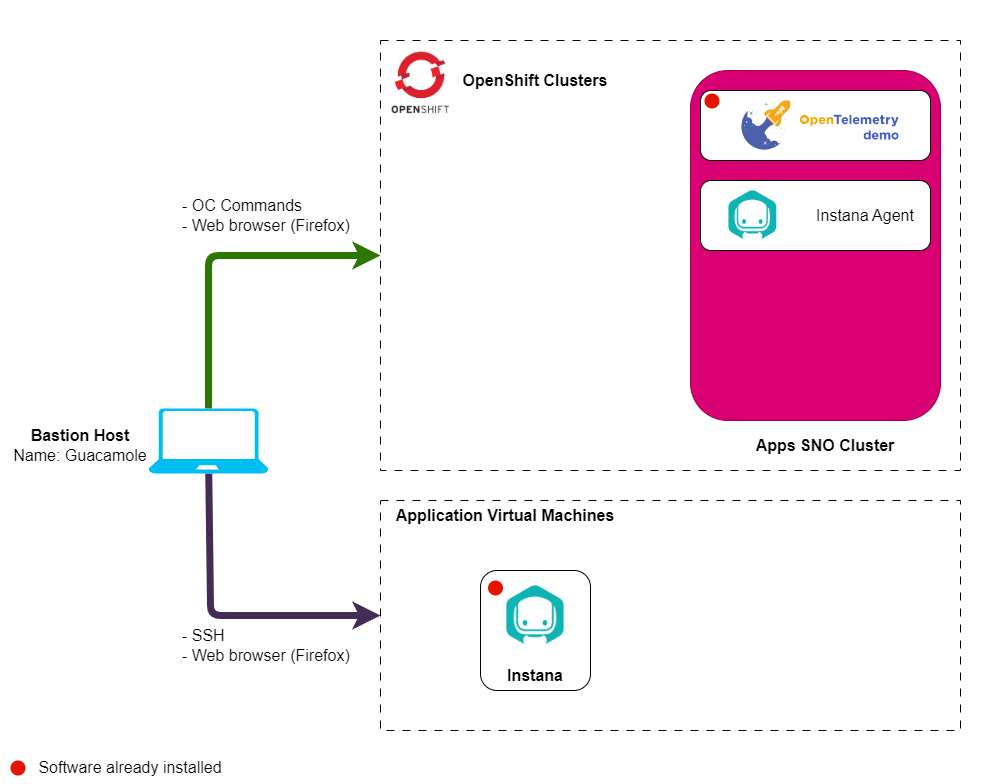

# Lab Environment

The lab environment includes Openshift cluster with Instana.

Openshift clusters:

1. **Instana cluster** - An instance of Single Node OpenShift cluster that will
   be used to install the Instana agent. The OpenTelemetry Demo Application and Instana backend will be pre-installed

:::note

- IBM Instana cluster have been pre-installed.
- OpenTelemetry Demo Application have been pre-installed.
- You will adjust configuration of the OpenTelemetry Demo Application and enable OpenTelemetry for Instana agent during the lab.

:::

## Prerequisites

To complete this lab you will need:

- Instana Download Key - Entered when requesting lab environment
- Sales Key - Entered when requesting lab environment

## Requesting a Lab Environment

:::caution
The Self Service Tech Zone lab environment for this lab is not currently available.
:::

For this lab we will be using the
[Jam-in-a-Box: Instana - Explore](https://techzone.ibm.com/my/reservations/create/64b8b2e0a06bca0017539c00)
collection.

:::info

You can follow
[these instructions](/waiops-tech-jam/labs/jam-in-a-box/#requesting-a-lab-environment)
if you need guidance on how to request a lab.

:::
