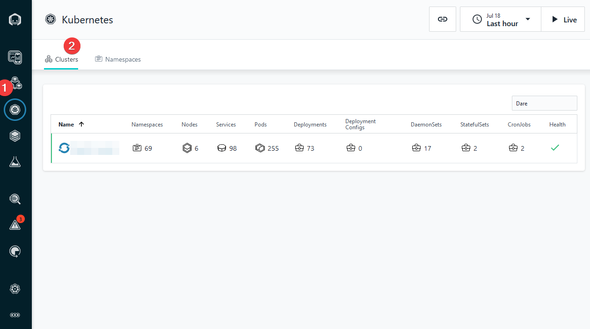

## Instana agent installation
In this section you will install Instana Agent to monitor your OCP cluster.

## Helm chart 

Log in to your Instana UI, click on "Deploy agent" link as described on the below picture


Select OpenShift and choose Helm installation option. Copy the helm chart installation script.


Go back to your ssh console, paste the copied helm chart installation script and hit enter

```bash
helm install instana-agent \
   --repo https://agents.instana.io/helm \
   --namespace instana-agent \
   --create-namespace \
   --set openshift=true \
   --set agent.key=xxx \
   --set agent.downloadKey=xxxx \
   --set agent.endpointHost=xxx \
   --set agent.endpointPort=443 \
   --set cluster.name='YourClusterName' \
   --set zone.name='YourZoneName' \
   instana-agent
```

Make sure the installation was done by checking the below command output

```sh
oc project instana-agent
Now using project "instana-agent" on server "https://xxx:6443".

oc get pods
NAME                        READY   STATUS    RESTARTS   AGE
instana-agent-xxx           1/1     Running   0          27h
instana-agent-xxx           1/1     Running   0          27h
instana-agent-xxx           1/1     Running   0          27h
k8sensor-xxx-6rddc          1/1     Running   0          3d
k8sensor-xxx-btll6          1/1     Running   0          3d
k8sensor-xxx-qvn2s          1/1     Running   0          3d
```


## Verify OpenShift monitoring

Go to your Instana UI, click on "Kubernetes" left side menu. Ensure you are getting the metrics from your cluster.

