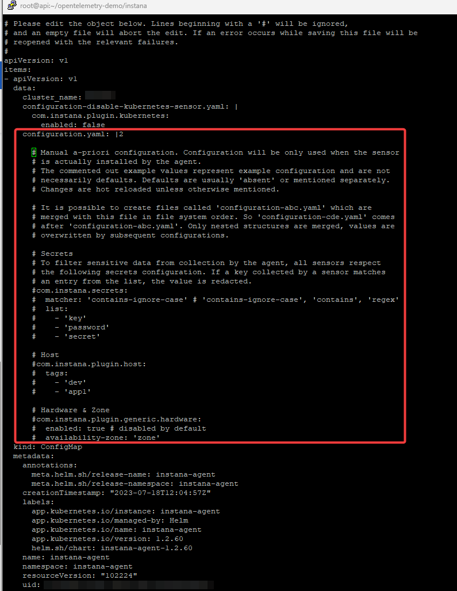
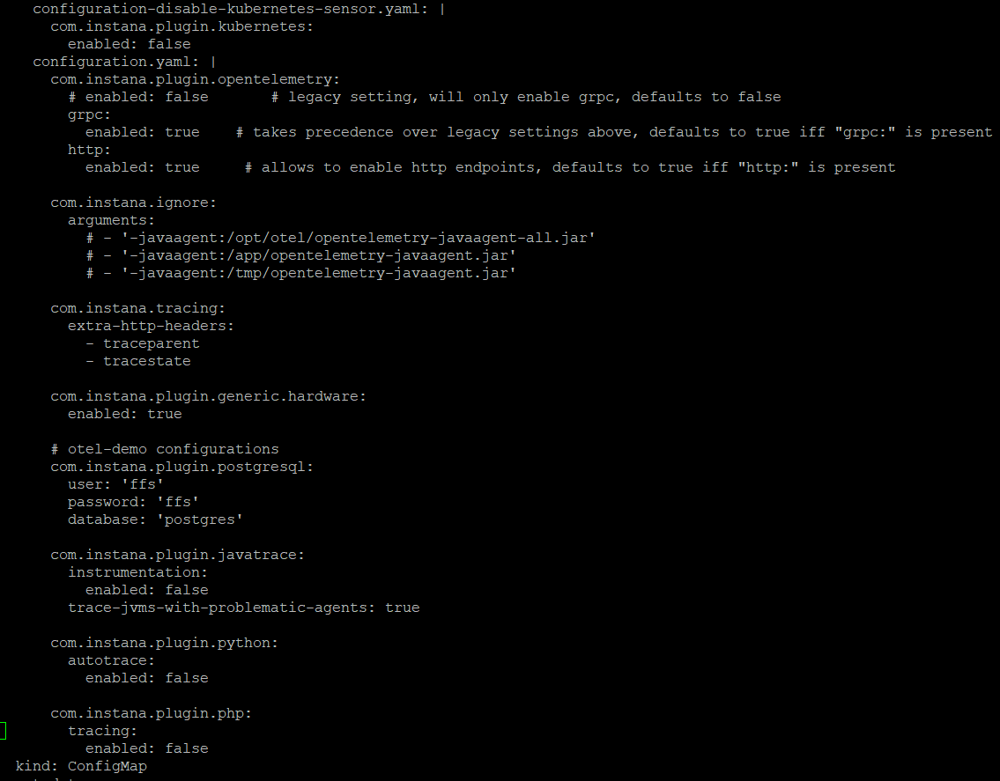

# OpenTelemetry instrumentation
For the purpose of this lab, we will use Instana OpenTelemetry Demo Application https://github.com/instana/opentelemetry-demo/tree/main 
which is the fork of generic OpenTelemetry Demo Application available here https://github.com/open-telemetry/opentelemetry-demo.

Instana's custom fork of the OpenTelemetry Demo Application is a microservice-based application, integrated with an Instana backend. 
The demo shows the native Instana OpenTelemetry data collection, correlation of OpenTelemetry tracing and the underlying monitored infrastructure, 
and an example of trace continuity between Instana tracing and OpenTelemetry.

OpenTelemetry Demo Application was already installed for you in the lab environment. The following steps are required to enable OpenTelemetry 
in the Instana agent.

OpenTelemetry is an open-source observability framework with a collection of software development kits (SDKs), vendor-neutral or vendor-agnostic APIs, and tools for instrumentation. 
This technology can generate, collect, export, and instrument telemetry data to analyze your platform's behavior and performance. Opentelemetry is also known as OTel. 
OpenTelemetry is included into Instana license, there's no additional payment required.

## Enable OpenTelemetry in Instana

First, let's make sure you are using the correct project in your OCP cluster

```sh
oc project instana-agent
```

Now, let's edit the configmap of instana-agent. We need to let instana-agent know which OpenTelemetry settings are required

```sh
oc edit configmap --namespace instana-agent 
```

Remove all commented lines from the configuration section as described below.

You can use "dd" in the text editor to remove a single line from the file.



Once the remove is done, copy and paste the below configuration content. 

Please note that there are exact number of spaces required.

```yaml
      com.instana.plugin.opentelemetry:
        # enabled: false       # legacy setting, will only enable grpc, defaults to false
        grpc:
          enabled: true    # takes precedence over legacy settings above, defaults to true iff "grpc:" is present
        http:
          enabled: true     # allows to enable http endpoints, defaults to true iff "http:" is present
      
      com.instana.ignore:
        arguments:
          # - '-javaagent:/opt/otel/opentelemetry-javaagent-all.jar'
          # - '-javaagent:/app/opentelemetry-javaagent.jar'
          # - '-javaagent:/tmp/opentelemetry-javaagent.jar'
      
      com.instana.tracing:
        extra-http-headers:
          - traceparent
          - tracestate
      
      com.instana.plugin.generic.hardware:
        enabled: true
      
      # otel-demo configurations
      com.instana.plugin.postgresql:
        user: 'ffs'
        password: 'ffs'
        database: 'postgres'
      
      com.instana.plugin.javatrace:
        instrumentation:
          enabled: false
        trace-jvms-with-problematic-agents: true
      
      com.instana.plugin.python:
        autotrace:
          enabled: false
      
      com.instana.plugin.php:
        tracing:
          enabled: false
```

The final structure of the configmap should look like the below example



Save the file by typing ":wq" 

## Restart cluster workload

Restart all of the instana agents pods to ensure that configmap change was implemented.

```sh
oc rollout restart daemonset instana-agent --namespace instana-agent 
```

Restart will prompt with a message

```sh
daemonset.apps/instana-agent restarted
```

Restart all of the Otel Demo app pods to ensure the Instana injection was done.

```sh
kubectl -n otel-demo rollout restart deploy 
```

Restart will prompt with a message

```sh
deployment.apps/my-otel-demo-accountingservice restarted
deployment.apps/my-otel-demo-adservice restarted
deployment.apps/my-otel-demo-cartservice restarted
deployment.apps/my-otel-demo-checkoutservice restarted
deployment.apps/my-otel-demo-currencyservice restarted
deployment.apps/my-otel-demo-emailservice restarted
deployment.apps/my-otel-demo-featureflagservice restarted
deployment.apps/my-otel-demo-ffspostgres restarted
deployment.apps/my-otel-demo-frauddetectionservice restarted
deployment.apps/my-otel-demo-frontend restarted
deployment.apps/my-otel-demo-frontendproxy restarted
deployment.apps/my-otel-demo-kafka restarted
deployment.apps/my-otel-demo-loadgenerator restarted
deployment.apps/my-otel-demo-paymentservice restarted
deployment.apps/my-otel-demo-productcatalogservice restarted
deployment.apps/my-otel-demo-quoteservice restarted
deployment.apps/my-otel-demo-recommendationservice restarted
deployment.apps/my-otel-demo-redis restarted
deployment.apps/my-otel-demo-shippingservice restarted
```

## Verify OpenTelemetry Demo Application

Once the instana-agent and OpenTelemetry Demo Application were restarted, it is now time to Verify
if the applications works and delivers metrics as expected.

Let's find out what is the OpenTelemetry Demo Application route by using below command 

```sh
oc project otel-demo
oc get routes
```

The results will be similar to the below output

```sh
NAME           HOST/PORT                                            PATH   SERVICES                     PORT          TERMINATION   WILDCARD
my-otel-demo   my-otel-demo-otel-demo.xxxxxxx.ibm.com          my-otel-demo-frontendproxy   tcp-service   edge          None

```

Your instance of OpenTelemetry Demo Application is available under the https://my-otel-demo-otel-demo.xxxxxxx.ibm.com. 
Let's use a browser to open that page. Please note the https in the address bar. 
Also, do not worry about the security message - accept the self-signed certificate.


## Create an Application in Instana

Now, let's create an application perspective in Instana. Log in to your Instana instance and create new application perspective.


Switch to "Advanced mode"


Provide application name of your choice, your cluster name, select "All downstream services" and "All calls", click "Create"


## Generate OpenTelemetry Demo Application traffic

Once the demo application is up and running, let's generate some traffic. 
Go back to the OpenTelemetry Demo Application in the browser, click through the site and explore the page, 
add products to the cart, make some orders.


Once you have purchased some of the products, let's go back to the Instana UI, open your Application Perspective to see 
the captured traffic.


This view concludes chapter 4. You are now able to see the traffic from your instance of the OpenTelemetry Demo Application captured by Instana. 
Let's move to the next sections.