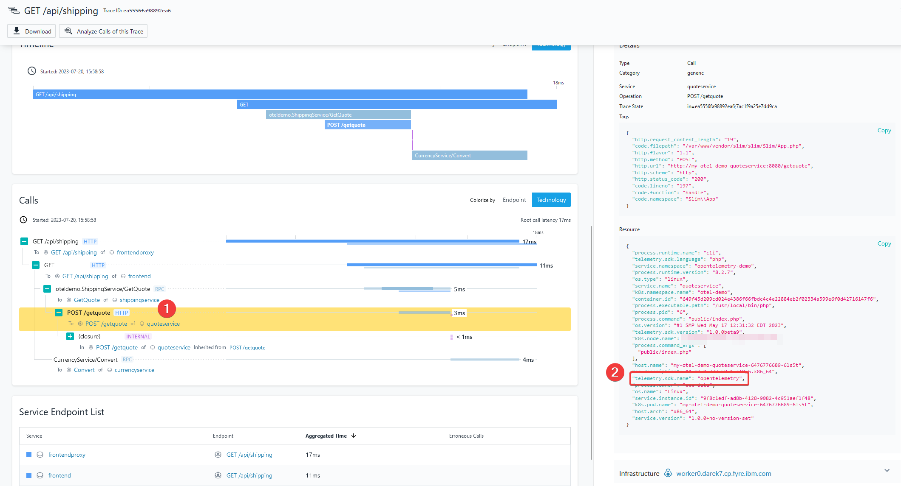
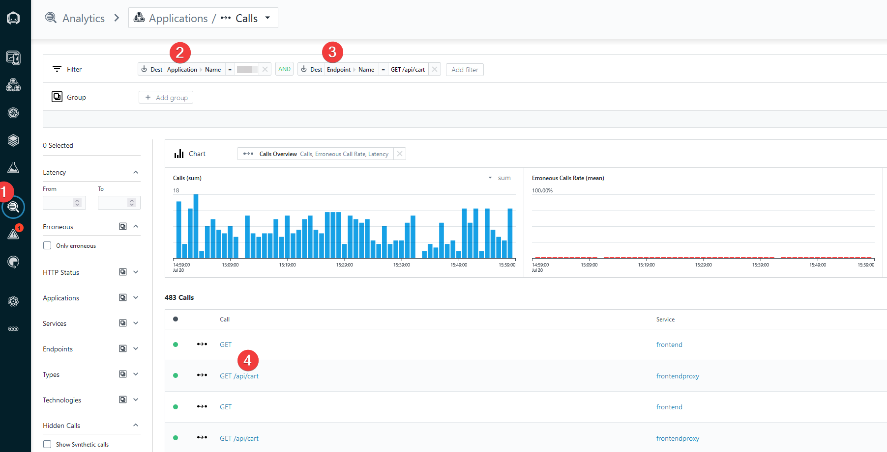

## Explore Instana and OpenTelemetry traces

Now, once the Instana and OpenTelemetry Demo Application are in sync, you can start exploring the captured data.

## Instana native tracing

In this section you will focus on exploring Instana's native tracing capabilities. In your Instana UI/Analytics search for calls which meet 
these criteria: 

- Application name: your application name
- Service name: frontendproxy

Click on the image call described under the point (4) from the below screen


On the right side of the screen you will notice tags and call parameters, together with an Infrastructure information - EnvoyProxy. 
This means that Instana injected its own tracing libraries into the proxy application.


## OpenTelemetry tracing

Using Instana agent, you can also receive OpenTelemetry based traces. Let's find an example in your environment.
Go to Instana UI/Analytics search for calls which meet these criteria: 

- Application name: your application name
- Service name: quoteservice

Click on the call link to see the transaction details.


In the detailed view of the call, please take a look at the right side of the screen. You will find there a list of json attributes captured by Instana. One of them is called 
"telemetry.sdk.name" with a value "opentelemetry", which proves that the content is coming from the OpenTelemetry tracer.



## Instana and OpenTelemetry combined traces

Instana can combine traces coming from applications instrumented by OpenTelemetry and Instana tracing on the same screen. 
Please follow the below instructions to find an example of such transaction in your environment.

Go to Instana UI/Analytics and search for the calls that are in your application perspective and endpoint name is /api/cart like presented below.
Click on /api/cart to see the details of the call.



Click on the first transaction as highlighted on the below screen in a point (1). The point (2) represents the captured data. 
The content was delivered by a native Instana tracing.


Click on the second row within the transaction as described below in a point (1). The point (2) represents the captured data which comes from the OpenTelemetry tracer.


The above example proves the Instana can combine traces from both OpenTelemetry and Instana tracing within the same screen under one transaction ID.

## Instana native tracing - code examples

Instana can provide combined traces from the OpenTelemetry and Instana native tracing. In the below example, you can see, how to 
use native Instana instrumentation techniques. In the below snippet, we follow [Envoy tracing configuration described here](https://www.ibm.com/docs/en/instana-observability/current?topic=technologies-monitoring-envoy-proxy#configuring-distributed-tracing)

As an outcome, Instana will inject its code and capture tracing of a calls, which were processed by the Envoy proxy.

```bash
FROM envoyproxy/envoy:v1.25-latest
RUN apt-get update && apt-get install -y gettext-base wget ca-certificates && apt-get clean && rm -rf /var/lib/apt/lists/*

USER envoy
WORKDIR /home/envoy
COPY ./src/frontendproxy/envoy.tmpl.yaml envoy.tmpl.yaml

# Instana tracing
ARG ARTI_PATH='https://artifact-public.instana.io/artifactory/shared/com/instana/libinstana_sensor/'
ARG INSTANA_AGENT_KEY
ARG INSTANA_DOWNLOAD_KEY
RUN access_key=$([ ! -z "${INSTANA_DOWNLOAD_KEY}" ] && echo "${INSTANA_DOWNLOAD_KEY}" || echo "${INSTANA_AGENT_KEY}") \
    && wget --user _ --password ${access_key} --output-document=./list.html ${ARTI_PATH} \
    && sensor_version=$(grep -o "href=\"[0-9]\+\.[0-9]\+\.[0-9]\+/\"" ./list.html | tail -n1 | cut -d'"' -f2) \
    && echo "Using sensor version ${sensor_version}" \
    && wget --user _ --password ${access_key} --output-document=/home/envoy/libcxx-libinstana_sensor.so ${ARTI_PATH}${sensor_version}linux-amd64-libcxx-libinstana_sensor.so

ENTRYPOINT ["/bin/sh", "-c", "envsubst < envoy.tmpl.yaml > envoy.yaml && envoy -c envoy.yaml;"]
```

Please note the use of libcxx-libinstana_sensor.so library.

[The source code is available here](https://github.com/instana/opentelemetry-demo/blob/main/src/frontendproxy/Dockerfile)

## OpenTelemetry tracing - code examples

If you wish to use OpenTelemetry in your application, here is the example snippet which can show, how to build the proper instrumentation. 

```php
use OpenTelemetry\API\Common\Instrumentation\Globals;
use OpenTelemetry\API\Trace\Span;
use OpenTelemetry\API\Trace\SpanKind;
use Psr\Http\Message\ResponseInterface as Response;
use Psr\Http\Message\ServerRequestInterface as Request;
use Slim\App;

function calculateQuote($jsonObject): float
{
    $quote = 0.0;
    $childSpan = Globals::tracerProvider()->getTracer('manual-instrumentation')
        ->spanBuilder('calculate-quote')
        ->setSpanKind(SpanKind::KIND_INTERNAL)
        ->startSpan();
    $childSpan->addEvent('Calculating quote');

    try {
        if (!array_key_exists('numberOfItems', $jsonObject)) {
            throw new \InvalidArgumentException('numberOfItems not provided');
        }
        $numberOfItems = intval($jsonObject['numberOfItems']);
        $quote = round(8.90 * $numberOfItems, 2);

        $childSpan->setAttribute('app.quote.items.count', $numberOfItems);
        $childSpan->setAttribute('app.quote.cost.total', $quote);

        $childSpan->addEvent('Quote calculated, returning its value');
    } catch (\Exception $exception) {
        $childSpan->recordException($exception);
    } finally {
        $childSpan->end();
        return $quote;
    }
}

return function (App $app) {
    $app->post('/getquote', function (Request $request, Response $response) {
        $span = Span::getCurrent();
        $span->addEvent('Received get quote request, processing it');

        $jsonObject = $request->getParsedBody();

        $data = calculateQuote($jsonObject);

        $payload = json_encode($data);
        $response->getBody()->write($payload);

        $span->addEvent('Quote processed, response sent back', [
            'app.quote.cost.total' => $data
        ]);

        return $response
            ->withHeader('Content-Type', 'application/json');
    });
};
```

Please note the use of OpenTelemetry/API and further use of the span builders.

[The source code can be found here](https://github.com/instana/opentelemetry-demo/blob/main/src/quoteservice/app/routes.php)