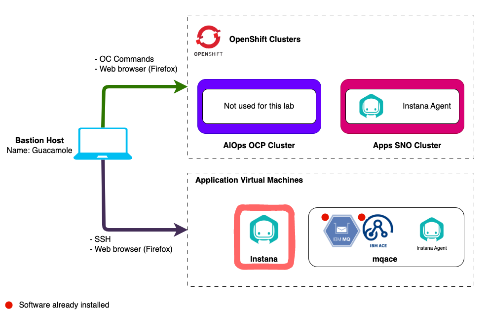
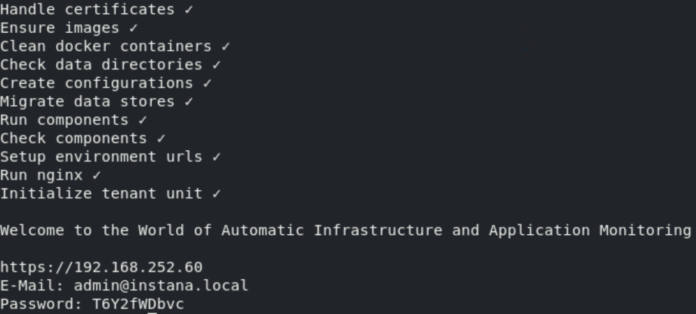

# Instana Server Installation

## 3.1: Introduction

Instana backend is available as SaaS (preferred option) or self hosted (aka
on-prem). For on-premises installations, Instana offers multiple options:

- **Single Server** self-hosted is a _Containerized_ deployment that does not
  support multi-tenancy. Self-Hosted is what Instana calls its on-premises
  deployments. Of course, on-premises could be deployed into a public cloud, but
  is not a recommended approach.
- **Two server** _Containerized_ self-hosted configuration with the datastores
  on one server and the other components on another. This option is also
  single-tenant.
- **Kubernetes deployment** with the cloud native backend components running in
  a kubernetes cluster and the datastores running either distributed across
  multiple servers or in the kubernetes cluster also. This configuration is
  multi-tenant. For assistance with architecture/planning, contact the SWAT team
  or open a [SWAT Request](http://ibm.biz/automation-swat) request (IBM
  internal).

:::tip

On-premises (self-hosted) releases are delivered every 4 weeks. The release have
odd numbers such as 225, 227, 229, etc. When upgrading, you may upgrade from N-1
or N-2, but you can't skip more than one release. So, you can upgrade from 225
to 229, but not to 231. Even numbered releases are for SaaS only. SaaS is
upgraded every 2 weeks.

:::

For the installation of the Instana server, we'll be following the instructions
from the Instana documentation for a **Self-Hosted Instana backend on Docker**.
The instructions can be found
[here](https://www.ibm.com/docs/en/instana-observability/current?topic=instana-self-hosted-backend-docker-premises)
for your reference, but you can follow the steps below. You will be performing
an online installation during this Tech Jam, but Instana does support off-line
(air-gapped) installs.

This _Self-Hosted Instana backend on Docker_ is Instana's smallest on-premises
installation option. Production and larger deployments are installed into
kubernetes for horizontal scale and resiliency. The installation of Instana will
be completed on the VM **instana**.



## 3.2: Prerequisites

Instana requires a Linux server with 16 cores, 64 Gig of RAM and few hundred Gig
of disk space for a POC sized deployment. It also requires fast backend storage.
For environments with even a few hundred servers, you'll need 6000 IOPS or more.
For larger deployments, you'll need more capacity. Several different versions of
Linux are supported. We have chosen Ubuntu 22.04 for this environment.

:::info

Normally, you would need to ensure that the virtual machine has the correct
ports opened in the firewall for the agent, UI, and EUM communications. We have
already done this work for you. For reference,
[here are the ports](https://www.ibm.com/docs/en/instana-observability/current?topic=premises-installing-instana-backend-docker#network-security-notes)
that need to be opened for the Instana Server for an on-prem deployment. The
ports for SaaS are slightly different.

:::

:::tip

If you are unsure how to get access to the Bastion host (Guacamole) see
[Accessing a Lab Environment](/waiops-tech-jam/labs/jam-in-a-box/#accessing-a-lab-environment)

:::

From the Bastion host (Guacamole), open a terminal window by selecting
**Activities** at the top left of the screen and then the terminal icon.


Use the terminal to login to the Instana host:

```sh
ssh jammer@instana
```

When prompted if you want to continue connecting, type: `yes`

Use sudo to become root.

```sh
sudo -i
```

Prior to installing Instana, you must install Docker CE or Docker EE. Run the
following commands to setup the prerequisites, download Docker CE, and install
Docker CE on the virtual machine.

```sh
apt-get install ca-certificates curl gnupg lsb-release -y
mkdir -p /etc/apt/keyrings
curl -fsSL https://download.docker.com/linux/ubuntu/gpg | sudo gpg --dearmor -o /etc/apt/keyrings/docker.gpg
echo   "deb [arch=$(dpkg --print-architecture) signed-by=/etc/apt/keyrings/docker.gpg] https://download.docker.com/linux/ubuntu $(lsb_release -cs) stable" | sudo tee /etc/apt/sources.list.d/docker.list > /dev/null
apt-get update -y
apt-get install docker-ce docker-ce-cli containerd.io docker-compose-plugin -y
```

After the commands have executed, verify that docker is installed and running.
You can run the `docker ps` command to confirm that it is installed and running.

```sh
docker ps
```

If docker is running, you should see output similar to what is shown below.


Next, we want to pin the major version of Instana so that we don't get updates
during the lab. Issue the following command to pin the Instana version.

:::note Copy & paste

Be mindful when copying and pasting to ensure no extra lines are inserted by
first copying the command to a text document.

:::

```sh
cat >/etc/apt/preferences.d/instana-console <<EOF
Package: instana-console
Pin: version 231-1
Pin-Priority: 1000
EOF
```

Next, create the following directories/filesystems that will be used for the
Instana datastore storage.

:::info

Ideally, these directories/filesystems should be setup on fast storage volumes
with a separate filesystem for each because the datastores are very I/O
intensive. Even during a POC, these filesystems can become fairly large. Plan
for a minimum of 20 Gig for the **data** directory, 200 Gig for the **metrics**
directory, and 40 Gig for the **traces** directory. Production environments will
be much larger and need to be planned for based on the size of the environment.

:::

```sh
mkdir /mnt/metrics
mkdir /mnt/traces
mkdir /mnt/data
```

You are now ready to start the installation of the Instana Server.

---

## 3.3: Installing Instana Server

Run the following commands to install the Instana Server. These commands will
vary depending on which Linux platform you are using for your installation. The
instructions below are for Ubuntu and Debian.

Begin by installing the Instana package by issuing the following commands. Make
sure the commands are successful before proceeding to the next step.

:::info

This will install the **instana** command on the server.

:::

```sh
echo "deb [arch=amd64] https://self-hosted.instana.io/apt generic main" > /etc/apt/sources.list.d/instana-product.list
wget -qO - "https://self-hosted.instana.io/signing_key.gpg" | apt-key add -
apt-get update -y
apt-get install instana-console -y
```

Now let's create the working directory for instana server installation:

```sh
mkdir -p /opt/instana && cd /opt/instana
```

Next, run the `instana init` command to install the Instana server. You will be
prompted for additional information during the install.

```sh
instana init
```

When you run the _init_ command, it generates a file named _settings.hcl_ in
your current directory. It is important to save this file. The settings.hcl file
contains the configuration settings for your deployment. It can be used to
enable additional features and make other configuration settings in the future.

You will be prompted to select **single**, **dual-instana**, or
**dual-clickhouse**. Type **Enter** to select **single**


Next, you will be prompted to enter a tenant name for your Instana server. This
can be any string. In a single server installation, the tenant name doesn't
really matter, but in multi-tenant or SaaS environment, the tenant name is very
important because it becomes part of the URL to access the Instana server.
Customers frequently use their company name for the tenant.


Next, you will be prompted to enter a unit name. In a single server
installation, the unit name doesn't really matter, but in multi-tenant or SaaS
environment, the unit name is very important because it becomes part of the URL
to access the Instana server. Customers frequently use a business unit or Dev,
Test, Prod to identify the unit.


You will now be prompted for your **agent key**. This is one of the requirements
of the lab, you will need to bring your own Instana License.


The next step is to enter your **download key**. Use the same key as your
**agent key** from the previous step.


Next, enter your **sales key**. This is one of the requirements of the lab, you
will need to bring your own Instana License.


Next, you will be prompted for the fully qualified hostname of the server.
Normally, you would enter a fully qualified hostname, but in this demo
environment we will use the IP address.

:::caution Important

Instead of specifying the hostname or fqdn, enter the **IP address** of the
Instana server. In the Tech Zone lab environment it is `192.168.252.60`

:::


You will now be prompted for the path where your data will be stored. The
default path is **/mnt/data**. Press **Enter** to accept the default value.


You will now be prompted for the path where your traces will be stored. The
default path is **/mnt/traces**. Press **Enter** to accept the default value.


Next, you will be prompted for the path where your metric data will be stored.
The default path is **/mnt/metrics**. Press **Enter** to accept the default
value.


You will be prompted for the location of the Instana logs. Press **Enter** to
accept the default value of **/var/log/instana**.


You will be prompted for the path to your signed certificate file. If desired,
you can create your own. If you don't provide one, the installer will generate a
certificate. Press **Enter** and let Instana generate a self-signed certificate.
If you were deploying at a customer site and the customer wanted to use CA
signed certificates, this is the step where you would specify the existing
certificate.


Finally, you will be prompted for the private key file. For this lab, press
**Enter** and have the install generate the key file for the self-signed
certificate.


Instana will now begin the installation process. It will take 20 to 30 minutes
to complete the installation process.

:::info

Troubleshooting

- If there are any intermittent errors relating to containers being pulled or
  starting you can run the `instana init` command again and resume the install
  to try again.
- If there are any errors relating to ports in use from a previous install
  attempt, you can list the process listening on the port with
  `lsof -t -i:<port-number>` and kill the process id returned with
  `kill -9 <process-id>`

:::

At the end of the installation, you will be shown the URL to access the Instana
server and a username of `admin@instana.local` and a **password**. Save this
information so that you can use it later to login to the Instana user interface.

The output should look something like this:



:::caution

Before attempting to login to your Instana server, activate the license using
the steps in the following section.

:::

:::tip

- If at any time you need to
  [restart Instana](https://www.ibm.com/docs/en/instana-observability/current?topic=premises-operations-docker-based-instana#stopping-all-components)
  you can run the `instana stop` and `instana start` commands.

:::

Change the password for the administrator account **admin@instana.local** to
something easier to remember for the labs:

```sh
instana configure admin -p Passw0rd
```

---

## 3.4: Activate the license

After completing the installation, you must activate the license. We suggest you
run the following commands in your working directory hence the license file will
store here:

```sh
cd /opt/instana
```

Run the following command to download the license:

```sh
instana license download
```


Next, import the license to activate your license:

```sh
instana license import
```


You can verify the license by typing:

```sh
instana license verify
```


---

## 3.5: Launch the Instana User interface

You are now ready to open a browser and login to the Instana user interface.

Open a firefox browser and select the **Instana** bookmark.


:::info

You can safely ignore the warning about the certificate being untrusted.


:::

When prompted, enter the username and password that you updated earlier.

- Username: **admin@instana.local**
- Password: **Passw0rd**


You will be taken to an Initial Screen where you can install the instana agents
or navigate to the main product UI. We will install an Instana Agent in the
upcoming section of the lab.


---

## 3.6: Turning on features and setting up SMTP

Following the initial install of your Instana server, there are optional
configurations that you will likely want to make.

- You may need to setup the Instana server to use an SMTP server if you plan to
  send out Email notifications.
- There may be some optional features that you want to enable via feature flags.
  Features such as VMware/vSphere monitoring, Power HMC monitoring, and zHMC
  monitoring are disabled by default.

Follow the steps below to configure the SMTP settings and enable some additional
feature flags.

1. Edit `settings.hcl` file according to the
   [documentation](https://www.ibm.com/docs/en/obi/current?topic=installer-enabling-feature-flags).
   The **settings.hcl** file will be located in the same directory where you
   issued the **instana init** command.

These parameters are added to the settings.hcl file in the section with the
other feature flags. Search in the settings.hcl file for **feature**. Then, add
any additional feature flags that are desired in that section of the file. They
can be place anywhere within the **feature** section of the file.

:::caution

Be aware that turning on features (especially BETA features) may heavily impact
backend performance. DO NOT turn on features you don't need\*\*

:::

As we issued **instana init** from the working directory `/opt/instana`, the
`settings.hcl` has been created there:

```sh
cd /opt/instana
```

Before you edit the settings.hcl file, make a backup of the file by typing:

```sh
cp settings.hcl settings.hcl.bak
```

Now, edit the settings.hcl file by typing:

```sh
vi settings.hcl
```

Locate the existing _feature_ settings and add the following feature flags.

```java
feature "infraCustomDashboards" {
  enabled = true
}
feature "infraEntityExplore" {
  enabled = true
}
```

:::info

Note: There are other feature flags that you should be aware of, <span
style={{color: "red"}}> but do not add these into the settings.hcl file</span>.
Here are some common feature flags available are:

```java
feature "vsphereEnabled" {
  enabled=true
}
feature "zhmcEnabled" {
  enabled=true
}
feature "phmcEnabled" {
  enabled=true
}
feature "beeinstana" {
  enabled=true
}
feature "smartAlertsLogsBlueprintEnabled" {
  enabled=true
}
feature "infraCustomDashboards" {
  enabled = true
}
feature "infraEntityExplore" {
  enabled = true
}
```

:::

Next, in the same file search for the **smtp** section in the settings.hcl file.
Modify the smtp section to look like the below **making sure you enter the
correct password supplied by the proctors**. We recommend that you edit the
parameters rather than copy/paste this section. It is easy to make a mistake
with the spacing when doing a copy/paste.

:::note

If you want, you can replace the **from** parameter with any Email address that
you like. The **from** Email address is what you will see as the sender of the
Email alerts from Instana.

:::

```sh
  smtp {
    from      = "server@instana.com"
    host      = "localhost"
    port      = 25
    user      = "jammer"
    password  = "Passw0rd"
    use_ssl   = false
    start_tls = false
  }
```

Save the changes in the settings.hcl file.

2. Apply the changes

```sh
instana update -f ./settings.hcl
```

:::tip

It will take a little while for the configuration changes to take effect. The
next section on upgrading the Instana Server is for information only, you can
read it while the configuration changes are being applied.

:::

Once complete you should see the below


---

## 3.7: Upgrading the Instana server

:::warning Do not perform these steps

You should not perform any steps in this section, it is for information only.

We want you to know the process for performing an upgrade.

:::

When upgrading an Instana server, it is important to know that you can only skip
one release when upgrading. The on-prem/self-hosted releases use odd numbers.
That means that you can upgrade from version 225 to either 227 or 229. But, you
can't upgrade from 225 to 231 because that would be skipping 2 releases and
isn't supported. It is important for customers to know this because they need to
keep their Instana server patched on a fairly regular basis. Otherwise, it will
mean that they will have to perform multiple steps to upgrade to the current
version.

Before attempting to upgrade, you want to confirm your current version. Issue
the **instana version**

```sh
instana version
```

Next, find out what versions are available to be installed. Issue the the
following command:

```sh
apt-cache policy instana-console
```

You will see a long list of versions that are available. Scroll to the top of
the list where you will see the most recent versions. 

You'll notice that in this example, 229-2 is the most recent version and 229-1
is the current version. That means you can upgrade to that minor release. There
is newer major release available.

First, install the latest instana-console. This upgrades the **instana** command
that is installed on your server:

```sh
apt install instana-console=229-2
```

Next, upgrade the server by issuing the **instana update** command. If you are
in directory with the settings.hcl file, then you don't need any arguments.
Otherwise, specify the path to the settings.hcl file.

```sh
instana update -f /opt/instana/settings.hcl
```

When performance the upgrade, the installer automatically pulls down the latest
docker containers and gets them up and running on the Instana server.

---

## 3.8: Summary

In this portion of the lab, you have learned how to install a self-hosted docker
based Instana server. For a POC, we recommend either SaaS or the single server
self-hosted docker installation of the Instana server. For production
deployments, customers will want the kubernetes based deployments to gain
improved scalability and resiliency.

You have also learned how to configure the SMTP settings and how to enable
feature flags.

Finally, you learned how to upgrade a docker based self-hosted Instana server.

You are now ready to learn how to install and configure an Instana Agent.

---
