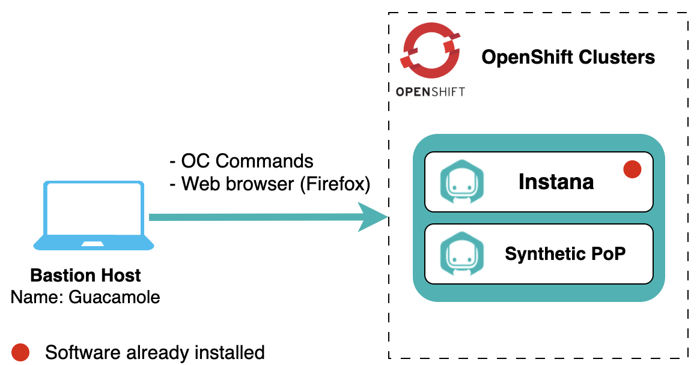

# Lab Environment

The lab environment includes Openshift cluster with Instana.

Openshift clusters:

1. **Instana cluster** - An instance of Single Node OpenShift cluster that will
   be used to install the Instana and KubeTurbo agents and the sample _RobotShop_
   application. The _Quote Of The Day_ sample application has been
   pre-installed.

:::note

- IBM Instana cluster have been pre-installed.
- You will install and configure Synthetic Point of Presence component during the lab.

:::

## Prerequisites

To complete this lab you will need:

- Instana Download Key - Required when requesting lab environment

## Requesting a Lab Environment

For this lab we will be using the
[Jam-in-a-Box: Instana - Synthetic Monitoring](https://techzone.ibm.com/my/reservations/create/64b726eba6da30001745cf6d)
collection.

:::info

You can follow
[these instructions](/waiops-tech-jam/labs/jam-in-a-box/#requesting-a-lab-environment)
if you need guidance on how to request a lab.

:::
