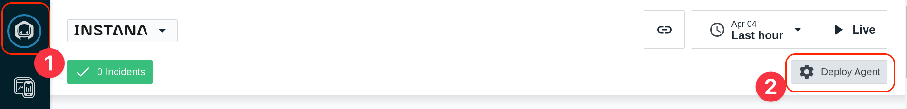
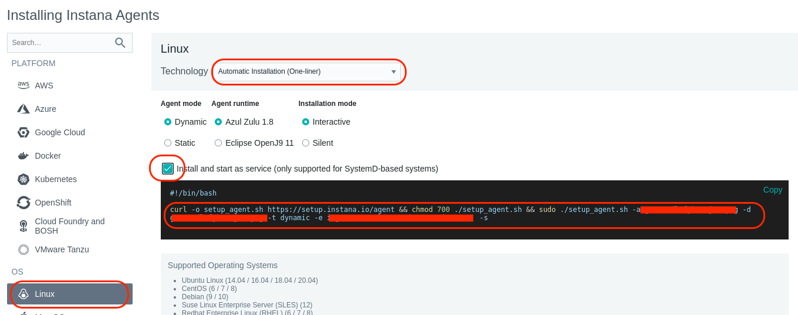
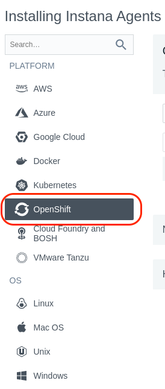

## 3.1: Instana Agent Deployment Options

Instana has a variety of agent installation options including the mirror
repository and static agents that allow customers to meet strict change control
processes. Some of the available options are listed below:

- OS specific installer (Linux, MacOS, Windows, UNIX)
- Container setup
- Docker (and other container managers)
- Kubernetes
- OpenShift
- Hosted Cloud Services
- Serverless component

All above mentioned methods are accessible via the wizard on the Instana UI


:::caution

If the Instana user interface is not available, go back and look at the command
prompt where you issued the **instana update** command to change the
configuration parameters. The command may still be running. The user interface
won't be available until the update is complete.

:::

You begin by choosing the platform where you will be installing the agent. Then
you can selected the **Technology** dropdown and choose from a list of
installation options. For example, on Linux, you can choose a automatic
**one-liner** installation, RPM, or TAR file installation. For
OpenShift/kubernetes, you have multiple options including operator, helm, and
yaml installs.


:::caution Important

The Instana agent install requires **root** privileges.

:::

When installing Instana agent you have to select if you want the agent to be
**dynamic** or **static** based on whether it can update itself or not. Here is
the excerpt from the
[Instana agent documentation](https://www.ibm.com/docs/en/SSE1JP5_current/src/pages/setup_and_manage/host_agent/index.html).

- A **Dynamic** host agent downloads on startup the latest set of sensors from
  repositories. By default, a dynamic agent updates itself daily with the latest
  and greatest capabilities that are released. It is also possible to tightly
  control the updating of dynamic host agents by
  [pinning a version](https://www.ibm.com/docs/en/obi/current?topic=agent-updates-dynamic-host-agents#version-pinning)

  By default, dynamic host agents use the Instana repository to pull updates,
  but it is possible to
  [set up your own managed mirror](https://www.ibm.com/docs/en/obi/current?topic=agent-repositories#agent-repositories).
  Currently, the mirror must be a Nexus repository. This is probably the best
  option for must customers because it allows them the benefits of automatic
  updates, while at the same time controlling the content that is in the
  repository.

- A **Static** host agent is a self-contained host agent that includes all the
  latest available components at the time of its release, and has no dynamic
  update capabilities. The static host agent has a stable "bill of materials"
  that never changes after the host agent's installation.

:::tip

Static host agents require no internet connection to the Instana repository, and
are recommended in restrictive network setups.

:::

---

## 3.2: Installing Instana Agent on a Linux VM

You will be installing the Instana Agent on the ACE/MQ server that has been
provisioned for you for this lab. Open a new terminal tab by selecting **File**
-> **New Tab**.

SSH to the ACE/MQ server as follows:

:::note

When prompted if you want to continue connecting, type: `yes`

:::

```sh
ssh jammer@mqace
```

Then use sudo to switch to root:

```sh
sudo -i
```

In Instana UI, select the **"Stan"** the robot icon in the upper left corner


Next, click the **"Deploy Agent"** button near the upper right corner.



A window will open with a list of different environments where you can install
the Instana Agent. This is a Linux server, so select Linux on the left side of
the screen.



Just to see what your options are, select the **"Technology"** dropdown list to
see the different ways that you can install the Instana Agent. You'll notice
that you can perform rpm installs or simply download a tar file. But, the
easiest method is the default one, **"Automatic Installation (One-Liner)"**.
Select that option in the dropdown list.

Notice that there are a few other options including the use of different java
versions, static vs. dynamic agents, etc. Leave the default settings.

Next, select the checkbox next to **"Install and start as service"**. This will
setup the systemctl autostart process and will also start the Agent immediately
after it is installed.

Finally, copy and paste the curl command into the terminal window and answer
**y** when prompted. Once complete you will see the below:


At this point the Agent is installed and up and running.

The Agent will automatically start monitoring the operating system and start
discovering key processes and middleware. In many cases it will automatically
instrument those technologies. In the case of some technologies (eg. MQ an and
App Connect Enterprise), there are manual configuration steps required due to
the need to provide credentials for accessing those applications.

---

## 3.3: Installing Instana Agent on the Instana Server

Next, you will install the Instana agent on the Instana server.

You can navigate back to your first tab still logged into the **instana** host
or from a terminal ssh to the Instana server again:

```sh
ssh jammer@instana
```

Switch to root

```sh
sudo -i
```

In the Instana UI, from the **Installing Instana Agents** screen select
**Docker** this time.

:::tip

If you aren't still on the **Installing Instana Agents** screen you can get
there by selecting the **"Stan"** robot icon in the upper left corner


and clicking the **"Deploy Agent"** button near the upper right corner.


:::

At the top of the page you will see an entry box where you can specify a
**Zone**. Specify a zone name such as **instana**. Then, copy the docker run
command and past it into the terminal window.

:::caution

Make sure you are pasting it into the **root@instana** vm.

:::


This will install the Instana Agent as a docker container running on the Instana
Server machine.

Once complete if you issue a **docker ps** command, you'll see that there is a
new docker container running. This container is the Instana agent.

```sh
docker ps | grep agent
```


Once installed, the Agent will begin to collect host metrics and will discover
the various technologies like Cassandra, ClickHouse, ElasticSearch, Nginx,
Node.js, and more. Many of these technologies will be monitored automatically
without the need for configuration. In some cases, the sensors need to be
configured in order to see the performance metrics.

---

## 3.4: Installing Instana Agent on OpenShift Cluster

The next step is to install the Instana Agent into the **Apps** OpenShift
Cluster that we'll be using to host our demo applications _Robot Shop_ and
_Quote of the Day_.

:::tip

Throughout this lab, we will be using the "oc" command to run commands within
OpenShift. The "oc" command is similar to kubectl for other versions of
Kubernetes. There are some minor syntax differences.

:::

Open another tab in your terminal so you are back on the local bastion host
(admin@bastion-gym-lan).

Check to make sure you are in the right place by running the following:

```sh
oc cluster-info --kubeconfig kubeconfig-apps
```

You should see the following output, specifically the url
`https:api.sno.techzone.lan:6443`. If you don't try opening a new tab or
terminal window and trying again.


Follow the steps below to install the Agent into the cluster:

Set the correct cluster to use:

```sh
export KUBECONFIG=~/kubeconfig-apps
```

Set permissions for the Instana Agent to allow the Agent to have access to
monitor the entire cluster:

```sh
oc adm policy add-scc-to-user privileged -z instana-agent --kubeconfig kubeconfig-apps
```

Again from the **Installing Instana Agents** screen select OpenShift from the
list.



Select the dropdown list next to the word **"Technology"**. Notice that there
are multiple options for installing the Agent. Choose the **"Helm chart"**
option from the list.

Set the **Cluster name** to `SNO` and the **Agent Zone** name to
`Quote of the Day` since this OCP cluster will be used for the **Quote of the
Day** application. Setting these values will allow you to find your Agent and
Kubernetes Cluster within the user interface and not get confused by data coming
in from other agents.

:::info

Zones are used to organize the Instana Agents (and sensors). Many customers
create zones for lines of business, data center locations, public cloud regions,
etc

:::

You will see output similar to what's shown below


Next, view the running agent pods:

```sh
oc get pods -n instana-agent --kubeconfig kubeconfig-apps
```

This will provide a list of the pods that are running in the agent namespace
(project). There will be one pod for each worker node in your target cluster.
This SNO instance only has one worker node so you will only see one pod running.

:::info

The Agent is deployed as a daemonset so that if a new Worker Node is added to
the cluster, monitoring will automatically get added to the new Worker Node.
Check, if the instana-agent pods are running.

:::


If there are no pods running, wait a minute and issue the "oc get pods" command
again. This completes the installation of Instana agent on OpenShift cluster.

---

## 3.5: Troubleshooting Instana Agent Installation on Kubernetes Cluster

If you don't see your cluster in Instana UI after a couple of minutes, you need
to troubleshoot the Instana Agent. From a terminal window with connection to
your OCP cluster, issue the following command:

```sh
oc get pods -n instana-agent --kubeconfig kubeconfig-apps
```

Check to make sure that all pods are running (since Instana agent runs as
daemonset, number of pods should be equal to number of nodes in your cluster).
If pods are running, you can examine the logs of one of the pods. Type:

```sh
oc logs <POD NAME> -c instana-agent --kubeconfig kubeconfig-apps
```

where **<POD NAME\>** is one of the pods listed in the previous command.

---

## 3.6: Configuring Proxy

:::warning Information Only

This section is here for informational purposes. There are no steps to execute.

:::

If there is no direct connectivity for the Instana agent you may need to setup a
proxy. There are 2 connections with 2 different locations for configuration:

- Connection to **Instana Backend** - defined in
  _INSTANA-AGENT-DIR_/etc/instana/com.instana.agent.main.sender.Backend.cfg
- Connection to **Agent/Sensor Repository** - defined in
  _INSTANA-AGENT-DIR_/etc/mvn-settings.xml (This is used in case client wants to
  setup internal maven2 mirror repository)

Proxy configuration goes into the respective files. You can also use
[environment variables](https://www.ibm.com/docs/en/obi/current?topic=requirements-installing-host-agent-docker#agent-configuration)

For backend connectivity you have to define _INSTANA*AGENT_PROXY*_ variables.
For repository connectivity you have to define _INSTANA*REPOSITORY_PROXY*_
variables.

---

## 3.7: Configuring Instana Agent

:::warning Information Only

This section is here for informational purposes. There are no steps to execute.

:::

There are multiple ways to configure the Instana agent. These instructions apply
to the Instana Agent installed on a traditional server. Instructions would be
different for docker or kubernetes versions of the Agent. Settings related to
agent functionality reside in `configuration.yaml` file located by default in
`/opt/instana/agent/etc/instana` directory. However, other settings related to
agent environment sits in other \*.cfg files.

:::info

Agent will actually read and use ANY yaml file in that directory.

:::

Some customers choose to have separate yaml files for each key technology. For
example, you could create a mq.yaml file and an ace.yaml file in the same
directory and it would read both files. `configuration.yaml` will contain sample
configuration entries and comments for ALL available sensors at the time of your
install, **BUT** it will not automatically add new sensor config as new sensors
become available.

For host based installation you can update `configuration.yaml` and agent should
pick up changes automatically (no restart required). For Kubernetes based
installations, there is `instana-agent` configmap where you can customize the
same content that you see in the configuration.yaml file. Using kubernetes/oc
commands, you can edit the configmap.

:::info

Instana agent configuration file must be a proper YAML - if your changes are not
applied, make sure that it's not a formatting error

:::

---

## 3.8: Agent Configuration Troubleshooting

:::warning Information Only

This section is here for informational purposes. There are no steps to execute.

:::

The first place to look when the agent does not start properly or does not work
as expected is agent log file. By default it is located in
`/opt/instana/agent/data/log/agent.log` . This is the path for a traditional
server.

In case of Kubernetes based deployment you have to look at logs of
`instana-agent` pods running in `instana-agent` namespace.

---

## 3.9: Configuring GitOps for Agents

:::warning Information Only

This section is here for informational purposes. There are no steps to execute.

:::

If you don't want to modify the Instana agent configuration files for each agent
locally, you can setup a centralized git repository for configuration files and
instruct Instana agent to use these files. To accomplish that, follow the steps
from the
[documentation](https://www.ibm.com/docs/en/obi/current?topic=configuration-git-based-management#git-based-configuration-management).

The Instana agent fetches configuration updates from the remote repository:

1. Upon the startup or restart.
1. Through a reboot initiated over the Agent Management Dashboard.
1. Through a configuration change over the Agent Management Dashboard.
1. Through the Web API as described in the Host Agent section and the
   integrations that rely on it like the GitHub Update Agent action.

---

Proceed to section 4, where you will install and instrument the Robot Shop
application.
