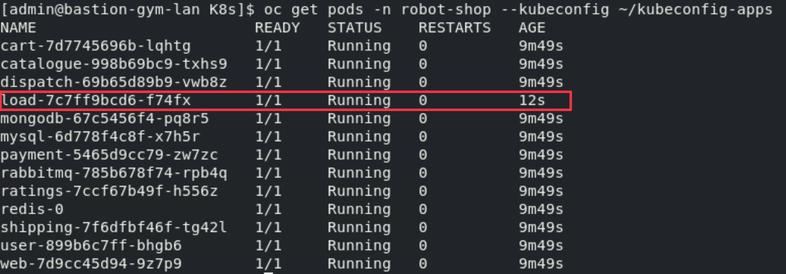

## 4.1: Introduction

In this section of the lab, you will learn how to install the Robot Shop
application. Robot Shop is pre-configured to include any required configuration
changes needed to enable monitoring. Some technologies such as java don't
require any configuration, but others require monitor configuration changes so
that the application can be monitored. During the install, you will also specify
the required information that is necessary for Instana to monitor the End User
Experience (EUM) / Real User Monitoring (RUM) data.

---

## 4.2: Create the Website in Instana

If you want to capture EUM/RUM data within Instana, you must first create a
website within the GUI (or via API). Open the Instana GUI within your browser.

If you are still on the **Installing Instana Agents** screen, select the **Go to
Instana!** button.


On left side navigation, select **Websites & Mobile Apps**. You'll see a dialog
where you can enter a Website Name. Enter **Robot Shop** as the website name.
Then, click the **Add Website** button.


A dialog containing **javascript** will open. In a more typical application, you
would follow the instructions on the dialog. You copy/paste the **javascript**
into the HTML pages. In a containerized environment, you would need to rebuild
and deploy the containers.


Robot Shop has already done some of the work for you. When you deploy the
application, you can pass parameters into the helm install. There are two
parameters within the **javascript** that we will need to copy and use when we
install the Robot Shop application. You will need the **key** and the
**reportingURL**. Either copy those parameters now or leave this dialog open
that you can retrieve it later.


---

## 4.3: Install Robot Shop

The full installation instructions for **Robot Shop** can be found here:
https://github.com/instana/robot-shop You'll notice that there are instructions
for installing **Robot Shop** into a number of different environments including
docker, kubernetes, and OpenShift. This lab uses an OpenShift environment, so
we'll be following those steps.

We have documented the steps below, so there is no need to refer to the GitHub
instructions.

:::info Important

The following should be run from the bastion host (admin@bastion-gym-lan). Check
to make sure you are in the right place by running the following:

```sh
oc cluster-info --kubeconfig kubeconfig-apps
```

You should see the following output, specifically the url
`https:api.sno.techzone.lan:6443`. If you don't try opening a new tab or
terminal window and trying again.


:::

Login to the **control node** to execute the following steps.

Make sure you are in the **jammer** user's home directory **(/home/jammer)**.

Clone the GitHub repository by typing:

```sh
git clone https://github.com/instana/robot-shop.git
```

change directory into the **robot-shop/K8s** directory

```sh
cd robot-shop/K8s
```

Create an OpenShift **project (workspace)** for the **Robot Shop** application
by issuing the following command:

```sh
oc adm new-project robot-shop --kubeconfig ~/kubeconfig-apps
```

Next, setup **privileges** within the cluster for the **Robot Shop** application
by issuing the following two commands:

```sh
oc adm policy add-scc-to-user anyuid -z default -n robot-shop --kubeconfig ~/kubeconfig-apps
oc adm policy add-scc-to-user privileged -z default -n robot-shop --kubeconfig ~/kubeconfig-apps
```

Robot Shop requires a persistent volume for Redis. Create a PV and PVC for use
by redis:

```sh
oc create -f ~/robot-shop-pv.yaml --kubeconfig ~/kubeconfig-apps
```


Install the **Robot Shop** by issuing the following helm command.

:::info

- **<EUM Key\>** is the **key** you obtained in section 4.2 from the Instana
  user interface. Example: `m-IMxZYFQyW_n7Xo0VRjrw`.
- **<Reporting URL\>** is the _reportingURL_ you obtained in section 4.2. **Do
  not include the trailing slash ( / ) following 2999.** Example:
  `http://<your_server_ip>:2999`.

:::

```sh
helm install robot-shop \
--set openshift=true \
--set eum.key=<EUM Key> \
--set eum.url=<Reporting URL> \
-n robot-shop helm \
--kubeconfig ~/kubeconfig-apps
```

If successful, you should see the results similar to what's shown below.


Check whether the Robot Shop pods are running by typing:

```sh
oc get pods -n robot-shop --kubeconfig ~/kubeconfig-apps
```

If the install was successful, you'll see the following pods running.

:::info

If some of the pods show **0/1** instead of **1/1** in the READY column or the
pods aren't in a **Running** state, wait a couple more minutes and issue the
**oc get pods** command again. It can **take as much as 15 minutes** before all
of the pods are running. If you don't want to wait, you can proceed to the next
steps.

:::


Finally, if you want to bring up the Robot Shop user interface, you need to
expose the service as a route. Issue the following command:

```sh
oc expose service web -n robot-shop --kubeconfig ~/kubeconfig-apps
```

Now, issue the **oc get route** command to get the route to the application.

```sh
oc get route -n robot-shop --kubeconfig ~/kubeconfig-apps
```

The result should look similar to: **web-robot-shop.<cluster domain\>**


Paste the route into firefox (make sure you specify http instead of https) or
select the **Robot Shop** bookmark if you copied the bookmarks.

---

## 4.4: Setup Automated Load

Now that the application is running, you will want to generate some traffic
against the application.

Within the same directory, issue the following command to install the load
generation pod.

:::tip

Make sure you are still in the directory `/home/admin/robot-shop/K8s`

:::

```sh
oc apply -f load-deployment.yaml -n robot-shop --kubeconfig ~/kubeconfig-apps
```

Run the **oc get pods** command. You should see an additional pod named **load**
running within the project.

```sh
oc get pods -n robot-shop --kubeconfig ~/kubeconfig-apps
```



You can now navigate back to the home directory ready for the next section

```sh
cd ~
```

---

## 4.5: Summary

In this section, you learned how to install an application that includes
monitoring and configure it for Website EUM/RUM monitoring.

Now, proceed to section 5 where you will configure the monitoring for IBM MQ and
IBM App Connect Enterprise (ACE).

---
