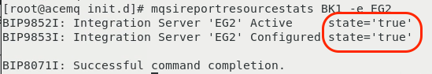
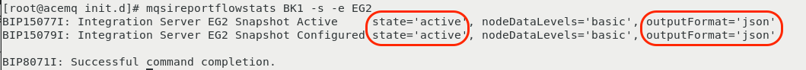
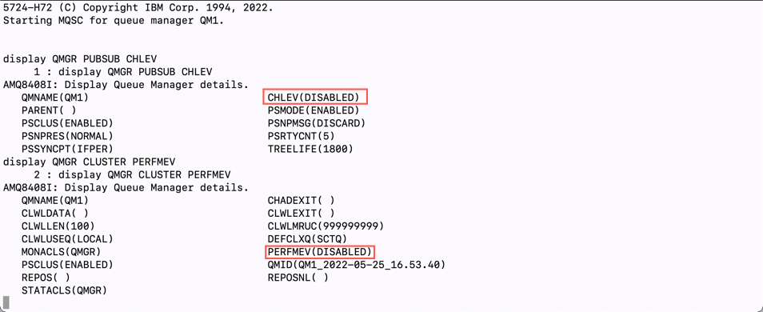
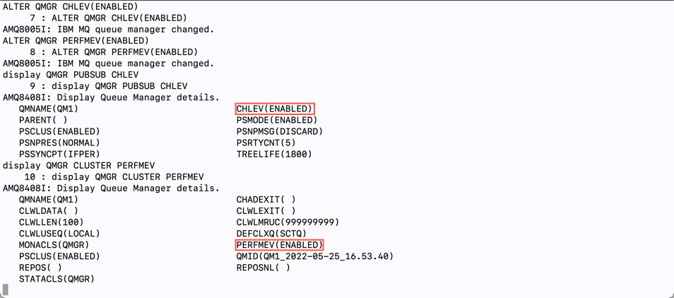
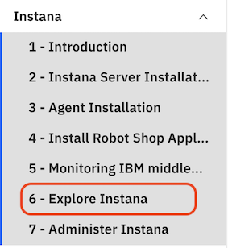

## 5.1: Introduction

Positioning Instana at existing IBM customers often requires presenting Instana
value proposition in context of other IBM middleware used by the client. In this
section, you will find guidance about configuring and using Instana with the
following IBM technologies:

- MQ
- App Connect Enterprise (ACE)

---

## 5.2: Configure Quote of the Day Application to use MQ & ACE

The **"Quote of the Day"** application has been installed for you on the
**Application** OpenShift cluster. For more information about the **Quote of the
Day** application, you can go to this GitLab location:
https://gitlab.com/quote-of-the-day/quote-of-the-day (It is not necessary to go
there, but you might be interested in learning more about the application.)

For the containerized portion of the application, some technologies are
automatically instrumented for monitoring. In addition, the load generation tool
is continuously running transactions against the application.

Let's verify that things are running. Issue the **oc get pods** command against
the **qotd** namespace/project.

```sh
oc get pods -n qotd
```

You should see results similar to this:


The next step is to modify the configuration of the Quote of the Day application
so that it uses an external ACE and MQ server. By default, the engraving service
runs as a cloud native call that doesn't really do anything. We want to modify
the configuration so that the engraving service makes a REST API call to ACE and
ACE subsequently calls MQ and puts a message on a queue.

You can do this by editing the deployment for the qotd-engraving.

Type the following command:

```sh
oc edit deployment qotd-engraving -n qotd
```

This will open a "vi" session. Scroll down within the file to line 49. You
should see 3 lines of text like the following:

```sh
- name: SUPPLY_CHAIN_URL
- name: SUPPLY_CHAIN_SIMULATE
  value: "true"
```

You need to modify those lines to look like the following. You need to add a
"value" parameter that contains the SUPPLY_CHAIN_URL for the ACE flow. The flow
within the ACE server is
**"http://&lt;acemq_ipaddress&gt;:7081/supplychain/v1/order"**. This is what you
need to use for the SUPPLY_CHAIN_URL value, but replace **<acemq_ipaddress>**
with the IP address of your ACE/MQ server.

You'll also need to change the value for the SUPPLY_CHAIN_SIMULATE to "false" to
disable the simulation.

When you are done, the lines should look like this:

:::info Hint

Replace &lt;acemq_ipaddress&gt; with the IP address for your ACEMQ server

:::

```sh
- name: SUPPLY_CHAIN_URL
//highlight-next-line-emphasise
  value: http://<acemq_ipaddress>:7081/supplychain/v1/order
- name: SUPPLY_CHAIN_SIMULATE
//highlight-next-line-emphasise
  value: "false"
```

Type **":wq"** to save your changes and exit the file.

```sh
:wq
```

As soon as you save your changes, OpenShift will automatically redeploy the
**"qotd-engraving"** pod with the updated configuration. To verify that the
changes were applied successfully, let's check the application UI.

Type `oc get route -n qotd` to get the route for the application. Then, in the
browser, open this URL with http://route and click the “Order Engraving” button.
Then, click again the “Order Engraving” button. If successful, you’ll see “Order
successfully placed.”


---

## 5.3: Configure ACE and MQ for Resource Monitoring

:::caution

This section is here for informational purposes. There are no steps to execute.

:::

This section of the lab will help you understand how IBM MQ and IBM App Connect
Enterprise (ACE) need to be configured for monitoring. There are certain
configuration settings within MQ and ACE that are required in order to get the
monitoring KPIs. The key KPI's that need to be enabled are Resource Stats and
Flow Stats. The requirements are documented in the
[sensor configuration guide](https://www.ibm.com/docs/en/obi/223?topic=technologies-monitoring-app-connect-enterprise#monitoring-ibm-app-connect-enterprise)
that is online. You'll see links to those guides further down in this document.

:::note

Typically, these steps are performed by the MQ and ACE admins, so you don't need
to know the step by step procedure. But, you do need to tell the MQ/ACE admins
what the monitoring requirements are.

:::

---

### Verify the ACE configuration

The "Resource Monitoring" KPIs are already enabled in most customer
environments. But it is worth validating the configuration. For example, you can
use the ACE `mqsireportresourcestats` and `mqsireportflowstats` commands to view
the configuration for ACE.

Become root user on mqace node:

```sh
sudo -i
```

To run the following commands you have to source the `mqsiprofile`:

```sh
. /opt/ace-11.0.0.11/server/bin/mqsiprofile
```

:::info

In the commands listed, BK1 is the Integration Node name and would be different
if the Integration Node had a different name

:::

Here are example commands that you can issue to see the ACE configuration:

```sh
mqsireportresourcestats BK1 -e EG2
```

You will see results similar to those shown below. Notice that the "state" is
set to "true" indicating that **"Resource Stats"** are enabled.



To see the configuration of the "flow" stats, issue the following command:

```sh
mqsireportflowstats BK1 -s -e EG2
```

You will see results similar to those shown below. Notice that the "state" is
"active", and the outputFormat is "json". This indicates that the **"Flow
Stats"** are enabled. The product requires that the output format be set to json
vs. XML.



---

### Verify the MQ configuration

There are fewer requirements for MQ. The sensor will work with the default
settings. However, you can have the sensor automatically use thresholds/Events
that are setup within the MQ server. If you want to use the built in MQ Events,
then you need to set **CHLEV** (Channel Events) and **PERFMEV** (Performance
Events) to **ENABLED**. To check those settings, you can issue the following
commands.

Become root user on mqace node:

```sh
sudo -i
```

HINT: To run the following commands you have to source the `setmqenv` and
specify the queue manager name (QM1):

```sh
. /opt/mqm/bin/setmqenv -m QM1
```

You first need to run the **"runmqsc"** command.

```sh
/opt/mqm/bin/runmqsc QM1
```

The **runmqsc** command won't prompt you with a cursor. That's okay. Just start
typing the commands.

Within the runmqsc command prompt you can issue other MQ commands. Type the
following commands:

Then:

```sh
display QMGR PUBSUB CHLEV
```

```sh
display QMGR CLUSTER PERFMEV
```

These commands will give outputs similar to what's shown below.



In the output, you can see that the CHLEV (Channel Events) and PERFMEV
(Performance Events) is set to disabled.

To enable run the following commands:

```sh
ALTER QMGR CHLEV(ENABLED)
ALTER QMGR PERFMEV(ENABLED)
```

Re-run the display command to verify that configuration was changed



Type **"quit"** to exit the runmqsc command prompt.

```sh
quit
```

---

## 5.4: Configure ACE and MQ for Tracing

:::caution

This section is here for informational purposes. There are no steps to execute.

:::

In addition to the "Resource Monitoring" KPIs, additional settings are required
to enable Tracing within IBM MQ and ACE. It is important that you understand
this process since Tracing is typically not enabled by default in most IBM MQ
and ACE environments. In this section, we've documented the steps.

:::note

Typically, these steps are performed by the MQ and ACE admins, so you don't need
to know the step by step procedure.

:::

This section is simply going to describe the process. The procedure is well
documented within the Instana online documentation. You will find a **Tracing**
section within the sensor documentation.

For ACE, you perform the following steps

- Download a small TAR file from IBM Fix Central. There are links within the
  [Instana documentation](https://www.ibm.com/docs/en/obi/223?topic=technologies-monitoring-app-connect-enterprise#tracing).
- Extract the tar file into the **/var/mqsi/shared-classes** directory
- Stop the ACE server
- Run the following command to "Install" the **User Exit**:
  **mqsichangeflowuserexits BK1 -o -x /var/mqsi/shared-classes**
- Start the ACE server
- Activate the **User Exit** by typing: **mqsichangeflowuserexits BK1 -o -a
  ACEOpenTracingUserExit**

The MQ procedure is similar.

- Download a small TAR file from IBM Fix Central. There are links within the
  [Instana documentation](https://www.ibm.com/docs/en/obi/223?topic=technologies-monitoring-mq#tracing).
- Extract the tar file to **/var/mqm/exits64**
- Edit the **/var/mqm/mqs.ini** file
- Add a small section within the **/var/mqm/mqs.ini** file. The content can be
  copied and pasted from the Instana documentation.
- Restart the Queue Manager

In the lab environment, these steps have already been performed. If you want,
you can examine the files and directories specified above.

:::note

Even though the TAR files for ACE and MQ look similar, they are unique for each
middleware component.

:::

---

## 5.5: Configure the ACE and MQ Sensors

In this section, you will perform these commands as root on the ACE/MQ server.

From the control node, ssh to the ACE/MQ server.

```sh
ssh jammer@mqace

```

Then, use sudo to switch to the root user.

```sh
sudo -i

```

After installing an Instana Agent, one of the first things you want to do is set
a Zone name. This allows you to organize your Agents to make them easier to
find. The Zones can also be used for custom queries, threshold distribution, and
more. In your case, set the Zone name to **Quote of the Day** or something
meaningful.

Change directory to `/opt/instana/agent/etc/instana`

```sh
cd /opt/instana/agent/etc/instana
```

This is the main configuration directory for the Instana Agent and sensors.
There are few configuration files in the parent directory, but most of the
important ones are here.

The **com.instana.agent.main.sender.Backend.cfg** file contains information on
where the Agent is going to send the monitoring data. Back one directory, you'll
see a file **/opt/instana/agent/etc/mvn-settings.xml** that is used to configure
the use of an internal maven repository.

We are going to be editing the configuration.yaml file. This file contains all
of the configuration settings for the sensors.

Take a backup before you actually edit the configuration.yaml file:

```sh
cp configuration.yaml configuration.yaml.bak
```

Edit configuration.yaml using either "vi" or use other editor like `nano` if you
prefer.

```sh
vi configuration.yaml
```

:::warning Important

YAML files are very strict about indentation. Each line within the file must be
indented by 0, 2, 4, 6, etc. spaces. Do not use tabs and do not indent by odd
numbers of characters. Make sure that all of the characters line up vertically
within the text. If you see a line that is commented out and you need to
uncomment it, just remove the single "#" character.

:::

Within the editor, scroll down to the section titled **"IBM ACE"**

You will need to uncomment the required entries and change the parameters to
match the ACE/MQ configuration on this server. If you read the description on
each line, you'll see that some parameters are optional.

For more information about about the ACE configuration, view the online
documentation found here:
[link](https://www.ibm.com/docs/en/obi/current?topic=technologies-monitoring-app-connect-enterprise)

There are multiple options for configuring the sensor. The information shown
matches this particular environment. A few key possibilities:

- If ACE is configured for MQTT, the configuration will be different than if ACE
  is configured to use MQ.
- The configuration will be different if you are doing remote monitoring vs.
  local.
- Pay careful attention to the required vs. optional parameters. For example, in
  some environments the MQ Channel Authentication is disabled and you don't need
  to specify credentials.

Edit the **IBM ACE** section of the file so that it looks like this. If you
want, you can copy this text and replace the entire section. Or, you can change
the individual parameters.

:::caution Important

When you paste this information, you must **replace <mqm password\> with the
password provided by the lab proctor**.

:::

```yaml
# IBM ACE
com.instana.plugin.ace:
  enabled: true
  poll_rate: 20
  NodesOrServers: # Multiple Integration node instances or multiple standalone Integration Servers can be specified
    BK1: # specify the Integration node/server name (required)
      restApiPort: "4414" # ACE rest api port (required)
      mqport: "1414" # Sets the port for remote administration IBM MQ channel port or the MQTT server port (required)
      queuemanagerName: "QM1" # Queue Manager name (required for IBM MQ)
      channel: "ACE.SVRCONN" # Remote administration channel (required for IBM MQ)
      mqUsername: "mqm" # MQ channel authentication's username if security enabled (optional for IBM MQ)
      mqPassword: "<mqm password>" # MQ channel authentication's password if security enabled (optional for IBM MQ)
```

In the example above, **QM1** is the Queue Manager name. **BK1** is the name of
the Integration Server. **ACE.SVRCONN** is the channel that the sensor will
connect to in order to query the performance KPIs. The username of **mqm** is
the admin username for MQ, but the sensor does not require administrative
permissions. Any valid MQ user can be specified as long as it has permissions to
connect to the channel.

Next, you will need to edit the MQ sensor settings. Scroll further down in the
file until you find the section titled "IBM MQ". You will be editing this
section of the configuration to match the settings of the MQ server. There are a
number of mandatory and optional parameters. For more information on the
configuration settings, see the online documentation:
[link](https://www.ibm.com/docs/en/obi/current?topic=technologies-monitoring-mq)

Edit the **IBM MQ** section of the file so that it looks like this. If you want,
you can copy this text and replace the entire section. Or, you can change the
individual parameters.

:::caution Important

When you paste this information, you must **replace <mqm password\> with the
password provided by the lab proctor**.

:::

```yaml
# IBM MQ
com.instana.plugin.ibmmq:
  enabled: true
  poll_rate: 5
  queueManagers: # Multiple Queue Manager instances can be specified
    QM1:
      channel: "ACE.SVRCONN" # Remote administration channel
      username: "mqm"
      password: "<mqm password>"
```

---

## 5.6: Further Configuration

First, let's change the **Zone** name within the file. This is similar to the
Zone that you specified when installing the Docker and OpenShift monitoring
Agents. Scroll down until you see the section titled "Hardware & Zone".
Uncomment the 3 lines of text starting with
`com.instana.plugin.generic.hardware`. By default the "availability-zone"
parameter is set to "Datacenter A /Rack 42". Change the value to **ACE and MQ**

The section of the configuration.yaml file should look as follows:

```yaml
# Hardware & Zone
com.instana.plugin.generic.hardware:
  enabled: true # disabled by default
  availability-zone: "ACE and MQ"
```

In addition to configuring the **Zone** name, you can specify tags within the
configuration.yaml file. Search for the section within the configuration.yaml
file titled **Host**. Within that section, you see a section for tags. By
default this section will be commented out. Uncomment the
**com.instana.plugin.host** section and specify some tags. For example, add a
**production** tag to indicate that this system is a production server. And, add
a **QOTD** tag to indicate that it supports the **Quote of the Day**
application. Add a **Dallas** tag to indicate the the server resides in Dallas,
Texas.

Add **production, QOTD, and Dallas** as tags. The configuration.yaml section
should look as follows:

```yaml
com.instana.plugin.host:
  tags:
    - "production"
    - "QOTD"
    - "Dallas"
```

It is possible to specify tags for the Docker and OpenShift versions of the
Instana Agent, but we are not going to cover that in this lab.

:::info

Zones and Tags can be used for a number of purposes within instana:

- Search for systems within the UI or via the APIs
- Assign thresholds to systems with a specific tag or zone name
- Build custom dashboards using the tags or zone names and more...

:::

By default, Instana will monitor key processes that are related to the
applications/middleware that are being monitored. It will also monitor processes
that are consuming large amounts of CPU or Memory. Sometimes, customers want to
ensure that specific processes are monitoring. Let's edit the configuration.yaml
file to specify some key processes on this ACE/MQ server. Search within the
configuration.yaml file for **com.instana.plugin.process**

The section will be commented out by default. Uncomment the section and specify
the following processes for monitoring **(crond, amqzmgr0, runmqlsr)**. One
process is the cron daemon, which customers frequently want to monitor. The
other two process are related to IBM MQ. The section should look like this:

```yaml
com.instana.plugin.process:
  processes:
    - "crond"
    - "amqzmgr0"
    - "runmqlsr"
```

:::note

There is also a section in the configuration.yaml file where you can specify
processes that you want to ignore. Search for **com.instana.ignore**.

:::

Save and exit the configuration.yaml file. In "vi", type ":wq" to save and exit
the file.

As soon as you save your changes to the file, Instana will detect those changes
and will start to implement what you have configured.

At this point, we recommend that you navigate to next section of this tutorial
**6 - Explore Instana**.



In the **Explore Instana** section, we'll begin by confirming that the ACE and
MQ monitoring are working properly. If they are not, come back to this section
and double check your configuration.yaml settings and check that there are no
obvious errors in the log file.

The main install log file is /opt/instana/agent/data/log/agent.log

---

## 5.7: Summary

You learned how to configure the Instana sensor for IBM App Connect Enterprise
(ACE) and IBM MQ. This includes customization such as defining tags, defining a
zone, and identifying specific processes to monitor.

Now, proceed to section 6 where you will explore Instana.

---
