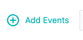

## 7.1: Create an Alert Channel

In order to notify people when problems occur in an Instana environment, you
must first have an **Alert Channel**. An **Alert Channel** is a mechanism that
is used to get Events out of Instana and into another system when the Events
trigger. There are a variety of **Alert Channels** including email
notifications, slack, Watson AIOps, and more. In this section we'll show you how
to setup and **Alert Channel**. Later, in the Administrative section, we'll use
that **Alert Channel** to get a notification when an Event triggers.

Begin by selecting the **Settings** gear in the left side navigation. Then,
select **Alert Channel**


The screen will change to show the **Alert Channels**. Since this is a new
install of Instana, there are no **Alert Channels** defined.

The next step will be to define an **Alert Channel**. In the upper left portion
of the screen, click on the **Add Alert Channel** dropdown and select **Email**


Notice that there are several different types of **Alert Channels** to integrate
**Events** into a variety of solutions. The **Generic Webhook** is the most
flexible and supports integration into an number of tools like ServiceNow that
support Webhooks.

After selecting **Email** the screen will change to show the fields required to
configure the **Email** **Alert Channel**. An **Alert Channel** can be setup to
notify very specific users or it can be setup to notify large groups of users.
For example, you might want all database related Events to be sent to an
**Email** alias for the DBAs. Or, you might want to notify a specific line of
business or the IT Operations team.

Here are the steps for setting up the **Email** channel.

- Enter a name for the alert. The name can be anything, but should be
  meaningful. For example, if the **Alert Channel** will be used to notify the
  MQ admins, call it something MQ related such as **MQ Email Channel**
- Enter the email address to notify. Notice that there is an **Add Email** link
  on the right side if you want to add multiple Email addresses. For the lab purpose,
  please use **jammer@localhost** email - Instana will be able to send email to your
  localhost email server


- Next, click the **Test Channel** button. This will attempt to send a test
  Email to the address you specified. You'll see whether the Instana server has
  access to the Email destination. In order to check an email in Instana lab server,
  login as **jammer** user to your Instana server and type "mail" command as presented
  below:


  This will show one email received from Instana to jammer@localhost email box.

- After successfully testing the **Alert Channel**, click the **Create** button to
  save the **Alert Channel**

---

## 7.2: Create an Analytics Based Smart Alert

In this section, students are going to create an analytics based **"Smart
Alert"** to detect abnormal behavior within an application.

Click on Applications. Then, select the **"Quote of the Day"** application.

Note, you can't use the application that you just installed for Analytics based
threshold because there isn't enough historical data.


Click on **"Add Smart Alert"** in the lower right corner.


There is a simple and an advanced mode. We'll be using the advanced mode which
allows you to see all of the capabilities.

In the upper right corner of the dialog, select **"Switch to Advanced Mode"**


In the upper left corner, you'll see that there are 4 different types of **Smart
Alerts**

- Slow Calls
- Erroneous Calls
- HTTP Status Codes
- Throughput (both high and low numbers of calls)

Leave the default of **"Slow Calls"**


Scroll down. You'll see that there are number of options to determine which
calls you want to analyze.

- You can analyze the calls for this application or you can analyze specific
  services or endpoints.
- You can analyze **Inbound Calls** or **All Calls**
- You can include **Internal Calls**
- You can include **Synthetic Calls**


Leave the default settings.

Scroll down further until you see the widgets show in the screen capture below.


You'll notice that there are a variety of options including:

- The ability to change the percentile that is used for the evaluation
- The type of seasonality (static, daily, or weekly)
- whether you want to view the last 24 hours or 7 days of historical data
- Sensitivity.

Try out some of the options, but keep in mind that analytics based thresholds
will require a week of data and your system has only been running for a few
hours.

Try moving the slider for sensitivity. Notice that when you set it to higher
sensitivity, the number of red triangles show on the screen will change. These
red triangles indicate when thresholds would trigger if you had chosen that
setting.


Choose an appropriate value for the sensitivity. You don't want to receive a lot
of alert by setting the sensitivity too high. Usually, if you see more than 1 or
two alerts per day, the sensitivity is probably too high. But, it depends on the
historical data that you're looking at and the mission criticality of the
application.

Scroll down further.


You'll see that there are options for persistence over time. This ensures that
the conditions trigger for a reasonable length of time before an alert is
raised.

There is also an option to select an **"Alert Channel"**. In the previous
section, you created an Email Alert Channel.

Select the **"Select Alert Channels"** option. A dialog will open with the
**Alert Channel** that you created earlier. Select the channel.

Note: It is possible to select multiple **Alert Channels**. For example, you can
notify people via Email and Slack. Or, let's assume there is a database Event,
you can notify the DBAs and you can notify that line of business that uses the
database.

Scroll further down on the page and you'll see a section titled **Additional
Alert Properties**


In this section you will notice that there is a default title and description.
You can edit those fields and replace them with custom messages. As you type the
**Title** and **Description**, the upper right corner will update with a sample
of what the Event will look like when it triggers. There are other options such
as setting the **Alert Level** and whether or not the Event should be aggregated
into an **Incident**.

Fill in the fields as you desire. Then, click the ** Create** button to create
the **Smart Alert**

The **Smart Alert** dialog will close and you'll be back in the context of your
application. To see the **Smart Alert** that you just created, click on the
**Smart Alerts** tab at the top of the screen.


---

## 7.3: Create a Static Threshold (Event)

Now, let's examine how a more traditional threshold is created and used in
conjunction with Alert Channels.

On the left side of the screen, select the **"Settings"** gear.


The Settings menu provides access to most of the administrative tasks within
Instana. You'll notice menus for Events, Alerts, Alert Channels, API Tokens,
Users, Groups, Log Management Integration, and more.

Select **"Events"**

Once you click on **"Events"**, you will see a list of 300+ Events that are
defined as out of the box thresholds within Instana. If you want to filter the
list, you can do that in a number of ways via the drop down lists at the top of
the page.


Notice that you can filter based on the Event type, severity, entity type,
state, or simply enter a keyword filter.

Let's select **"Entity Type"**

Select the **"Entity Type"** dropdown list and type **"IBM MQ"** into the field.
You'll notice that a few different options show up. Each of the options is an
Entity Type. You can filter on the Events related to the IBM MQ Queue Manager,
Queue, Channel, etc.

Select **"IBM MQ Queue Manager"** from the dropdown list.


This will filter the Events to the list of Events that are written against the
IBM MQ Queue Manager entity type. There are several out of the box threshold
Events that will detect things like channel initiator status, queue manager
status, publish/subscribe engine status, and more.

Let's create a new Event.

At the top of the screen, select the **"+ New Event"** link.


Fill in the following information for you new Event:

- Give your Event a name.
- Enter a description for the Event
- Select a severity (Warning or critical)
- Select the option of whether you want your Event to get correlated into
  Incidents
- Select a Grace Period.


The Grace Period is a capability that allow you to avoid getting multiple alerts
during flapping. Let's say you are monitoring for high CPU utilization on a
server. If CPU utilization goes High, then Low, then High over a short period of
time, you typically only want to see **ONE** event. By setting a "Grace Period"
of something like 60 seconds, you would only receive 1 Event during that
interval.

Now, scroll down a little further and fill in the remaining options.

In the **"Condition"** section, select the dropdown and choose **"Built-in
Metrics"**. Most of your thresholds will be written against these **Built-in
Metrics**.


The choice of "Custom metrics" would only apply to custom metrics that are being
fed into Instana. The "System Rules" are a specialized set of rules for doing
thing like detecting that an entity is **"offline"**.

Once you select **"Built-in Metrics"** another dropdown list will appear. The
new dropdown list is asking for the **"Entity type"** that you are going to
write your threshold against.

In the **"Entity type"** dropdown, select **"IBM MQ Queue"**. Notice that you
can type in letters such as "IBM MQ" to filter the list.


After specifying an **"Entity type"**, a new dropdown appears with a list of
available **"Metrics"**. Select the **"Metric"** dropdown and choose **"Depth >
Queue Depth Percentage"**.


After making your select, some new dropdowns appear on the screen looking for
the following information:

- Time Window: This is the duration that you want to monitor and evaluate
- Aggregation: Since Instana is capture data at a high interval, you can use
  Min, Max, Avg, Sum as part of your evaluation.
- Operator: What type of evaluation do you want to do (>, < =, etc.)
- Percentage - This field is actually different depending on the metric you are
  evaluating. In this case, you are evaluating a metric that is a percentage.

In the dropdowns, choose **"60 s"** for the time window, **"max"** for the
Aggregation, **">"** for the Operator, and **"90"** for the Percentage.


This will cause the threshold to evaluate the **Queue Depth Percent** for 60
seconds and determine whether the maximum value during that interval exceeded
90%. If it did exceed 90%, then the Event will trigger.

Now you have to select the **"Scope"** that this threshold will apply to. Select
the dropdown list.


In the dropdown list, you'll see the following options:

- You have the option of applying this threshold to an **"Application
  Perspective"**. This would limit the scope of the threshold to a specific
  application.
- You can use a **"Dynamic Focus Query"** to filter to a specific list of MQ
  Queues.
- Or, you can have your threshold apply to **"All Available Entities"**.

Let's make this a global Event and choose the **"All Available Entities"**
option.

Click the **"Create"** button to save your new Event.

Note: If you wanted to apply your Event to a subset of the MQ Queues, you would
specify a Dynamic Focus Query. The query would look something like this.


The easiest way to formulate a **Dynamic Focus Query** is to go to the
**Infrastructure** page and build a filter. It will guide you through the
options. Then, copy and paste the string into the **Event** editor.


A **Dynamic Focus Query** can be a complex expression using AND, OR, NOT, etc.
to filter to a subset of the entities. These queries are build using the
**Lucene** query language. For more information on the **Lucene** query
language, see the project documentation.
[Lucene's Query Language](https://www.ibm.com/docs/en/instana-observability/current?topic=instana-filtering-dynamic-focus)

---

## 7.4: Setting up an Offline Event

A common monitoring scenario is to setup an **Offline** Event to detect an
Entity going offline. We're going to create an **Event** that will detect any
**Host** that goes offline.

To do this, create a new static **Event**. When you create the event, select
**System Rules** as the **Source**. Then, select **Offline event detection** for
the **System Rule**


Next, select the scope. Choose **Selected Entities Only (Dynamic Focus Query)**.

In the **Dynamic Focus Query**, you are going to specify something a little
different. Instead of choosing **Entity.type:host**, we are going to use
**entity.selfType:host**. The reason for this is that **entity.type:host** will
filter on all of the hosts, but will also include the child entities that are
running on the host. We only want to detect that the **Host** is offline.
Therefore, we are going to specify **entity.selfType:host**.

Copy and post the string into the Event definition.

```sh
entity.selfType:host
```

Your **Dynamic Focus Query** should look like this.


Click the Create button to save your Event.

If you want to see how **entity.type:host** vs. **entity.selfType:host**
behaves, you can open the Infrastructure view and add the queries into the
search bar and see the results. You'll see the same list of hosts returned
within the UI. But, when you use **selfType**, you'll notice that the server
towers do not contain the **pizza boxes** representing each of the **Entities**.


---

## 7.5: Setup an Alert for the New Event

Now that you have a new Event defined, you need to define and Alert. Alerts are
used to notify people and teams via various Alert Channels. You previously
reviewed the options for Alert Channels. The Alerts will be sent to one or more
Alert Channels that you select.

Select **"Settings"** on the left side navigation. Then select **"Alerts"**


Click on the **"+ New Alert"** link


Give the new **"Alert"** a name. Normally, the **Alert** name is something
meaningful to indicate who will be notified and the type of events being sent.
For example, **MQ Alerts**

Select the dropdown labeled **"Alert on Event(s)"**


You will see that there are multiple options. You can setup an Alert for a
particular Entity Type. For example, you might setup an Alert for all Oracle
Database Events.

In your case, select **"Alert on Event(s)"**. This option allows you to select a
specific list of Events to forward to an Alert Channel(s).

Further down on the page, select the **"Add Events"** link.



Initially, you will see a list of ALL Events.

Let's filter the list to just a specific **Entity Type**. Select the **"Entity
Type"** dropdown list and select **"IBM MQ Queue"**


You will now see a filtered list of Events related to IBM MQ Queues. Find the
Event you created in the previous section and select the checkbox. Then, select
the **"Add 1 Event"** button at the bottom.


You will now see the 1 selected Event listed. Further down on the screen you
will see a **"Scope"** section. This determines which Entities this Alert will
apply to.


Select the **"Apply on"** dropdown list. You'll see that you can choose one of 3
options:

- Application Perspective: This option allows you to limit the scope of the
  alert to a specific application.
- Selected Entities Only: You use the dynamic focus queries to filter to a
  specific set of Entities
- All Available Entities: The Alert would apply to any Entity that triggered the
  Event threshold.

Select the **"Selected Entities Only"** option


A new widget will appear on the right side of the screen asking you to specify
the **"Dynamic Focus Query"**

In the entry field, enter the lucene query that will filter to the queue that is
used for the **Quote of the Day** application. Enter the following value:

```sh
entity.ibmmq.queue.name:CP4I.DEMO.API.Q
```


These lucene queries can be complex sequences of AND and OR statements. In this
case, we are looking for 1 specific queue.

Next, click on the **"+ Add Alert Channels"** link


A dialog will open with a list of available **"Alert Channels"**. Select the
**Alert Channel** that you created earlier.

Then, click the **"Add 1 Channel"** button.


Scroll down to the bottom. You will see an optional section where you can add
custom payloads by adding Key/Value pairs. We're going to skip that section.

Finally, click the **"Create"** button to save your Alert.


That completes this section of the lab.

---

## 7.6: Summary

At this point, you have created an Event and an Alert for that Event. The next
time the custom **"Event"** that you created triggers, an **"Alert"** will be
sent to the **Alert Channel**. In this case, a Email will be sent.

In this section of the lab, you learned how to create a Smart Alert, a
traditional Alert (Event), and learned how these Alerts are routed to the
correct people/teams via Alert Channels.

---
