# Action Catalog

Instana recently added a capability called the **Action Catalog**.  The **Action Catalog allows you to execute corrective actions in order to solve problems in an automated way.  
The approach allows you to reduce downtime by fixing known issues as quickly as possible.  There is no need to leave the Instana user interface.  In the near future, you will also be able to have those 
automated actions execute automatically whenever specific Events trigger.

An example might be that when the log file of an application has consumed all available disk space, SREs may restore service by deleteing logs or extending space with one click from Instana UI.

There are multiple ways to execute the Actions.  Instana can be integrated with tools like Ansible to execute complex automations remotely. It supports the execution of webhooks.  
It supports the integration of web pages so that you can point to a manual runbook.  And, it provides the ability to execute scripts locally on the Agent machine.

In the lab we will create an action that SRE can run from the context of a raised event.

## Create New Action
Click on Automation from the left menu, select "Action catalog" and then "New Action"

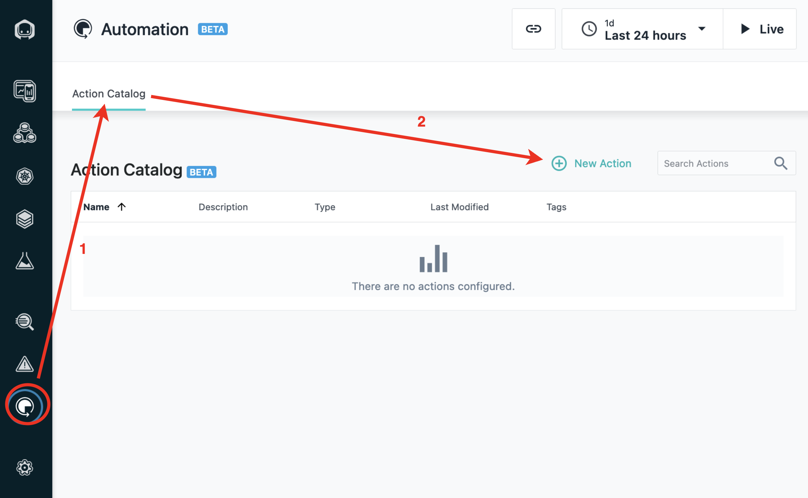

Define **Name** and **Description** for the **Action**

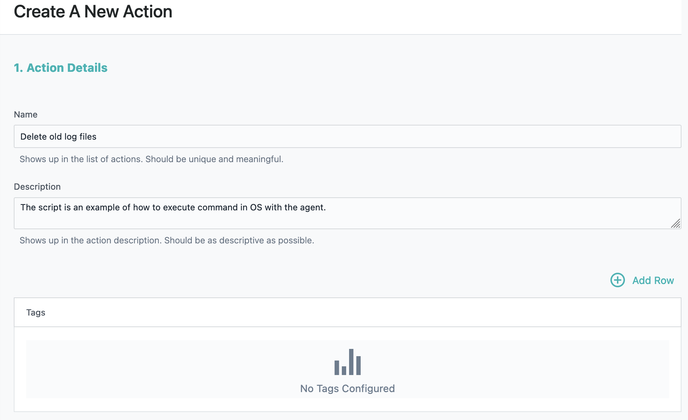

Notice that the **Action Catalog** supports **Tags**.  In this lab we will not be using tags.

Select the Action **Type** dropdown and choose the **Script** option.  Notice that there are a few other options.  The **Documentation Link** is used to associate a manual runbook into Instana.  The **HTTP** option is used to automate the execution of a REST API call.

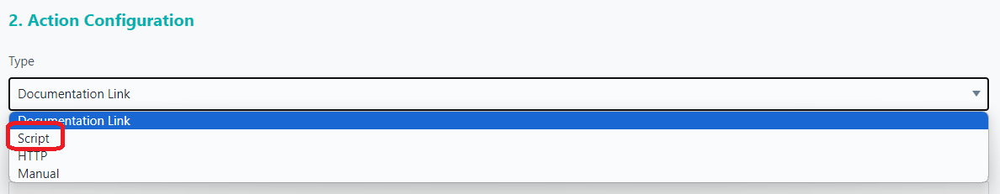

Next, add your shell script content to the section labeled **Script**.  Paste in the content shown below.

```bash
#!/bin/bash
echo `date` " - Deleting old log files" >> /tmp/action.txt
```

Note: You'll notice that this script doesn't really delete any files, but it gives you some ideas of what can be done.

The results should look as follows:

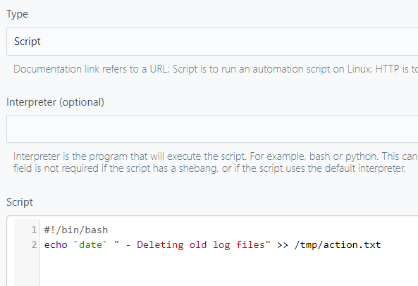

We won't be using it in this lab, but notice that there is a **Parameters** section of the **Action** where you can pass parameters into your script.

## Event triggers

In the next next, you will decide which Events will be associated with your automation.  The idea is that you only want your automation to appear when certain Events trigger.

Notice that there are two categories of Events.  There are traditional static **Events** and there are **Smart Alerts**.  You have an opportunity to associate the automation/Action with both types of Events.

Click on **Add Events**.  Then, filter the Events by specifying **Host** (1) for the **Entity Type**, then specifying **disk** in the **Filter Events** field.

You should now see a list of 3 disk space related Events.   Click the checkbox to select all three.  Then, click the **Add 3 Events** button.

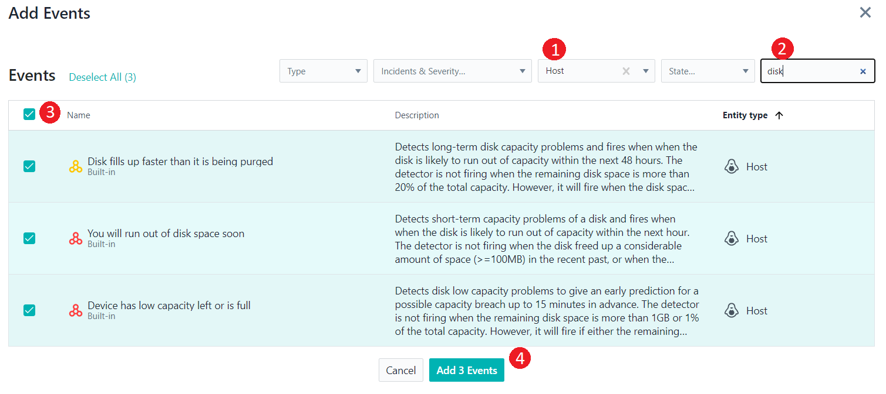

Now, we can add some **Smart Alerts** to associate with our **Action**.  Let's assume that we have high erroneous calls due to the filesystem filling up.  Select the **Smart Alert** named **Erroneous call rate is higher than normal**

Then, click the **Select 1 Smart Alert** button at the bottom of the page.

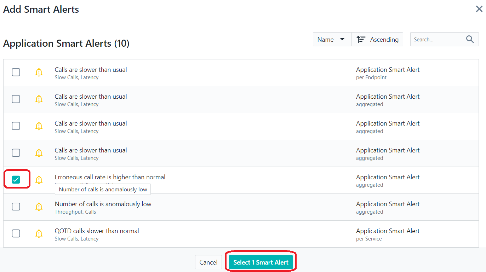


Finally, at the bottom of the page, click the **Create** button to create your Action.


## Execute actions

By default, the Instana Agents will not allow you to execute Actions.  This features must be enabled on each Agent where you want to execute Actions.  This is done by editing the `configuration.yaml` file for the agent.

Login to **Infranfs** node using ssh terminal as root.
```sh
ssh root@10.100.1.2
```

Edit configuration.yaml file of the agent:
```bash
vi /opt/instana/agent/etc/instana/configuration.yaml
```

Enable Actions plugin by adding the following config block in the end of the file:
```yml
# Action Catalog
com.instana.plugin.action:
  enable: true    # by default is false
com.instana.plugin.action.script:
  enable: true    # by default is false
  scriptExecutionHome: /tmp
  runAs: mqm
```

Notice that you can specify any directory where you want the script to execute.   And, you can specify the user account that you want the script to run-as.   In this case, the infrafs server is an MQ server, so we are going to run the script as the MQ admin account.

Save end exit from file.

## View the actions

Go back to the Instana user interface.  Within the Action Catalog, you will see your Action.  Notice that you can manually execute the Action by selecting the run arrow.

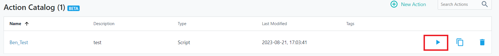

## Action association

In addition, the Action has now been associated with the 4 Events/Smart Alerts that you selected.   

Get back to Instana dashboard and open Events -> Issues:
Choose issue "Erroneous call rate too high":
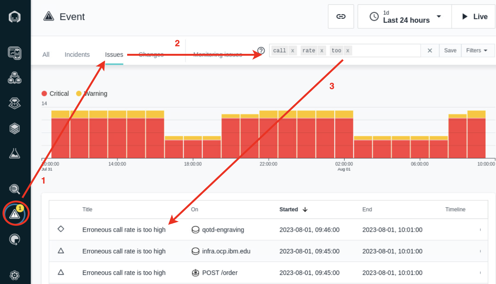

Scroll down, see associated actions with the event and click "Run" on the Associated Action "Delete old log files":
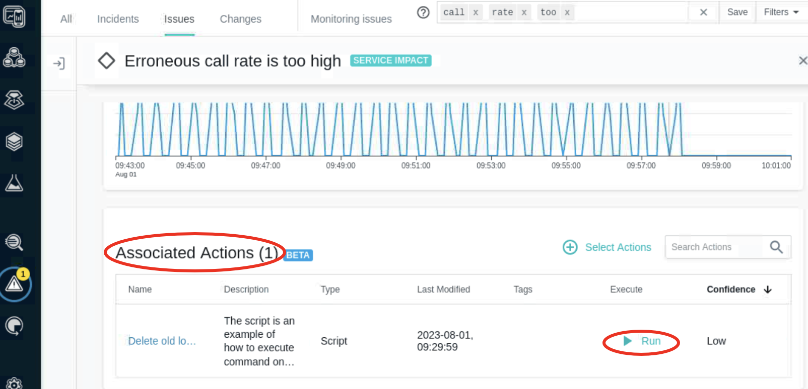

Select Agent on which to run the command and click "Run Action":
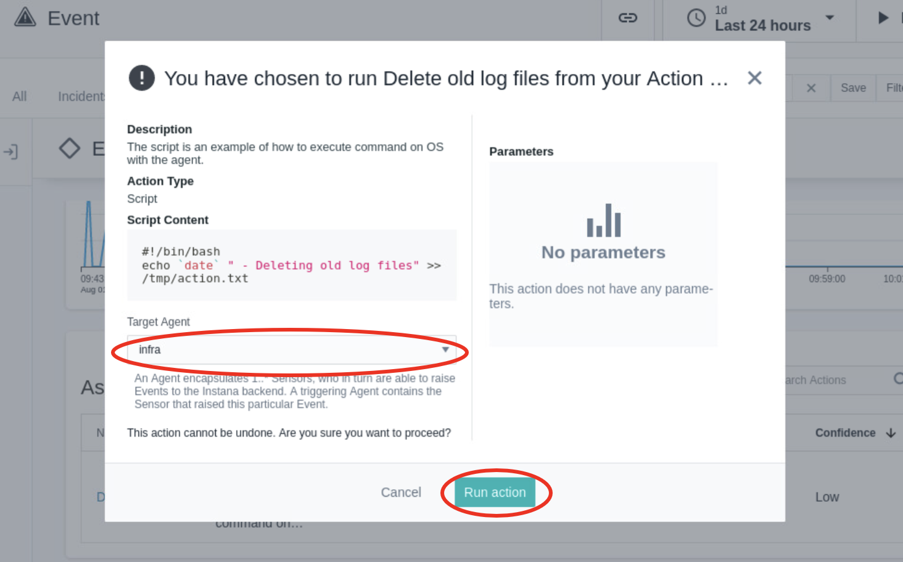

## Script execution

To ensure the script has been executed login to Infranfs node using ssh terminal as root.

Check content of the file `/tmp/action.txt` on the infranfs node:

```bash
cat /tmp/action.txt
```

The results should look similar to the image below:
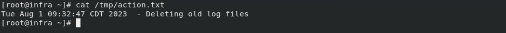

## Summary

During the lab we:
- Created Action and run it from the context of Event