# Administer Instana

From the Bastion host open the Firefox browser and select the **Instana**
bookmark.

:::tip

If you are unsure how to get access to the Bastion host (Guacamole) see
[Accessing a Lab Environment](/waiops-tech-jam/labs/jam-in-a-box/#accessing-a-lab-environment)

:::

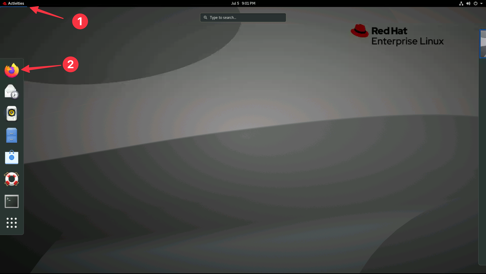

{/* 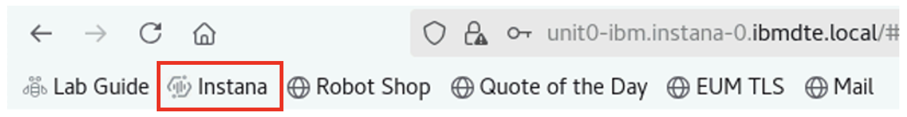 */}

&nbsp;
&nbsp;


:::info

You can safely ignore the warning about the certificate being untrusted.

{/* 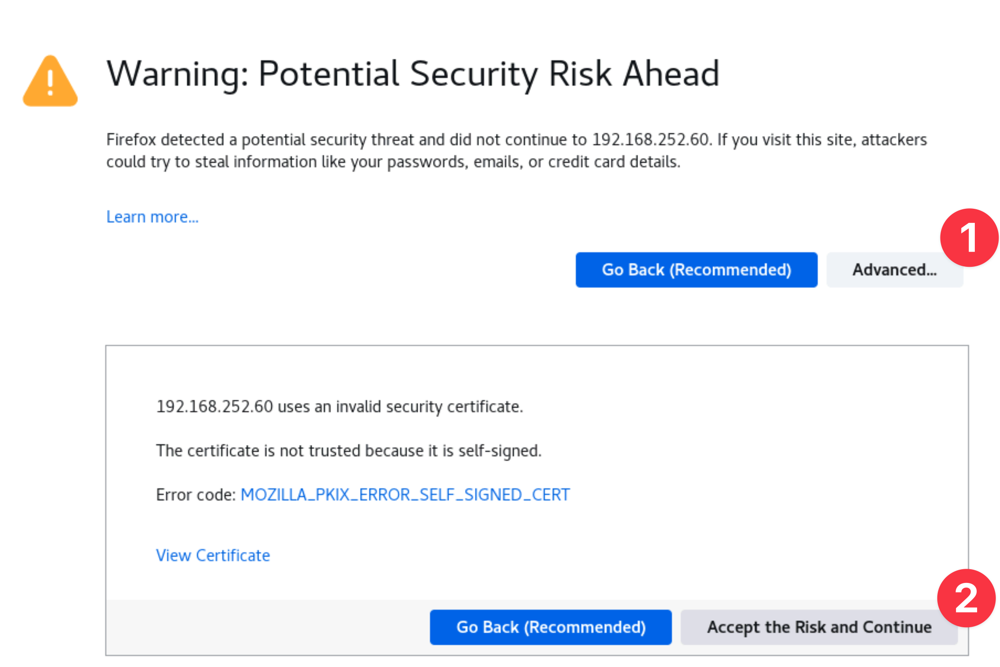 */}

:::

When prompted, enter the username and password that you updated earlier.

- Username: **admin@instana.local**
- Password: **Passw0rd**

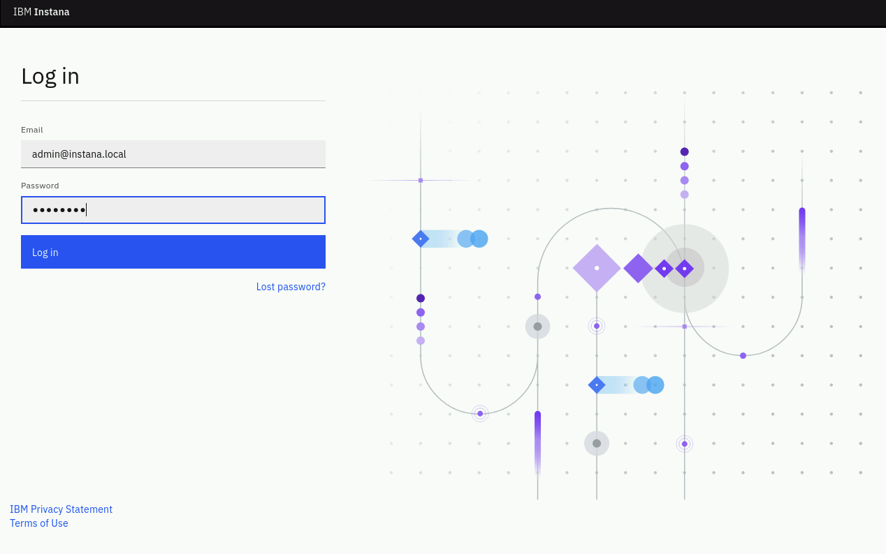

## 3.1: Create an Alert Channel

In order to notify people when problems occur in an Instana environment, you
must first have an **Alert Channel**. An Alert Channel is a mechanism that is
used to get Events out of Instana and into another system when _Events_ are
triggered.

There are a variety of Alert Channels including:

- Email
- Slack
- AIOps
- and more...

In this section we'll show you how to setup an Alert Channel. Later, in the
Administrative section, we'll use that Alert Channel to get notifications when
an Event triggers.

:::info

About SMTP Configuration Information:

- Pre-configuration:​ In this lab, the SMTP server was set up during the initial 
Instana backend installation. You can view the specific steps in the 
[Server and Agent Installation Lab guide](https://ibm.github.io/waiops-tech-jam/labs/instana/server-and-agent-install-lab/server-installation/#35-installing-instana).

- Modification/Setup:​ If you need to configure or update SMTP settings after 
installation, there is also an information section giving details 
on [how to configure SMTP post installation](https://ibm.github.io/waiops-tech-jam/labs/instana/server-and-agent-install-lab/server-installation/#smtp-post-installation).

:::

From the Instana UI select the **Settings** gear in the left side navigation.
Then, select **Alert Channels**

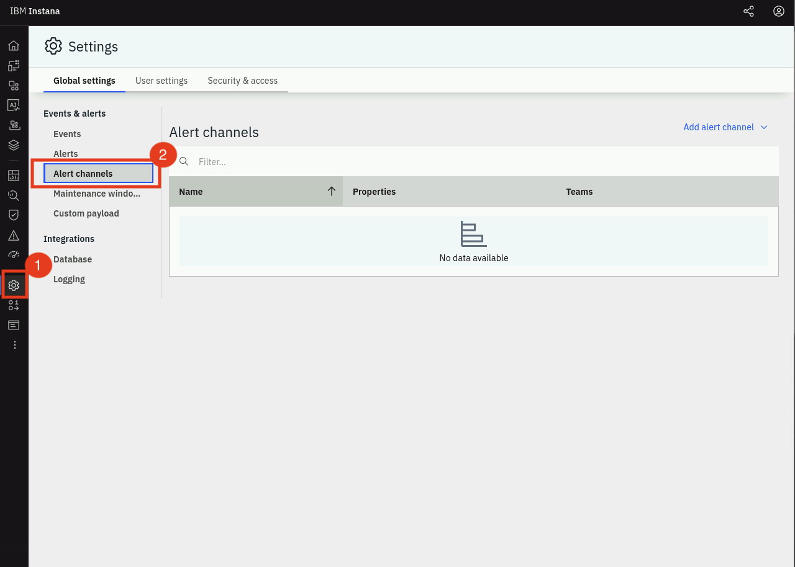

The screen will change to show the **Alert Channels**. Since this is a new
install of Instana, there are no Alert Channels defined.

In the upper right portion of the screen, click on the **Add Alert Channel**
dropdown and select **Email**

:::tip

There are several different types of **Alert Channels** to integrate **Events**
into a variety of solutions. The **Generic Webhook** is the most flexible and
supports integration into an number of tools like ServiceNow that support
webhooks.

:::

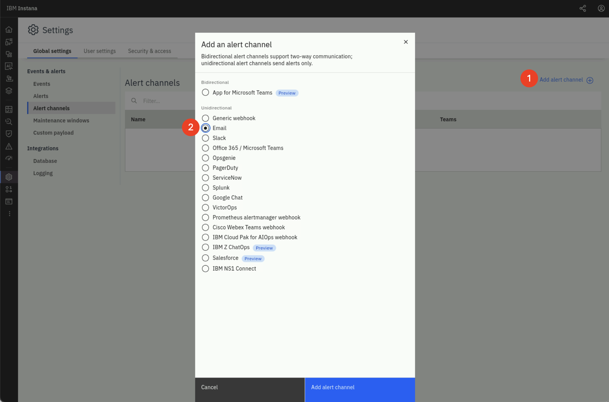

After selecting **Email** the screen will change to show the fields required to
configure the **Email Alert Channel**. An Alert Channel can be setup to notify
specific users or to notify a large group of users. For example, you might want
all database related Events to be sent to a _database team email alias_ for the
DBAs. Or, you might want to notify a specific line of business or the IT
Operations team.

Here are the steps for setting up the **Email** channel.

- Enter a name for the Alert Channel. The name can be anything, but should be
  meaningful. For example, if the Alert Channel will be used to notify the MQ
  admins, like in this case, call it something MQ related such as
  `MQ Email Channel`
- Enter the email address to notify. Notice that there is an **Add Email** link
  on the form if you want to add multiple email addresses. For this lab we will
  use `mqadmins@example.com`.

Next, click the **Send Test Email** button. This will attempt to send a test
email to the address you specified.

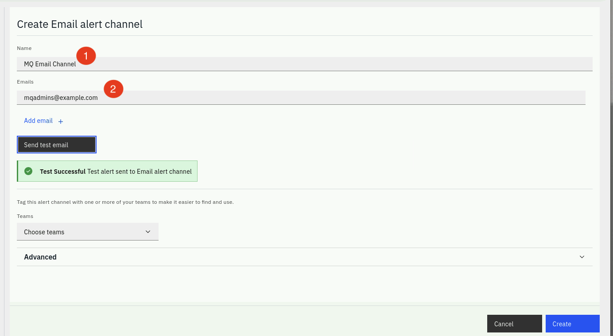

Check for the test email by opening the Firefox bookmark called **Mail** in a
new tab

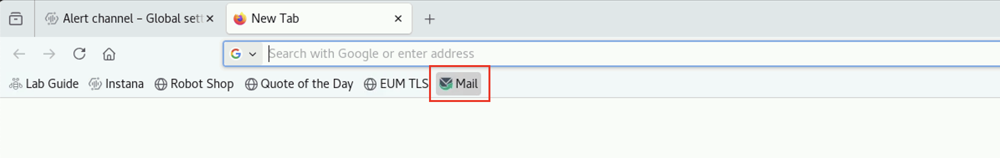

You should see the test email in the Inbox

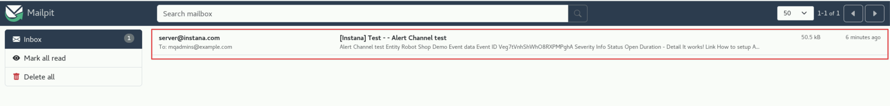

You can select the email for a preview

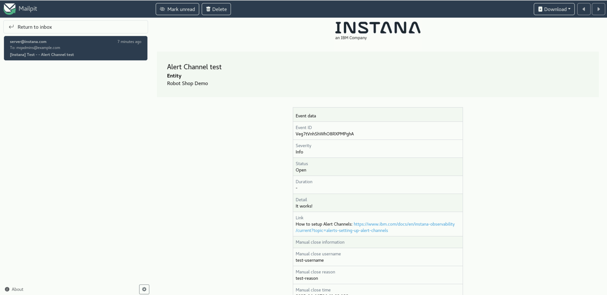

After successfully testing the Alert Channel, click the **Create** button to
save the **Alert Channel**

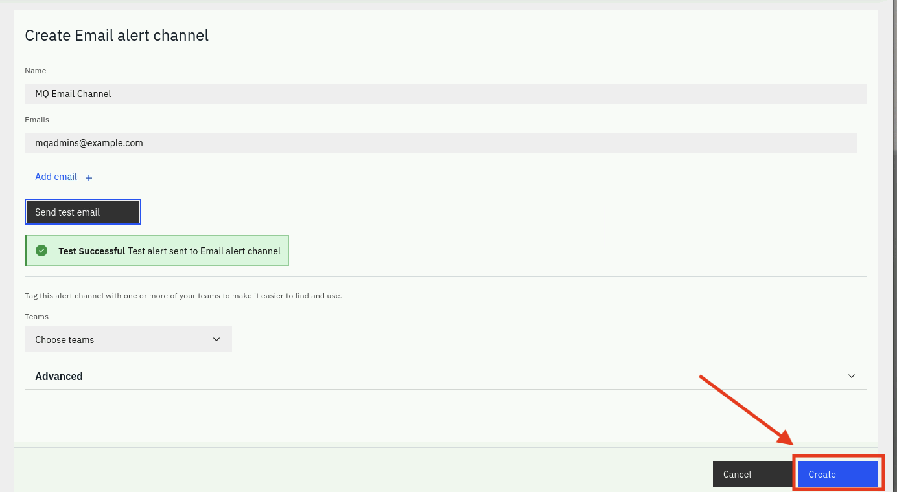

---

## 3.2: Create an Analytics Based Smart Alert

In this section, you will create an analytics based **Smart Alert** to detect
abnormal behavior within an application.

Click on **Applications** and then, select the **Quote of the Day** application.

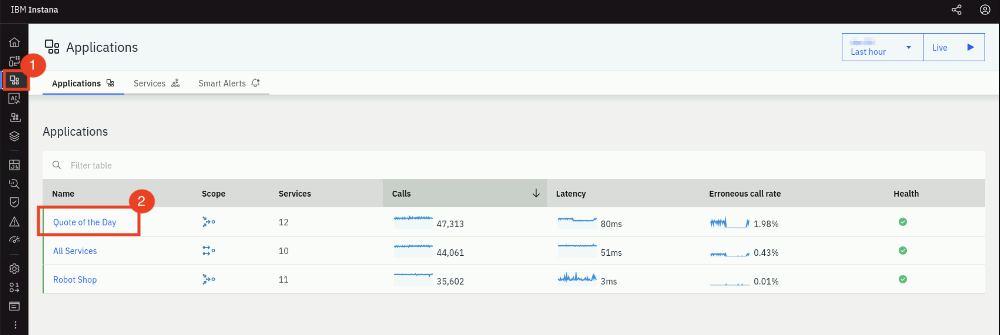

Click on **Smart Alerts** tab.

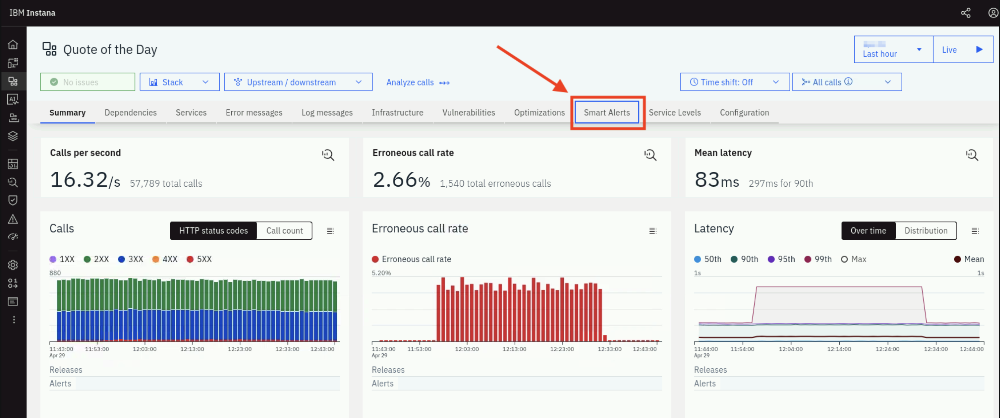

Then click on **Create Smart Alert** button.

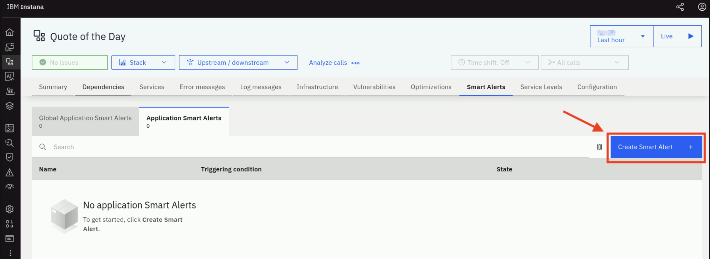

There is a simple and an advanced mode. We'll be using the advanced mode which
allows you to see all of the capabilities.

In the upper right corner of the dialog, select **Switch to Advanced Mode**

{/* 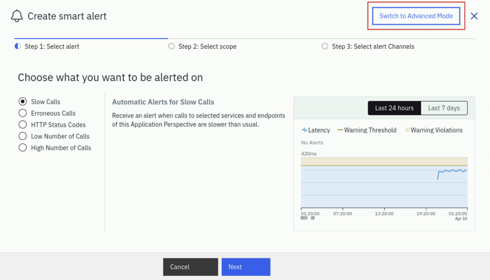 */}


You'll see that there are 4 different **Blueprints** for the Smart Alert

- Slow Calls
- Erroneous Calls
- HTTP Status Codes
- Throughput (both high and low numbers of calls)

Leave the default of **Slow Calls**

Leave the default Threshold as **Static**

:::info

During this lab, we will not be using the "Adaptive" Smart Alerts. This is
due to the fact that we don't have enough historical data.  They require
7 days of historical data.

:::

{/* 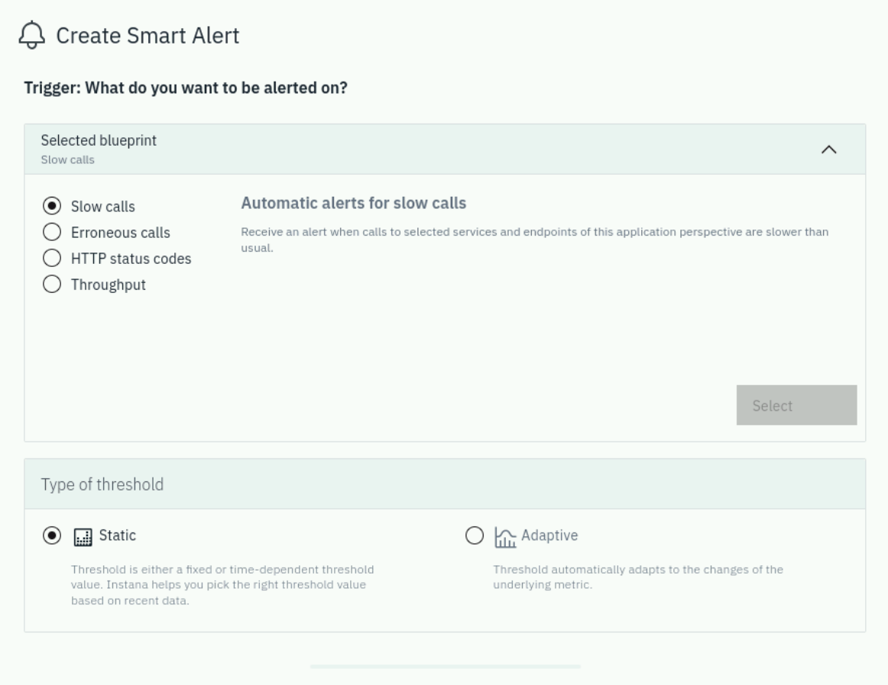 */}


Scroll down to the **Scope** section. You'll see that there are number of
options to determine which calls you want to analyze.

- You can analyze the calls for this application or you can analyze specific
  services or endpoints.
- You can analyze **Inbound Calls** or **All Calls**
- You can include **Internal Calls**
- You can include **Synthetic Calls**

Leave the default settings.

{/* 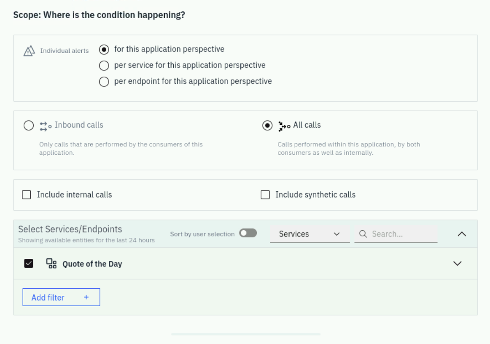 */}


:::tip

We could select **Per Service** instead of the default application-level scope.
This provides a much more realistic monitoring scenario. Application-level thresholds can be misleading
because they aggregate metrics across all services. For example, if "login" represents only 2% of
transactions but has really slow response times, it might not trigger an alert if other services are
performing well. By monitoring at the service level, you can detect performance issues in individual
services that might otherwise be hidden in application-wide averages.

:::

Scroll down further to the **Thresholds** section.

You'll notice that there are a variety of options including:

- The ability to change the percentile that is used for the evaluation
- The type of seasonality (static, daily, or weekly)
- whether you want to view the last 24 hours or 7 days of historical data
- Sensitivity.

:::info

You can try out some of the options, but keep in mind that analytics based
thresholds will require 5 days of data and your system has only been running for
a few hours. You will see the below warning until you have enough data.

{/* 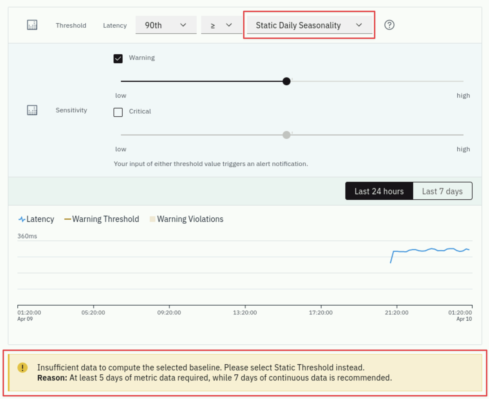 */}


:::

:::tip

Here is an example from an app that has been running longer. When you adjust the
sensitivity, the number of red triangles shown on the screen will change. These
red triangles indicate when thresholds would trigger if you had chosen that
setting.

{/* 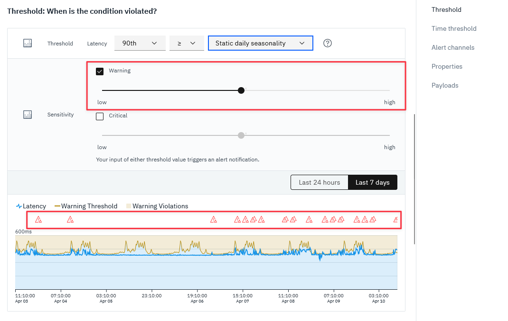 */}


You don't want to receive a lot of alerts by setting the sensitivity too high.
Usually, if you see more than 1 or two alerts per day, the sensitivity is
probably too high. But, it depends on the historical data that you're looking at
and the mission criticality of the application.

:::

In our case we will leave the default as **Static Threshold** for this section
as we do not have enough historical data. 
Usually, you can set the threshold by clicking on `Use suggested value...` which provides 
the suggested value that is based on the discovered pattern. But for our demo case, to proactively
trigger alerts, let's update the warning threshold value to `290ms` as in the screenshot below:

{/* 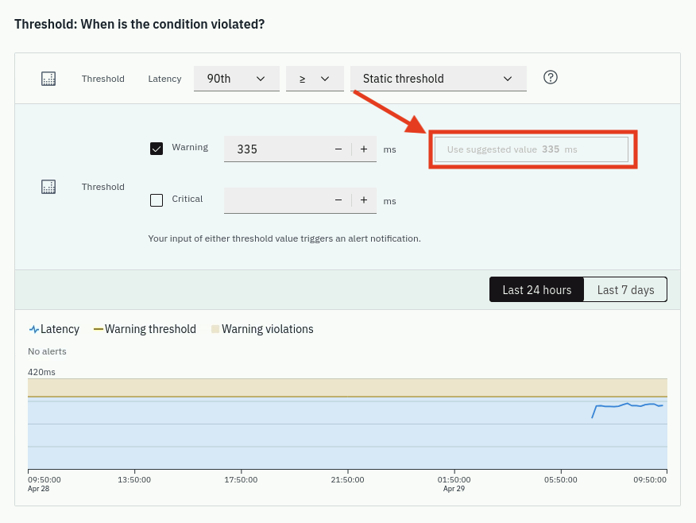 */}


Scroll down further to the **Time Threshold** options.

You'll see that there are options for persistence over time. This ensures that
the conditions trigger for a reasonable length of time before an alert is
raised.

{/* 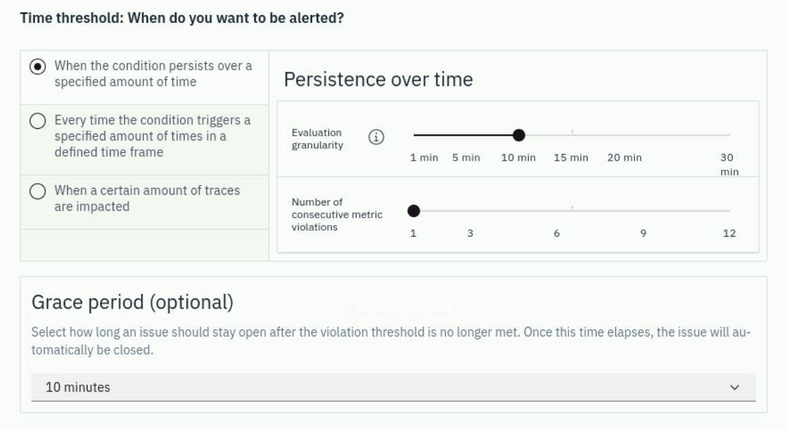 */}


:::info

**Understanding Grace Period:**

The Grace Period is particularly important for dynamic metrics like response time, CPU utilization,
and network performance. It prevents alert fatigue by ensuring that transient spikes don't trigger
unnecessary alerts.

For example, if response time briefly spikes above the threshold but quickly returns to normal,
the Grace Period prevents the issue from being closed and immediately reopened if another spike
occurs within the grace period window. This is especially valuable in dynamic environments where
metrics can fluctuate frequently.

:::

We can leave this section as default too, let's set the Grace Period to 10
minutes, which means the issue will be automatically closed after the violation
threshold is no longer met.

Scroll down further to the **Alert Channel**. Here we can select the Email Alert
Channel that you created in the previous section.

Select the **Select Alert Channels** button.

{/* 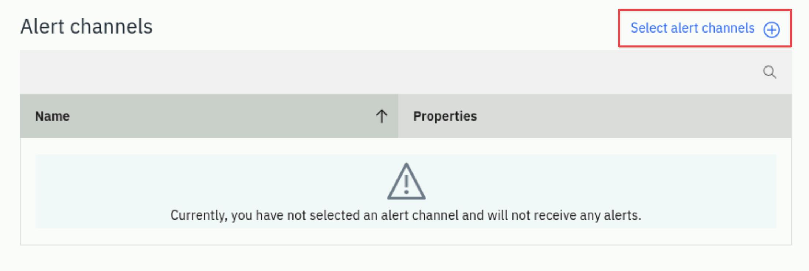 */}


A dialog will open with the Alert Channel that you created earlier. Select the
channel we set up earlier in this lab.

:::note

It is possible to select multiple Alert Channels. For example, you can notify
people via Email and Slack. Or, let's assume there is a database event, you can
notify the DBAs and you can notify that line of business that uses the database.

:::

{/* 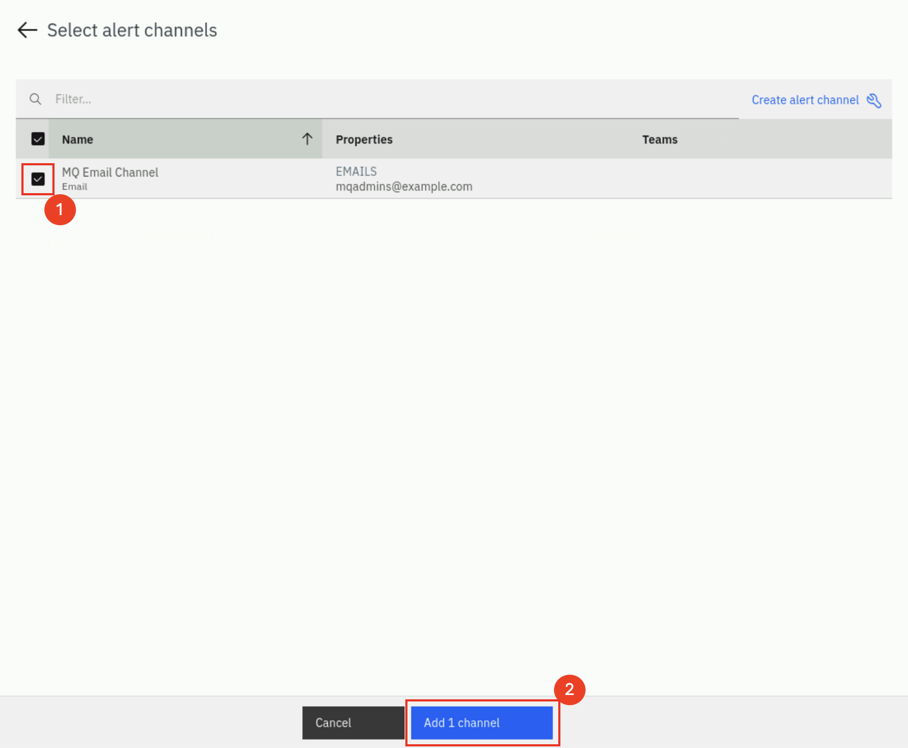 */}


Scroll further down on the page and you'll see a section titled **Additional
Alert Properties**

{/* 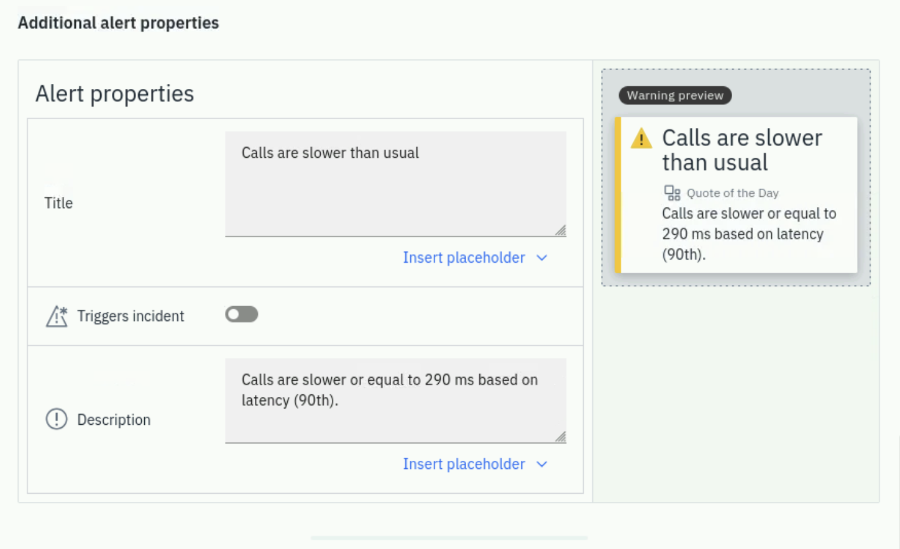 */}


In this section you will notice that there is a default title and description.
You can edit those fields and replace them with custom messages. As you type the
**Title** and **Description**, the upper right corner will update with a sample
of what the Event will look like when it triggers. There are other options such
as setting the **Alert Level** and whether or not the Event should be aggregated
into an **Incident**.

:::info

**Triggering Incidents:**

When you enable "Trigger Incident", Instana automatically correlates related Events and Issues
into a single Incident. This correlation is based on:
- **Host proximity**: Events occurring on the same or nearby hosts
- **Application relationships**: Dependencies that Instana discovers between services and components

This intelligent correlation helps reduce alert noise by grouping related problems together,
making it easier to understand the root cause and scope of issues.

:::


Scroll further down on the page and you'll see a section titled **Custom Payloads**.

Let's add 2 rows of custom payload for this alert:
- A Static type of custom payload with a key of `alert_environment` and a value of
`demo`
- A Dynamic type of custom payload with a key of `alert_service` and a value of **Service > Name** 

{/* 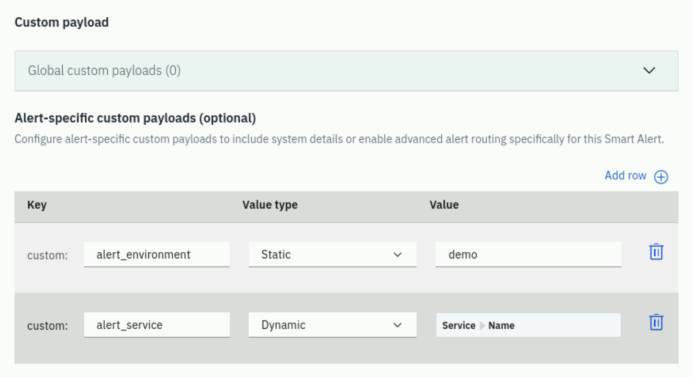 */}


:::tip

**Custom Payloads:**

Instana now supports Alert-specific custom payloads that can be configured to enrich the content of
your alerts. Custom payloads allow you to include additional context-specific information in
alert notifications, such as environment details, team contacts, or runbook links. This makes
alerts more actionable by providing responders with the information they need immediately.

The custom payloads information can be displayed in the alert notification, like you can receive the
following information in the email alert:
{/* 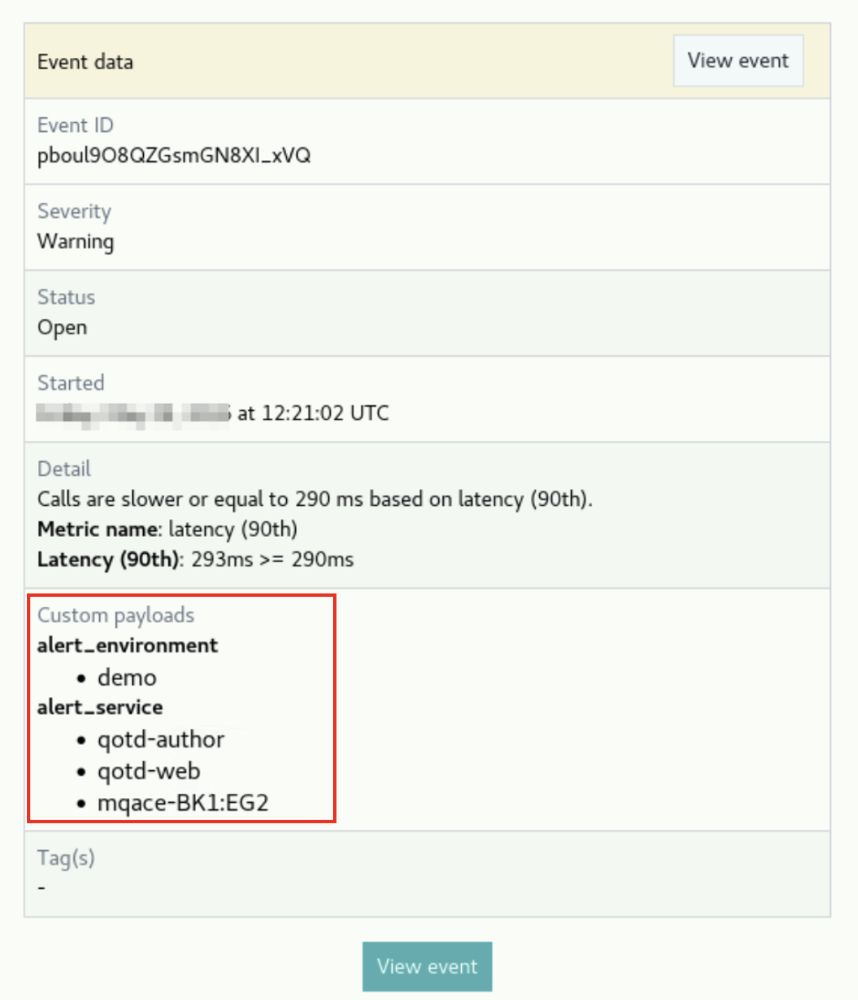 */}


:::

Fill in the fields as you desire. Then, click the **Create** button to create
the **Smart Alert**

The **Smart Alert** dialog will close and you'll be back in the context of your
application. You'll see a notification letting you know your Smart Alert has
been created.

{/* 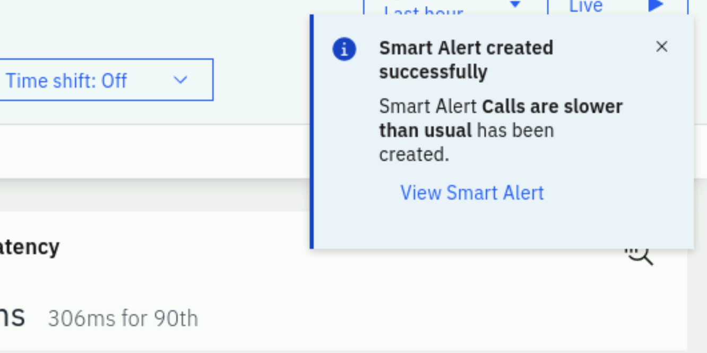 */}


The **Smart Alert** you just created is now listed.

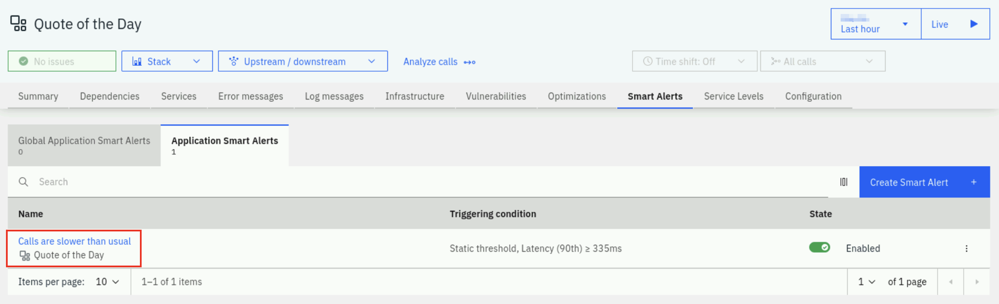

---

## 3.3: Create a Static Threshold (Event)

Now, let's examine how a more traditional threshold is created and used in
conjunction with Alert Channels.

On the left side of the screen, select the **Settings** gear.

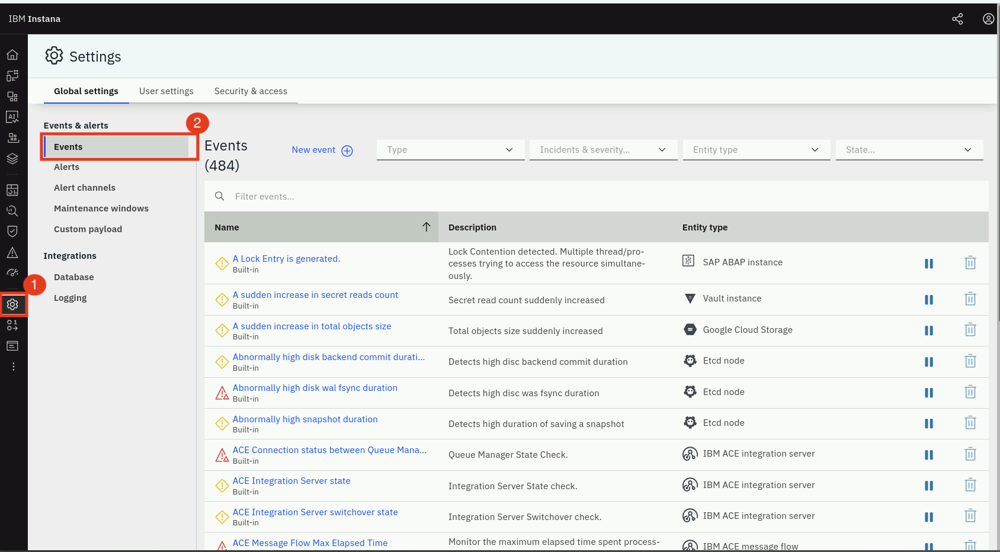

The Settings menu provides access to most of the administrative tasks within
Instana. You'll notice menus for Events, Alerts, Alert Channels, API Tokens,
Users, Groups, Log Management Integration, and more.

Ensure **Events** is selected

You will see a list of nearly 500 Events that are defined as out of the box thresholds
within Instana. If you want to filter the list, you can do that in a number of
ways via the drop down lists at the top of the page.

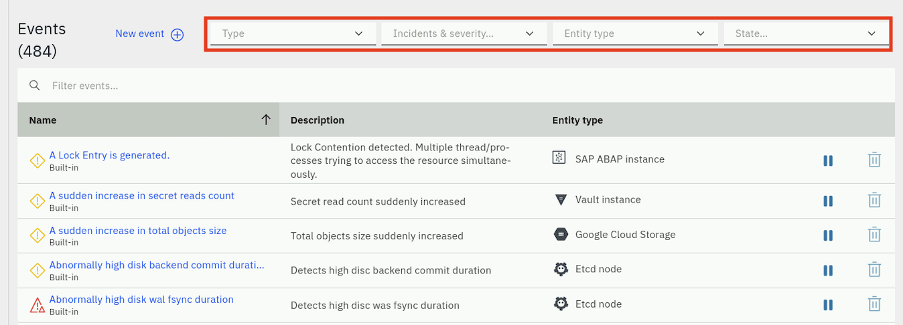

Notice that you can filter based on the Event type, severity, entity type,
state, or simply enter a keyword filter.

Select the **Entity Type** dropdown list and type `IBM MQ` into the field.
You'll notice that a few different options show up. Each of the options is an
Entity Type. You can filter on the Events related to the IBM MQ Queue Manager,
Queue, Channel, etc.

Select **IBM MQ Queue Manager** from the dropdown list.

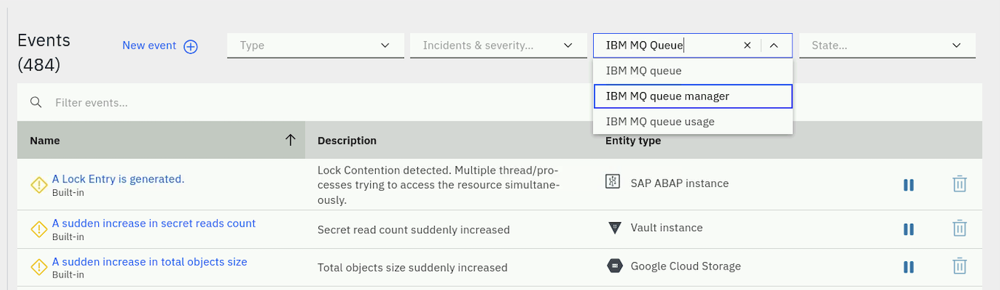

This will filter the Events to the list of Events that are written against the
IBM MQ Queue Manager entity type. There are several out of the box threshold
Events that will detect things like channel initiator status, queue manager
status, publish/subscribe engine status, and more.

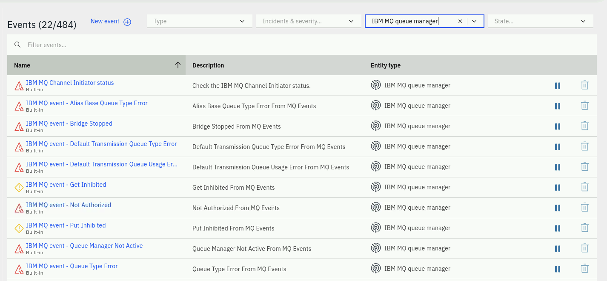

Let's create a new Event now.

At the top of the page, select the **New Event** button.

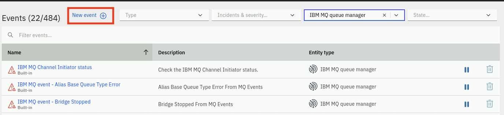

Fill in the following information for the new Event **Event Details** section:

- Give your Event a name, for example, `IBM MQ Queue Depth`
- Enter a description for the Event, for example, `Queue depth event`
- Select **Critical** severity
- Select the option of whether you want your Event to get correlated into
  Incidents
- Select a Grace Period.

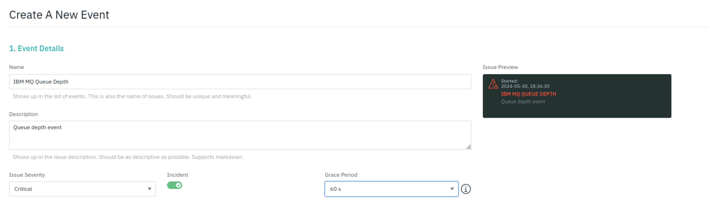

:::info

{/* The Grace Period is a capability that allows you to avoid getting multiple
alerts during flapping. Let's say you are monitoring for high CPU utilization on
a server. If CPU utilization goes High, then Low, then High over a short period
of time, you typically only want to see **ONE** event. By setting a "Grace
Period" of something like 60 seconds, you would only receive 1 Event during that
interval. */}

The Grace Period is a capability that delays the closing of an issue. 
If a server's CPU goes High (triggering an issue) and then drops back to normal, 
Instana waits for the duration of the Grace Period before resolving it. 
If the CPU goes High again within this period, the original issue remains open, 
preventing it from being closed and immediately reopened as a new alert.

:::

Fill in the following information for the **Condition** section:

Select the dropdown and choose **Built-in Metrics**. Most of your thresholds
will be written against these **Built-in Metrics**.

:::info

The choice of **Custom metrics** usually applies to custom metrics that are being
fed into Instana via OpenTelemetry, Prometheus, or StatsD etc. These are common
methods for ingesting application-specific or business metrics that aren't automatically
collected by Instana's sensors. The _System Rules_ are a specialized set of rules for doing
things like detecting that an entity is _offline_.

:::

Once you select **Built-in Metrics** another dropdown list will appear. The new
dropdown list is asking for the **Entity type** that you are going to write your
threshold against.

In the **Entity type** dropdown, select **IBM MQ Queue**. Notice that you can
type in letters such as `IBM MQ` to filter the list. The **Time Window** is the
duration that you want to monitor and evaluate, set this to **60 s**.

After specifying an **Entity type**, a new dropdown appears with a list of
available **Metrics**. Select the **Metric** dropdown and choose **Depth > Queue
Depth Percentage**.

After selecting the _Metric_ some new dropdowns appear on the screen looking for
the following information:

- **Aggregation**: Since Instana captures data at a high interval, you can use
  Min, Max, Avg, Sum as part of your evaluation.
  - **Relative Difference**: Compares the current value to a baseline (e.g., 20% higher than normal)
  - **Absolute Difference**: Compares the absolute change in value (e.g., increased by 100ms)
- **Operator**: What type of evaluation do you want to do (greater than, less than, equals, etc.)
- **Percentage**: This field is actually different depending on the metric you are
  evaluating. In this case, you are evaluating a metric that is a percentage.

Set the following:

- Aggregation: **max**
- Operator: **>**
- Percentage: **90**.

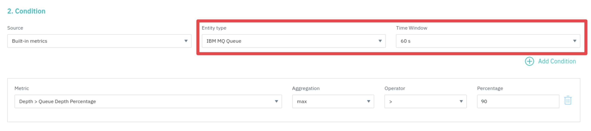

These settings will cause the threshold to evaluate the **Queue Depth Percent**
for 60 seconds and determine whether the maximum value during that interval
exceeded 90%. If it did exceed 90%, then the Event will trigger.

Finally, you now have to select the **Scope** that this threshold will apply to.

Select the dropdown list. In the dropdown list, you'll see the following
options:

- You have the option of applying this threshold to an **Application
  Perspective**. This would limit the scope of the threshold to a specific
  application.
- You can use a **Dynamic Focus Query** to filter to a specific list of MQ
  Queues.
- Or, you can have your threshold apply to **All Available Entities**.

Let's make this a global Event and choose the **All Available Entities** option.

{/* 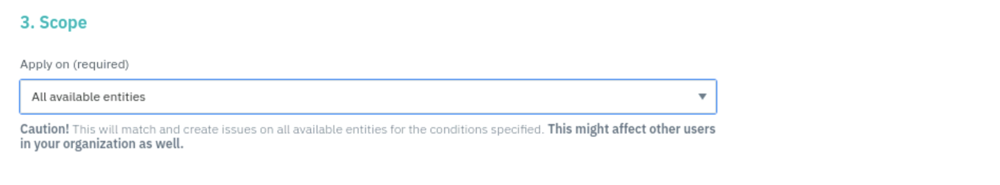 */}


You can configure transient events during the definition of the event.
**Transient Events** is a noise reduction feature. 
Instead of alerting you immediately for every blip, 
Instana uses historical data to predict if an issue will self-resolve quickly. 
If it predicts the issue is short-lived, it suppresses the alert notification to 
prevent mailbox fatigue.

We'll disable Transient Events for this Event so that you can see the alert 
trigger immediately when the threshold is breached.


Following section provides instructions on how to configure and 
use Transient Events for noise reduction.
<details>
<summary>How to Configure and Use Transient Events </summary>

**1. Enable the Feature**
* Action: Turn on the feature toggle (enabled by default).
* What it does: Instana will start analyzing newly triggered events against 
historical patterns and label them as Transient if they are predicted to be 
short-lived. 
(Note: Simply enabling this will not stop alerts, it only labels them).

**2. Set the Transient Threshold**

* Action: Define a time window (e.g., 5 minutes or 10 minutes).
* Rule of thumb: Set this to the maximum amount of time you are willing to 
wait before an issue genuinely requires human intervention. If an event is 
predicted to last less than this threshold, it is treated as a transient event.

**3. Choose Notification Behavior**

To effectively eliminate noise, change the default notification behavior:
* Select: `Only send an alert if an event persists after the threshold`
* How it works:
   * If an event triggers but Instana predicts it will self-resolve within 
   5 minutes -> Instana holds back (suppresses) the notification.
   * If it self-resolves within 5 minutes -> No alert is ever sent. (Noise reduced!)
   * If it outlasts the 5-minute threshold -> Instana fires the alert because 
   it is a real persistent issue.
</details>

Click the **Create** button to save your new Event.


:::tip

**Dynamic Focus Queries (DFQ):**

A Dynamic Focus Query allows you to filter the distribution down to a subset of target resources.
For example, you could specify:
- Specific queues or queue managers
- Specific hosts or clusters
- Resources with custom tags
- Any combination using AND, OR, NOT operators

If you wanted to apply your Event to a subset of the MQ Queues, you would
specify a Dynamic Focus Query. The query would look something like this:

```sh
entity.ibmmq.queue.name:abc* OR entity.ibmmq.queue.name:*xyz
```

The Event UI now provides guided assistance in building DFQs, making it easier to construct
complex queries without needing to manually type Lucene syntax.

A **Dynamic Focus Query** can be a complex expression using AND, OR, NOT, etc.
to filter to a subset of the entities. These queries are built using the
**Lucene** query language. For more information on the **Lucene** query
language, see the project documentation:
[Lucene's Query Language](https://www.ibm.com/docs/en/instana-observability/current?topic=instana-filtering-dynamic-focus)

:::

---

## 3.4: Setting up an Offline Event

A common monitoring scenario is to setup an **Offline** Event to detect an
Entity going offline. We're going to create an **Event** that will detect when an
**IBM MQ Queue Manager** goes offline.

To do this, select **New Event** again.

Enter the name `Queue Manager Offline`.

Enter the description `An IBM MQ Queue Manager has gone offline`.

Select a **Grace Period** of **10s**.

Select **System Rules** as the **Source** under _2. Condition_. Then, select
**Offline event detection** for the **System Rule**

Next, select the scope. Choose **Selected Entities Only (Dynamic Focus Query)**.

In the **Dynamic Focus Query**, you are going to specify a filter for IBM MQ Queue Managers.
We want to detect when any Queue Manager goes offline. Enter the following query:

```sh
entity.selfType:ibmmq.qm
```

:::info

We use **entity.selfType** instead of **entity.type** because the former filters only the
specific entity type without including child entities. This ensures we're monitoring only
the Queue Manager itself, not all the queues, channels, and other entities associated with it.

:::

Your Offline Event should look like this:

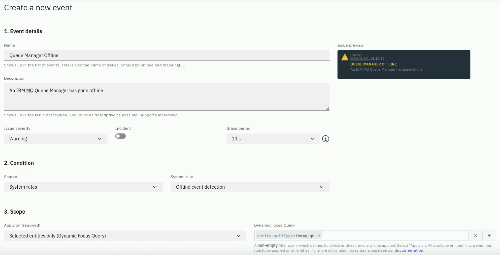

Click the **Create** button to save your Event.

:::tip

If you want to see how **entity.type** vs. **entity.selfType** behaves, you can open the
Infrastructure view and add the queries into the search bar and see the results. When you
use **selfType**, you'll notice that the entity towers **do not contain the child entities**
(represented as pizza boxes) that are associated with the parent entity.

{/* 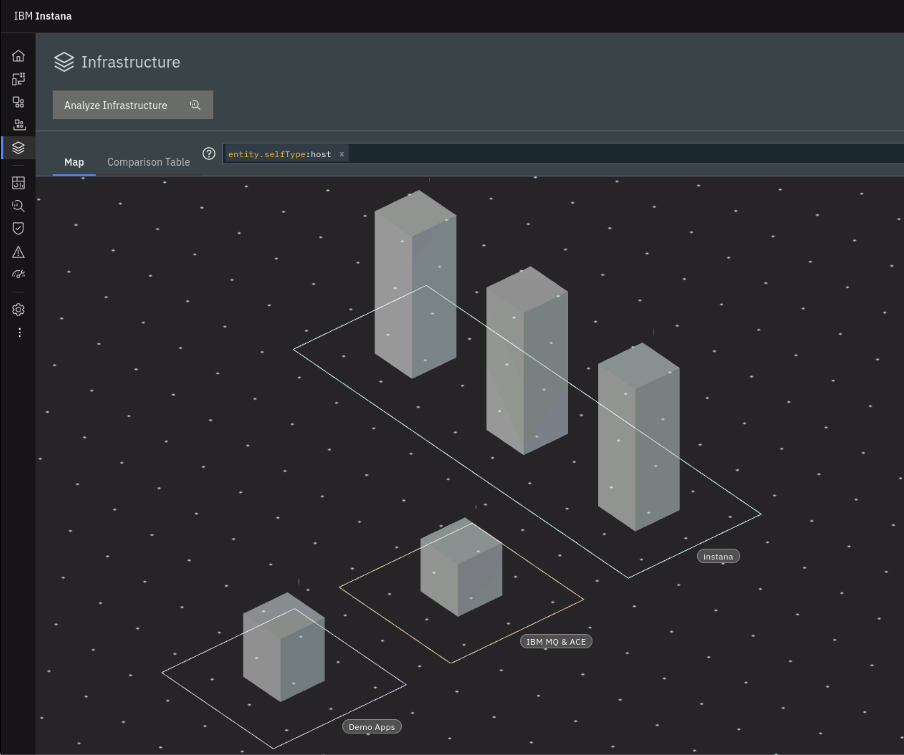 */}


:::

---

## 3.5: Setup an Alert for the New Event

Now that you have a new Event defined, you need to define an Alert.

Alerts are used to notify people and teams via various Alert Channels. You
previously reviewed the options for Alert Channels. The Alerts will be sent to
one or more Alert Channels that you select.

Select **Settings** on the left side navigation. Then select **Alerts**

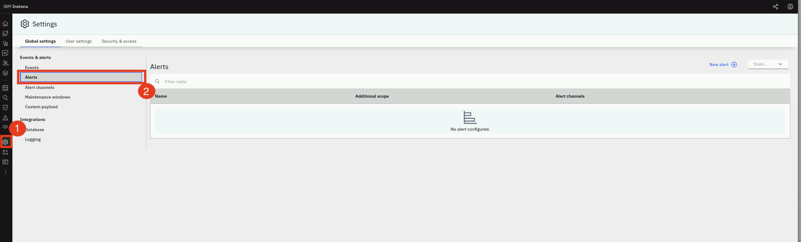

Click on the **New Alert** button

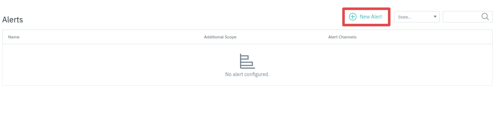

Give the new **Alert** a name. Normally, the **Alert** name is something
meaningful to indicate who will be notified and the type of events being sent.
For example, **MQ Alerts**

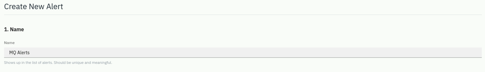

Under **Events** you will see that there are multiple options. You can setup an
Alert for a particular Entity Type. For example, you might setup an Alert for
all Oracle Database Events.


Select **Alert on Event(s)** from the dropdown. This option allows you to select
a specific list of Events to forward to an Alert Channel(s).

:::tip

**Alternative Alert Configuration:**

Another way to define Alerts is to select **Alert on Event Types** and then use a Dynamic
Focus Query (DFQ) to filter it down to certain entity types. For example, MQ administrators
could receive all Events for MQ entity types by filtering on `entity.type:ibmmq*`. This
approach is useful when you want to capture all events for a specific technology or team
responsibility area without having to select individual events.

:::

Select the **Add Events** button.

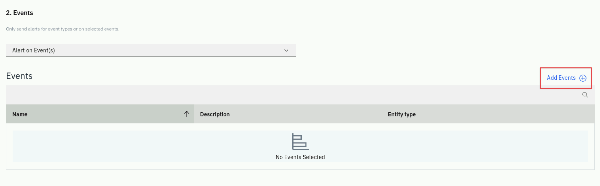

Initially, you will see a list of all Events.

Filter the list to just a specific **Entity Type**. Select the **Entity Type**
dropdown list and select **IBM MQ Queue**. You will now see a filtered list of
Events related to IBM MQ Queues.

Find the Event you created in the previous section and select the checkbox.
Then, select the **Add 1 Event** button at the bottom.

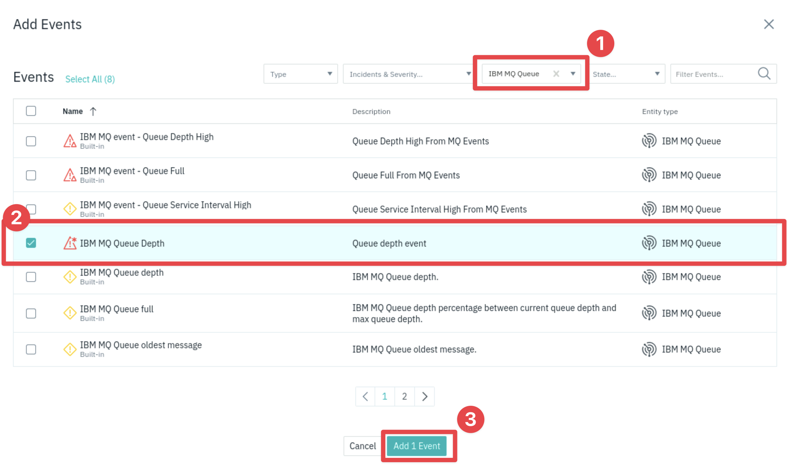

You will now see the 1 selected Event listed.

Scroll down to the **Scope** section. This determines which Entities this Alert
will apply to.

Select the **Apply on** dropdown list. You'll see that you can choose one of 3
options:

- Application Perspective: This option allows you to limit the scope of the
  alert to a specific application.
- Selected Entities Only: You use the dynamic focus queries to filter to a
  specific set of Entities
- All Available Entities: The Alert would apply to any Entity that triggered the
  Event threshold.

Select the **Selected Entities Only** option

A new widget will appear on the right side of the screen asking you to specify
the **Dynamic Focus Query**

In the entry field, enter the lucene query that will filter to the queue that is
used for the **Quote of the Day** application. In this case, we are looking for
1 specific queue. Enter the following value:

```sh
entity.ibmmq.queue.name:CP4I.DEMO.API.Q
```

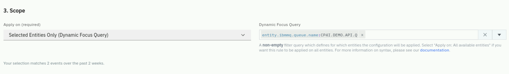

:::note

Depending on the randomness of the load generation you may not see any selection
matches over the past 2 weeks like in the above screenshot. If you want to
trigger this alert more easily you could edit the custom event you created and
reduce the **Grace Period** to **10s** and the **Queue Depth Percentage** to
**50**.

:::

Next, click on the **Add Alert Channels** button.

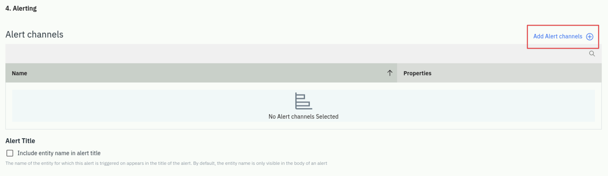

A dialog will open with a list of available **Alert Channels**. Select the Alert
Channel that you created earlier.

Then, click the **Add 1 Channel** button.

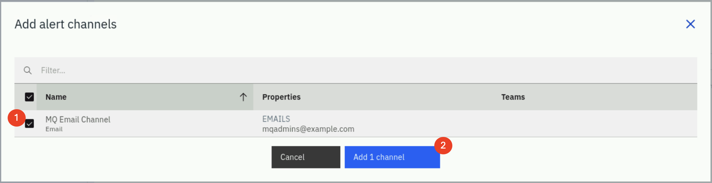

Scroll down to the bottom. You will see an optional section where you can add
custom payloads by adding Key/Value pairs.

:::info

**Custom Payloads:**

Custom payloads allow you to add additional context to your alerts by including key/value
pairs that will be sent with the alert notification. This is useful for including information
like:
- Team contact information
- Runbook URLs
- Environment identifiers
- Escalation procedures

For this lab, we'll skip adding custom payloads, but in production environments, these are
commonly used to make alerts more actionable.

:::

Finally, click the **Create** button to save your Alert.

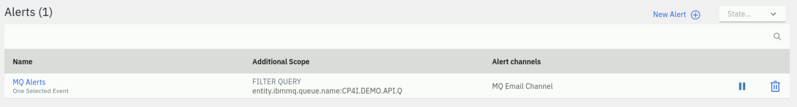

:::tip

You can use the **Mail** bookmark to view alert emails that are sent for the
alerts you have setup.

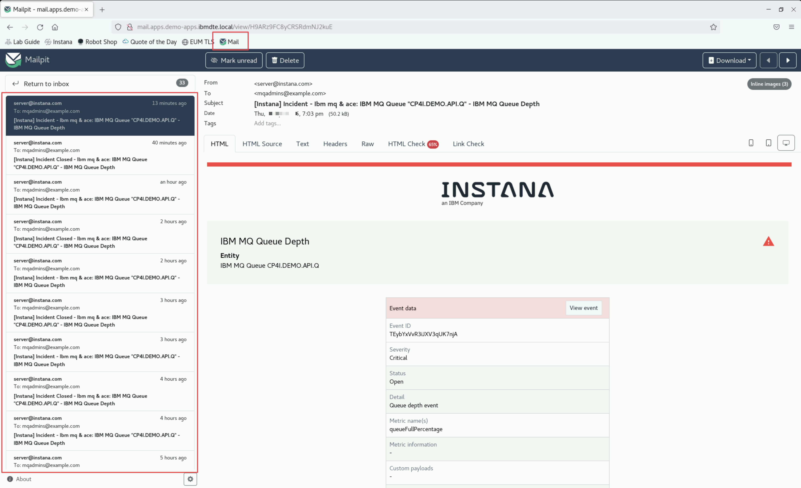

:::

---

## 3.6: Global Custom Payloads (Optional)

Global Custom Payloads are a powerful feature that many Instana customers use in production
environments. Unlike the alert-specific custom payloads we saw earlier, Global Custom Payloads
apply to all alerts, making them ideal for organization-wide standards.

:::info

**What are Global Custom Payloads?**

Global Custom Payloads allow you to define key/value pairs at the Alert level that will
be automatically included in alert notifications. This is particularly useful for:

- **Consistent metadata**: Ensure all alerts include standard fields like environment, region, or business unit
- **Integration requirements**: Add fields required by downstream systems (e.g., ServiceNow, PagerDuty)
- **Organizational standards**: Include company-specific information like cost center or support team
- **Dynamic values**: Use Instana's placeholder variables to include context-specific information

:::

### Configuring Global Custom Payloads

To configure Global Custom Payloads:

1. Navigate to **Settings** → **Global settings** → **Events & alerts** → **Custom payload**
2. Specify the Key/Value pairs that should be included in an alert. You can use static values or dynamic 
placeholders that Instana will replace with actual values when the alert is sent. 
3. Click **Save** to apply the Global Custom Payloads.

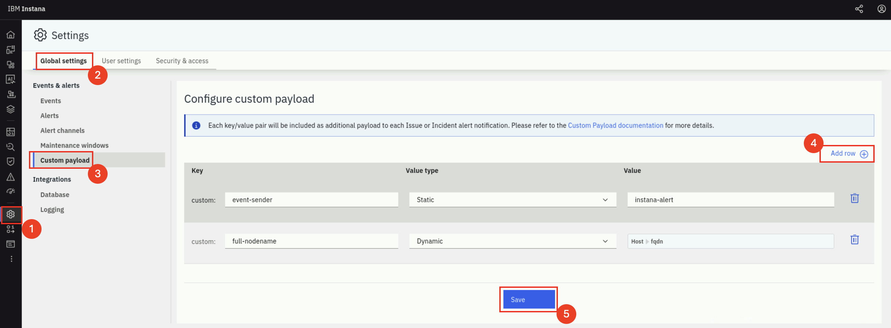

**Example Custom Payload Keys:**
- `environment`: production, staging, development
- `team`: database-team, mq-team, application-team
- `severity_mapping`: Map Instana severity to your organization's levels
- `runbook_url`: Link to troubleshooting documentation
- `escalation_policy`: Define escalation procedures


4. When you create an alert, you will be able to view the Global Custom Payloads that you have defined.

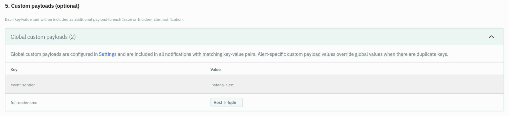


For this lab, we won't configure Global Custom Payloads, but understanding this feature is
important for production deployments where consistent alert formatting is critical.

---

## 3.7: Summary

At this point, you have created an Event and an Alert for that Event. The next
time the custom **Event** that you created triggers, an **Alert** will be sent
to the **Alert Channel**. In this case, a Email will be sent.

In this exercise lab, you learned how to:
- Create an Alert Channel for notifications
- Create application Smart Alerts based on application metrics and analytics.
- Configure Incident correlation and Custom Payloads
- Create traditional threshold-based Events and explore nearly 500 out-of-the-box build-in events.
- Use Dynamic Focus Queries to filter monitoring scope
- Configure Transient Events for noise reduction
- Set up Offline detection for critical entities
- Understand Global Custom Payloads for organization-wide standards

---
