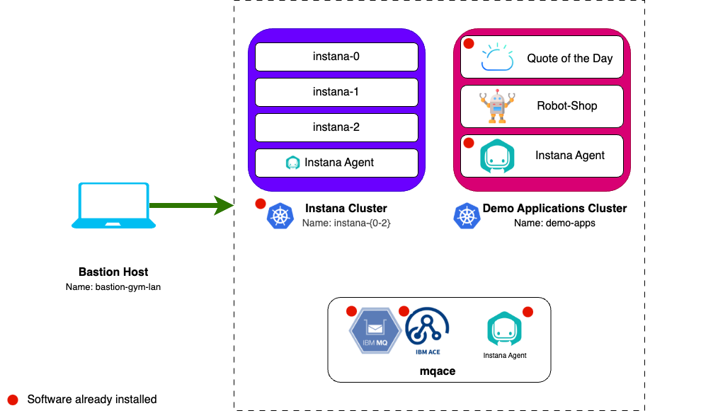

# Lab Environment

The lab environment includes 2 Openshift clusters and 3 VMs.

Openshift clusters:

1. **AIOps OCP Cluster** - Not required for this lab.
2. **Apps SNO Cluster** - An instance of Single Node OpenShift where you will
   install the Robot Shop demo application that will be monitored using Instana.
   There is a pre-installed demo application called Quote of the Day that will
   be integrated with IBM MQ and ACE to demonstrate further the Instana Servers
   monitoring capabilities.

Virtual Machines:

1. **Guacamole VM** - A RHEL VM that will be used as the _bastion_ host into the
   lab network. Guacamole has access to all lab VM's and clusters and will be
   your primary workstation for these labs.
2. **Instana** - An Ubuntu VM with an instance of Instana Server and Instana
   Agent running running in Docker.
3. **MQACE** - An Ubuntu VM that contains the pre-installed IBM ACE and MQ
   middleware.

## Prerequisites

To complete this lab you will require the following:

- Instana License
  - Agent Key - Entered when requesting lab environment
  - Sales Key - Entered when requesting lab environment

## Requesting a Lab Environment

:::info

Follow
[these instructions](/waiops-tech-jam/labs/jam-in-a-box/#requesting-a-lab-environment)
for step by step guidance on requesting a lab environment in IBM Tech Zone.

:::

Request Tech Zone environment:

- [Jam-in-a-Box: Instana - Apps & IBM Middleware](https://techzone.ibm.com/my/reservations/create/649cd3d0fc016400174bed27)
