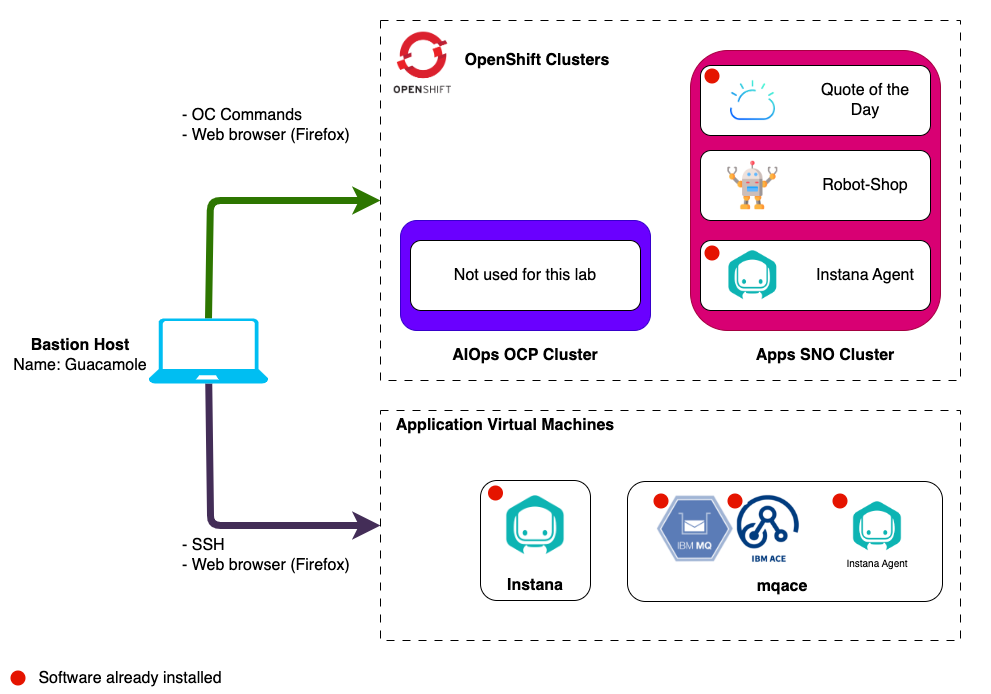

import LicenseInfo from "@site/src/components/Instana/LicenseInfo"
import RequestingLabEnvironment from "@site/src/components/requestingLabEnvironment/RequestingLabEnvironment"
import CreateIbmId from "@site/src/components/createIbmId/CreateIbmId"

# Lab Environment

The lab environment includes 6 VMs.

1. **Bastion VM** - A RHEL VM named `bastion-gym-lan` that will be used as the
   _bastion host_ for the lab network. This Bastion host has access to all lab
   VM's and will be your primary workstation for these labs.
2. **Instana VMs** - 3 Ubuntu VMs that are running a multi-node self-hosted
   Instana server on K3s.
3. **MQACE** - An Ubuntu VM that contains the pre-installed IBM ACE and MQ
   middleware.
4. **Demo Applications Cluster** - An Ubuntu VM running K3s, it has the Instana
   Agent and Quote of the Day demo application running. It will be used to
   install the Robot Shop demo application in this lab.

## Prerequisites

<CreateIbmId />

<LicenseInfo />

## Requesting a Lab Environment

<RequestingLabEnvironment
   environmentName="Jam-in-a-Box: Instana - Apps & IBM Middleware"
   environmentUrl="https://techzone.ibm.com/my/reservations/create/67ec9e6d673783a07149cef3"
/>
