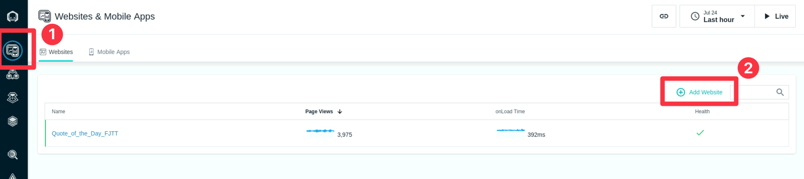
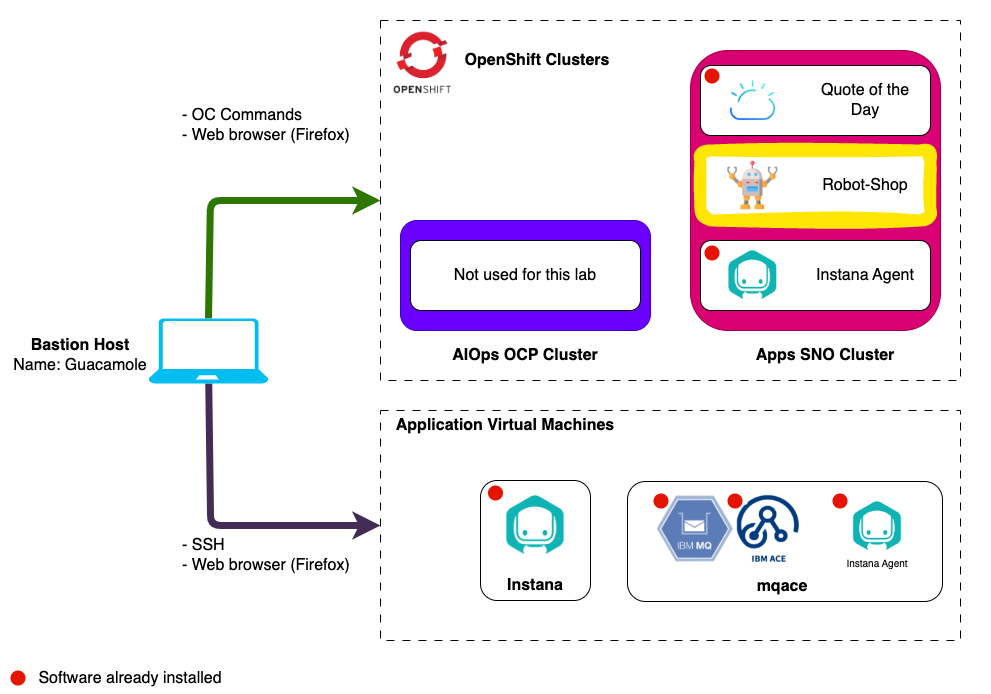
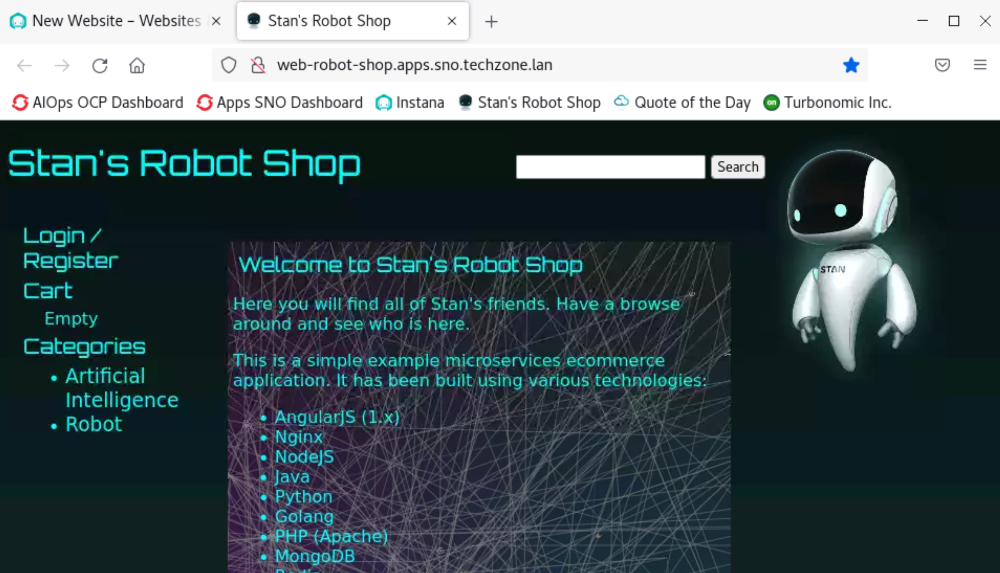
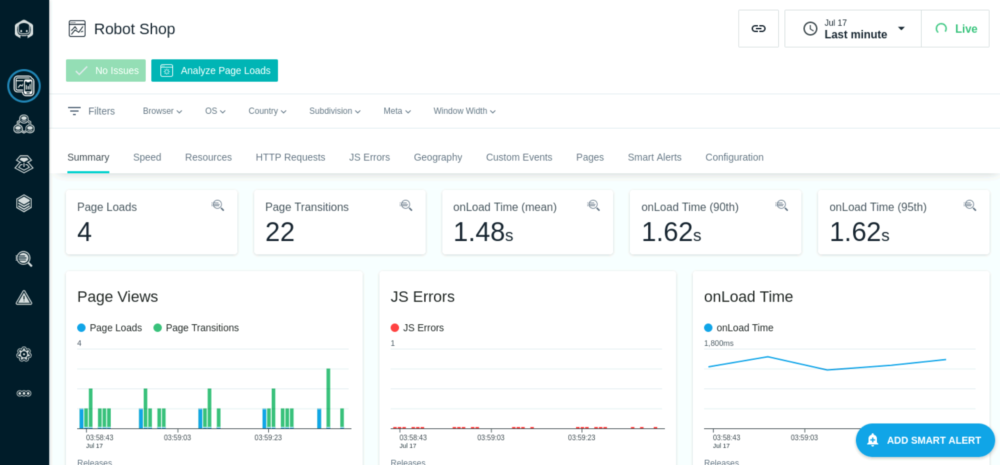

import WorkshopOnly from "@site/src/components/workshop/WorkshopOnly"

# Install the Robot Shop Application

<WorkshopOnly>

:::warning mandatory prerequisite setup

You are in a workshop setting which uses a single base classroom environment for
all the lab exercises. In order to ensure the required prerequisite setup and
dependencies for this lab are in place, please execute the following automation
before proceeding with the lab instructions below:

```bash title="Execute on bastion node as admin user"
ansible-playbook -i ~/ansible/hosts \
    ~/demo-scenarios-aiops/ws_instana_101/playbooks/ad-hoc-qotd-deploy.yml
```

:::

</WorkshopOnly>

## 3.1: Introduction

In this lab, you will learn how to install the demo application, **Robot Shop**.

Robot Shop is pre-configured with changes needed to enable Instana monitoring.
Some technologies such as java don't require any configuration, but others
require configuration changes so the application can be monitored.

During the install, you will also specify the required information that is
necessary for Instana to monitor the End User Experience (EUM) / Real User
Monitoring (RUM) data.

---

:::tip

If you are unsure how to get access to the Bastion host (Guacamole) see
[Accessing a Lab Environment](/waiops-tech-jam/labs/jam-in-a-box/#accessing-a-lab-environment)

:::

From the Bastion host open the Firefox browser and select the **Instana**
bookmark.


:::info

You can safely ignore the warning about the certificate being untrusted.


:::

When prompted, enter the Instana username and password as seen below.

- Username: **admin@instana.local**
- Password: **Passw0rd**


## 3.2: Create the Website in Instana

If you want to capture EUM/RUM data within Instana, you must first create a
website within the GUI (or via API).

From the Instana GUI, on left side navigation, select **Websites & Mobile
Apps**. Then, click the **Add Website** link.



You'll see a dialog where you can enter a Website Name (If it's the first time
you open the Website & Mobile Apps page, you won't have any existing website
configured, then you'll directly see this dialog). Enter `Robot Shop` as the
website name and click the **Add website** button.


A new dialog containing some options and javascript will open. Leave the options
as is.

In a more typical application, you would follow the instructions and copy/paste
the javascript into the website's `<head/>` tag.

:::info

Note: For Apache and IBM HTTP Servers, you do not need to update the HTML pages.
You can configure the Instana agent where the Apache HTTP Server is present, to
automatically inject the JavaScript agent into the website to enable website
monitoring. Refer to
[Website automatic instrumentation](https://www.ibm.com/docs/en/instana-observability/current?topic=websites-automatic-instrumentation)
for more details.

:::

Robot Shop has already done some of the work for us by embedding this script
with variable placeholders for the unique values into the application. When we
deploy the application, we can pass parameters into the Helm Chart to populate
the unique variables. There are two parameters within the javascript that we
will need to copy and use when we do the install. You will need the **key** and
the **reportingURL**. Either copy those parameters now or leave this dialog open
so that you can retrieve it later.


---

## 3.3: Install Robot Shop

We will install Robot Shop on the Demo Applications Cluster in the **demo-apps**
vm.



The full installation instructions for **Robot Shop** can be found
[here](https://github.com/instana/robot-shop). You'll notice that there are
instructions for installing **Robot Shop** into a number of different
environments including docker, kubernetes, and OpenShift. This lab uses a
Kubernetes environment, so we'll be following those steps.

We have documented the steps below, so there is no need to refer to the GitHub
instructions.

:::info Important

This section should be run from the **demo-apps** host.

From the Bastion host, open a new terminal window by selecting **Activities** at
the top left of the screen and then the terminal icon.


Run the following to connect to the **demo-apps** vm:

```sh
ssh jammer@demo-apps
```

Enter `yes` when prompted _if you are sure you want to continue connecting_.

Run the following command to become the _root_ user:

```sh
sudo -i
```

:::

We will use **Helm**, a package manager for Kubernetes to install Robot Shop.
First install Helm by running the following commands:

```sh
curl -fsSL -o get_helm.sh https://raw.githubusercontent.com/helm/helm/main/scripts/get-helm-3
chmod 700 get_helm.sh
./get_helm.sh
```

Clone the Robot Shop GitHub repository by running the following command:

```sh
cd ~ && git clone https://github.com/instana/robot-shop.git
```

Create the `robot-shop` namespace:

```sh
cat <<EOF | kubectl apply -f -
apiVersion: v1
kind: Namespace
metadata:
  name: robot-shop
EOF
```

Install the **Robot Shop** application using Helm:

1. Set your reporting URL by replacing **your-instana-reporting-url** with the
   **reporting URL** from your website definition in the Instana UI. Then, run
   the command below.

:::info

- **your-instana-reporting-url** is the _reportingURL_ you obtained in section
  3.2. <br/> Example: `https://instana-0.ibmdte.local/eum/`.

:::

```sh
export REPORTING_URL=<your-instana-reporting-url>
```

1. Set your key value by replacing **your-instana-key** with the **key** from
   your website definition in the Instana UI. Then, run the command below.

:::info

**your-instana-key** is the **key** you obtained in section 3.2 from the Instana
user interface. <br /> Example: `cYd1TSDZQBCIUfYCGMvV8A`.

:::

```sh
export EUM_KEY=<your-instana-key>
```

1. Deploy the Robot Shop application with the following Helm command:

   ```sh
   helm install robot-shop \
   ./robot-shop/K8s/helm \
   --set eum.key=${EUM_KEY} \
   --set eum.url=${REPORTING_URL} \
   --set redis.storageClassName="local-path" \
   -n robot-shop \
   --kubeconfig=/etc/rancher/k3s/k3s.yaml
   ```

If successful, you should see the results similar to what's shown below.


Check the status of the Robot Shop deployment by watching the pods:

:::note

Type `Ctrl-C` to exit the watch loop.

:::

```sh
kubectl get pods -n robot-shop -w
```

If the install was successful, you'll see the following pods running.

:::info

If some of the pods (for example _ratings_ or _shipping_) show **0/1** instead
of **1/1** in the READY column or the pods aren't yet in a **Running** state you
may need to wait a little longer. It can **take as much as 15 minutes** before
all of the pods are running. If you don't want to wait, you can exit the watch
and proceed to the next steps.

:::


Finally, we want to expose the Robot Shop UI. K3s includes a Traefik Ingress
Controller that we can use to create a new Ingress for the app. Run the
following to create the ingress:

```sh
cat <<EOF | kubectl apply -f -
apiVersion: networking.k8s.io/v1
kind: Ingress
metadata:
  name: robot-shop-ingress
  namespace: robot-shop
spec:
  rules:
  - host: robot-shop.apps.demo-apps.ibmdte.local
    http:
      paths:
      - path: /
        pathType: Prefix
        backend:
          service:
            name: web
            port:
              number: 8080
EOF
```

The url to the application has already been saved to a bookmark called **Robot
Shop** in Firefox. Alternatively you can issue the following command to get the
url to the application

```sh
kubectl get ingress -n robot-shop
```

The result should look similar to: `web-robot-shop.CLUSTER_DOMAIN`. In our case
it is **robot-shop.apps.demo-apps.ibmdte.local**


Wait for all pods to be in a running state before you continue.

Open a new Firefox tab and select the **Robot Shop** bookmark to navigate to the
Robot Shop application.

:::tip

If using the route you printed earlier make sure you pay attention to the 'Port'
field, for this application you will be using http (80) instead of https (443).

:::



### Workaround Required for Robot Shop

You can now navigate and use the Robot Shop application, however if you navigate
to **Websites & Mobile Apps** > **Robot Shop** you will not see any EUM data
displayed in Instana.


The reason this is happening is because the Instana EUM reporting URL uses HTTPS
`https://instana-0.ibmdte.local/eum/` and the browser is not able to verify the
Self Signed Certificate used by Instana in this lab.

To fix this first issue we need to manually accept the Self Signed Certificate,
from Firefox select the bookmark **EUM TLS** and accept the certificate by
selected **Advanced...** and then **Accept the Risk and Continue**.


If you have done this correctly you should now see the _eum.min.js_ file.


You can now close the tab.

---

## 3.4: Setup Automated Load

Now that the application is running and EUM data in displaying, we can generate
some artifical traffic against the Robot-Shop application.

Issue the following command to install the load generation pod.

```sh
cat <<EOF | kubectl create -f -
apiVersion: apps/v1
kind: Deployment
metadata:
  name: rs-website-load
  namespace: robot-shop
  labels:
    service: rs-website-load
spec:
  replicas: 1
  selector:
    matchLabels:
      service: rs-website-load
  template:
    metadata:
      labels:
        service: rs-website-load
    spec:
      containers:
      - name: rs-website-load
        env:
          - name: HOST
            value: "http://web:8080/"
        image: brightzheng100/rs-website-load:latest
EOF
```

Run the **kubectl get pods** command.

```sh
kubectl get pods -n robot-shop
```

You should now see an additional pod named **rs-website-load-\*** running within
the project.

Navigate to **Websites & Mobile Apps** and select the the **Robot Shop**
application you just created. After a few minutes you should begin to see
traffic in the Robot Shop dashboard.

:::tip

You can change the filter at the top right of the page to **Live** and **Last
minute** to see the traffic in real time.

:::



---

## 3.5: Summary

In this section, you learned how to install an application that includes
monitoring and configure it for Website EUM/RUM monitoring.

Now you can proceed to the next section of the lab where you will configure the
monitoring for IBM MQ and IBM App Connect Enterprise (ACE).

---
