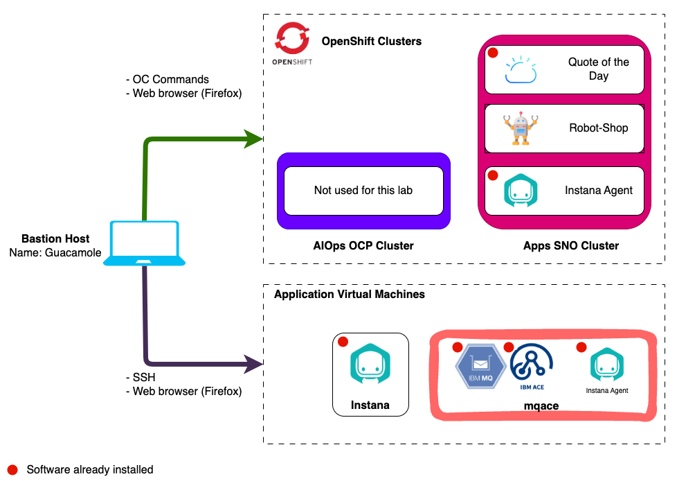
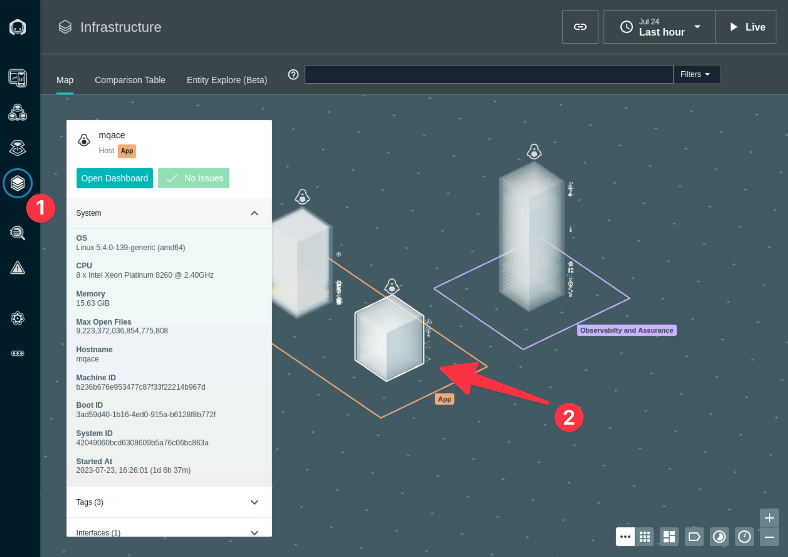

# Monitoring IBM Middleware

## 4.1: Introduction

Positioning Instana at existing IBM customers often requires presenting the
Instana value proposition in the context of other IBM middleware used by the
client. In this section, you will find guidance about configuring and using
Instana with the following IBM technologies:

- MQ
- App Connect Enterprise (ACE)

These have already been installed for us, ready to be configured on the
**mqace** virtual machine.



---

## 4.2: Confirm MQ & ACE are running

Open a new terminal tab, ssh to the **mqace** machine and change to the root
user:

> Type **yes** when asked if you are sure that you want to continue connecting.

```sh title="Host: bastion-gym-lan"
ssh jammer@mqace
sudo -i
```

Check the current status of MQ and ACE by running the following:

```sh title="Host: mqace"
/opt/mqm/bin/dspmq -m QM1 -o all
source /opt/ace-11.0.0.11/server/bin/mqsiprofile
/opt/ace-11.0.0.11/server/bin/mqsilist
```

If MQ (QM1) and ACE (BK1) are both ready the output will look like this:

:::note

You can ignore the status; _Integration node 'IBNODE' on queue manager 'QM1' is
stopped_. We are only interested in:

- _QNAME(QM1) STATUS(Running)_
- _Integration node 'BK1' with default queue manager 'QM1' and administration
  URI 'http://mqace.ibmdte.local:4414' is running._

:::


Carefully compare your output to the screenshot above.

## 4.3: Configure Quote of the Day Application to use MQ & ACE

The **Quote of the Day** application has been installed for you on the **Demo
Apps** cluster.

For more information about the **Quote of the Day** application, you can go to
the [GitLab repository](https://gitlab.com/quote-of-the-day/quote-of-the-day),
it is not necessary to go there, but you might be interested in learning more
about the application.

For the containerized portion of the application, some technologies are
automatically instrumented for monitoring. In addition, the load generation tool
is continuously running transactions against the application. Let's verify that
things are running.

:::info IMPORTANT

The following should be completed from the **demo-apps** host running as the
**root** user.

Open a new terminal tab, ssh to the **demo-apps** machine and change to the root
user:

```sh title="Host: bastion-gym-lan"
ssh jammer@demo-apps
sudo -i
```

:::

Issue the **kubectl get pods** command against the **qotd** namespace/project.

```sh title="Host: demo-apps"
kubectl get pods -n qotd
```

You should see results similar to this:


The next step is to modify the configuration of the Quote of the Day application
so that it uses an external ACE and MQ server. By default, the engraving service
runs as a cloud native call that doesn't really do anything. We want to modify
the configuration so that the engraving service makes a REST API call to ACE and
ACE subsequently calls MQ and puts a message on a queue.

You can do this by editing the deployment for the qotd-engraving.

Type the following command:

```sh title="Host: demo-apps"
kubectl edit deployment qotd-engraving -n qotd
```

This will open a "vi" session. Scroll down within the file to line 48. You
should see 3 lines of text like the following:

:::tip

If you want to display line numbers in vi, press the _esc_ key to enter command
mode and type **":set number"**.

:::

```sh
- name: SUPPLY_CHAIN_URL
- name: SUPPLY_CHAIN_SIMULATE
  value: "true"
```

You need to modify those lines to look like the following. You need to add a
"value" parameter that contains the SUPPLY_CHAIN_URL for the ACE flow. The flow
within the ACE server is
**"http://&lt;acemq_ipaddress&gt;:7081/supplychain/v1/order"**. This is what you
need to use for the SUPPLY_CHAIN_URL value, but replace
**&lt;acemq_ipaddress&gt;** with the IP address of your ACE/MQ server, in this
demo environment that is **192.168.252.70**.

You will also need to change the value for the SUPPLY_CHAIN_SIMULATE to
**false** to disable the simulation.

When you are done, the lines should look like this:

```sh
- name: SUPPLY_CHAIN_URL
//highlight-next-line-emphasise
  value: http://192.168.252.70:7081/supplychain/v1/order
- name: SUPPLY_CHAIN_SIMULATE
//highlight-next-line-emphasise
  value: "false"
```

Press the **esc** key to enter command mode and write your changes and quit the
open file by typing the following and pressing enter:

```sh
:wq
```

As soon as you save your changes, kubernetes will automatically redeploy the
**"qotd-engraving"** pod with the updated configuration.

Wait for the `qotd-engraving` pod rollout to complete:

```sh title="Host: demo-apps"
kubectl rollout status deployment qotd-engraving -n qotd
```

To verify that the changes were applied successfully, let's check the
application UI.

In Firefox, open the **Quote of the Day** bookmark.

:::note

You can manually find the URL by running the command
`kubectl get ingress -n qotd` and opening the URL with open this URL with
http:// in front.

:::

Once opened click the **Order Engraving** button.

Then, click again the **Order Engraving** button. If successful, you’ll see
“Order successfully placed.”


---

## 4.4: Configure the ACE and MQ Sensors

In this section, you will continue to perform these commands as root on the
**mqace** server.

:::note

If you do not have a terminal opened to the **mqace** server you can run the
following:

```sh title="Host: bastion-gym-lan"
ssh jammer@mqace
sudo -i
```

:::

Change to the instana agent configuration directory:

:::info

Reminder: The Instana Agent you are about to modify was pre-installed for you on
this server. If you want to learn more about the Instana Agent you can complete
[Server & Agent Installation lab](https://ibm.github.io/waiops-tech-jam/labs/instana/server-and-agent-install-lab/introduction/)

:::

```sh title="Host: mqace"
cd /opt/instana/agent/etc/instana
```

This is the main configuration directory for the Instana Agent and sensors.
There are few configuration files in the parent `etc` directory, but most of the
important ones are here.

- **configuration.yaml** - Sensor and other agent configuration parameters.
- **com.instana.agent.main.sender.Backend.cfg** - Contains information on where
  the Agent is going to send the monitoring data.

We are going to be editing the configuration.yaml file. This file contains all
of the configuration settings for the sensors.

Take a backup before you actually edit the configuration.yaml file:

```sh title="Host: mqace"
cp configuration.yaml configuration.yaml.bak
```

This environment is provisioned with Ansible which sets some defaults. Reset the
configuration.yaml file to the default settings before you start editing it.

```sh title="Host: mqace"
sed -i '/# BEGIN ANSIBLE MANAGED BLOCK/,/# END ANSIBLE MANAGED BLOCK/d' /opt/instana/agent/etc/instana/configuration.yaml
```

Edit configuration.yaml using either "vi" or use other editor like `nano` if you
prefer.

```sh title="Host: mqace"
vi configuration.yaml
```

:::warning Important

YAML files are very strict about indentation. Each line within the file must be
indented by 0, 2, 4, 6, etc. spaces. Do not use tabs and do not indent by odd
numbers of characters. Make sure that all of the characters line up vertically
within the text. If you see a line that is commented out and you need to
uncomment it, just remove the single "#" character.

:::

### ACE Configuration

Within the editor, scroll down to the section titled **"# IBM ACE"**

You will need to uncomment the required entries and change the parameters to
match the ACE/MQ configuration on this server. If you read the description on
each line, you'll see that some parameters are optional.

For more information about about the ACE configuration
[view the online documentation](https://www.ibm.com/docs/en/instana-observability/1.0.291?topic=technologies-monitoring-app-connect-enterprise-ace)

In addition,
[here is a blog that provides additional information on configuring the sensor](https://community.ibm.com/community/user/blogs/hou-fang-zhao/2022/05/24/usefule-tips-for-ace-sensor-configuration)

There are multiple options for configuring the sensor. The information shown
matches this particular environment. A few key possibilities:

- If ACE is configured for MQTT, the configuration will be different than if ACE
  is configured to use MQ.
- The configuration will be different if you are doing remote monitoring vs.
  local.
- Pay careful attention to the required vs. optional parameters. For example, in
  some environments the MQ Channel Authentication is disabled and you don't need
  to specify credentials.

In our demo environment, we have the most common configuration. ACE is
configured to use MQ instead of MQTT. And, we require credentials to connect to
the channel.

One other important factor when setting up ACE monitoring. The user that is
connecting to the MQ channel needs to have permissions on some MQ objects such
as queues and topics. If the ACE sensor is not working, look at the MQ log to
see if there are any permissions errors. The MQ log path will be
"/var/mqm/qmgrs/QM1/error/AMQERR01.LOG" where **QM1** is the Queue Manager name.
Look for the string **insufficient authority** and the log will tell you which
object and permissions are missing.

Edit the **IBM ACE** section of the file so that it looks like this. If you
want, you can copy this text and replace the entire section. Or, you can change
the individual parameters.

```yaml
# IBM ACE
com.instana.plugin.ace:
  enabled: true
  poll_rate: 20
  NodesOrServers: # Multiple Integration node instances or multiple standalone Integration Servers can be specified
    BK1: # specify the Integration node/server name (required)
      restApiPort: "4414" # ACE rest api port (required)
      mqport: "1414" # Sets the port for remote administration IBM MQ channel port or the MQTT server port (required)
      queuemanagerName: "QM1" # Queue Manager name (required for IBM MQ)
      channel: "ACE.SVRCONN" # Remote administration channel (required for IBM MQ)
      mqUsername: "mqm" # MQ channel authentication's username if security enabled (optional for IBM MQ)
      mqPassword: "Passw0rd" # MQ channel authentication's password if security enabled (optional for IBM MQ)
```

In the example above, **QM1** is the Queue Manager name. **BK1** is the name of
the Integration Server. **ACE.SVRCONN** is the channel that the sensor will
connect to in order to query the performance KPIs. The username of **mqm** is
the admin username for MQ, but the sensor does not require administrative
permissions. Any valid MQ user can be specified as long as it has permissions to
connect to the channel.

The Instana engineering team has created a
[script that will setup all of the required permissions within MQ](https://github.com/instana/content/tree/main/ace-setup-mq)
.

### MQ Configuration

Next, you will need to edit the MQ sensor settings. Scroll further down in the
file until you find the section titled "IBM MQ". You will be editing this
section of the configuration to match the settings of the MQ server. There are a
number of mandatory and optional parameters. For more information on the
configuration settings, see the online documentation:
[link](https://www.ibm.com/docs/en/obi/current?topic=technologies-monitoring-mq)

The MQ sensor also has a number of different possible configurations. The most
common is for the sensor to connect to a channel using credentials. But, it is
possible to configure without credentials by disabling MQ channel
authentication. In addition, if the Instana Agent runs as a user that is a
member of the **mqm** group, then the sensor will automatically discover and
instrument MQ.

For more information on configuring the MQ sensor, see the product
documentation:
[link](https://www.ibm.com/docs/en/instana-observability/current?topic=technologies-monitoring-mq#configuring)

In addition, this blog contains additional debugging steps:
[link](https://community.ibm.com/community/user/blogs/tianxing-33ed/2024/05/20/how-to-debug-mq-sensor-connection-problem)

Edit the **# IBM MQ** section of the file so that it looks like this. If you
want, you can copy this text and replace the entire section. Or, you can change
the individual parameters.

```yaml
# IBM MQ
com.instana.plugin.ibmmq:
  enabled: true
  poll_rate: 30
  queueManagers: # Multiple Queue Manager instances can be specified
    QM1:
      channel: "ACE.SVRCONN" # Remote administration channel
      username: "mqm"
      password: "Passw0rd"
```

If you edit the default yaml, you will see QUEUE_MANAGER_1. You will be
replacing QUEUE_MANAGER_1 with the actual queue manager name (QM1).

Save the changes and exit the editor, press the **esc** key to enter command
mode and write your changes and exit the file by typing:

```sh
:wq
```

---

<details>
<summary>Configure ACE and MQ for Resource Monitoring</summary>


:::warning Information Only

You do not need to perform any steps in this section, it is for information only.

:::

This section of the lab will help you understand how IBM MQ and IBM App Connect
Enterprise (ACE) need to be configured for monitoring. There are certain
configuration settings within MQ and ACE that are required in order to get the
monitoring KPIs. For ACE, the key KPI's that need to be enabled are Resource
Stats and Flow Stats. The requirements are documented in the
[sensor configuration guide](https://www.ibm.com/docs/en/instana-observability/current?topic=ace-configuring-sensor)
that is online. You'll see links to those guides further down in this document.

:::note

Typically, these steps are performed by the MQ and ACE admins, so you don't need
to know the step by step procedure. But, you do need to tell the MQ/ACE admins
what the monitoring requirements are.

:::

#### Verify the ACE configuration

The "Resource Monitoring" (Resource Stats) KPIs are already enabled in most
customer environments. But it is worth validating the configuration. It is less
common to see **Flow Stats** enabled. For example, you can use the ACE
`mqsireportresourcestats` and `mqsireportflowstats` commands to view the
configuration for ACE.

Open in a new Terminal tab and SSH to the **mqace** server

```sh title="Host: bastion-gym-lan"
ssh jammer@mqace
```

Become root user on mqace node:

```sh title="Host: mqace"
sudo -i
```

To run the following commands you have to source the `mqsiprofile`:

:::note

You might see _'mqsiprofile repetition disallowed'_, this can be safely ignored.

:::

```sh title="Host: mqace"
. /opt/ace-11.0.0.11/server/bin/mqsiprofile
```

:::info

In the commands listed, BK1 is the Integration Node name and would be different
if the Integration Node had a different name. EG2 is the name of the Integration
Server and will vary from environment to environment. There can also be multiple
Integration Servers configured on a single Integration Node.

:::

Here are example commands that you can issue to see the ACE configuration for
Integration Node BK1 and Integration Server EG2:

```sh title="Host: mqace"
mqsireportresourcestats BK1 -e EG2
```

You will see results similar to those shown below. Notice that the "state" is
set to "true" indicating that **"Resource Stats"** are enabled and it is set to
**"Active"**


To see the configuration of the "flow" stats, issue the following command:

```sh title="Host: mqace"
mqsireportflowstats BK1 -s -e EG2
```

You will see results similar to those shown below. Notice that the "state" is
"active", and the outputFormat is "json". This indicates that the **"Flow
Stats"** are enabled. The product requires that the output format be set to json
vs. XML.


#### Verify the MQ configuration

There are fewer requirements for MQ. The sensor will work with the default
settings. However, you can have the sensor automatically use thresholds/Events
that are setup within the MQ server. If you want to use the built in MQ Events,
then you need to set **CHLEV** (Channel Events) and **PERFMEV** (Performance
Events) to **ENABLED**. To check those settings, you can issue the following
commands.

To run the following commands you have to source the `setmqenv` and specify the
queue manager name (QM1) like below:

```sh title="Host: mqace"
. /opt/mqm/bin/setmqenv -m QM1
```

You first need to run the **"runmqsc"** command.

```sh title="Host: mqace"
/opt/mqm/bin/runmqsc QM1
```

The **runmqsc** command won't prompt you with a cursor. That's okay. Just start
typing the commands.

Within the runmqsc command prompt you can issue other MQ commands. Type the
following commands:

```sh title="Host: mqace"
display QMGR PUBSUB CHLEV
```

```sh title="Host: mqace"
display QMGR CLUSTER PERFMEV
```

These commands will give outputs similar to what's shown below.


In the output, you can see that the CHLEV (Channel Events) and PERFMEV
(Performance Events) is set to disabled.

To enable run the following commands:

```sh title="Host: mqace"
ALTER QMGR CHLEV(ENABLED)
ALTER QMGR PERFMEV(ENABLED)
```

Re-run the display command to verify that configuration was changed

```sh title="Host: mqace"
display QMGR PUBSUB CHLEV
display QMGR CLUSTER PERFMEV
```


Type **"quit"** to exit the runmqsc command prompt.

```sh title="Host: mqace"
quit
```

</details>

<details>
<summary>Configure ACE and MQ for Tracing</summary>


:::warning Information Only

You do not need to perform any steps in this section, it is for information only.

:::

In addition to the "Resource Monitoring" KPIs, additional settings are required
to enable Tracing within IBM MQ and ACE. It is important that you understand
this process since Tracing is typically not enabled by default in most IBM MQ
and ACE environments. In this section, we've documented the steps.

:::note

Typically, these steps are performed by the MQ and ACE admins, so you don't need
to know the step by step procedure.

There are multiple options for Tracing transactions through ACE and MQ. You
options depend on the version of ACE and MQ as well as the platform. In older
versions of ACE and MQ, it was necessary to install an Instana **User Exit** in
order to monitor the traces. In recent versions of ACE and MQ, these products
have added support for OpenTelemetry tracing.

For ACE, we recommend using OpenTelemetry tracing because it has less overhead.
For MQ, the Instana User Exit and OpenTelemetry have similar characteristics.
For information on OpenTelemtry tracing within ACE and MQ, see the product
documentation for ACE and MQ.

In this lab, we will be using the Instana User Exit.

:::

This section is simply going to describe the process. The procedure is well
documented within the Instana online documentation. You will find a **Tracing**
section within the sensor documentation that can be found
[here](https://www.ibm.com/docs/en/instana-observability/current?topic=ace-configuring-tracing-in).

For ACE, you perform the following steps

- Download a small TAR file from IBM Fix Central. There is a link for
  **artifactory** within the
  [Instana documentation](https://www.ibm.com/docs/en/instana-observability/current?topic=ace-configuring-tracing-in).
- Extract the tar file into the **/var/mqsi/shared-classes** directory
- Stop the ACE server
- Run the following command to "Install" the **User Exit**:
  **mqsichangeflowuserexits BK1 -o -x /var/mqsi/shared-classes**
- Start the ACE server
- Activate the **User Exit** by typing: **mqsichangeflowuserexits BK1 -o -a
  ACEOpenTracingUserExit**

The MQ procedure is similar.

- Download a small TAR file from either **artifactory** or IBM Fix Central.
  There are links within the
  [Instana documentation](https://www.ibm.com/docs/en/instana-observability/current?topic=mq-tracing).
- Extract the tar file to **/var/mqm/exits64**
- Edit the **/var/mqm/mqs.ini** file
- Add a small section within the **/var/mqm/mqs.ini** file. The content can be
  copied and pasted from the Instana documentation.
- Restart the Queue Manager

The mqs.ini file should contain the following additional information:

```sh
ApiExitCommon:
   Sequence=100
   Function=EntryPoint
   Module=/var/mqm/exits64/mqtracingexit
   Name=TracingApiExit
```

In the lab environment, these steps have already been performed. If you want,
you can examine the files and directories specified above.

:::note

Even though the TAR files for ACE and MQ look similar, they are unique for each
middleware component.

In addition, it is important that you select the tar file for the platform that
you are running. There are unique packages for x64_64 Linux, Power Linux, AIX,
etc.

:::

</details>

---

## 4.5: Further Configuration

After installing an Instana Agent, one of the first things you want to do is set
a Zone name. This allows you to organize your Agents to make them easier to
find. The Zones can also be used for custom queries, threshold distribution, and
more. In this environment the zone for the **mqace** server is **MQACE**, lets
update that to **IBM MQ & ACE**.

Once again open the configuration.yaml file for editing:

```sh title="Host: mqace"
vi configuration.yaml
```

Scroll down until you see the section titled **# Hardware & Zone**. Uncomment
the 3 lines of text starting with `com.instana.plugin.generic.hardware`. Change
the _availability-zone_ to **IBM MQ & ACE**.

The section of the configuration.yaml file should look as follows:

:::info Important

This demo environment is provisioned

:::

```yaml
# Hardware & Zone
com.instana.plugin.generic.hardware:
  enabled: true # disabled by default
  availability-zone: "IBM MQ & ACE"
```

In addition to configuring the **Zone** name, you can specify tags within the
configuration.yaml file.

Search for the section within the configuration.yaml file titled **# Host**.
Within that section, you see a section for tags. By default this section will be
commented out. Uncomment the **com.instana.plugin.host** section and specify
some tags. Add the following:

- **production** tag to indicate that this system is a production server.
- **MQ** tag to indicate the application running on this server.
- **ACE** tag to indicate the application running on this server.
- **TechZone** tag to indicate the the server resides in IBM Tech Zone.

```yaml
com.instana.plugin.host:
  tags:
    - "production"
    - "MQ"
    - "ACE"
    - "TechZone"
```

It is possible to specify tags for the Docker and OpenShift versions of the
Instana Agent, but we are not going to cover that in this lab.

:::info

Zones and Tags can be used for a number of purposes within instana:

- Search for systems within the UI or via the APIs
- Assign thresholds to systems with a specific tag or zone name
- Build custom dashboards using the tags or zone names and more...

:::

By default, Instana will monitor key processes that are related to the
applications/middleware that are being monitored. It will also monitor processes
that are consuming large amounts of CPU or Memory. Sometimes, customers want to
ensure that specific processes are monitoring. Let's edit the configuration.yaml
file to specify some key processes on this ACE/MQ server.

Search within the configuration.yaml file for **# Custom processes**

The section will be commented out by default. Uncomment the section and specify
the following processes for monitoring. One process is the cron daemon, which
customers frequently want to monitor. The other two process are related to IBM
MQ. The section should look like this:

```yaml
com.instana.plugin.process:
  processes:
    - "crond"
    - "amqzmgr0"
    - "runmqlsr"
```

:::note

Another option is to specify `combineTopProcesses` as seen below. This option
causes Instana to monitor the top 10 processes in terms of CPU usage and the top
10 based on memory usage

```yaml
com.instana.plugin.host:
  combineTopProcesses: true
```

:::

:::note

There is also a section in the configuration.yaml file where you can specify
processes that you want to ignore. Search for **com.instana.ignore**.

:::

Save and exit the configuration.yaml file. Press the **esc** key to enter
Command Mode and then write your changes and exit the file by typing:

```sh
:wq
```

As soon as you save your changes to the file, Instana will detect those changes
and will start to implement what you have configured.

After a few minutes you will see the updates displayed in the Instana UI on the
**Infrastructure Page**

:::tip

The main Instana agent log file is located at
`/opt/instana/agent/data/log/agent.log`. You can watch the log output to see the
agent discovering entities and potentially any errors or warnings it encounters.

If you haven't seen updates in the Instana UI after 5 minutes you can try
adjusting your time range filter. Select a shorter range or enable **Live**.


:::



---

## 4.6: Summary

You learned how to configure the Instana sensor for IBM App Connect Enterprise
(ACE) and IBM MQ. This includes customizations such as;

- Configuring tags
- Setting the zone name
- Configuring specific processes to monitor.

---
