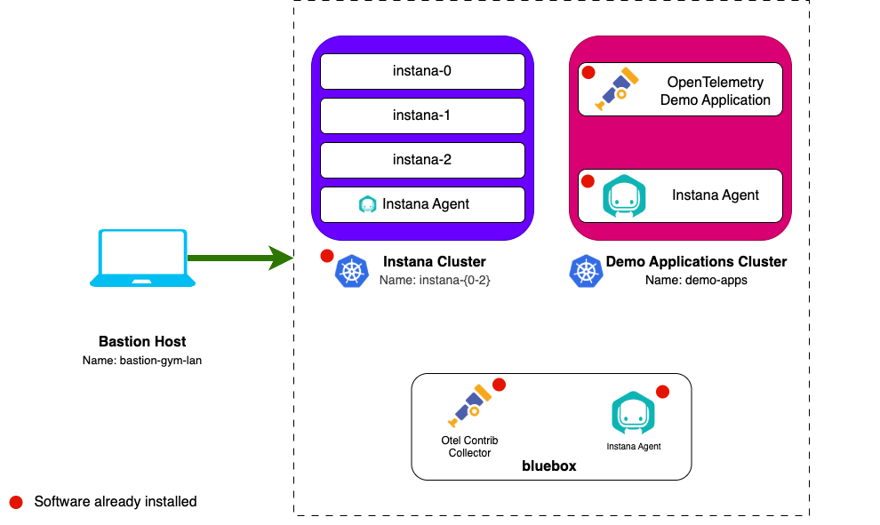

import LicenseInfo from "@site/src/components/Instana/LicenseInfo"
import RequestingLabEnvironment from "@site/src/components/requestingLabEnvironment/RequestingLabEnvironment"

# Lab Environment

The lab environment includes 6 VMs.

1. **Bastion VM** - A RHEL VM named `bastion-gym-lan` that will be used as the
   _bastion host_ for the lab network. This Bastion host has access to all lab
   VM's and will be your primary workstation for these labs.
2. **Instana VMs** - 3 Ubuntu VMs that are running a multi-node self-hosted
   Instana server on K3s.
3. **Bluebox** - An Ubuntu VM that contains the pre-installed OtelCol Contrib
   Collector and Instana Agent
4. **Demo Applications Cluster** - An Ubuntu VM running K3s, it has the
   OpenTelemetry Demo Application running, which will be further configured
   during this lab.

## Prerequisites

To complete this lab you will need:

- <LicenseInfo />

## Requesting a Lab Environment

<RequestingLabEnvironment
   environmentName="Jam-in-a-Box: Instana - OpenTelemetry"
   environmentUrl="https://techzone.ibm.com/my/reservations/create/673d043277fa7ddf3fca1c9e"
/>
