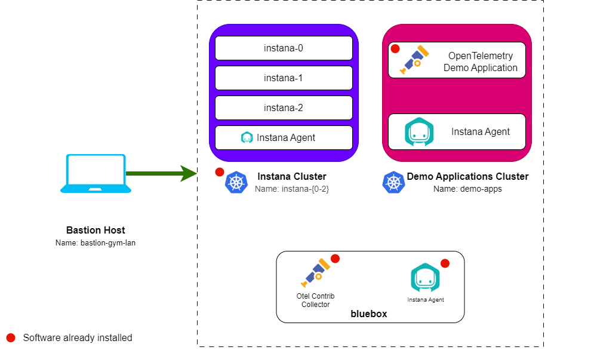

# Lab Environment

The lab environment includes Openshift cluster with Instana.

Openshift clusters:

1. **Instana cluster** - An instance of Single Node OpenShift cluster that will
   be used to install the Instana agent. The OpenTelemetry Demo Application and
   Instana backend will be pre-installed

## Prerequisites

To complete this lab you will need:

- Instana License
  - Download/Agent Key (Required when requesting lab environment)
  - Sales Key (Required when requesting lab environment)

## Requesting a Lab Environment

:::warning Work In Progress

The Self Service Tech Zone lab environment for this lab is currently under
development.

:::

:::info

You can follow
[these instructions](/waiops-tech-jam/labs/jam-in-a-box/#requesting-a-lab-environment)
if you need guidance on how to request a lab.

:::

:::caution

Ignore the _optional_ label for the Instana keys, these fields are required.
This is a known issue in Tech Zone.

:::

For this lab we will be using the
[Jam-in-a-Box: Instana - OpenTelemetry](https://techzone.ibm.com/my/reservations/create/64b8b2e0a06bca0017539c00)
collection.
