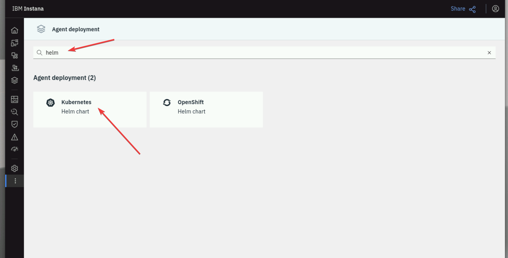
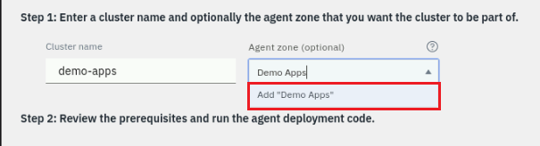
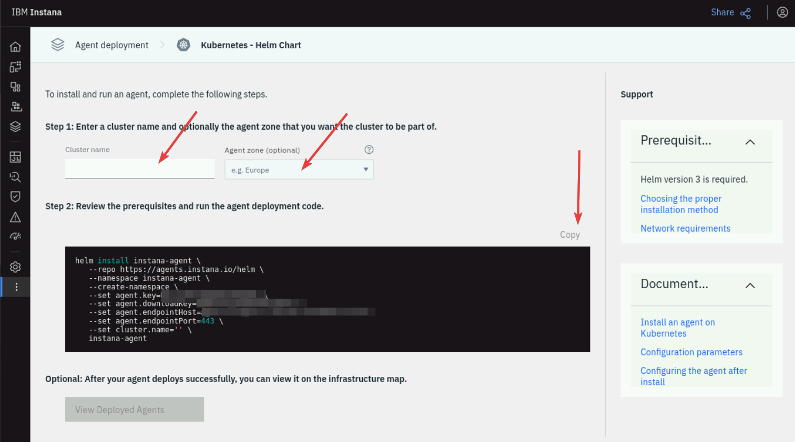

# Instana agent

In this section, you will proceed with the installation of the Instana Agent to
enable monitoring and observability of your Kubernetes (K3s) cluster. The
Instana agent is designed to automatically discover and monitor all running
services and applications within the Kubernetes environment, capturing detailed
telemetry data such as CPU and memory usage, network traffic, and
application-specific metrics. This data is sent to the Instana backend for
real-time analysis and visualization.

By deploying the Instana agent, you gain access to powerful features like
automatic root cause analysis, anomaly detection, and service dependency
mapping. These capabilities allow you to proactively manage and optimize your
Kubernetes (K3s) cluster, ensuring high availability and performance of your
microservices. The installation process involves configuring the necessary
permissions and environment variables, applying the manifest, and verifying the
successful deployment of the agent. Detailed documentation and support are
available to guide you through each step.

## Instana agent deployment options

The Instana agent can be installed using several methods, each catering to
different deployment preferences and requirements. These methods include using a
Helm chart, an Operator, or a static YAML file (soon to be deprecated).

- **The Helm chart method** provides a flexible and customizable way to deploy
  the Instana agent, allowing you to manage the installation and configuration
  through Helm's package management capabilities. This approach is ideal for
  users who prefer a streamlined and repeatable deployment process.

- **The Operator method** leverages Kubernetes Operators to automate the
  deployment and management of the Instana agent. This method simplifies the
  operational complexity by handling tasks such as upgrades and scaling, making
  it suitable for environments that require robust automation and lifecycle
  management.

- **The static YAML file method**, although soon to be deprecated, offers a
  straightforward way to deploy the Instana agent by applying predefined YAML
  manifests. This method is useful for users who prefer direct control over the
  deployment configuration.

:::info

For the purpose of this training, we will opt for the Helm chart installation
method.

:::

## Helm chart

To begin, log in to your Instana UI using your credentials.

From the Bastion host open the Firefox browser and select the **Instana**
bookmark.

:::tip

If you are unsure how to get access to the Bastion host (Guacamole) see
[Accessing a Lab Environment](/waiops-tech-jam/labs/jam-in-a-box/#accessing-a-lab-environment)

:::


:::info

You can safely ignore the warning about the certificate being untrusted.


:::

When prompted, enter the username and password that you updated earlier.

- Username: **admin@instana.local**
- Password: **Passw0rd**


Once you have successfully logged in, navigate to the main dashboard where you
can access various monitoring and management tools. Look for the **Deploy
agent** link. Click on this link to proceed.


You will be guided through the necessary steps to deploy the agent. Follow the
on-screen instructions carefully to ensure the agent is deployed correctly and
starts monitoring your system as intended.

After navigating to the **Deploy agent** section, you will be presented with
various deployment options. Search for `helm`, then select the **Kubernetes Helm
chart** option:



:::info

Helm installation method simplifies the deployment process by using Helm charts,
which are packages of pre-configured Kubernetes resources.

:::

During the installation, you can specify the **Cluster name** and the **Agent
zone** parameters. Setting these values allow you to find your Agent and
Kubernetes Cluster within the Instana UI and not get confused by data coming in
from other agents.

Use the `otel-test` as the value for both parameters.

- Ensure you click the **Add "otel-test"** popup to set the zone name:

  

:::tip

Zones are used to organize the Instana agents. Many customers create zones for
lines of business, data center locations, public cloud regions, etc.

:::

Once you have selected the Helm installation option, you will be provided with a
Helm chart installation script. Copy this script to your clipboard, as you will
need to execute it in your Kubernetes environment to complete the installation.



Once you have copied the Helm chart installation script, switch back to your
terminal console in order to connect to your K3s cluster.

```bash
ssh jammer@demo-apps
```

After displayed prompt with a key fingerprint, please type "Yes" and hit Enter.


Ensure you are connected to the correct cluster - you should be able to see
similar prompt as presented on the below picture


Now, let's switch user from "jammer" to a "root" by using this commands

```bash
sudo -i
```

The results should be similar as below


Let's also make sure, we have a proper KUBECONFIG variable value. Please run
this command

```bash
export KUBECONFIG=/etc/rancher/k3s/k3s.yaml
```

You are now all set. To begin the Helm chart Instana agent installation, please
paste the copied Helm chart installation script.

:::info

This script contains all the necessary commands to install the Instana agent on
your Kubernetes cluster using Helm.

:::

After pasting the script, hit enter to execute the commands. The installation
process will begin, and you should see output indicating the progress of the
deployment. Monitor the console for any messages that may require your attention
to complete the installation successfully.

:::caution Please note the below example does not contain real values.

The fields like key, endpoint, etc. have been replaced with [REMOVED] value. You
need to use values from your environment.

:::

```bash
helm install instana-agent \
   --repo https://agents.instana.io/helm \
   --namespace instana-agent \
   --create-namespace \
   --set agent.key= [REMOVED] \
   --set agent.downloadKey= [REMOVED] \
   --set agent.endpointHost= [REMOVED] \
   --set agent.endpointPort=443 \
   --set cluster.name='otel-test' \
   --set zone.name='otel-test' \
   instana-agent
```

The results of the action should be similar to the presented image


Once you have executed the Helm chart installation script in your terminal, it's
important to verify that the installation was successful. To do this, you can
use specific commands to check the status of the deployed resources. Use the
command below to list all the pods in the `instana-agent` namespace and ensure
they are running correctly:

```sh
kubectl get pods -n instana-agent
```

By reviewing the output of these commands, you can ensure that the Instana agent
has been deployed successfully and is functioning as expected.


:::tip

All pods should be in a `RUNNING` phase, all of them should also have a `READY`
state of `1/1` values as explained on the picture above.

:::

## Verify Kubernetes monitoring

After verifying the successful installation of the Instana agent on your
Kubernetes cluster, return to your Instana UI to confirm that the agent is
collecting metrics. Navigate to the main dashboard and click on the "Kubernetes"
option in the left side menu. This section provides an overview of your
Kubernetes environment, including various metrics and performance data.


Ensure that you are receiving metrics from your cluster by checking the
displayed data. Look for information such as CPU usage, memory consumption, pod
statuses, and other relevant metrics. If the data is being populated correctly,
it indicates that the Instana agent is functioning as expected and monitoring
your Kubernetes cluster effectively.


## Summary

This concludes the Instana agent installation section.

Key takeaways:

- Instana UI Navigation: Familiarized yourself with the Instana UI, particularly
  the "Deploy agent" and "Kubernetes" sections.
- Helm Installation: Understood the process of deploying the Instana agent using
  Helm charts for Kubernetes.
- Verification: Learnt how to verify the successful deployment and ensure
  metrics are being collected from your Kubernetes cluster.

Please move to the next section of the course.
