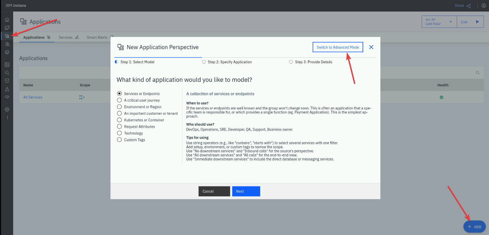
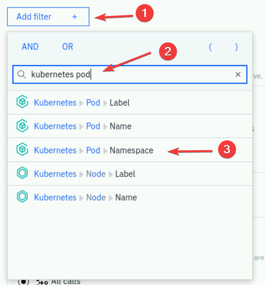
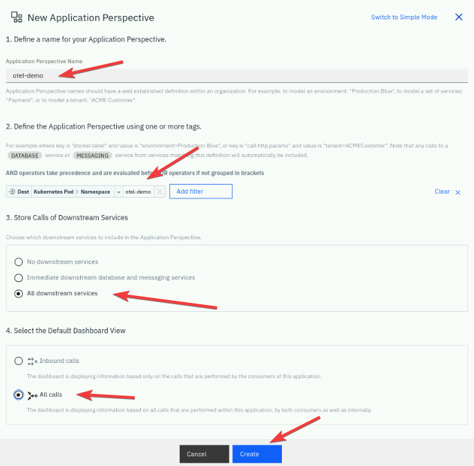
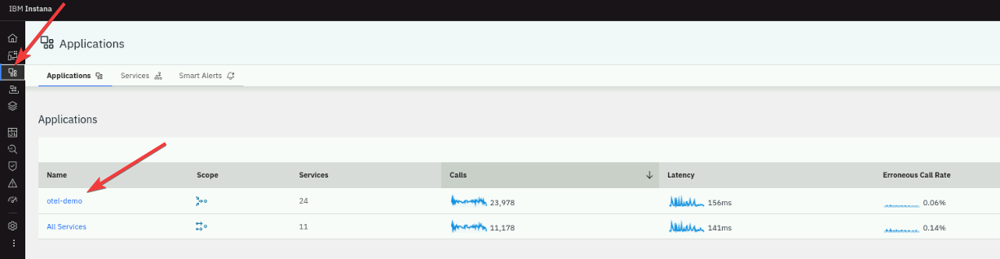
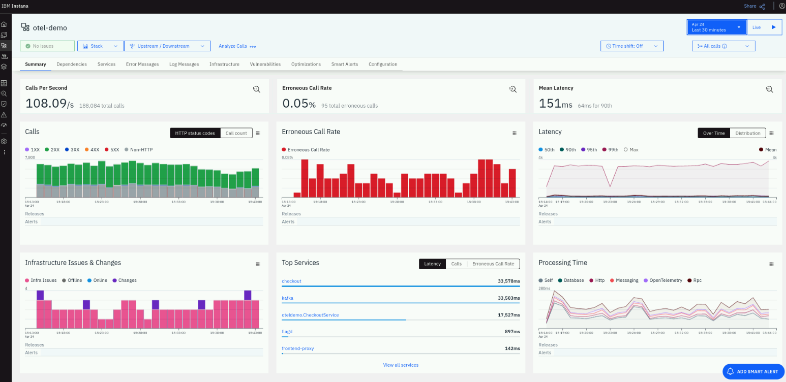

# Application Perspective in Instana

In the section of the labs, we will create an Application Perspective in Instana, so that we can see all of the metrics and traces
collected from the OpenTelemetry Demo Application.

An Application Perspective in Instana is a feature designed for monitoring, alerting, and analyzing microservice 
environments. It allows users to dynamically scope the visibility of their applications to focus on specific services, 
dependencies, technologies, business transactions, user journeys, deployment engines, versions, or releases.

Key features and benefits of Application Perspectives:

1. **Focused Monitoring**: Application Perspectives help teams stay focused on the services they are interested in, 
reducing distractions from unrelated components. This targeted approach ensures that alerts, 
errors, and logs are scoped to the relevant application perspective, streamlining troubleshooting.
2. **Dynamic Scoping**: Users can specify subsets of services and their dependencies based on various criteria 
such as zones, clusters, technologies, or cluster namespaces. This flexibility allows for customized monitoring setups 
that meet specific needs.
3. **Security and Visibility**: Organizations can use Application Perspectives to limit visibility to certain 
infrastructure and services, enhancing security by controlling access to sensitive data.
4. **Automated Dashboards**: Each Application Perspective auto-generates a feature-rich monitoring dashboard 
that displays key metrics and golden signals, providing a comprehensive view of the application's health and performance.

## Create an Application in Instana

Let's create an application perspective in Instana. Log in to your Instana UI and create a new application perspective
as described in the below picture

 

Switch to "Advanced mode" and provide all necessary values like name of your choice, scope.

To configured the "Scope" please type "kubernetes pod" and then select "namespace" as described on the below picture

 

Once the scope is configured, select "All downstream services" and "All calls", click "Create".

 

In a few moments, the new Application Perspective will be created. The scope will be limited only to the defined area -
in your case, Instana will display data only for pods located under the "otel-demo" namespace.

:::note
Please note the fact, that Application Perspective will not present data from the time before its creation. Application
Perspective will collect data only from the moment of when it was defined.
:::

## Review Application Perspective

After few minutes, you should be able to see the metrics collected and displayed as a part of your new Application
Perspective. 

 

Please navigate to the "otel-demo" Application Perspective to review the content.

 

:::tip
Presented traces and metrics are coming directly from the OpenTelemetry Demo Application using OpenTelemetry protocol.
During this lab, we have not installed or configured tracing collection from native Instana toolbox.
:::

## Summary

In the section, you've learnt how to create an Application Perspective. Please proceed to the next section of the labs.