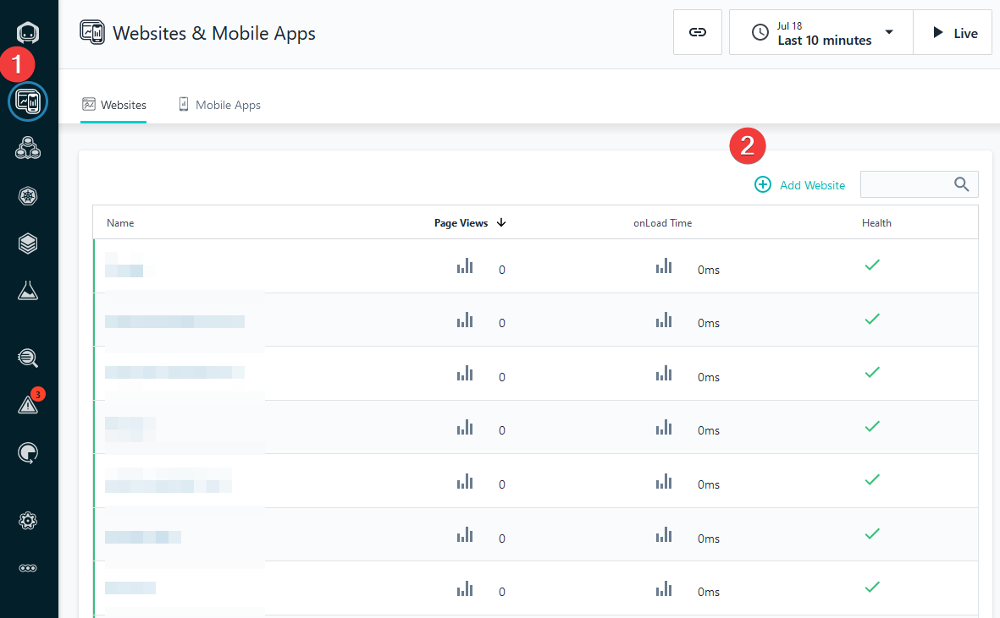
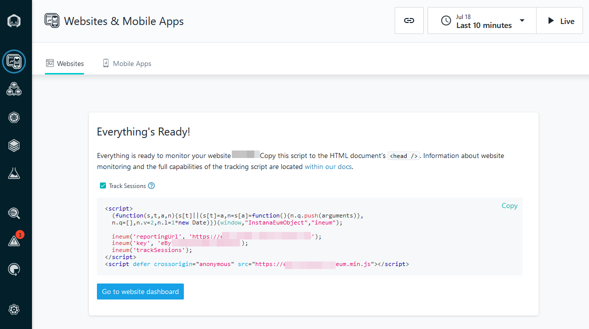
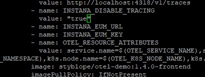
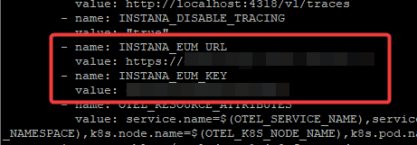

## Instana web-application end-to-end monitoring

In this section we will learn how to create a Web Application in Instana, 
which will allow us to capture end-to-end web transactions.

## Create a Web Application in Instana
Log in to your Instana UI, click on Web application and Add Website



Provide a name of your choice, click Next to get the screen with reportingURL and key. Please save these two values, 
we will be using these later during the lab.



Once the above step is ready, we can move to the next and edit the OpenTelemetry settings.

## Update the OpenTelemetry with a new reportingURL and key

Go back to your terminal and apply the below commands

```sh
oc project otel-demo 
kubectl edit deploy my-otel-demo-frontend 
```

Find the string "EUM" (you can use "?EUM" command in your text editor)



Apply the values as described on the below screen. Use your reportingURL and key from the previous step of this lab.



Save the file by entering ":wq"

## Generate traffic on the OpenTelemetry Demo Application

As described in the chapter 4, please run some test traffic through your instance of the OpenTelemetry Demo Application. 
Thanks to this, Instana will capture the end-to-end traffic starting from the web activity, down to the services and databases level.

