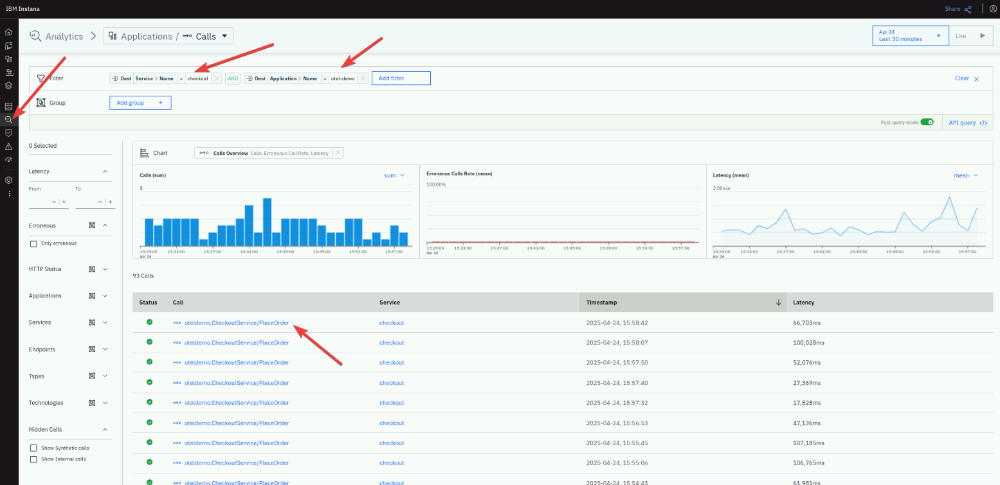
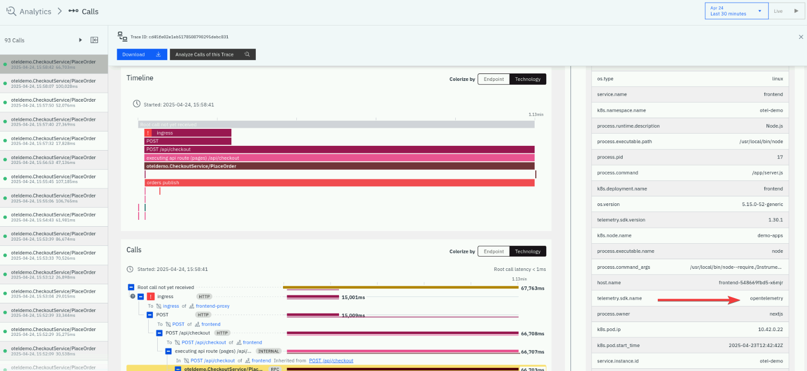
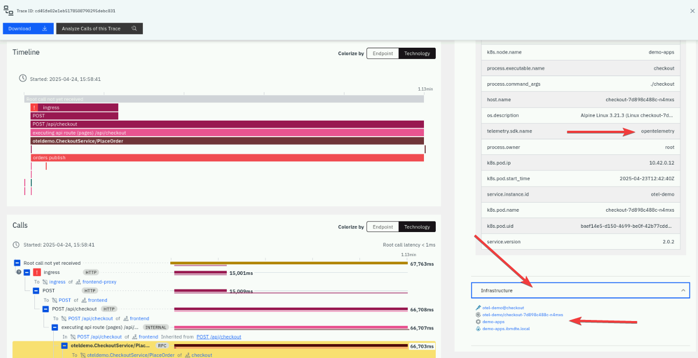

# Explore Instana and OpenTelemetry traces

Once the Instana and OpenTelemetry Demo Application are in sync, you can start exploring the captured data. 
This synchronization allows you to delve into the rich telemetry data collected from your microservices. 
You can analyze various metrics, traces, and logs to gain insights into the performance and behavior of your application. 

The Instana dashboard provides a comprehensive view of the data, enabling you to identify performance bottlenecks, 
monitor resource utilization, and track the flow of requests across different services. 

By examining the detailed traces, you can pinpoint the root causes of issues, optimize your application's 
performance, and ensure a seamless user experience. 

Additionally, the correlation of OpenTelemetry data with the underlying infrastructure helps you understand 
the impact of infrastructure changes on your application, facilitating proactive management and troubleshooting.

## OpenTelemetry tracing

Tracing in OpenTelemetry is a fundamental concept that involves tracking the execution of transactions or 
workflows through multiple distributed systems. It provides visibility into how requests propagate through services, 
helping to identify performance bottlenecks, latency issues, and errors.

Key aspects of tracing in OpenTelemetry:

1. **Spans and Traces**: A trace represents the entire journey of a request through the system, 
while spans are individual units of work within that trace. Each span includes metadata such as timestamps, 
service names, and operation names, allowing you to see the complete path of a request
2. **Context Propagation**: OpenTelemetry uses context propagation to maintain trace continuity across different 
services and components. This ensures that all spans within a trace are linked together, providing a 
coherent view of the request's journey

Let's find an example of an OpenTelemetry trace in your environment. Go to Instana UI/Analytics search for calls
which meet these criteria:

- Application name: your application name
- Service name: checkout

Click on the call link to see the transaction details.



In the detailed view of the call, please take a look at the right side of the
screen. You will find there a list of attributes captured by Instana. One
of them is called "telemetry.sdk.name" with a value "opentelemetry", which
proves that the content is coming from the OpenTelemetry tracer.



## Instana and OpenTelemetry combined

Instana can combine traces coming from applications instrumented by
OpenTelemetry and Instana infrastructure metrics delivered by the Instana agent. 
Please follow the below instructions to find an example of such transaction in your environment.

Using the trace from the previous example (the "checkout" service), please navigate to the right
side of the screen and scroll to the bottom of the page. You will then find an "Infrastructure"
view, with a full path beginning from the host, the platform, the pod, namespace, resource, etc.



The above example proves the Instana can combine traces from OpenTelemetry
and Instana infrastructure data within the same screen under one transaction ID.

## OpenTelemetry tracing - code examples

If you wish to use OpenTelemetry in your application, here is the example
snippet which shows, how to build the proper instrumentation.

```php
use OpenTelemetry\API\Common\Instrumentation\Globals;
use OpenTelemetry\API\Trace\Span;
use OpenTelemetry\API\Trace\SpanKind;
use Psr\Http\Message\ResponseInterface as Response;
use Psr\Http\Message\ServerRequestInterface as Request;
use Slim\App;

function calculateQuote($jsonObject): float
{
    $quote = 0.0;
    $childSpan = Globals::tracerProvider()->getTracer('manual-instrumentation')
        ->spanBuilder('calculate-quote')
        ->setSpanKind(SpanKind::KIND_INTERNAL)
        ->startSpan();
    $childSpan->addEvent('Calculating quote');

    try {
        if (!array_key_exists('numberOfItems', $jsonObject)) {
            throw new \InvalidArgumentException('numberOfItems not provided');
        }
        $numberOfItems = intval($jsonObject['numberOfItems']);
        $quote = round(8.90 * $numberOfItems, 2);

        $childSpan->setAttribute('app.quote.items.count', $numberOfItems);
        $childSpan->setAttribute('app.quote.cost.total', $quote);

        $childSpan->addEvent('Quote calculated, returning its value');
    } catch (\Exception $exception) {
        $childSpan->recordException($exception);
    } finally {
        $childSpan->end();
        return $quote;
    }
}

return function (App $app) {
    $app->post('/getquote', function (Request $request, Response $response) {
        $span = Span::getCurrent();
        $span->addEvent('Received get quote request, processing it');

        $jsonObject = $request->getParsedBody();

        $data = calculateQuote($jsonObject);

        $payload = json_encode($data);
        $response->getBody()->write($payload);

        $span->addEvent('Quote processed, response sent back', [
            'app.quote.cost.total' => $data
        ]);

        return $response
            ->withHeader('Content-Type', 'application/json');
    });
};
```

Please note the use of **OpenTelemetry/API** and further use of the span builders.

[The source code can be found here](https://github.com/open-telemetry/opentelemetry-demo/blob/main/src/quote/app/routes.php)

## Summary

In this section, you've learnt that Instana can easily represent merged data collected from OpenTelemetry and Instana native agent.