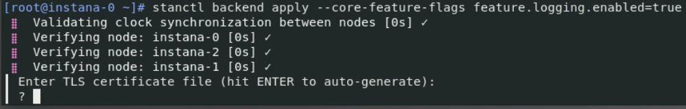
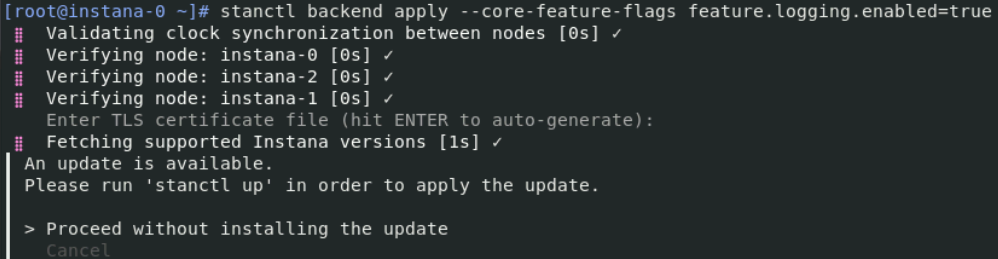
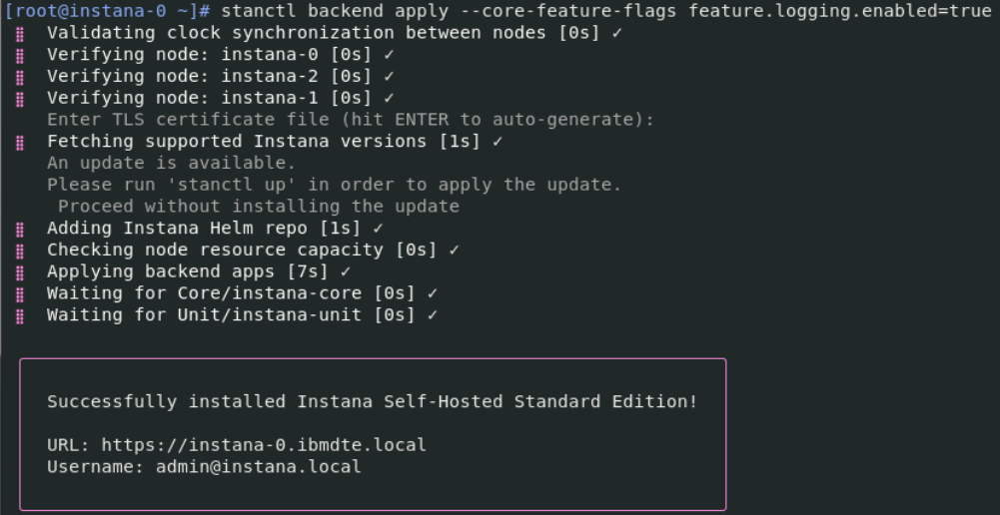
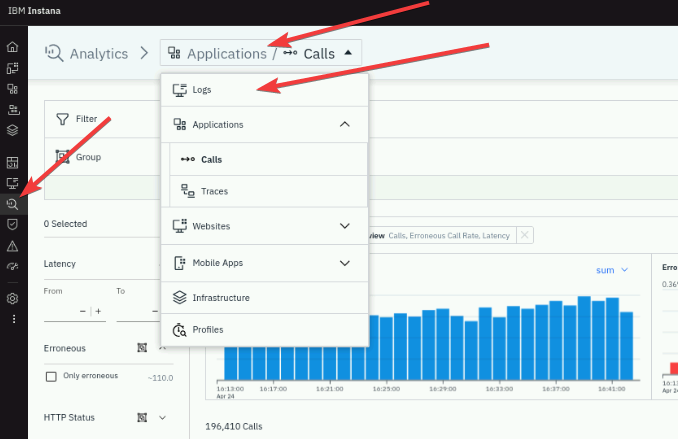
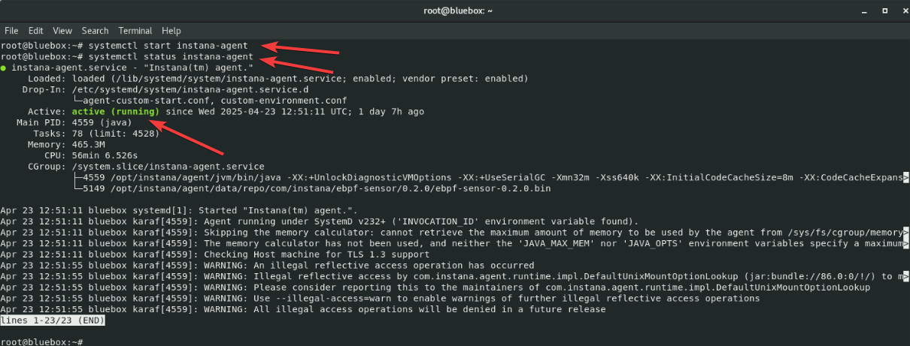
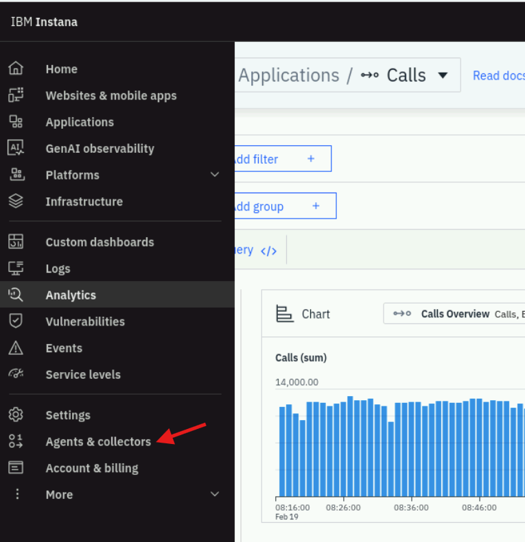
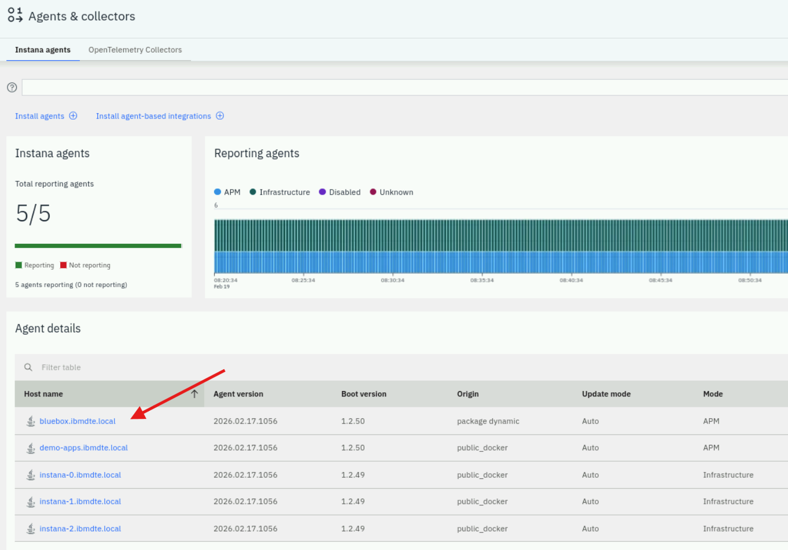

# OpenTelemetry Collector

Besides the application metrics and traces, OpenTelemetry standard also supports
ingesting logs content. In this scenario, you will learn how to deliver custom
logs to the Instana backend using OpenTelemetry Collector Contrib.

The OpenTelemetry Collector offers a vendor-agnostic implementation of how to
receive, process and export telemetry data. It removes the need to run, operate,
and maintain multiple agents/collectors. This works with improved scalability
and supports open source observability data formats (e.g. Jaeger, Prometheus,
Fluent Bit, etc.) sending to one or more open source or commercial backends. The
local Collector agent is the default location to which instrumentation libraries
export their telemetry data.

OpenTelemetry collector objectives:

- **Usability**: Reasonable default configuration, supports popular protocols,
  runs and collects out of the box.
- **Performance**: Highly stable and performant under varying loads and
  configurations.
- **Observability**: An exemplar of an observable service.
- **Extensibility**: Customizable without touching the core code.
- **Unification**: Single codebase, deployable as an agent or collector with
  support for traces, metrics, and logs.

:::info

In this lab, we will be using OpenTelemetry Collector Contrib, which source-code
can be found
[here](https://github.com/open-telemetry/opentelemetry-collector-contrib).

:::

## 6.1 Instana backend - configuration

Depending on when you are executing this lab, Logging is setup as an optional
feature and it's not enabled by default. The log collection via the runtimes is
collected by default. If you want OpenTelemetry base logging, you need to enable
the feature flag.

Let's enable that feature, by following these steps:

Use the ssh terminal and login to the instana backend server

```bash title="Host: bastion-gym-lan"
ssh jammer@instana-0
```

and then switch to the root user

```bash title="Host: instana-0"
sudo -i
```

as presented in the below screen


Enable the logging feature by running the below command

```bash title="Host: instana-0"
stanctl backend apply --core-feature-flags feature.logging.enabled=true
```

after applying the command, Instana will ask about the TLS certificate, please hit enter to accept the default certificate



after applying the command, Instana will ask about update options. In this lab, we are NOT going to update Instana, so please select "Proceed without installing the update"



finally, Instana should return confirmation the additional feature was updated correctly



you can close this terminal window by running the below command:

```bash title="Host: instana-0"
exit
```

:::tip

Please note, the Logging feature accepting the OpenTelemetry custom logs require
License Add-on

For the Instana SaaS, additional logging licenses need to be purchase

For the Instana self-hosted there is no add-on charge for short-term log
collection

In both cases, you need to update the license.

Please read and follow these
[instructions](https://www.ibm.com/docs/en/instana-observability/current?topic=opentelemetry-collecting-linux-system-logs).

:::

## 6.2 Instana backend - verification

After applying backend changes, please navigate to the Instana UI and refresh
the page (use button F5). After refreshing, please open Instana UI / Analytics /
Logs - if the Logs section is visible, it means the Instana backend is ready to
accept the OpenTelemetry log content. Please confirm your Instana instance with
the below screenshot



## 6.3 Instana agent - configuration

In this scenario, you will configure OpenTelemetry Collector to send
OpenTelemetry data to Instana backend through the Instana agent. First, you need
to make sure, the Instana agent is up and running on the "bluebox" host.

The agent was pre-installed into your Lab environment.

Open a new terminal window and login to the "bluebox" host using the below
command:

```bash title="Host: bastion-gym-lan"
ssh jammer@bluebox
```

and then let's switch to the root user

```bash title="Host: bluebox"
sudo -i
```

Please run the following command to start the agent on "bluebox" host:

```bash title="Host: bluebox"
systemctl start instana-agent
```

After a moment, please check the status of the recently started agent by typing
below command

```bash title="Host: bluebox"
systemctl status instana-agent
```

The response should indicate, that the agent is up and running as in the below
screen



After few minutes, please check the Instana UI and confirm the new agent is
reporting data to the Instana backend. Hover over main menu on the left and select **Agents & collectors**. 
screen below with the agent **bluebox.ibmdte.local**:



You should see similar content to the below screen



## 6.4 OpenTelemetry Collector - configuration

Once the Instana agent is up and running, you can configure the OpenTelemetry
Collector.

OpenTelemetry Collector was already pre-installed into your environment. Please
check the below information about the installation, but remember you don't need
to install the collector during this Lab

:::note

Please review this installation
[steps](https://opentelemetry.io/docs/collector/installation/).

During this scenario, we will be using
[OpenTelemetry Collector Contrib](https://github.com/open-telemetry/opentelemetry-collector-contrib),
which is more advanced version of the standard Collector.

:::

Let's review the OpenTelemetry Collector configuration file, by viewing
config.yaml:

```bash title="Host: bluebox"
cd /root/otelcol-contrib
vim config-simple.yaml
```

The content of the file looks like in the below picture


There are two key elements of the configuration file:

- log file which will be monitored (in our case -
  /root/otelcol-contrib/example-simple.log)
- OTLP endpoint (in our case - localhost:4317)

:::info

Please note, that the Otel data can also be sent directly to the Instana
backend. This is an alternative approach. In this scenario, we will be using
the Instana Agent as a "gateway" which will deliver OpenTelemetry data to the Instana
backend.

:::

Other elements of the configuration file (based on the Otel protocol):

- receivers - which element is providing the data to the Otel model. There are
  many different receivers, depending on the file/data types. Receivers,
  indicate that there are MANY available receivers such as SNMP, prometheus,
  databases, and many more, but we will be focusing on collecting log data and
  will be using the filelog receiver

- processors - allow you to process the data before the data is sent to the
  exporter, for example data cleaning, re-formatting, enriching, etc.

- exporters - indicate that it exports the data from the collector contrib to a
  target that is capable of receiving OpenTelemetry data. In our case that's
  Instana backend. It is possible to send data to multiple exporters

Other interesting settings within the configuration file:

- The "include" section at the top indicates which file(s) to monitor. In our
  case - example.log. You can specify one or more filenames as well as
  directories. When specifying a directory, you can also specify an "exclude"
  condition.
- Setting the severity to "Fatal" if we find _FATAL_ in the log
- Instana's Agent is listing for GRPC data on port 4317. By default, the Instana
  Agent listens on the loopback address, so you MUST configure the OpenTelemetry
  collector contrib to use either "localhost" or "127.0.0.1"

The file is ready to be used by the OpenTelemetry collector, let's close the
configuration file:

```bash
<escape> q!
```

and start the OpenTelemetry Collector service

```bash title="Host: bluebox"
sudo otelcol-contrib --config=config-simple.yaml
```

after a moment you should be able to see information about the service waiting
for the events like on below screen


The service is now ready to accept the log changes. Please keep this terminal
window open (do not stop the service) and move to the next section.

## 6.5 Log content creation

The above configuration will tail the desired log file content. Any new entries
that are not filtered out by our configuration settings will be captured by the
collector. Now, let's simulate new log entries creation - the goal is to be sure
that OpenTelemetry Collector will send the log data, throught the Instana agent
to the Instana backend.

Please open a new terminal and login (again) to the "bluebox" host. We need two
active sessions, because the previous one keeps the OpenTelemetry Collector up
and running. Please login to the "bluebox" host:

```bash title="Host: bastion-gym-lan"
ssh jammer@bluebox
```

switch to the root user

```bash title="Host: bluebox"
sudo -i
```

navigate to the OpenTelemetry directory

```bash title="Host: bluebox"
cd /root/otelcol-contrib
```

run these commands, which will add new lines into the existing log file

```bash title="Host: bluebox"
echo "2024-02-02 ERROR first line message1" >> example-simple.log
echo "2024-03-02 ERROR second line message2" >> example-simple.log
echo "2024-04-02 ERROR third line message3" >> example-simple.log
```

## 6.6 Instana verification

After a short moment, please navigate to the **Instana UI** -> **Analytics** -> **Logs**
section and confirm, you can see three logs entries delivered by the Agent using
the OpenTelemetry standard. Try filtering by **Most recent first** if you cannot see them.
You should be able to see similar content to the below screenshot:


You have just used Instana to accept custom log content using the external
OpenTelemetry Collector.

You can now exist out of the running **otelcol-contrib** process using `ctrl + c` to free up the ports used for the next example.

## 6.7 More complex example

In the previous example, we've been focusing on simple, one-line log files. Now,
let's try to parse and send to Instana more advanced multi-line log file. In
this case, it is parsing out the IBM MQ FDC. It pulls out a couple of key pieces
of information from the FDC log.

Let's stop the OtelContrib collector, as we will be using other configuration
file. Go back to the console with running service and hit CTRL+C to stop the
ingestion

Let's review the more advanced log example.

Make sure you are still in the right directory

```bash title="Host: bluebox"
cd /root/otelcol-contrib
```

Please open a example.FDC file by typing

```bash title="Host: bluebox"
vim example.FDC
```

The content will be like presented below. Please note, the multi-line entries

```bash title="Example Output"
+-----------------------------------------------------------------------------+
|                                                                             |
| IBM MQ First Failure Symptom Report                                         |
| =========================================                                   |
|                                                                             |
| Date/Time         :- Mon November 11 2024 10:45:21 EST                      |
| UTC Time          :- 1731339921.997850                                      |
| UTC Time Offset   :- -300 (EST)                                             |
| UTC Date/Time     :- 2024-11-11 15:45:21.997850 (1731339921997850)          |
| Host Name         :- acemq2                                                 |
| Operating System  :- Linux 5.14.0-427.16.1.el9_4.x86_64                     |
| OS Details        :- Red Hat Enterprise Linux 9.4 (Plow)                    |
| PIDS              :- 5724H7251                                              |
| LVLS              :- 9.3.0.15                                               |
| Product Long Name :- IBM MQ for Linux (x86-64 platform)                     |
| Vendor            :- IBM                                                    |
| O/S Registered    :- 1 (libmqmcs_r.so) Installed                            |
| Data Path         :- /var/mqm                                               |
| Installation Path :- /opt/mqm                                               |
| Installation Name :- Installation1    (1)                                   |
| License Type      :- Production                                             |
| Probe Id          :- XC338001                                               |
| Application Name  :- MQM                                                    |
| Component         :- xehAsySignalHandler                                    |
| Source filename   :- /build/jslot1/p930_P/src/lib/cs/unix/amqxerrx.c        |
| Line Number       :- 886                                                    |
| Build Date        :- Nov 29 2023                                            |
| Build Level       :- p930-015-231129                                        |
| Build Type        :- IKAP - (Production)                                    |
| Effective UserID  :- 1001 (mqm)                                             |
| Real UserID       :- 1001 (mqm)                                             |
| Program Name      :- amqzlaa0                                               |
| Arguments         :- -mQM1 -fip0                                            |
| Standard Streams  :- 0 1 2                                                  |
| Addressing mode   :- 64-bit                                                 |
| LANG              :- en_US.UTF-8                                            |
| Process           :- 9205                                                   |
| Process(Thread)   :- 9226                                                   |
| Thread            :- 2    AsyncSignal                                       |
| Perf Counter      :- 7225916878486                                          |
| UserApp           :- FALSE                                                  |
| Last HQC          :- 0.0.0-0                                                |
| Last HSHMEMB      :- 0.0.0-0                                                |
| Last ObjectName   :-                                                        |
| Major Errorcode   :- xecE_W_UNEXPECTED_ASYNC_SIGNAL                         |
| Minor Errorcode   :- OK                                                     |
| Probe Type        :- MSGAMQ6209                                             |
| Probe Severity    :- 3                                                      |
| Probe Description :- AMQ6209W: An unexpected asynchronous signal (15 :      |
|   SIGTERM) has been received and ignored.                                   |
| FDCSequenceNumber :- 0                                                      |
| Arith1            :- 15 (0xf)                                               |
| Arith2            :- 1 (0x1)                                                |
| Comment1          :- SIGTERM                                                |
| Comment2          :- Signal sent by pid 1                                   |
| Comment3          :- systemd                                                |
|                                                                             |
+-----------------------------------------------------------------------------+

MQM Function Stack
xehAsySignalMonitor
xehHandleAsySignal
xcsFFST

MQM Trace History
{ xihCSThreadClear
-{ xcsEmptyCBM
-} xcsEmptyCBM rc=OK
} xihCSThreadClear rc=OK
{ xppInitialiseDestructorRegistrations
} xppInitialiseDestructorRegistrations rc=OK
{ xehAsySignalMonitor
-{ xppPostAsySigMonThread
-} xppPostAsySigMonThread rc=OK
Data: 0xffffffff 0x00000000
Data: 0xffffffff 0x00000000
Data: 0xffffffff 0x00000000
Data: 0xffffffff 0x00000000
Data: 0xffffffff 0x00000000
```

As you can see in the above example, there are specific fields and values which
we would like to extract. For example, we are particularly interested in "Probe
ID", "Application Name", "Major Errorcode" and "Minor Errorcode". Our filtering
should remove all other, not important parts of the log file and focus on the
information which brings a value to the team.

Close the file by typing

```bash
!q
```

Let's examine the config-advanced.yaml with a command

```bash title="Host: bluebox"
vim config-advanced.yaml
```

```yaml
receivers:
  filelog:
    ## Path to the log files that must be read.
    include: ["/root/otelcol-contrib/*.FDC"]

    exclude_older_than: 1m
    include_file_path: true
    include_file_name: true

    ## Preserve the leading white spaces so that the example 'recombine' operator works as expected.
    preserve_leading_whitespaces: true
    operators:
      # Example use of the 'recombine' operator to handle multi-line log statements.
      - type: recombine
        combine_field: body
        source_identifier: attributes["log.file.path"]
        is_last_entry: body matches "^\\+---.*$"

      # Remove recombined log messages that do not contain this string.
      # This basically ignores the rest of the FDC file contents
      - type: filter
        expr: not (body contains "IBM MQ First Failure Symptom Report")

      - type: regex_parser
        regex: '\| Probe Id +:- (?P<ProbeId>\w+).*|$'

      - type: regex_parser
        regex: '\| Major Errorcode +:- (?P<MajorErrorCode>\w+).*|$'

      # Squash the multi-line log message into a single line by remove newline characters
      - type: regex_replace
        field: body
        regex: "\n"
        replace_with: ""

      # Replace entire squashed message body with hard-coded string (not possible without squash)
      - type: regex_replace
        field: body
        regex: ".*"
        replace_with: "IBM MQ First Failure Symptom Report"

processors:
  ## Adding a tag name of BusinessApp with a value of QOTD
  attributes/insertIntoLoggingSubPayload:
    actions:
      - key: "BusinessApp"
        value: "QOTD"
        action: insert

exporters:
  debug:
    verbosity: detailed

  file:
    path: ./otel-file-exporter.json
    append: false
    rotation:
      max_megabytes: 10
      max_days: 3
      max_backups: 3
      localtime: true
    format: json

  ## The Instana Agent supports GRPC payloads
  otlp/instanaAgent:
    ## Be sure to set the appropriate HOST:PORT combination.
    ## Note: The GRPC port will be 4317 (unless port-forwarding is used to change this).
    endpoint: "localhost:4317"
    ## endpoint: "otlp-http.instana2.tivlab.raleigh.ibm.com:443"
    ## TLS encryption is disabled in this example. To enable TLS encryption, see [Sending OpenTelemetry data to the Instana agent](https://www.ibm.com/docs/en/instana-observability/current?topic=opentelemetry-sending-data-instana-agent#enabling-tls-encryption-for-opentelemetry-ingestion).
    tls:
      insecure: true

service:
  pipelines:
    ## Sample logs pipeline using the above configurations.
    logs:
      receivers: [filelog]
      processors: [attributes/insertIntoLoggingSubPayload]
      exporters: [otlp/instanaAgent, debug, file]
```

As you can see, the configuration is more complex, comparing to the previous
example. There are couple of important parts of the file:

1. Operators – We've added an **"operators"** section to ensure the log file is
   parsed correctly and efficiently, enabling structured and meaningful log data
   extraction.

- The **recombine** operator is used to merge consecutive log lines into a
  single log entry based on defined expression rules. This is particularly
  useful for multi-line logs, such as stack traces or verbose error messages,
  which would otherwise be split and misinterpreted.

- The **is_last_entry** operator helps identify the final log entry in a file
  that should be processed. This is essential for ensuring that only complete
  and relevant log data is passed downstream, avoiding partial or incomplete
  entries.

- The **filter** operator allows selective processing by filtering incoming log
  entries that match a specific expression. This helps reduce noise and focus on
  logs that are relevant for analysis or alerting.

- The **regex_parser** operator extracts structured data from unstructured log
  messages. It parses a string-type field (specified by parse_from) using a
  regular expression pattern, enabling the extraction of fields like timestamps,
  log levels, or error codes.

- The **regex_replace** operator modifies the content of a string-typed field
  (specified by field) using a user-defined or well-known regular expression. It
  can be used to clean, mask, or standardize log data, such as anonymizing
  sensitive information or normalizing formats.

2. Processors – We've added a **processors** section to enrich the content of
   log messages, making them more informative and context-aware for Instana.

- The **insert** processor is used to add custom metadata to each log entry. In
  this case, it creates an additional tag called "BusinessApp" with the value
  "QOTD". This enrichment adds business context to the logs, making it easier to
  filter, search, and correlate logs in Instana. It also supports better tagging
  and grouping of logs by application, which is especially valuable in
  environments with multiple services.

Let's start the OpenTelemetry Contrib Collector using the new
config-advanced.yaml by the below command

```bash title="Host: bluebox"
sudo otelcol-contrib --config=config-advanced.yaml
```

Similarly as before, let's now open a new terminal window, login to the
"bluebox" host and switch to root user.

:::tip

If you see the error that starts with **Error: failed to create SDK: binding address localhost:8888**, you
may not have ended the previous **otelcol-contrib** process. Run `sudo pkill otelcol-contrib` to close it.

:::

Once done, we should create a new FDC file, so that our Collector could pick it
up and deliver to Instana backend. Open a new terminal tab and connect to **bluebox** again.

Copy the existing FDC file

```bash title="Host: bluebox"
cd /root/otelcol-contrib
cp example.FDC example-new.FDC
```

## 6.8 Instana verification - advanced

After a short moment, please navigate to the **Instana UI** -> **Analytics** -> **Logs**
section and confirm, you can see logs entries delivered by the Agent using the
OpenTelemetry standard. You should be able to see similar content to the below
screenshot:


It was shown, that Instana can accept custom, multi-line log content, using
external OpenTelemetry Collector.

Please note additional fields visible on the above screen:

1. **Business App** - the extra context field added during log parsing. The
   field allows you to create a filter or search over the provided value.

2. **Major Error Code** - additional contextual information about the specific
   error code visible within the log file. This will help to understand the
   potential root cause of a problem captured by Instana

3. **Probe ID** - additional value we've extracted from a long log file - will
   help with faster identification of an impacted infrastructure resource.

## 6.9 Summary

This section concludes the Lab. In this section you have learned:

1. How to setup, configure and run the OpenTelemetry Collector Contrib,
2. How to configure traditional Instana Agent to accept the Otel communication,
3. How to explore the Instana Analytics/Logs UI

:::info

Please review additional information about
[OpenTelemetry Collector filelog receiver](https://github.com/open-telemetry/opentelemetry-collector-contrib/tree/main/receiver/filelogreceiver).

:::
