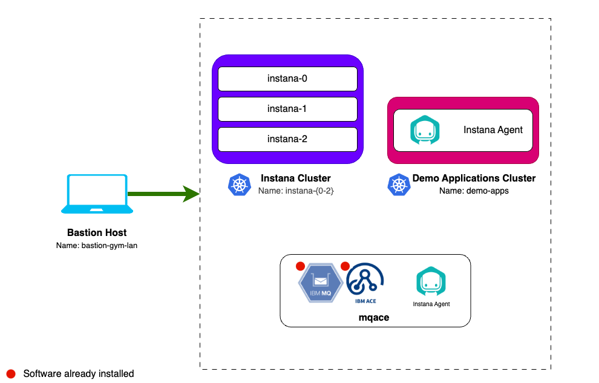

# Lab Environment

The lab environment includes 2 Openshift clusters and 3 VMs.

Openshift clusters:

1. **AIOps OCP Cluster** - Not required for this lab.
2. **Apps SNO Cluster** - An instance of Single Node OpenShift that will be used
   to learn how to install the Instana agent in a Kubernetes/OpenShift
   environment.

Virtual Machines:

1. **Guacamole VM** - A RHEL VM that will be used as the _bastion host_ for the
   lab network. Guacamole has access to all lab VM's and clusters and will be
   your primary workstation for these labs.
2. **Instana** - An Ubuntu VM that will be used to install a single node
   self-hosted Instana server.
3. **MQACE** - An Ubuntu VM that contains the pre-installed IBM ACE and MQ
   middleware. This VM will be used to install the Instana agent and monitor the
   middleware.

:::note

- IBM MQ, IBM ACE and Quote of the Day have been pre-installed.
- You will install and configure all remaining components during these labs.

:::

## Prerequisites

To complete this lab you will require the following:

- Instana License
  - Agent Key - Entered during lab
  - Sales Key - Entered during lab

## Requesting a Lab Environment

:::info

Follow
[these instructions](/waiops-tech-jam/labs/jam-in-a-box/#requesting-a-lab-environment)
for step by step guidance on requesting a lab environment in IBM Tech Zone.

:::

Request Tech Zone environment:

- [Jam-in-a-Box: Instana - Install](https://techzone.ibm.com/my/reservations/create/649cd328fc016400174bed25)
