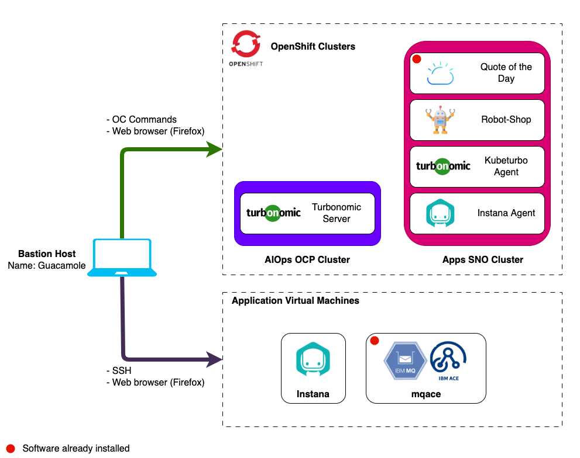

# Lab Environment

The lab environment includes 2 Openshift clusters and 3 VMs.

Openshift clusters:

1. **AIOps cluster** - A full installation of OCP that will be used to install
   Turbonomic.
2. **Apps cluster** - An instance of Single Node OpenShift that will be used to
   install the Instana and KubeTurbo agents and the sample _RobotShop_
   application. The _Quote Of The Day_ sample application has been
   pre-installed.

Virtual Machines:

1. **Guacamole VM** - A RHEL VM that will be used as the _bastion_ host into the
   lab network. Guacamole has access to all lab VM's and clusters and will be
   your primary workstation for these labs.
2. **Instana** - An Ubuntu VM that will be used to install a single node
   self-hosted Instana server.
3. **MQACE** - An Ubuntu VM that contains the pre-installed IBM ACE and MQ
   middleware.

:::note

- IBM MQ, IBM ACE and Quote of the Day have been pre-installed.
- You will install and configure all remaining components during these labs.

:::

## Prerequisites

To complete this lab you will need:

- Instana Agent Key - Required during lab
- Instana Sales Key - Required during lab

## Requesting a Lab Environment

For this lab we will be using the
[Jam-in-a-Box: Instana - Install](https://techzone.ibm.com/my/reservations/create/649cd328fc016400174bed25)
collection.

:::info

You can follow
[these instructions](/waiops-tech-jam/labs/jam-in-a-box/#requesting-a-lab-environment)
if you need guidance on how to request a lab.

:::
