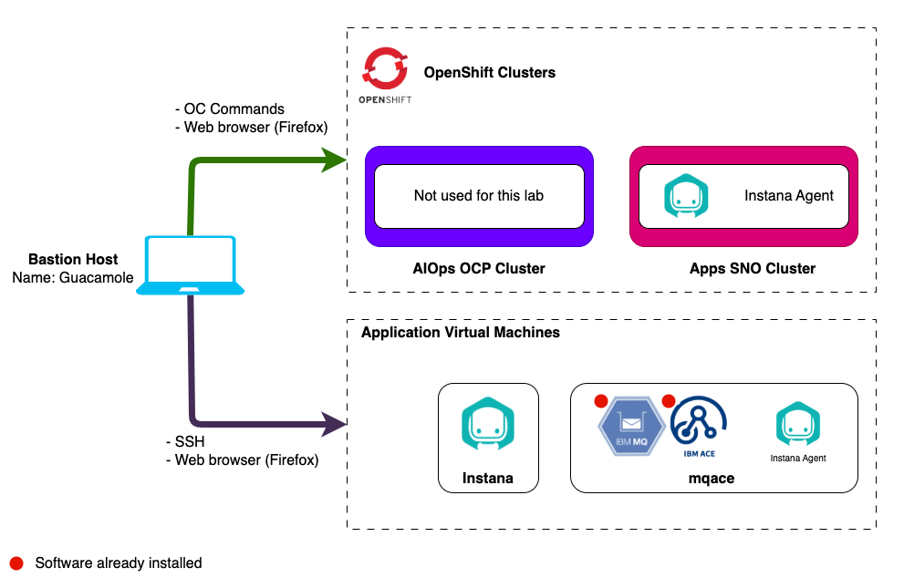

import LicenseInfo from "@site/src/components/Instana/LicenseInfo"
import RequestingLabEnvironment from "@site/src/components/requestingLabEnvironment/RequestingLabEnvironment"

# Lab Environment

The lab environment includes 6 VMs.

1. **Bastion VM** - A RHEL VM named `bastion-gym-lan` that will be used as the
   _bastion host_ for the lab network. This Bastion host has access to all lab
   VM's and will be your primary workstation for these labs.
2. **Instana VMs** - 3 Ubuntu VMs that will be used to install a multi-node
   self-hosted Instana server on K3s.
3. **MQACE** - An Ubuntu VM that contains the pre-installed IBM ACE and MQ
   middleware. This VM will be used to install the Instana agent and monitor the
   middleware.
4. **Demo Applications Cluster** - An Ubuntu VM running K3s that will be used to
   install the Instana agent and demo applications.

## Prerequisites

To complete this lab you will need:

- <LicenseInfo requiredWhen="during lab" />

## Requesting a Lab Environment

<RequestingLabEnvironment
   environmentName="Jam-in-a-Box: Instana - Install"
   environmentUrl="https://techzone.ibm.com/my/reservations/create/67e0fad6b985a83d6ad5dc14"
/>
