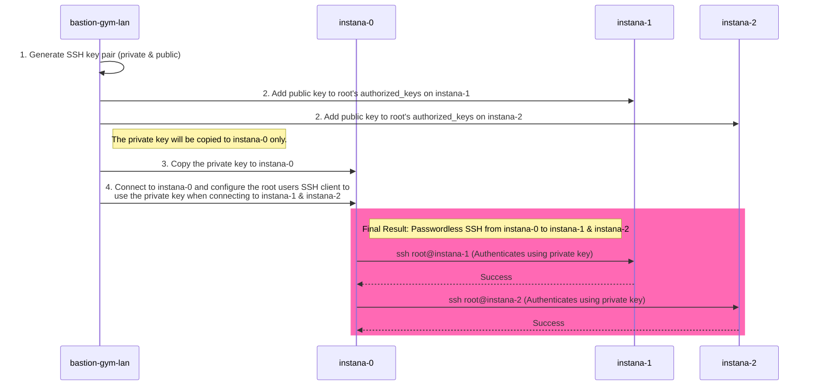
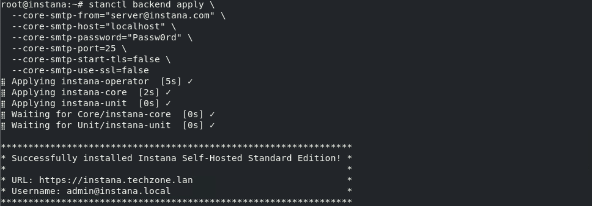

# Instana Server Installation

## 3.1: Introduction

Instana backend is available as SaaS (preferred option) or self hosted (aka
on-prem). For on-premises installations, Instana offers multiple containerized
options:

- **Standard Edition**
  - **Single-node cluster** Installs both the Instana backend and datastores on
    a single node K3s cluster.
  - **Multi-node cluster** Installs both the Instana backend and datastores a
    three node K3s cluster.
- **Custom Edition** Installs the backend Kubernetes Operator on a RedHat
  OpenShift or Kubernetes cluster. The datastores are not installed by the
  operator, they require manual installation either locally on the same cluster
  or remotely.
- **Classic Edition** Install both the Instana backend and the datasotres on a
  single VM using Docker. Unlike the other options this deployment does not
  support multi-tenancy. Note: **Classic Edition** is not a strategic deployment
  option. Many recent enhancements such as synthetics, automation catalog, and
  more are not available with Classic Edition.

:::tip

On-premises (self-hosted) releases are delivered every 4 weeks. The release have
odd numbers such as 225, 227, 229, etc. Historically upgrading, you may upgrade
from N-1 or N-2, but you couldn't skip more than one release. So, you can
upgrade from 225 to 229, but not to 231. Even numbered releases are for SaaS
only. SaaS is upgraded every 2 weeks. With the most recent version of
**Self-Hosted Standard Edition**, the N-1/N-2 requirement doesn't exist. When
you upgrade Instana, you will be provided a list of available releases that can
be installed. However, we still recommend keeping your Instana version fairly
current. For example, plan for upgrades every 2 months.

:::

For the installation of the Instana server, we'll be following the instructions
from the Instana documentation for a **Self-Hosted Standard Edition
Multi-node**. The instructions can be found
[here](https://www.ibm.com/docs/en/instana-observability/290?topic=edition-installing)
for your reference, but you can follow the steps below. You will be performing
an online installation during this Tech Jam, but Instana does support off-line
(air-gapped) installs.

The Classic Edition and Standard Editions are Instana's smallest on-premises
installation options. Larger deployments are installed into kubernetes for
horizontal scale and resiliency. For this lab the installation of Instana will
be completed on the VM's named **instana-0**, **instana-1** and **instana-2**.


## 3.2: Instana Multi-node Cluster

The three nodes in a multi-node cluster have specific uses:

- **instana-0** is labeled `node-role.instana.io: "backend"`. It is used for
  running backend workloads that require persistent volumes. The node also runs
  the gateway, acceptors, and the UI backend.
- **instana-1** is labeled `node-role.instana.io: "datastore"`. It is used for
  running data stores.
- **instana-2** is labeled `node-role.instana.io: "other"`. It used for running
  the rest of Instana workloads.

## 3.3 Prerequisites

For this multi-node installation, Instana requires the following:

**CPU and Memory**

3 Linux servers with 12 cores and 48 GB of RAM each.

**Storage**

~4TB of storage rated at at least 6000 IOPS (preferred 9000 IOPS) for production
environments. A detailed storage breakdown can be found
[here](https://www.ibm.com/docs/en/instana-observability/current?topic=mnc-system-requirements#storage-requirements).

:::tip

It is worth noting that Demo deployments only require 3000 IOPS however
multi-node deployments can only be installed in _production_ mode.

:::

**Networking**

Normally, you would need to ensure that the virtual machine has the correct
ports opened in the firewall for the agent, UI, and EUM communications. We have
already done this work for you. For reference, in an on-prem deployment, please
check the ports on your host must be open and accessible for the
[Single-node cluster](https://www.ibm.com/docs/en/instana-observability/current?topic=cluster-system-requirements#networking-requirements)
and
[Multi-node cluster](https://www.ibm.com/docs/en/instana-observability/current?topic=mnc-system-requirements#required-ports).
The ports for SaaS are slightly different.

In addition, online installations need access to a number of repositories that
are documented here for reference:
[here are the repositories](https://www.ibm.com/docs/en/instana-observability/current?topic=requirements-instana-self-hosted-deployments)

## 3.4. Preparing the server

:::tip

Prior to installing Instana, always ensure there is no instance of snap Docker
on the machine/s you will use as it can
[conflict with K3s](https://docs.k3s.io/known-issues#snap-docker).

There are few tasks that need to be run to prepare the servers for installation.
Lets start by ensuring you can connect to the first Instana host.

From the Bastion host, open a terminal window by selecting **Activities** at the
top left of the screen and then the terminal icon.

:::

:::tip

If you are unsure how to get access to the Bastion host (Guacamole) see
[Accessing a Lab Environment](/waiops-tech-jam/labs/jam-in-a-box/#accessing-a-lab-environment)

:::


Use the terminal to login to the first Instana host:

```sh title="Host: bastion-gym-lan"
ssh jammer@instana-0
```

When prompted if you want to continue connecting, type: `yes`

Use sudo to become root.

```sh title="Host: instana-0"
sudo -i
```

You are now operating as root on the first Instana host.

### 3.4.1. Prepare storage

The largest allocation of storage (3.7TB) for a multi-node installation is split
across four data storage directories on two nodes. The allocation for these
directories is as follows:

| Node      | Directory           | Path                           | Required Disk (GB) |
| --------- | ------------------- | ------------------------------ | ------------------ |
| instana-0 | **Objects**         | /mnt/instana/stanctl/objects   | 1000               |
| instana-1 | **Data**            | /mnt/instana/stanctl/data      | 500                |
|           | **Metrics**         | /mnt/instana/stanctl/metrics   | 1000               |
|           | **Analytics**       | /mnt/instana/stanctl/analytics | 1200               |
| instana-2 | No additional disks | N/A                            | N/A                |

The storage devices have been added to the hosts that require them but they must
be prepared with a filesystem and mounted prior to installation.

#### 3.4.1.1. Prepare storage on **instana-0**

Open your terminal window connected to **instana-0** and run the following to
list the available storage devices:

```sh title="Host: instana-0"
lsblk
```

As per the above table, we should expect to see a spare disk with the size of
1TB (1000GB) for the **Objects** directory. You should see output similar to the
below:

:::info

In this example, the device with 1000GB free is named **sdb**, the device name
may be different on your host.

:::

```sh {23} title="Example Output"
NAME                      MAJ:MIN RM   SIZE RO TYPE MOUNTPOINTS
loop0                       7:0    0     4K  1 loop /snap/bare/5
loop1                       7:1    0  55.6M  1 loop /snap/core18/2566
loop2                       7:2    0    62M  1 loop /snap/core20/1587
loop3                       7:3    0  63.2M  1 loop /snap/core20/1623
loop4                       7:4    0 238.5M  1 loop /snap/firefox/2015
loop5                       7:5    0 346.3M  1 loop /snap/gnome-3-38-2004/119
loop6                       7:6    0 349.7M  1 loop /snap/gnome-3-38-2004/143
loop7                       7:7    0  91.7M  1 loop /snap/gtk-common-themes/1535
loop8                       7:8    0   103M  1 loop /snap/lxd/23541
loop9                       7:9    0  89.4M  1 loop /snap/lxd/31333
loop10                      7:10   0  68.2M  1 loop /snap/powershell/220
loop11                      7:11   0  73.7M  1 loop /snap/powershell/283
loop12                      7:12   0    71M  1 loop /snap/prometheus/86
loop13                      7:13   0    47M  1 loop /snap/snapd/16292
loop14                      7:14   0    48M  1 loop /snap/snapd/17336
sda                         8:0    0   500G  0 disk
├─sda1                      8:1    0     1M  0 part
├─sda2                      8:2    0     2G  0 part /boot
└─sda3                      8:3    0   498G  0 part
  └─ubuntu--vg-ubuntu--lv 253:0    0   100G  0 lvm  /var/snap/firefox/common/host-hunspell
                                                    /
sdb                         8:16   0  1000G  0 disk
```

Capture the device name of the spare disk into the variable **OBJECTS_DISK**.

```php title="Host: instana-0"
OBJECTS_DISK=$(lsblk -o NAME,SIZE,TYPE,MOUNTPOINT | awk '
  $2 == "1000G" && $3 == "disk" {
    cmd = "lsblk -n /dev/" $1 " | wc -l";
    cmd | getline lines;
    close(cmd);
    if (lines == 1) print $1;  # Only 1 line means no partitions
  }
' | head -1)
```

You can run the following command to verify the value of the variable matches
the device name of the spare disk:

```php title="Host: instana-0"
echo $OBJECTS_DISK
```

You can now create an Ext4 filesystem on the device.

```php title="Host: instana-0"
for disk in $OBJECTS_DISK ; do
    echo "make filesystem for $disk"
    mkfs.ext4 -m 0 -E lazy_itable_init=0,lazy_journal_init=0,discard /dev/$disk
done
```

Now you will need to create the Objects directory that will be used to mount the
device:

```php title="Host: instana-0"
mkdir -p /mnt/instana/stanctl/objects
```

Then make a backup of the existing fstab file, get the UUID of the device and
add the new mount point for it:

```php title="Host: instana-0"
# Backup the existing fstab file
cp /etc/fstab /etc/fstab.backup

# Get the UUID of the device
OBJECTS_DEVICE_UUID=$(blkid -s UUID -o value /dev/$OBJECTS_DISK)

# Add the new mount point to the fstab file in case of a reboot
echo "UUID=$OBJECTS_DEVICE_UUID  /mnt/instana/stanctl/objects    ext4    discard,defaults,nofail        0 0" >> /etc/fstab

# Mount all filesystems
mount -a
```

Verify the mount point was added correctly by running the following command:

```php title="Host: instana-0"
lsblk /dev/$OBJECTS_DISK
```

You should now see that your device is mounted on the
`/mnt/instana/stanctl/objects` directory.

```sh title="Example Output"
NAME MAJ:MIN RM  SIZE RO TYPE MOUNTPOINTS
sdb    8:16   0 1000G  0 disk /mnt/instana/stanctl/objects
```

#### 3.4.1.2. Prepare storage on **instana-1**

Now we have to repeat the same steps for the 3 storage directories required on
the **instana-1** host.

Leave you current tab open, you will need it later.

Open a new terminal tab and connect to **instana-1**:

```sh title="Host: bastion-gym-lan"
ssh jammer@instana-1
```

Use sudo to become root.

```sh title="Host: instana-1"
sudo -i
```

You are now operating as root on the **instana-1** host.

Run the following to list the available storage devices:

```sh  title="Host: instana-1"
lsblk
```

As per the above table, we should expect to see three spare disks with the size
of 500GB, 1000GB and 1200GB. You should see output similar to the below:

:::info

The device names may be different for each storage allocation on your host.

:::

```sh {22-24} title="Example Output"
NAME                      MAJ:MIN RM   SIZE RO TYPE MOUNTPOINTS
loop0                       7:0    0  55.6M  1 loop /snap/core18/2566
loop1                       7:1    0     4K  1 loop /snap/bare/5
loop2                       7:2    0    62M  1 loop /snap/core20/1587
loop3                       7:3    0  63.2M  1 loop /snap/core20/1623
loop4                       7:4    0 238.5M  1 loop /snap/firefox/2015
loop5                       7:5    0 346.3M  1 loop /snap/gnome-3-38-2004/119
loop6                       7:6    0 349.7M  1 loop /snap/gnome-3-38-2004/143
loop7                       7:7    0  91.7M  1 loop /snap/gtk-common-themes/1535
loop8                       7:8    0   103M  1 loop /snap/lxd/23541
loop9                       7:9    0  89.4M  1 loop /snap/lxd/31333
loop10                      7:10   0  68.2M  1 loop /snap/powershell/220
loop11                      7:11   0  73.7M  1 loop /snap/powershell/283
loop12                      7:12   0    71M  1 loop /snap/prometheus/86
loop13                      7:13   0  44.4M  1 loop /snap/snapd/23771
sda                         8:0    0   500G  0 disk
├─sda1                      8:1    0     1M  0 part
├─sda2                      8:2    0     2G  0 part /boot
└─sda3                      8:3    0   498G  0 part
  └─ubuntu--vg-ubuntu--lv 253:0    0   100G  0 lvm  /var/snap/firefox/common/host-hunspell
                                                    /
sdb                         8:16   0   500G  0 disk
sdc                         8:32   0  1000G  0 disk
sdd                         8:48   0   1.2T  0 disk
```

Capture the device names of the spare disks into the variables **DATA_DISK**,
**METRICS_DISK** and **ANALYTICS_DISK**.

:::info

You could manually assign the device names to the variables DATA_DISK,
METRICS_DISK and ANALYTICS_DISK and continue however these commands will ensure
that the correct device names are used based on the size of the disk and the
partition status.

:::

```bash title="Host: instana-1"
DATA_DISK=$(lsblk -o NAME,SIZE,TYPE,MOUNTPOINT | awk '
  $2 == "500G" && $3 == "disk" {
    cmd = "lsblk -n /dev/" $1 " | wc -l";
    cmd | getline lines;
    close(cmd);
    if (lines == 1) print $1;  # Only 1 line means no partitions
  }
' | head -1)

METRICS_DISK=$(lsblk -o NAME,SIZE,TYPE,MOUNTPOINT | awk '
  $2 == "1000G" && $3 == "disk" {
    cmd = "lsblk -n /dev/" $1 " | wc -l";
    cmd | getline lines;
    close(cmd);
    if (lines == 1) print $1;
  }
')

ANALYTICS_DISK=$(lsblk -o NAME,SIZE,TYPE,MOUNTPOINT | awk '
  $2 == "1.2T" && $3 == "disk" {
    cmd = "lsblk -n /dev/" $1 " | wc -l";
    cmd | getline lines;
    close(cmd);
    if (lines == 1) print $1;
  }
')

```

You can run the following command to verify the value of the variable:

```sh title="Host: instana-1"
echo $DATA_DISK
echo $METRICS_DISK
echo $ANALYTICS_DISK
```

You can now create an Ext4 filesystem on the device.

```php title="Host: instana-1"
for disk in $DATA_DISK $METRICS_DISK $ANALYTICS_DISK ; do
    echo "make filesystem for $disk"
    mkfs.ext4 -m 0 -E lazy_itable_init=0,lazy_journal_init=0,discard /dev/$disk
done
```

Now you will need to create the data, metrics and analytics directories that
will be used to mount the devices:

```php title="Host: instana-1"
mkdir -p /mnt/instana/stanctl/data
mkdir -p /mnt/instana/stanctl/metrics
mkdir -p /mnt/instana/stanctl/analytics
```

Then make a backup of the existing fstab file, get the UUID of the device and
add the new mount point for it:

```php title="Host: instana-1"
# Backup the existing fstab file
cp /etc/fstab /etc/fstab.backup

# Get the UUID of the device
DATA_DEVICE_UUID=$(blkid -s UUID -o value /dev/$DATA_DISK)
METRICS_DEVICE_UUID=$(blkid -s UUID -o value /dev/$METRICS_DISK)
ANALYTICS_DEVICE_UUID=$(blkid -s UUID -o value /dev/$ANALYTICS_DISK)

# Add the new mount point to the fstab file in case of a reboot
echo "UUID=$DATA_DEVICE_UUID  /mnt/instana/stanctl/data    ext4    discard,defaults,nofail        0 0" >> /etc/fstab
echo "UUID=$METRICS_DEVICE_UUID  /mnt/instana/stanctl/metrics    ext4    discard,defaults,nofail        0 0" >> /etc/fstab
echo "UUID=$ANALYTICS_DEVICE_UUID  /mnt/instana/stanctl/analytics    ext4    discard,defaults,nofail        0 0" >> /etc/fstab

# Mount all filesystems
mount -a
```

Verify the mount points were added correctly by running the following commands:

```sh title="Host: instana-1"
lsblk
```

You should now see that your devices are mounted on the
/mnt/instana/stanctl/data, /mnt/instana/stanctl/metrics and
/mnt/instana/stanctl/analytics directories.

```sh title="Example Output"
NAME                      MAJ:MIN RM   SIZE RO TYPE MOUNTPOINTS
...
sdb                         8:16   0   500G  0 disk /mnt/instana/stanctl/data
sdc                         8:32   0  1000G  0 disk /mnt/instana/stanctl/metrics
sdd                         8:48   0   1.2T  0 disk /mnt/instana/stanctl/analytics
```

### 3.4.2. Set kernel parameters

There are some Kernel parameters that need to be set of each of the nodes. For
full details on the parameters, please refer to the
[Kernel Parameters documentation](https://www.ibm.com/docs/en/instana-observability/current?topic=cluster-preparing#kernel-parameters).

**Open a new terminal tab**, this will default you back to the **admin** user on
the **bastion-gym-lan** host. From the bastion host, run the following command
to iterate over each of the nodes and set the required kernel parameters:

:::note

StrictHostKeyChecking is set to no to avoid the need to accept the SSH key for
the instana-2 machine that we have not connected to yet.

:::

```php title="Host: bastion-gym-lan"
export SSH_OPTIONS="-o StrictHostKeyChecking=no"

for host in instana-0 instana-1 instana-2; do
  # Set vm.swappiness to 0 to make sure that application pages are not moved to swap space.
  ssh $SSH_OPTIONS jammer@$host "grep -q 'vm.swappiness=0' /etc/sysctl.d/99-stanctl.conf 2>/dev/null || sudo sh -c 'echo vm.swappiness=0 >> /etc/sysctl.d/99-stanctl.conf'"

  # Set fs.inotify.max_user_instances to 8192 to make sure that the system allows a maximum of 8192 inotify instances.
  ssh $SSH_OPTIONS jammer@$host "grep -q 'fs.inotify.max_user_instances=8192' /etc/sysctl.d/99-stanctl.conf 2>/dev/null || sudo sh -c 'echo fs.inotify.max_user_instances=8192 >> /etc/sysctl.d/99-stanctl.conf'"

  # Apply changes made to /etc/sysctl.d/99-stanctl.conf from the above commands
  ssh $SSH_OPTIONS jammer@$host "sudo sysctl -p /etc/sysctl.d/99-stanctl.conf"

  # Disable Transparent Huge Pages (THP) permanently for memory management.
  ssh $SSH_OPTIONS jammer@$host "sudo sh -c 'echo never > /sys/kernel/mm/transparent_hugepage/enabled && echo never > /sys/kernel/mm/transparent_hugepage/defrag'"

  # Disable the firewall
  ssh $SSH_OPTIONS jammer@$host "sudo ufw disable"

  echo "$host completed"
done
```

```sh title="Example Output"
vm.swappiness = 0
fs.inotify.max_user_instances = 8192
Firewall stopped and disabled on system startup
instana-0 completed
vm.swappiness = 0
fs.inotify.max_user_instances = 8192
Firewall stopped and disabled on system startup
instana-1 completed
Warning: Permanently added 'instana-2' (ECDSA) to the list of known hosts.
vm.swappiness = 0
fs.inotify.max_user_instances = 8192
Firewall stopped and disabled on system startup
instana-2 completed
```

You are now ready to start the installation of the Instana Server.

---

## 3.5. Installing Instana

First we need to ensure that the host **instana-0** has root access to the other
hosts in the Instana cluster. This is required to allow the **stanctl** tool to
install Instana components on the other hosts. To do this we need to generate a new public/private key pair and distribute the new keys to the Instana hosts.



1. Create a new ssh key pair
2. Add the public key to the root user on the **instana-1** and **instana-2** hosts
3. Copy the private key to the **instana-0** host
4. Add the private key to the root users .ssh directory and set permissions on **instana-0**
5. Ensure the new ssh key is used by by **instana-0** when connecting to
   **instana-1** and **instana-2**

Ensure you are on the **bastion-gym-lan** host and operating as the **admin**
user.

Run the following commands to create a new ssh key and store it in the
environment variable **PUBLIC_KEY**.

```sh title="Host: bastion-gym-lan"
ssh-keygen -t rsa -f ~/.ssh/instana-cluster -N "" -C "Instana Cluster Key"
```

Run the following to add the new public ssh key to the root user on
**instana-1** and **instana-2** hosts.

```php title="Host: bastion-gym-lan"
PUBLIC_KEY=$(cat ~/.ssh/instana-cluster.pub)
for i in 1 2; do
  ssh jammer@instana-$i "sudo -i bash -c 'mkdir -p ~/.ssh && chmod 700 ~/.ssh && echo \"$PUBLIC_KEY\" >> ~/.ssh/authorized_keys && chmod 600 ~/.ssh/authorized_keys' && echo \"SSH key added to instana-$i successfully\""
done
```

Setup the **root** user on **instana-0** to use the new ssh key to connect to
**instana-1** and **instana-2**:

```sh title="Host: bastion-gym-lan"
scp ~/.ssh/instana-cluster jammer@instana-0:/tmp/instana_key && echo "Key copied successfully" && \
ssh jammer@instana-0 "sudo -i bash -c 'mkdir -p ~/.ssh && chmod 700 ~/.ssh && \
mv /tmp/instana_key ~/.ssh/id_rsa && chmod 600 ~/.ssh/id_rsa && chown root:root ~/.ssh/id_rsa && \
echo \"Host instana-1 instana-2 192.168.252.30 192.168.252.31 192.168.252.32\" > ~/.ssh/config && \
echo \"    User root\" >> ~/.ssh/config && \
echo \"    IdentityFile ~/.ssh/id_rsa\" >> ~/.ssh/config && \
echo \"    StrictHostKeyChecking no\" >> ~/.ssh/config && \
chmod 600 ~/.ssh/config && echo \"All operations completed successfully\"'"
```

Now the host **instana-0** has access to the private ssh key that has been added
to the other hosts.

Navigate back to your terminal tab connected to **instana-0**. Ensure you are
still operating as the **root** user, you can check this by running the following:


```sh title="Host: instana-0"
hostname && whoami
```

You should see output similar to the following:

```sh title="Example output"
instana-0
root
```

:::info

If you don't see the above output you should open a new tab, connect to instana-0 and become the root user.

```sh
ssh jammer@instana-0
sudo -i
```

:::

Ensure you are able to connect to **instana-1** and **instana-2** as the root user using the newly created cluster key. Run the following:

```sh title="Host: instana-0"
ssh -o StrictHostKeyChecking=no -i ~/.ssh/id_rsa root@instana-1 "echo Connection to instana-1 successful" && ssh -o StrictHostKeyChecking=no -i ~/.ssh/id_rsa root@instana-2 "echo Connection to instana-2 successful"
```

You should see the following output:

```sh title="Expected Output"
Connection to instana-1 successful
Connection to instana-2 successful
```

:::danger

If you do not see the above output you need to revisit the key exchange and confirm all steps have been successfully run.

:::

Export your Instana Download and Sales keys as environment variables. Run the
following after replacing `<your-download-key>` and `<your-sales-key>` with the
[keys provided for your lab environment](https://ibm.seismic.com/Link/Content/DCQfMjDgqWT2B87FWXPhGXQbJGDP).

```sh title="Host: instana-0"
export AGENT_DOWNLOAD_KEY=<your-download-key>
export SALES_KEY=<your-sales-key>
```

Run the following commands to add the Instana repository.

```sh title="Host: instana-0"
echo 'deb [signed-by=/usr/share/keyrings/instana-archive-keyring.gpg] https://artifact-public.instana.io/artifactory/rel-debian-public-virtual generic main' > /etc/apt/sources.list.d/instana-product.list

cat << EOF > /etc/apt/auth.conf
machine artifact-public.instana.io
  login _
  password $AGENT_DOWNLOAD_KEY
EOF

wget -nv -O- --user=_ --password="$AGENT_DOWNLOAD_KEY" https://artifact-public.instana.io/artifactory/api/security/keypair/public/repositories/rel-debian-public-virtual | gpg --dearmor > /usr/share/keyrings/instana-archive-keyring.gpg
```

Update the package list and install the Instana **stanctl** utility. The
**stanctl** tool is used to install Instana and perform other Instana
administrative tasks.

```txt title="Host: instana-0"
apt update -y && \
apt install -y stanctl=1.11.5-1
```

Hold the stanctl package to prevent it from being upgraded unintentionally.

```sh title="Host: instana-0"
apt-mark hold stanctl
```

You can now verify your stanctl version by typing:

```sh title="Host: instana-0"
stanctl -v
```

You should see that the version is 1.11.5.

Install Instana

- We are installing Instana in **production** mode. A multi-node cluster only
  supports production mode.
- DNS has already been configured in this environment for the Instana vm's.
  Instana can be reached at _instana-0.ibmdte.local_. Further details on
  [required DNS entries can be found here](https://www.ibm.com/docs/en/instana-observability/current?topic=cluster-preparing#dns-settings).
- Internally, Instana has tenants, which are a logical construct. Each tenant
  has one or more tenant units. There are
  [restrictions to the names that can be chosen](https://www.ibm.com/docs/en/instana-observability/current?topic=cluster-preparing#tenant-and-unit-names).
  In this installation the tenant is **ibm** and the unit is **unit0**.
- The default administrator username is `admin@instana.local` and the password
  is `Passw0rd`.
- We are setting the volumes to the directories we created earlier during the
  storage configuration tasks.
- We are setting the SMTP configuration to use an SMTP server that has been
  configured in your lab environment.

  The installation below, uses a set of optional installation flags. If you are
  interested in seeing all of the available installation flags, you can run:

  ```sh title="Host: instana-0"
  stanctl up --help
  ```

Start the installation by running the following command:

:::info

- If prompted with "Would you like to execute the script
  (stanctl-preflight.sh)?" press **N** for no.

- When prompted to "Enter TLS certificate file (hit ENTER to auto-generate):"
  press **Enter** to auto-generate the certificate.

:::

```sh title="Host: instana-0"
stanctl up \
  --instana-version="3.305.486-0" \
  --multi-node-enable \
  --multi-node-ips="192.168.252.30,192.168.252.31,192.168.252.32" \
  --install-type="production" \
  --core-base-domain="instana-0.ibmdte.local" \
  --timeout="60m0s" \
  --download-key=$AGENT_DOWNLOAD_KEY \
  --sales-key=$SALES_KEY \
  --unit-initial-admin-password="Passw0rd" \
  --unit-tenant-name="ibm" \
  --unit-unit-name="unit0" \
  --volume-analytics="/mnt/instana/stanctl/analytics" \
  --volume-metrics="/mnt/instana/stanctl/metrics" \
  --volume-objects="/mnt/instana/stanctl/objects" \
  --volume-data="/mnt/instana/stanctl/data" \
  --core-smtp-from="server@instana.com" \
  --core-smtp-host="192.168.252.33" \
  --core-smtp-port="30025" \
  --core-smtp-check-server-identity=false \
  --core-smtp-start-tls=false \
  --core-smtp-use-ssl=false
```

:::info

Many of these installation parameters are optional if you are performing a
default install. If you do not specify the mandatory parameters such as the
`SALES_KEY`, you will be prompted during the installation.

The `--timeout` parameter is important for slower environments. The default
timeout is 30 minutes. If the install doesn't complete in the required time, the
install will fail.

The `core-base-domain`, `unit-tenant-name`, and `unit-unit-name` are important
parameters. The `core-base-domain` is typically the fully qualified hostname of
the server and must be in DNS. The unit name, tenant name, and base domain get
concatenated into the URL that you use to Log into the Instana UI.

Example: https://unit0-ibm.instana-0.ibmdte.local

This name must also be in the DNS server.

:::

The instana license is automatically applied during the installation process.
You can view it by running the following command:

```sh title="Host: instana-0"
stanctl license info
```

The installation will take approximately 20 minutes, but depends on the
performance of your server.

---

## 3.6: Launch the Instana User interface

Once the installation finished and you are prompted with the message....

You can open a browser and login to the Instana user interface.

Open a firefox browser and select the **Instana** bookmark.


:::info

You can safely ignore the warning about the certificate being untrusted.


:::

When prompted, enter the username and password that you updated earlier.

- Username: **admin@instana.local**
- Password: **Passw0rd**


You will be taken to an Initial Screen where you can install the instana agents
or navigate to the main product UI. We will install an Instana Agent in the
upcoming section of the lab.

---

<details>
<summary>Configuring SMTP after installation</summary>

:::warning Do not perform these steps

You should not perform any steps in this section, it is for information only.

:::

If you look back at the command used for installation you will see you have
already configured an SMTP server in this environment. You do not need to
configure your server at the time of installation, the SMTP settings can be
later modified using the stanctl tool. The following command will update the
SMTP settings of the Instana server:

```sh title="Host: instana-0"
stanctl backend apply \
  --core-smtp-from="server@instana.com" \
  --core-smtp-host="X.X.X.X" \
  --core-smtp-password="PASSWORD" \
  --core-smtp-port=25 \
  --core-smtp-start-tls=false \
  --core-smtp-use-ssl=false
```

Once updated you should see output similar to the below:



If you are interested in all of the parameters that can get specified using the
**stanctl backend apply** command, type:

```sh title="Host: instana-0"
stanctl backend apply --help
```

</details>

<details>
<summary>Turning on optional features</summary>


:::warning Do not perform these steps

You should not perform any steps in this section, it is for information only.

:::

There are optional configurations that you will likely want to make to your
installation of Instana.

These options are made available via optional 'feature flags'. For features such
as VMware/vSphere monitoring, Power HMC monitoring, and zHMC monitoring which
are disabled by default.

As an example to enable VMware/vSphere monitoring, you would run the following
command:

```sh title="Host: instana-0"
stanctl backend apply --core-feature-flags feature.vsphere.enabled
```

You can view a
[full list of available feature flags here.](https://www.ibm.com/docs/en/instana-observability/current?topic=configuring-enabling-optional-features)


</details>

<details>
<summary>Upgrading the Instana server</summary>

:::warning Do not perform these steps

You should not perform any steps in this section, it is for information only.

:::

Upgrades are made simple with the **stanctl** tool. The process for an upgrade
is to first upgrade **stanctl** and then upgrade the Instana backend.

Upgrading the **stanctl** tool is different depending on the Operating System
you are using. As an example for Ubuntu you would run the following commands:

```sh title="Host: instana-0"
# Unhold the stanctl package if it is held
sudo apt-mark unhold stanctl

apt update -y
apt install -y stanctl

# Hold the stanctl package again to prevent it from being upgraded unintentionally.
apt-mark hold stanctl
```

Then upgrade the backend:

```sh title="Host: instana-0"
stanctl up
```

The command will list the available update options. Use the arrows on your
keyboard to move up and download to select the version that you want to install
from the list provided.

</details>

---

## 3.7: Summary

In this portion of the lab, you have learned how to prepare an environment for
the installation of the **Self-Hosted Multi-node Standard Edition** Instana
server. You have also learned how to configure SMTP settings and how to enable
feature flags.

For a POC, we recommend either SaaS or the single node Standard Edition. For
production deployments, customers will want the **multi-node Standard Edition**
or **Self-Hosted Custom Edition**. **Multi-Node Standard Edition** will increase
scalability. **Self-Hosted Custom Edition** provides more flexibility in terms
of kubernetes/OpenShift environments and dramatically improves scalability as
well as providing built-in resiliency.

You are now ready to learn how to install and configure an Instana Agent.

---
