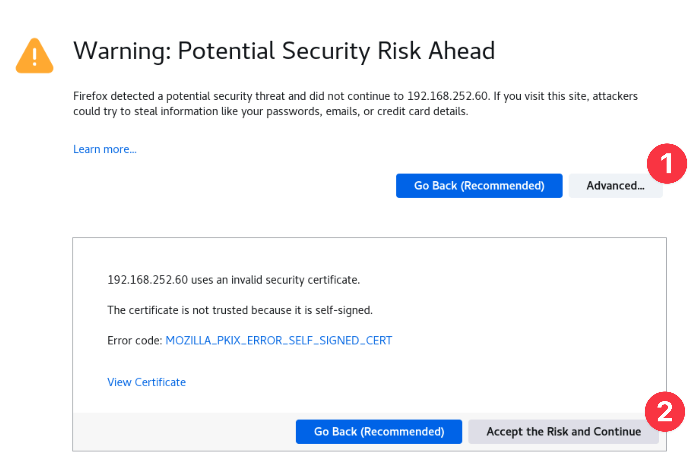

# Instana Server Installation

## 3.1: Introduction

Instana backend is available as SaaS (preferred option) or self hosted (aka
on-prem). For on-premises installations, Instana offers multiple containerized
options:

- **Self Hosted Standard Edition** Installs both the Instana backend and
  datastores on a single node K3s cluster.
- **Self Hosted Custom Edition** Installs the backend Kubernetes Operator on a
  RedHat OpenShift or Kubernetes cluster. The datastores are not installed by
  the operator, they require manual installation either locally on the same
  cluster or remotely.
- **Self Hosted Classic Edition** Install both the Instana backend and the
  datasotres on a single VM using Docker. Unlike the other options this
  deployment does not support multi-tenancy.

:::tip

On-premises (self-hosted) releases are delivered every 4 weeks. The release have
odd numbers such as 225, 227, 229, etc. When upgrading, you may upgrade from N-1
or N-2, but you can't skip more than one release. So, you can upgrade from 225
to 229, but not to 231. Even numbered releases are for SaaS only. SaaS is
upgraded every 2 weeks.

:::

For the installation of the Instana server, we'll be following the instructions
from the Instana documentation for a **Self-Hosted Standard Edition**. The
instructions can be found
[here](https://www.ibm.com/docs/en/instana-observability/current?topic=backend-installing-standard-edition)
for your reference, but you can follow the steps below. You will be performing
an online installation during this Tech Jam, but Instana does support off-line
(air-gapped) installs.

The Classic Edition and Standard Editions are Instana's smallest on-premises
installation option. Production and larger deployments are installed into
kubernetes for horizontal scale and resiliency. For this lab the installation of
Instana will be completed on the VM named **instana**.


## 3.2: Prerequisites

Instana requires a Linux server with 16 cores, 64 Gig of RAM and few hundred Gig
of disk space for a POC sized deployment. It also requires fast backend storage.
For environments with even a few hundred servers, you'll need 6000 IOPS or more.
For larger deployments, you'll need more capacity. Several different versions of
Linux are supported. We have chosen Ubuntu 22.04 for this environment.

:::info

Normally, you would need to ensure that the virtual machine has the correct
ports opened in the firewall for the agent, UI, and EUM communications. We have
already done this work for you. For reference,
[here are the ports](https://www.ibm.com/docs/en/instana-observability/current?topic=edition-system-requirements#networking-requirements)
that need to be opened for the Instana Server for an on-prem deployment. The
ports for SaaS are slightly different.

:::

:::tip

If you are unsure how to get access to the Bastion host (Guacamole) see
[Accessing a Lab Environment](/waiops-tech-jam/labs/jam-in-a-box/#accessing-a-lab-environment)

:::

From the Bastion host (Guacamole), open a terminal window by selecting
**Activities** at the top left of the screen and then the terminal icon.


Use the terminal to login to the Instana host:

```sh
ssh jammer@instana
```

When prompted if you want to continue connecting, type: `yes`

Use sudo to become root.

```sh
sudo -i
```

Prior to installing Instana, you must ensure there is no instance of Docker on
the machine you will use as it can
[conflict with K3s](https://docs.k3s.io/known-issues#snap-docker).

:::tip Optional Tip

Due to the large number of requests that can be made to Docker Hub from the IBM
network rate limiting may occur when you try to install Instana. You can prevent
this by adding your own Docker Hub credentials.

1. [Sign up](https://hub.docker.com/signup) to Docker Hub if you don't already
   have an account.
2. From the Instana VM export the following environment variables:

```sh
export DOCKER_HUB_USERNAME=<your-docker-hub-username>
export DOCKER_HUB_PASSWORD=<your-docker-hub-password>
```

3. Run the following commands to create the authentication file for Docker Hub
   in the K3s directory:

```sh
sudo mkdir -p /etc/rancher/k3s
sudo tee /etc/rancher/k3s/registries.yaml <<EOF
configs:
  registry-1.docker.io:
    auth:
      username: ${DOCKER_HUB_USERNAME}
      password: ${DOCKER_HUB_PASSWORD}
EOF
```

4. Confirm the new file is accurate by running:

```sh
cat /etc/rancher/k3s/registries.yaml
```

:::

## 3.3. Preparing the server

There are few tasks that need to be run to prepare the server for the
installation.

Set the required kernel parameters by running the following commands:

```sh
echo fs.inotify.max_user_instances=8192 >> /etc/sysctl.d/99-stanctl.conf && sudo sysctl -p /etc/sysctl.d/99-stanctl.conf
echo vm.swappiness=0 >> /etc/sysctl.d/99-stanctl.conf && sudo sysctl -p /etc/sysctl.d/99-stanctl.conf
sysctl --load
echo never > /sys/kernel/mm/transparent_hugepage/enabled
```

Set the firewall rules. In this lab we are in a restricted network so we don't
need to worry about the firewall rules. You can simply run the following:

```sh
ufw disable
```

For production you can
[reference the Firewall Rules documentation](https://www.ibm.com/docs/en/instana-observability/current?topic=edition-preparing#firewall-rules)
for the exact rules you need to set for your Operating System.

Prepare the mount volumes. We will be using a single disk with multiple
directories in this lab. In a production environment you will likely want to
provision multiple disks to meet the
[IOPS requirements](https://www.ibm.com/docs/en/instana-observability/current?topic=edition-system-requirements#storage-requirements)
of Instana. If you use more than one disk you can refer to the
[documentaton for preparing additional disks](https://www.ibm.com/docs/en/instana-observability/current?topic=edition-preparing#prepare-the-additional-disks)
for the Instana server.

```sh
mkdir -p /mnt/instana/stanctl/data
mkdir -p /mnt/instana/stanctl/metrics
mkdir -p /mnt/instana/stanctl/analytics
mkdir -p /mnt/instana/stanctl/objects
```

You are now ready to start the installation of the Instana Server.

---

## 3.4. Installing Instana

Export the Download key as an environment variables

```sh
export DOWNLOAD_KEY=<your-download-key>
```

Run the following commands to install the Instana package. Review the output of
each command using _cat_ to be sure the commands are successful before
proceeding to the next step.

```sh
echo 'deb [signed-by=/usr/share/keyrings/instana-archive-keyring.gpg] https://artifact-public.instana.io/artifactory/rel-debian-public-virtual generic main' > /etc/apt/sources.list.d/instana-product.list
cat /etc/apt/sources.list.d/instana-product.list
```

```sh
cat << EOF > /etc/apt/auth.conf
machine artifact-public.instana.io
  login _
  password $DOWNLOAD_KEY
EOF
cat /etc/apt/auth.conf
```

```sh
wget -O- --user=_ --password="$DOWNLOAD_KEY" https://artifact-public.instana.io/artifactory/api/security/keypair/public/repositories/rel-debian-public-virtual | gpg --dearmor > /usr/share/keyrings/instana-archive-keyring.gpg
cat /usr/share/keyrings/instana-archive-keyring.gpg
```

Update the package list and install the Instana **stanctl** installation tool.

```sh
apt update -y
apt install -y stanctl
```

Hold the stanctl package to prevent it from being upgraded unintentionally.

```sh
apt-mark hold stanctl
```

Install Instana

- We are installing Instana in **demo** mode.
- DNS has already been configured in this environment for the Instana vm, it can
  be reached at _instana.techzone.lan_. Further details on
  [required DNS entries can be found here](https://www.ibm.com/docs/en/instana-observability/current?topic=edition-preparing#dns-settings).
- Internally, Instana has tenants, which are merely a logical construct. Each
  tenant in turn has at least one or multiple tenant units. There are
  [restrictions to the names that can be chosen](https://www.ibm.com/docs/en/instana-observability/current?topic=edition-preparing#tenant-and-unit-names).
  In this case the tenant is IBM and the unit is unit0.
- The default administrator password for the **admin.instana.local** user is
  **Passw0rd**.
- We are setting the volumes to the directories we created earlier.
- We are skipping preflight checks as the environment does not have the storage
  required to meet the minimum requirements, it is satisfactory for a small demo
  instance though.

```sh
stanctl up \
--install-type="demo" \
--timeout="60m0s" \
--core-base-domain="instana.techzone.lan" \
--download-key=$DOWNLOAD_KEY \
--sales-key=$SALES_KEY \
--unit-tenant-name="ibm" \
--unit-unit-name="unit0" \
--unit-initial-admin-password="Passw0rd" \
--volume-analytics="/mnt/instana/stanctl/analytics" \
--volume-metrics="/mnt/instana/stanctl/metrics" \
--volume-objects="/mnt/instana/stanctl/objects" \
--volume-data="/mnt/instana/stanctl/data" \
--skip-preflight-check
```

The instana license is automatically applied during the installation process.
You can view it by running the following command:

```sh
stanctl license info
```

---

## 3.5: Launch the Instana User interface

Once the installation finished and you are prompted with the message....

You can open a browser and login to the Instana user interface.

Open a firefox browser and select the **Instana** bookmark.


:::info

You can safely ignore the warning about the certificate being untrusted.



:::

When prompted, enter the username and password that you updated earlier.

- Username: **admin@instana.local**
- Password: **Passw0rd**


You will be taken to an Initial Screen where you can install the instana agents
or navigate to the main product UI. We will install an Instana Agent in the
upcoming section of the lab.


---

## 3.6: Turning on features and setting up SMTP

Following the initial install of your Instana server, there are optional
configurations that you will likely want to make.

- You may need to setup the Instana server to use an SMTP server if you plan to
  send out Email notifications.
- There may be some optional features that you want to enable via feature flags.
  Features such as VMware/vSphere monitoring, Power HMC monitoring, and zHMC
  monitoring are disabled by default.

Follow the steps below to configure the SMTP settings and enable some additional
feature flags.

1. Edit `settings.hcl` file according to the
   [documentation](https://www.ibm.com/docs/en/obi/current?topic=installer-enabling-feature-flags).
   The **settings.hcl** file will be located in the same directory where you
   issued the **instana init** command.

These parameters are added to the settings.hcl file in the section with the
other feature flags. Search in the settings.hcl file for **feature**. Then, add
any additional feature flags that are desired in that section of the file. They
can be place anywhere within the **feature** section of the file.

:::caution

Be aware that turning on features (especially BETA features) may heavily impact
backend performance. DO NOT turn on features you don't need\*\*

:::

As we issued **instana init** from the working directory `/opt/instana`, the
`settings.hcl` has been created there:

```sh
cd /opt/instana
```

Before you edit the settings.hcl file, make a backup of the file by typing:

```sh
cp settings.hcl settings.hcl.bak
```

Now, edit the settings.hcl file by typing:

```sh
vi settings.hcl
```

Locate the existing _feature_ settings and add the following feature flags.

```java
feature "infraCustomDashboards" {
  enabled = true
}
feature "infraEntityExplore" {
  enabled = true
}
```

:::info

Note: There are other feature flags that you should be aware of, <span
style={{color: "red"}}> but do not add these into the settings.hcl file</span>.
Here are some common feature flags available are:

```java
feature "vsphereEnabled" {
  enabled=true
}
feature "zhmcEnabled" {
  enabled=true
}
feature "phmcEnabled" {
  enabled=true
}
feature "beeinstana" {
  enabled=true
}
feature "smartAlertsLogsBlueprintEnabled" {
  enabled=true
}
feature "infraCustomDashboards" {
  enabled = true
}
feature "infraEntityExplore" {
  enabled = true
}
```

:::

Next, in the same file search for the **smtp** section in the settings.hcl file.
Modify the smtp section to look like the below. We recommend that you edit the
parameters rather than copy/paste this section. It is easy to make a mistake
with the spacing when doing a copy/paste.

:::note

If you want, you can replace the **from** parameter with any Email address that
you like. The **from** Email address is what you will see as the sender of the
Email alerts from Instana.

:::

```sh
  smtp {
    from      = "server@instana.com"
    host      = "localhost"
    port      = 25
    user      = "jammer"
    password  = "Passw0rd"
    use_ssl   = false
    start_tls = false
  }
```

Save the changes in the settings.hcl file.

2. Apply the changes

```sh
instana update -f ./settings.hcl
```

:::tip

It will take a little while for the configuration changes to take effect. The
next section on upgrading the Instana Server is for information only, you can
read it while the configuration changes are being applied.

:::

Once complete you should see the below


---

## 3.7: Upgrading the Instana server

:::warning Do not perform these steps

You should not perform any steps in this section, it is for information only.

We want you to know the process for performing an upgrade.

:::

When upgrading an Instana server, it is important to know that you can only skip
one release when upgrading. The on-prem/self-hosted releases use odd numbers.
That means that you can upgrade from version 225 to either 227 or 229. But, you
can't upgrade from 225 to 231 because that would be skipping 2 releases and
isn't supported. It is important for customers to know this because they need to
keep their Instana server patched on a fairly regular basis. Otherwise, it will
mean that they will have to perform multiple steps to upgrade to the current
version.

Before attempting to upgrade, you want to confirm your current version. Issue
the **instana version**

```sh
instana version
```

Next, find out what versions are available to be installed. Issue the the
following command:

```sh
apt-cache policy instana-console
```

You will see a long list of versions that are available. Scroll to the top of
the list where you will see the most recent versions. 

You'll notice that in this example, 229-2 is the most recent version and 229-1
is the current version. That means you can upgrade to that minor release. There
is newer major release available.

First, install the latest instana-console. This upgrades the **instana** command
that is installed on your server:

```sh
apt install instana-console=229-2
```

Next, upgrade the server by issuing the **instana update** command. If you are
in directory with the settings.hcl file, then you don't need any arguments.
Otherwise, specify the path to the settings.hcl file.

```sh
instana update -f /opt/instana/settings.hcl
```

When performance the upgrade, the installer automatically pulls down the latest
docker containers and gets them up and running on the Instana server.

---

## 3.8: Summary

In this portion of the lab, you have learned how to install a self-hosted docker
based Instana server. For a POC, we recommend either SaaS or the single server
self-hosted docker installation of the Instana server. For production
deployments, customers will want the kubernetes based deployments to gain
improved scalability and resiliency.

You have also learned how to configure the SMTP settings and how to enable
feature flags.

Finally, you learned how to upgrade a docker based self-hosted Instana server.

You are now ready to learn how to install and configure an Instana Agent.

---
