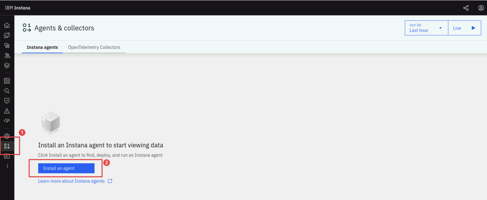
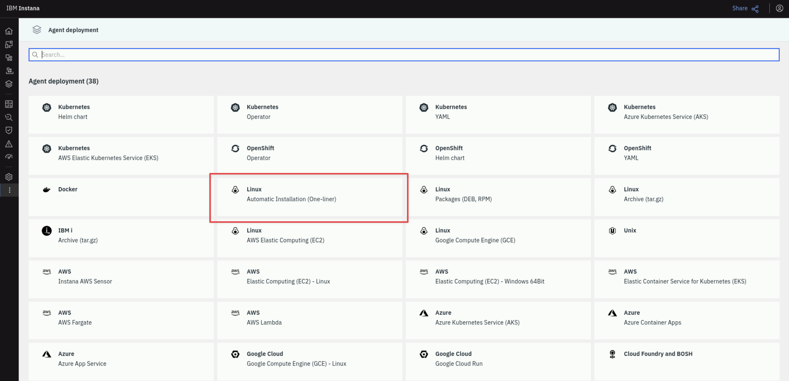
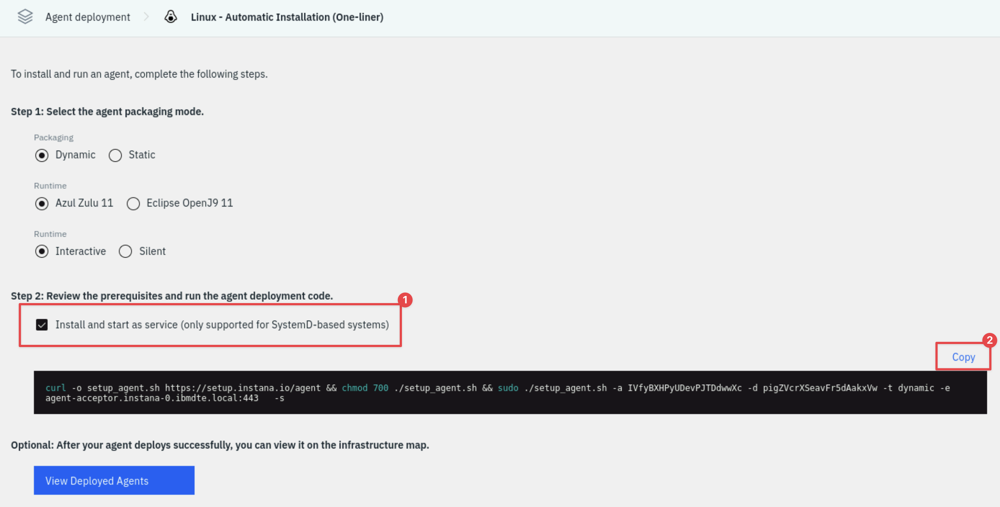
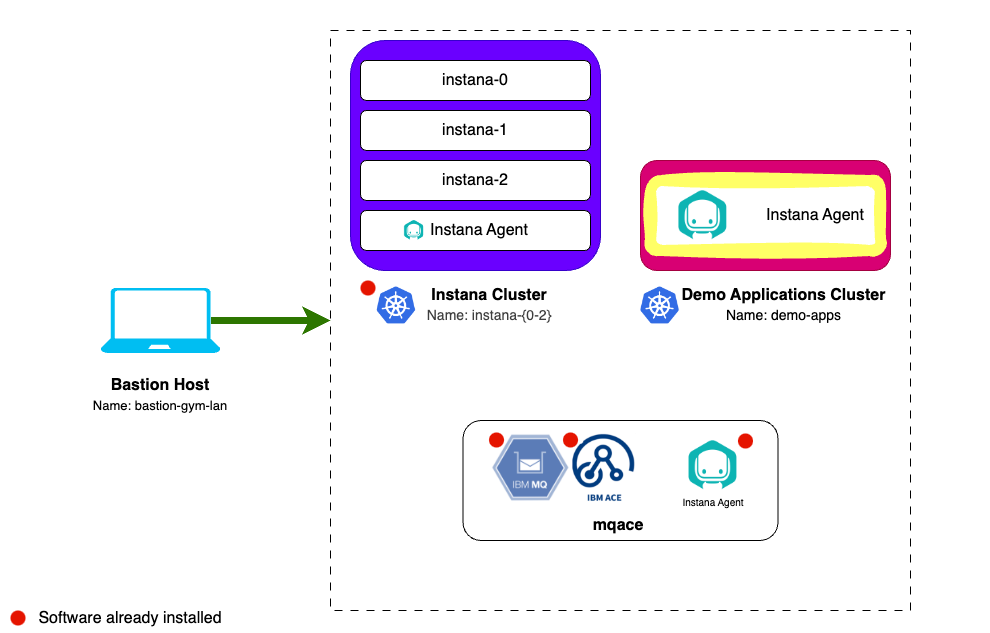
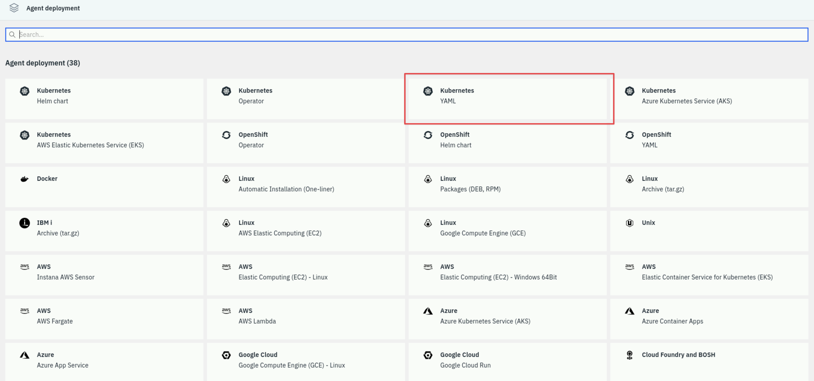
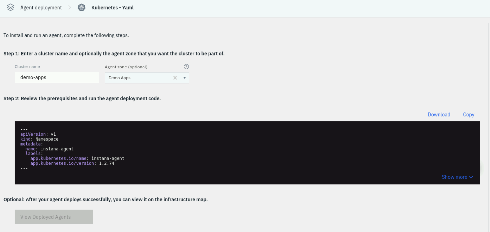
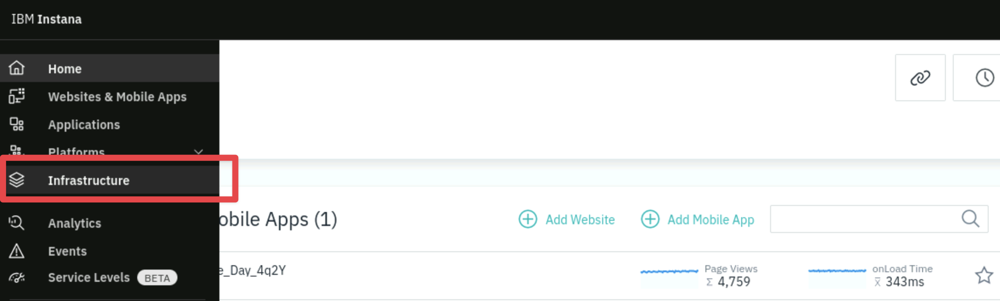

# Agent Installation

## 4.1: Instana Agent Deployment Options

Instana has a variety of agent installation options including the mirror
repository and static agents that allow customers to meet strict change control
processes. Some of the available options are listed below:

- OS specific installer (Linux, MacOS, Windows, UNIX)
- Container setup
- Docker (and other container managers)
- Kubernetes
- OpenShift
- Hosted Cloud Services
- Serverless component

All above mentioned methods are accessible via the wizard on the Instana UI.

If at any point you want to review the Instana agent documentation you can find
it [here](https://www.ibm.com/docs/en/SSE1JP5_current/src/pages/setup_and_manage/host_agent/index.html).

:::caution

If you are unable to access the Instana Web UI you will need to go back through
the previous lab and follow all the steps to ensure that the Instana server is
up and running.

:::

When installing the Instana agent you have to select if you want the agent to be
**dynamic** or **static** based on whether it can update itself or not.

- A **Dynamic** host agent downloads the latest set of sensors from
  repositories. By default, a dynamic agent updates itself at agent startup and
  checks daily for updates to the agent and sensor code. This automatically
  gives you access to new features and bug fixes. It is also possible to tightly
  control the updating of dynamic host agents by
  [pinning a version](https://www.ibm.com/docs/en/instana-observability/current?topic=agents-configuring-updates-dynamic-host#version-pinning)
  It is also possible to change the interval that the Agent checks for updates.

  By default, dynamic host agents use the Instana repository to pull updates,
  but it is possible to
  [set up your own managed mirror](https://www.ibm.com/docs/en/instana-observability/current?topic=agents-setting-up-agent-repositories-dynamic-host).
  Currently, the mirror must be a Nexus or Artifactory repository. This is
  probably the best option for must customers because it allows them the
  benefits of automatic updates, while at the same time controlling the content
  that is in the repository. In addition, it eliminates the need for every Agent
  to have internet access to the repositories.

- A **Static** host agent is a self-contained host agent that includes all the
  latest available components at the time of its release, and has no dynamic
  update capabilities. The static host agent has a stable "bill of materials"
  that never changes after the host agent's installation. **Static Agents** must
  be manually upgraded or upgraded via automation such as Ansible.

:::tip

Static host agents require no internet connection to the Instana repository, and
are recommended in restrictive network setups.

:::

---

## 4.2: Installing a local Instana Agent on K3s for self monitoring


Instana provides the ability to setup **self monitoring** of the **Standard
Edition** server types (single and multi-node). Self monitoring the Instana Backend when using the Standard
Edition of Instana installed on K3s is very simple, the
Agent is automatically configured to monitor the key technologies such as
cassandra, kafka, postgres, etc. so that the entire Instana backend server is
being monitored.

Open a new terminal tab by selecting **File** -> **New Tab**.

SSH to the Instana server with the _stanctl_ cli tool installed:

```sh
ssh jammer@instana-0
```

Become the root user:

```sh
sudo -i
```

Run the following command:

```sh
stanctl agent apply
```

You should see the following output:

```sh title="Example output"
⠼ Adding Instana Helm repo  [13s] ✓
⠧ Applying Instana agent  [1m16s] ✓
```

---

## 4.3: Installing Instana Agent on a Linux VM

Next we will install the Instana Agent on a Linux VM that is running IBM MQ and ACE.


After logging into Instana for the first time you will be taken to the Agent
Deployment page.

:::tip

If you aren't on the **Agent deployment** screen you can get there by selecting
the **Home** menu in the left navigation and then clicking the **"Deploy
Agent"** button near the upper right corner.



:::

A list of different environments where you can install the Instana Agent is
shown. For example, on Linux, you can choose a automatic **one-liner**
installation, RPM, or TAR file installation. For OpenShift/kubernetes, you have
multiple options including operator, helm, and yaml installs. The _MQACE_ VM is a
Linux server, the easiest method for Linux is the automatic one-liner, so select **Linux Automatic Installation (One-liner)**.



There are a few options on this page for the _agent packaging mode_ including the use of different java versions, static vs. dynamic agents, etc. Leave the default settings.

Select the checkbox next to **"Install and start as service"**. This will
setup the systemctl autostart process and will also start the Agent immediately
after it is installed. Select **Copy** to copy the command to your clipboard.



Open a new terminal tab by selecting **File** -> **New Tab**.

SSH to the ACE/MQ server as follows:

```sh
ssh jammer@mqace
```

When prompted if you want to continue connecting, type: `yes`

Use sudo to switch to the root user:

```sh
sudo -i
```

Paste the curl command you copied earlier into the **root@mqace** terminal window
and answer `y` when prompted.

At this point the Agent is installed and up and running. You can confirm this by
running:

```sh
ps -ef | grep instana
```

You should see a process running, the short version looks like this:

```sh
root       22012       1 99 12:35 ?        00:00:11 /opt/instana/agent/jvm/bin/java .....
```

The Agent will automatically start monitoring the operating system and start
discovering key processes and middleware. In many cases it will automatically
instrument those technologies. In the case of some technologies (eg. MQ an and
App Connect Enterprise), there are manual configuration steps required due to
the need to provide credentials for accessing those applications.

---

## 4.4: Installing the Instana Agent on a Kubernetes Cluster

The next step is to install the Instana Agent into the **demo-apps** Kubernetes Cluster. In future labs we'll be using this cluster to host our demo applications like _Robot Shop_, _Quote of the Day_ and others.



Navigate back to the **Agent deployment** screen by selecting **Home** and then
clicking the **Deploy Agent** button near the upper left corner.


There are a few different options for installing the Instana Agent on a Kubernetes cluster. A common method is to use the **Helm** chart, you will need to ensure that Helm has been installed first though. A 'dependency free' option is the _YAML_ method.

Select the tile **Kubernetes YAML**.



Provide a meaningful name for the Cluster and specify and Agent Zone. These
namespace will show up within the Instana UI:

- **Cluster name**: `demo-apps`
- **Agent Zone**: `Demo Apps`



Setting these values will allow you to find your Agent and Kubernetes Cluster
within the user interface and not get confused by data coming in from other
agents.

:::info

Zones are used to organize the Instana Agents (and sensors). Many customers
create zones for lines of business, data center locations, public cloud regions,
etc

:::

Select the **Copy** button to copy the yaml content.

Open a new tab in your terminal. SSH to the _demo-apps_ kubernetes cluster:

```sh
ssh jammer@demo-apps
```

When prompted if you want to continue connecting, type: `yes`

Use sudo to switch to the root user:

```sh
sudo -i
```

You can check to ensure you are in the right place by running the following:

```sh
kubectl get nodes
```

You should see the following output:

```sh title="Example output"
NAME        STATUS   ROLES                  AGE   VERSION
demo-apps   Ready    control-plane,master   19h   v1.32.2+k3s1
```

We not need to paste the yaml content into a text document. Start by creating and opening a new file called **instana-agent.yaml** using the vi editor.

```sh
vi instana-agent.yaml
```

Now enter paste mode by typing the following command:

```sh
:set paste
```

Enter insert mode by pressing `i` and then **paste the yaml content you copied earlier**.

:::tip

If at any times you have any issues you can press the `Esc` key to exit insert mode and then type `:q!` to quit the editor without saving. You can then try again.

:::

Save the file and exit the editor by pressing `Esc` and then typing `:wq` and then `Enter`.

You can now apply the yaml file to the cluster by running the following command:

```sh
kubectl apply -f instana-agent.yaml
```

If done correctly you should see the following output:

```sh title="Example output"
root@demo-apps:~# kubectl apply -f instana-agent.yml
namespace/instana-agent created
serviceaccount/instana-agent created
service/instana-agent created
service/instana-agent-headless created
secret/instana-agent created
configmap/instana-agent created
daemonset.apps/instana-agent created
clusterrole.rbac.authorization.k8s.io/instana-agent created
clusterrolebinding.rbac.authorization.k8s.io/instana-agent created
configmap/k8sensor created
deployment.apps/k8sensor created
clusterrole.rbac.authorization.k8s.io/k8sensor created
clusterrolebinding.rbac.authorization.k8s.io/k8sensor created
serviceaccount/k8sensor created
```

Next, view a list of the pods that are running in the agent namespace.

```sh
kubectl get pods -n instana-agent
```

There will be one pod for each worker node in your target cluster. This Kubernetes cluster
only has one node so you will only see one agent pod running.

```sh title="Example output"
root@demo-apps:~# kubectl get pods -n instana-agent
NAME                        READY   STATUS    RESTARTS   AGE
instana-agent-vw7lz         1/1     Running   0          63s
k8sensor-85995748f9-4qtz9   1/1     Running   0          63s
k8sensor-85995748f9-mc6x5   1/1     Running   0          63s
k8sensor-85995748f9-sfldk   1/1     Running   0          63s
```

This completes the installation of Instana agent on OpenShift cluster.

---

## 4.5: View Instana Agents in the Instana UI

From the left navigation select **Infrastructure**.



You should see 5 nodes reporting. The **Multi-node Instana Cluster**, the **MQACE VM** and the
**Single Node Kubernetes VM**. If you don't see them yet, give the agents a
few minutes to start reporting.

:::info

In an upcoming section we will learn how to update the name of the zone where
the _MQACE_ VM resides.

:::


:::note

The demo-apps cluster being yellow can be ignored in this environment. It is an Instana warning letting us know that the vm is operating at a consistently high load.

:::

## 4.6: Troubleshooting the Instana Agent Installation on Linux

If you cannot see the **MQACE** host in the Instana UI you
should read the Instana agent logs on the mqace host. From the bastion host run the following command:

```sh
ssh jammer@mqace
sudo -i
```

View the Instana agent log file:

```sh
cat /opt/instana/agent/data/log/agent.log
```

Look for the current status and any warnings or errors that may be shown.

## 4.7: Troubleshooting the Instana Agent Installation on a Kubernetes Cluster

If you don't see the **demo-apps** host in the **Demo Apps** zone after a couple of
minutes, you need to troubleshoot the Instana Agent.

From the bastion host run the following command:

```sh
ssh jammer@demo-apps
sudo -i
```

Check to make sure that all pods are running. Since Instana agent runs as a
DaemonSet the number of pods should be equal to number of nodes in your cluster,
in this case one.

```sh
oc get pods -n instana-agent
```

You can check the Instana Agent pod logs by running:

```sh
kubectl logs $(kubectl get pods -n instana-agent -o custom-columns=POD:.metadata.name --no-headers | grep instana-agent) -n instana-agent -c instana-agent
```

---

## 4.8: Configuring Proxy

:::warning Information Only

This section is here for informational purposes. There are no steps to execute.

:::

If there is no direct connectivity for the Instana agent you may need to setup a
proxy. There are 2 connections with 2 different locations for configuration:

- Connection to **Instana Backend** - defined in
  `INSTANA-AGENT-DIR/etc/instana/com.instana.agent.main.sender.Backend.cfg`
- Connection to **Agent/Sensor Repository** - defined in
  `INSTANA-AGENT-DIR/etc/mvn-settings.xml` (This is used in case client wants to
  setup internal maven2 mirror repository)

Proxy configuration goes into the respective files. You can also use
[environment variables](https://www.ibm.com/docs/en/instana-observability/current?topic=agents-installing-docker#agent-configuration)

For backend connectivity you have to define **INSTANA_AGENT_PROXY\_\***
variables. For repository connectivity you have to define
**INSTANA_REPOSITORY_PROXY\_\*** variables.

---

## 4.9: Configuring Instana Agent

:::warning Information Only

This section is here for informational purposes. There are no steps to execute.

:::

There are multiple ways to configure the Instana agent. These instructions apply
to the Instana Agent installed on a traditional server. Instructions would be
different for docker or kubernetes versions of the Agent. Settings related to
agent functionality reside in `configuration.yaml` file located by default in
`/opt/instana/agent/etc/instana` directory. However, other settings related to
agent environment sit in other \*.cfg files.

:::info

The Agent will read and use ANY yaml file in the `/opt/instana/agent/etc/instana` directory.

:::

Some customers choose to have separate yaml files for each key technology. For
example, you could create a mq.yaml file and an ace.yaml file in the same
directory and it would read both files. `configuration.yaml` will contain sample
configuration entries and comments for ALL available sensors at the time of your
install, **BUT** it will not automatically add new sensor config as new sensors
become available.

For host based installation you can update `configuration.yaml` and the Agent should
pick up changes automatically (no restart required).

For Kubernetes based installations, you can specify the same content that would
go into the `configuration.yaml` file, but the mechanism is different. See the
product documentation for Operator and yaml based installations. For helm
installs, you use an **agent.configuration_yaml** parameter to reference a
values.yaml file. The configuration information would be placed in the
values.yaml file. Yaml content can be placed directly in the helm command, but
the syntax gets a little tricky. Here is an example helm command:

```sh
helm install instana-agent \
  --repo https://agents.instana.io/helm \
  --namespace instana-agent \
  --set agent.key=wxyz  \
  --set agent.downloadKey=abcdefg \
  --set agent.endpointHost=agent-acceptor.instana2.tivlab.raleigh.ibm.com  \
  --set agent.endpointPort=443 \
  --set zone.name=zone1 \
  --set cluster.name='cluster1' \
  --set agent.configuration_yaml="$(cat values.yaml)" \
  --set k8s_sensor.deployment.enabled=true \
  --set k8s_sensor.deployment.replicas=2 \
  instana-agent
```

:::info

Instana agent configuration file must be a proper YAML - if your changes are not
applied, make sure that it's not a formatting error

:::

---

## 4.10: Configuring GitOps for Agents

:::warning Information Only

This section is here for informational purposes. There are no steps to execute.

:::

If you don't want to modify the Instana agent configuration files for each agent
locally, you can setup a centralized git repository for configuration files and
instruct Instana agent to use these files. The documentation for this functionality is available
[here](https://www.ibm.com/docs/en/instana-observability/current?topic=agents-git-based-configuration-management).

The Instana agent fetches configuration updates from the remote repository:

1. Upon the startup or restart.
1. Through a reboot initiated over the Agent Management Dashboard.
1. Through a configuration change over the Agent Management Dashboard.
1. Through the Web API as described in the Host Agent section and the
   integrations that rely on it like the GitHub Update Agent action.

---

You have now completed the Instana Server and Agent installation lab. Feel free
to explore the other Instana Jam-in-a-Box labs available on TechZone.
